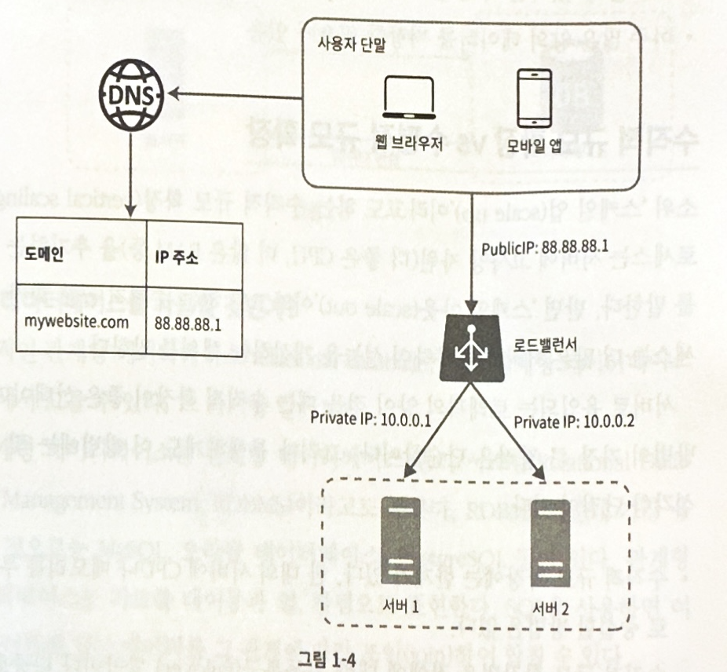
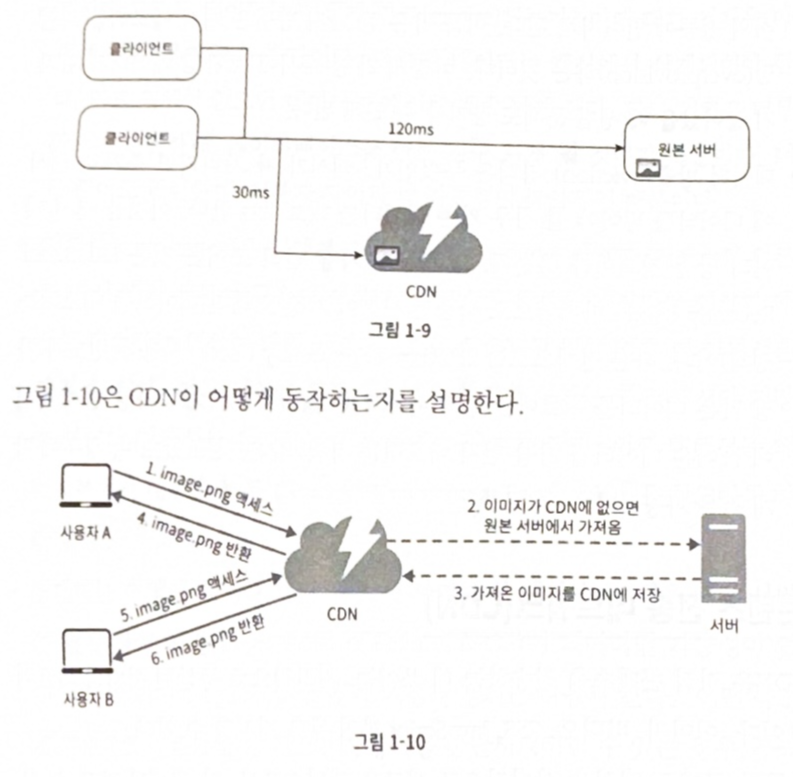
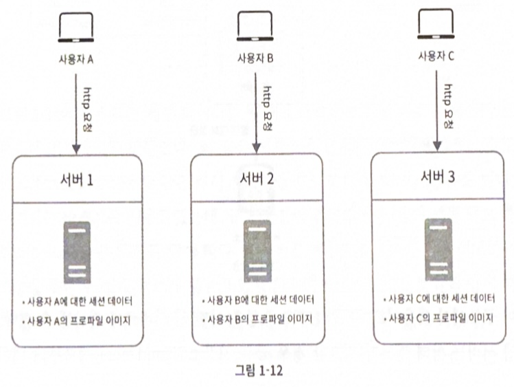
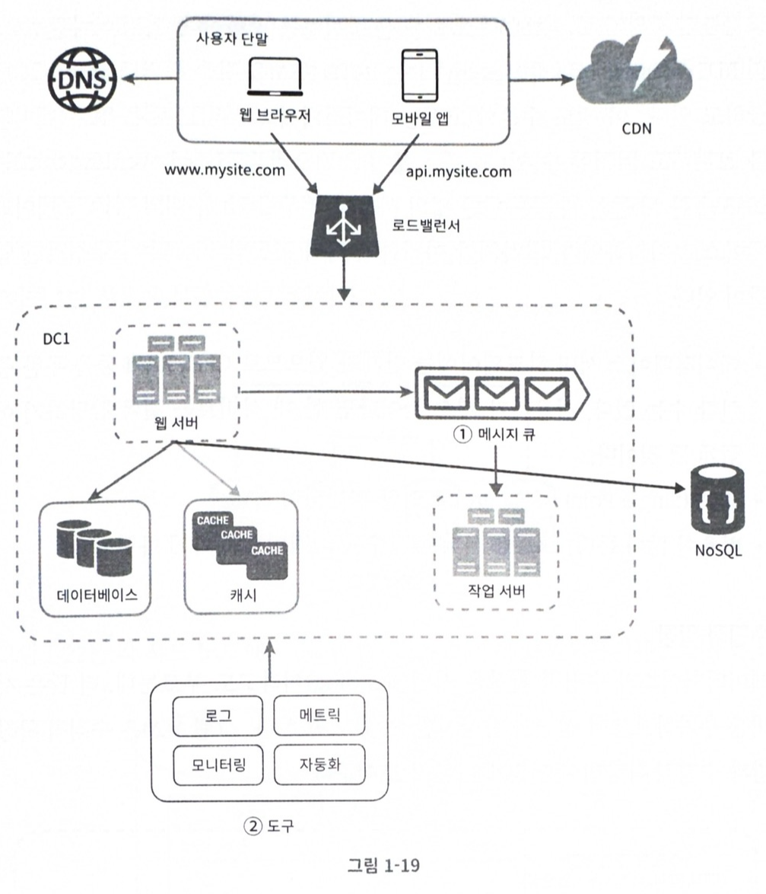

## 1장 사용자 수에 따른 규모 확장성
#### 1-1. 단일서버
</img>
1. DNS(Domain name Service) 질의를 통한 Public IP를 알아온다.
2. 해당 IP주소로 HTTP 요청 전달
3. 서버에서는 요청에 맞는 응답을 준다.(HTML/XML/JSON 등)

#### 1-2. 데이터베이스
</img>
- Local 환경에서 서버와 Database를 하나의 물리 장비에서 사용하는 것을 먼저 생각
- 서버(웹 계층)와 데이터베이스(데이터 계층)의 서버를 물리적으로 분리 생각
    - 각각 독립적으로 확장해 나갈 수 있음
    - 이후 책에서 서버의 확장/데이터베이스의 확장의 방법과 형태를 설명함

🌟 어떤 데이터베이스를 사용할 것인가?
- RDBMS(Relational Database Management System)
- NoSQL(key-value/graph/column/document)
- 어떤 데이터베이스를 선택하느냐에 따라 Application이 많이 달라짐.(코드량/컨벤션 등)
    - 이론적으로 Hexagonal 아키텍처에서는 DB와 같은 infra를 분리하여 DB가 변경되어도 다른 곳에 영향이 가지 않도록 하는 설계도 있음
- 이럴때는 RDBMS보다 NoSQL이 유리하다고 함
    - 아주 낮은 응답 Latency (DynamoDB의 경우 응답 지연에 대해 최대 10ms를 보장함.)
    - 다루는 데이터 자체가 관계형 데이터가 아님 (Not Joined)
    - 데이터 Serialize/Deserialize만 가능하면 됨
    - 아주 많은 양의 데이터를 저장할 필요가 있음 (데이터양과는 관련없이 응답시간이 동일 -> 물론 가져올때 나눠서 가져와야할때가 있어서 그에 대한 응답지연은 생길 수 있음)
    - 지속적으로 Write되는 Data에 유리

#### 1-3. 수직적 규모 확장 vs 슈평적 규모 확장
- Scale-up : H/W 성능을 늘려 더 좋은 성능을 얻음, 
    - 고사양 자원은 늘릴수록 훨씬 더 많은 비용이 추가됨
    - 한계가 존재함
    - 자동복구(failover) 방안이나 다중화(redundancy) 방안이 없음
    - H/W 장애 발생시 무조건 서비스 불가함
- Scale-out : 같은 수준의 장비를 추가하여 좋은 성능을 유지함
    - 서버가 N대로 늘어나게 되므로 서버에 요청이 고르게 분포되도록 LB(LoadBalancer) 필요함
    - L/B가 Public IP를 가지고 있고 거기에서 사설 IP로 요청이 나눠지는 모습
    - 분배에 대한 다양한 알고리즘이 존재한다.

##### 로드밸런서
</img>
- L/B가 Public IP를 가지고 있고 거기에서 사설 IP로 요청이 나눠지는 모습
- 자동복구(failover)가 가능하여 Application Service에 대한 가용성(availability)가 향상
- AWS EKS 환경에서 개발중 

##### 데이터베이스 다중화
</img>
- HA(High-Availability) 구성
- HA 구성에서 Master Instance만 Write를 지원하고 나머지 Slave는 Read만 지원하여 사용함.
    - @Transactional(readonly=true)
    - Read/Write 요청에 대한 부하가 분산되므로 성능상 너무 이점이 크지만 문제도 많다.
- 좋은 점
    - Read/Write 요청에 대한 분리로 성능이 좋아진다.
    - 안정성(reliability) + 가용성(availability): 데이터를 여러 지역(데이터센터)에 복제하여 장애발생시 failover 가능
    - DR(Disaster-Recovery)
        - AWS Cloud의 경우 서울 Region의 데이터센터는 총 4개임(Zone으로 분리)
        - AuroraMySQL/DynamoDB의 경우는 생성 시 자동으로 다중 Zone에 인스턴스를 만들어서 failover를 더욱더 강력히 함
- 나쁜 점
    - Slave 장애 : 1대였다면 Master로 Read 질의, 여러대라면 다른 Slave로 Read 질의
    - Master 장애 : 부 데이터베이스 서버 중 한대가 새로운 주서버가 될 것.(합의 알고리즘)
    - 항상 Slave에서 가져온 데이터가 최신이라는 보장이 없음(Master Write 된 것이 아직 복제 되지 않음)
- DynamoDB
    - DynamoDB의 경우 리더가 없는 복제임
    - 모두 복제 -> 모두 Select -> 과반결과 OK 이런식임

##### 로드밸런서 + 데이터베이스 다중화
</img>

#### 1-4. 캐시
- 캐시는 값비싼 연산 결과 또는 자주 참조되는 데이터를 **메모리** 안에 두고 뒤이은 **동일한** 요청이 보다 빨리 처리될 수 있도록 하는 저장소다.
    - Global Cache
    - Local Cache

##### 캐시 계층
</img>
- infra 요청(Database/Webclient/TCP 등)은 Application 입장에서 아주 큰 부담
- 캐시를 통해 값비싼 자원을 최소한 요청함으로써 서비스의 성능을 높임

##### 캐시 사용시 유의할 점
- 캐시는 어떤 상황에 바람직한가? 어떤 데이터를 캐시에 두어야 하는가?  
    - 데이터 갱신은 자주 일어나지 않지만 참조는 비번하게 일어난다면 고려할만하다.
- 캐시에 보관된 데이터는 어떻게 만료(expire)되는가?
    - 비지니스별 정책을 정해야한다.
    - 애매했던 경험으로는 캐시 Duration을 기획에서 정해야하나? 서버에서 정해야하나? 음..
- 일관성은 어떻게 유지되는가?
    - 개인적인 생각으로는.. 일관성을 100% 보장받아야하는 데이터는 캐싱이 맞을까?
- 장애 대처
    - SPOF(Single Point Of Failure) 피하려면 여러지역에 걸쳐 캐시 서버 분산
    - Global Cache(Redis)인 경우 이를 위한 아키텍처도 있음
- 캐시 메모리는 얼마나 크게 잡을 것인가?
- 데이터 방출(eviction) 정책은 무엇인가?
    - LRU(Least Recently Used) - 마지막으로 사용된 시점이 가장 오래된 데이터를 내보내는 정책
    - LFU(Least Frequently Used) - 사용된 빈도가 가장 낮은 데이터를 내보내는 정책
    - FIFO(First in First Out) - 가장 먼저 캐시에 들어온 데이터를 가장 먼저 내보내는 정책
- Local Cache
    - 종류에 따라 알고리즘도 서로 달라 Cache 성능에 차이도 엄청남
    - 종류에 따라 설정할 수 있는 것들도 서로 다름
    - Caffeine Cache
- (경험)
    - Caffeine Cache
    - 대부분 1분 Cache로 사용 (요청이 많기 때문에)
    - Infra(DB/Webclient/TCP) 단위로 Cache하여 요청 실패 시, 최근 캐시된 내용으로 fail-over하여 고객은 정상으로 보이도록 설정 (홈탭 데이터라 진짜 실시간 아니여도 되서 가능)

#### 1-5. 콘텐츠 전송 네트워크(CDN)
</img>
- CDN은 정적 콘텐츠를 전송하는데 쓰이는 지리적으로 분산된 서버의 네트워크이다.
- 이미지, 비디오, css, javascript 파일 등 캐시
- AWS Cloudfront 사용
    - S3 저장소
    - AWS 최 앞단 (CF-WAF-ALB-EKS)

##### CDN 사용 시 고려해야 할 사항
- 비용 : CDN은 보통 서드파티에 사업자에 의해 운영되며 CDN으로 들어가고 나가는 데이터 전송 양에 따라 요금을 과금
- 적절한 만료 시한 설정 : 너무 길면 콘텐츠의 신선도는 떨어지고, 너무 짧으면 원본 서버에 빈번히 접속하게 되어 좋지 않음
- CDN 장애 대처 방안 : CDN이 응답하지 않을 경우, 해당 문제를 감지하여 원본 서버로부터 직접 콘텐츠를 가져오도록 클라이언트를 구성하는 것이 필요할 수 있다.
- 콘텐츠 무효화(invalidation) : 아직 만료되지 않은 콘텐츠라 하더라도 아래 방법 가운데 하나를 쓰면 CDN에서 제거할 수 있다.
    - CDN 서비스 사업자가 API 제공 (AWS CF의 경우 Java SDK Library 제공하여 Application에서 직접 사용하고 있음)
    - object versioning 사용하고 있음 - 아래 이용하여 잘 쓰고 있다.
        - APP Client ({url}?v=20241201, ?v=20241202) Non-cache
        - AWS CF ({url}?v=20241201, ?v=20241202) cache

#### 캐시 + CDN
</img>

#### 1-6. 무상태(stateless) 웹 계층
- 웹 계층을 Scale-out 하기위한 고민
- 상태 정보(사용자 세션) 웹 계층에서 분리(RDBMS or NoSQL 저장)

##### 상태 정보 의존적인 아키텍처
</img>
- 고정 세션(sticky session) 기능으로 클라이언트마다 서버가 고정되어 세션을 잃어버리지 않게 사용한다는 뜻
- LB에 부담되고 서버를 추가하거나 제거하기도 까다롭다.
    - 추가/제거 -> 어떻게 sticky-session 다시 나눌건데? (re-balancing 느낌?)

##### 무상태 아키텍처
</img>
- 상태 정보는 웹 서버로부터 물리적으로 분리됨
- 구조는 단순하고 안정적이며 규모 확장이 쉽다.
- 정답임
- 뭐가 되든 상관없음(RDBMS, NoSQL, Memcached/Redis 등등)

#### 1-7. 데이터 센터
- 물리적으로 데이터 센터를 분리하는 경우, 시스템 가용성이 늘어난다.
    - 진짜 자사.. 물난리.. 데이터센터
    - 카카오도 장애 있었고..
- 지리적 라우팅(geoDNS-routing or geo-routing)
- 다중 데이터센터 아키텍처를 만들려면 기술적 난제가 필요함
    - 트래픽 우회 : 진짜 데이터센터에 가까운 곳으로 트래픽을 라우팅한다는 개념
    - 데이터 동기화 : 데이터 센터마다 별도의 데이터베이스를 사용한다면...
        - 데이터센터별 Master DB가 있을텐데 Master DB끼리 변경분에 대한 동기화 수행
    - 테스트와 배포
- 시스템을 더 큰 규모로 확장하기 위해서는 시스템의 컴포넌트를 분리하여, 각기 독립적으로 확장될 수 있도록 하여야 한다.(MSA 관점)

#### 1-8. 메시지 큐
</img>
- 메시지큐는 메시지의 무손실(durability, 일단 보관된 메시지는 Consume 하지 전에는 안전하게 보관된다는 특성)을 보장하는, 비동기 통신을 지원하는 컴포넌트다.
- Producer, Consumer가 각각 존재함.
- 각자의 서비스가 되지 않더라도 독립적으로 수행할 수 있어 서비스간 결합이 느슨해짐
- Producer, Consumer 각자 독립적으로 확장할 수 있음
- Mydata 도메인에서 Transaction은 상당한 데이터의 양으로 시스템에 부하를 줘서 메시지큐로 해결함.

#### 1-9. 로그,메트릭 그리고 자동화
- 로그
    - 에러 로그 모니터링 중요
    - 단일 서비스로 모아주는 도구 활용하여 검색
    - ES/Kibana도 써보고, Loki/Grafana도 써봄
- 메트릭
    - 호스트 단위 메트릭 : CPU, 메모리, 디스크 I/O 메트릭으로 서버 모니터링이 가능함
    - 종합 메트릭 : DB, Cache 메트릭 확인
    - 비지니스 메트릭 : DAU/MAU/Retention 등
- 자동화
    - CI/CD
    - 금융권이다보니 CI가 너무 복잡해지긴함.
    - gitlab-ci / argo-cd 사용
    - ci/cd(!prod)는 서버개발자 cd(prod)는 devOps 담당함

#### 메시지 큐 + 로그,메트릭 그리고 자동화 
</img>

#### 1.10. 데이터베이스의 규모 확장
##### 수직적 확장
- 고성능의 자원(CPU/RAM/디스크) 증설
- 무한 증설이 불가함.
- SPOF(Single Point Of Failure)로 인한 위험성이 크다.
- 비용이 많이 든다. 고성능 서버로 갈수록 가격이 올라감

##### 수평적 확장
</img>
- 샤딩(sharding)
- 데이터베이스를 샤드(shard)라고 부르는 작은 단위로 분할하는 기술
- 모든 샤드는 같은 스키마를 쓰지만 샤드에 보관되는 데이터 사이에는 중복이 없다.
- Key를 가지고 Hash 함수를 통해 어떤 Shard로 들어갈지 정함.
    - 위 그림에서 Hash Function은 id % 4임
- 샤딩 키는 파티션 키(partition key)라고 부름
- 큰 난제
    - 데이터의 재 샤딩
        - 샤드가 늘어났을때, id % 5로 넣어야할 수 있음.
        - 샤드 간 데이터 분포가 균등하지 못하여 특정 샤드에 할당된 공간 소모가 다른 샤드에 비해 빨리 진행될때(샤드소진) Hash Function을 바꾸고 데이터 재배치 [5장 안정 해시(consistent hasing)]
    - 유명 인사
        - 핫스팟 키(hotspot key)
        - 특정 샤드에 질의가 집중되어 서버에 과부하가 걸리는 문제
        - 인스타 그램이 user 기준으로 Shading을 했다고 하면 엄청나게 유명한 사람에게 트래픽이 몰리는 현상이 무조건 발생함
        - 이 문제를 풀려면 유명인사 각각에 샤드 하나씩 할당해야하거나 user단위가 아닌 데이터로 더 잘게 쪼개야할 수 있음
    - 조인과 비정규화
        - 여러 샤드에 걸친 데이터를 조인하기가 힘들어짐
        - Shard는 RDBMS보다 NoSQL이 더 잘어울린다고 생각해도 될까? (고민)
- AWS DynamoDB의 경우 partition key를 가지고 진짜 이렇게 사용함
    - AWS DynamoDB Specialist가 partition key 잘나누는게 제일 중요하고 user 단위로 나누면 절대 안된다고 말한 적 있음
    - 지금 마이데이터 자산은 모두 DynamoDB 사용 중!

</img>

