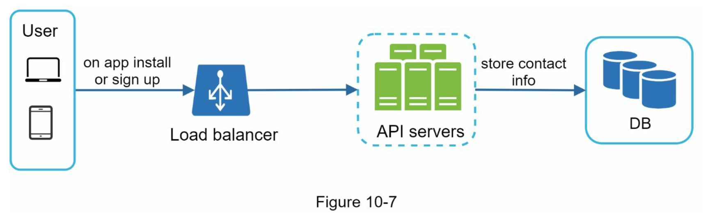
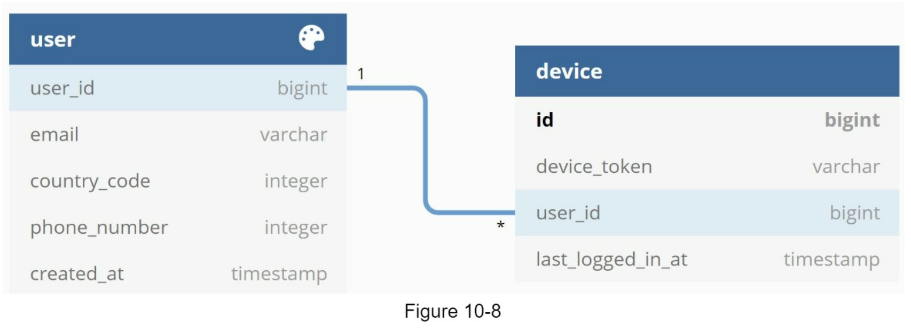

# 알림 시스템 설계
## 1. 문제 이해 및 설계 범위 확정
* Push 알림, SMS, email
* soft real-time
* 알림은 가능한 빨리 전달되어야 하지만 시스템에 높은 부하가 걸렸을때 약간의 지연은 무방
* ios, android 단말, laptop/desktop
* Application or 서버 Scheduled
* 사용자 알림 설정 Check(알림 동의/미동의)
* 천만 건의 모바일 푸시 알림 / 1일
* 백만 건의 SMS 메시지 / 1일
* 5백만 건의 이메일 / 1일

## 2. 개략적 설계안 제시 및 동의 구하기
* 알림 유형별 지원 방안
* 연락처 정보 수집 절차
* 알림 전송 및 수신 절차

### 알림 유형별 지원 방안
#### ios 푸시 알림
</img>
* Provider(알림 제공자): 알림 요청을 만들어 APNS(Apple Push Notification Service)로 보내는 주체다.
    * 단말토큰/페이로드
* APNS: 애플이 제공하는 원격 서비스다. Push 알림을 ios device로 보내는 역할
* ios device: 푸시 알림을 수신하는 사용자 단말이다.

#### 안드로이드 푸시 알림
</img>
* ios와 동일하다.
* APNS 대신 FCM(Firebase Cloud Messaging)을 사용한다.

#### SMS 메시지
</img>

#### 이메일
</img>

### 연락처 정보 수집 절차
</img>
* 사용자가 우리 앱을 설치하거나 처음으로 계정을 등록하면 API 서버는 해당 사용자의 정보를 수집하여 데이터베이스에 저장한다.

</img>
* 이메일 주소와 전화번호는 user 테이블에 저장하고, 단말 토큰은 device 테이블에 1:N으로 저장한다.(한 사용자가 여러 단말을 가질 수 있고, 알림은 모든 단말 전송해야 함)

### 알림 전송 및 수신 절차
#### 개략적 설계안 (초안)
</img>
* Service(1..N): 어떠한 형태든 알림시스템에 Request를 날리는 Service
* Notification System(알림 시스템): Service에 알림 전송을 위한 API를 제공해야 하고, 제 3자 서비스에 전달할 알림 페이로드를 만들어야 함.
* third party services(제 3자 서비스): 사용자에게 알림을 실제로 전달하는 역할로 확장성 있게 구현해야한다.

```
문제점
- SPOF(Single-Point-Of-Failure): 알림 서비스에 서버가 하나밖에 없으므로 서버 장애시 전체 서비스 장애로 이어진다.
- 규모 확장성: 한 대 서비스로 푸시 알림을 처리하므로 데이터베이스나 캐시 등 중요 컴포넌트의 규모를 늘릴 수 없다.
- 성능 병목: 알림 처리 및 발송은 자원을 많이 필요로 하므로 시스템이 과부하 상태에 빠질 수 있다.
```

#### 개략적 설계안 (개선)
* 데이터베이스와 캐시를 알림 시스템의 주 서버에서 분리한다.
* 알림 서버를 증설
* 메시지 큐를 이용해 알림 시스템과 Third Party에 대한 디펜던시를 끊는다.

</img>
* Service(1..N): 어떠한 형태든 알림시스템에 Request를 날리는 Service
* Notification System(알림 시스템)
    * 알림 전송 API 제공(인증 클라이언트)
    * 알림 검증(validation)
    * Database/Cache(알림에 필요한 정보를 가져옴)
    * 알림 전송(Message Queuing)
* Message Queue(메시지 큐): 시스템 컴포넌트 간 의존성을 제거함. Third-Party 시스템에 장애가 발생해도 전체 시스템에 전파되지 않음
* Workers(작업 서버): 메시지 큐에서 전송할 알림을 꺼내서 제3자 서비스로 전달하는 역할을 담당하는 서버
* Third-Party Services

## 3. 상세 설계
* 안정성(reliability)
* 추가로 필요한 컴포넌트 및 고려사항
* 개선된 설계안

### 안정성
* 분산 환경에서 운영될 알림 시스셑ㅁ 설계 시 고려사항
#### 데이터 손실 방지
</img>
* 알람이 소실되면 안된다는 요구사항
* 알림 시스템은 알림 데이터를 데이터베이스에 보관하도 재시도 메커니즘을 구현해야 한다.
* Notification Log(알림 로그) 데이터베이스 유지

#### 알림 중복 전송 방지
* 같은 알림이 여러 번 반복되는 것을 완전히 막는 것은 불가능하다. (분산 시스템 특성)
* 그 빈도를 줄이기 위해 중복 탐지 매커니즘을 도입하고 오류를 신중하게 처리해야 한다.
    * ex) 보내야 할 알림 도착 시, 이벤트 ID를 검사하여 이전에 본 적이 있는 이벤트인지 살핀다.

### 추가로 필요한 컴포넌트 및 고려사항
* 알림 템플릿, 알림 설정, 이벤트 추척, 시스템 모니터링, 처리율 제한 등 알림 시스템 구현을 위해 필요한 추가 컴포넌트 체크

#### 알림 템플릿
* 알림 메시지 대부분은 형식이 비슷할 것
* 이런 유사성을 고려하여 알림 템플릿을 사용
* 알림 형식을 일관성 있게 유지, 오류 가능성 제외, 알림 작성에 드는 시간도 줄일 수 있다.

#### 알림 설정
* 알림 동의/미동의 설정
* 서비스별/채널별/시간별 등 기획에 따라 달라짐
* 법과 관련된 것도 많음

#### 전송률 제한
* 사용자별 알림의 빈도를 제한하는 것
* 알림을 너무 많이 보내면 사용자가 알림 기능을 끌 수도 있다.

#### 재시도 방법
* 제3자 서비스가 알림 전송에 실패하면, 해당 알림을 재시도 전용 큐에 넣는다.
* 같은 문제가 계속 발생하면 개발자 통지

#### 푸시 알림과 보안
* ios/안드로이드의 경우, 일림 전송 API는 appKey/appSecret을 사용하여 보안을 유지한다.
* 인증된 클라이언트인지 확인 후 해당 API를 사용하여 알림을 보낸다.

#### 큐 모니터링
* Message Queue에 쌓인 알림의 개수 중요
* 이 수가 너무 크면 작업 서버들이 이벤트를 빠르게 처리하지 못하고 있다는 것
* 작업 서버 증설 및 삭제를 확인할 수 있다.

#### 이벤트 추적
* 데이터 분석 서비스를 통해 다양한 지표 확인

### 수정된 설계안
* 알림 서버에 인증(authentication)과 전송률 제한(rate-limiting) 기능이 추가
* 전송 실패에 대응하기 위한 재시도 기능 추가. 전송에 실패한 알림은 다시 큐에 넣고 지정된 횟수만큼 재시도
* 전송 템플릿을 사용하여 알림 생성 과정을 단순화하고 알림 내용의 일관성 유지
* 모니터링과 추적 시스템을 추가
</img>


