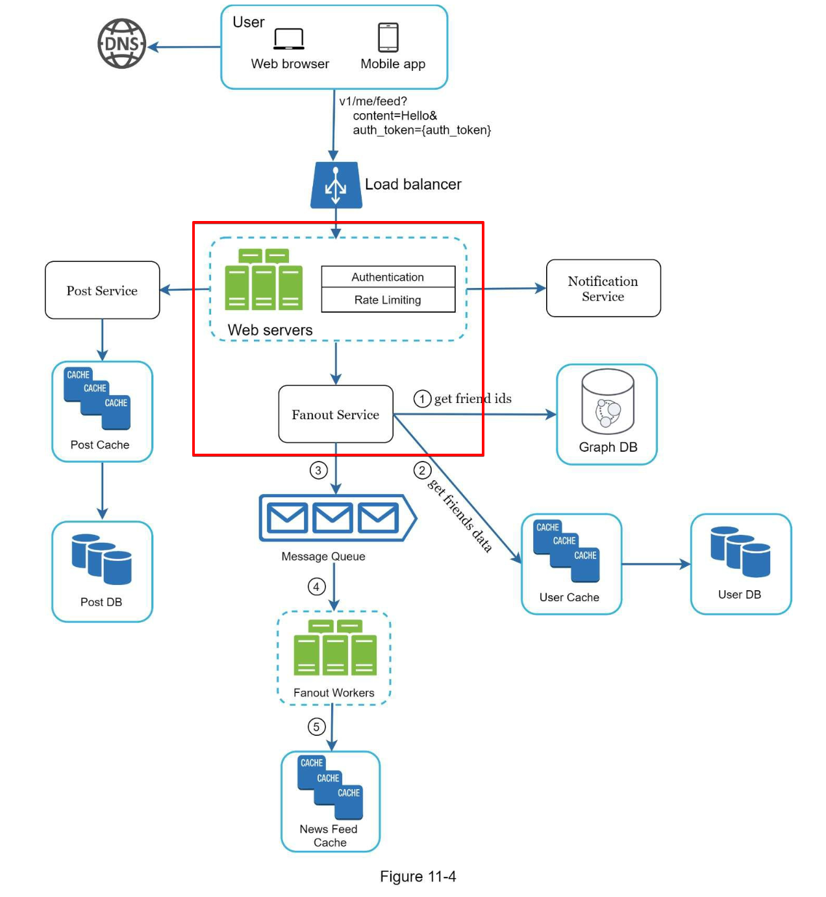
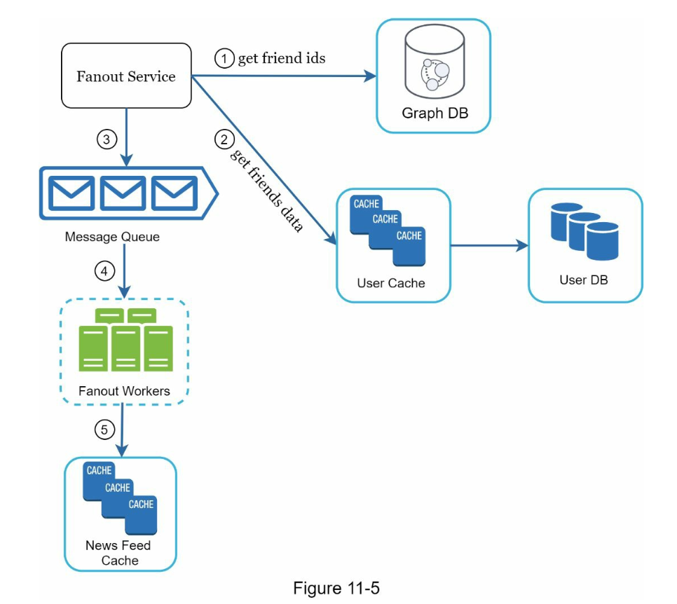
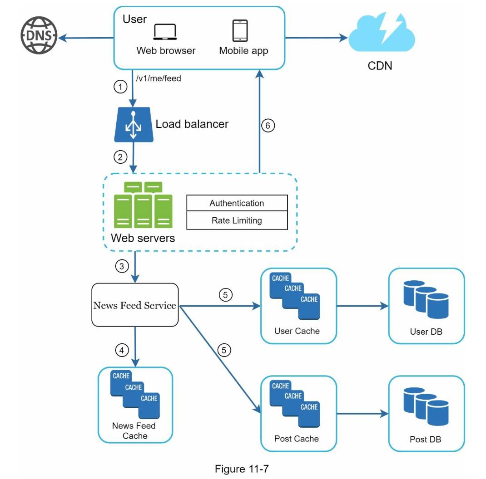
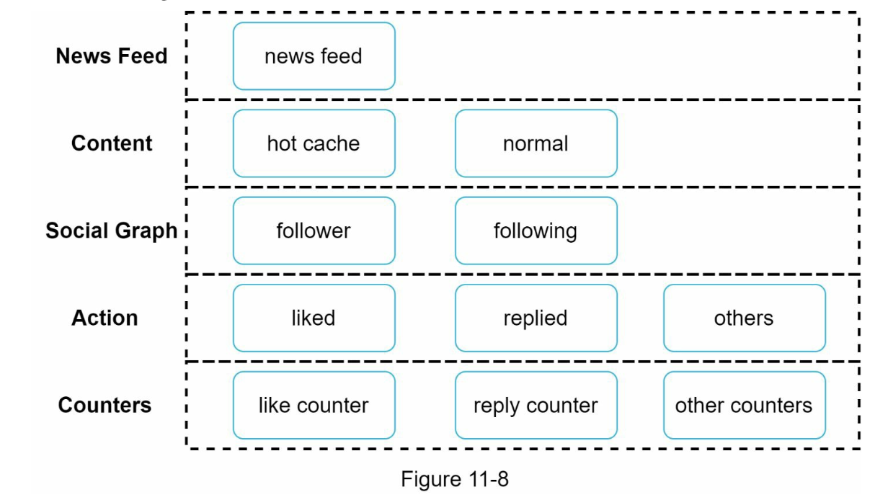

# Chapter 11 "뉴스 피드 시스템 설계"

* 뉴스 피드(new feed): 홈 페이지 중앙에 지속적으로 업데이트 되는 스토리

## 1단계. 문제 이해 및 설계 범위 확정

* 모바일 앱/웹 모두 지원
* 주요 기능? 뉴스 피드 페이지에 새로운 스토리를 올리고, 친구들이 올리는 스토리를 볼 수 있어야 함.
* 스토리 정렬 순서? 시간 흐름 역순
* 최대 팔로우 친구 수? 5,000명
* 트래픽 규모? 매일 천만명 (천만 Daily Active User)
* 스토리에 이미지나 비디오 등의 미디어 파일 포함

## 2단계. 개략적 설계안 제시 및 동의 구하기

* 피드 발행과 뉴스 피드 생성으로 나누어 생각하자.
    * 피드 발행: 사용자가 스토리를 포스팅하면 해당 데이터를 캐시와 DB에 기록하고, 친구의 뉴스 피드에 전송한다.
    * 뉴스 피드 생성: 모든 친구의 포스팅을 시간 역순으로 모아서 만든다.

### 1. 뉴스 피드 API

* 피드 발행 API: `POST /v1/me/feed`
* 피드 읽기 API: `GET /v1/me/feed`

### 2. 피드 발행 시스템

* 포스팅 저장 서비스(post service): 새 포스팅을 DB와 캐시에 저장한다.
* 포스팅 전송 서비스(fanout service): 새 포스팅을 친구의 뉴스 피드에 push 한다. 뉴스 피드 데이터는 캐시에 보관하여 빠르게 읽어갈 수 있도록 한다.
* 알림 서비스(notification service): 푸시 알림을 보낸다.

### 3. 뉴스 피드 생성

* 뉴스 피드 서비스(news feed service): 캐시에서 뉴스 피드를 가져온다.
* 뉴스 피드 캐시(news feed cache): 뉴스 피드를 렌더링할 때 필요한 피드 ID 를 보관한다.

## 3단계. 상세 설계

### 1. 피드 발행 흐름 상세 설계 (fanout service)

#### 1.1. 웹 서버

* 클라이언트와 통신
* 인증
* 처리율 제한 (포스팅 수 제한)

#### 1.2. 포스팅 전송 (fanout) 서비스

* 포스팅 전송 (fanout): 사용자의 새 포스팅을 그 사용자와 친구 관계에 있는 모든 사용자에게 전달하는 과정.

##### 1) 쓰기 시점 팬아웃 (push 모델)

* 새로운 포스팅 기록 시점에 뉴스 피드를 갱신하게 된다.
* 장점
    * 실시간 갱신. 즉시 전송된다.
    * 새 포스팅이 기록되는 순간에 이미 뉴스 피드가 갱신되므로, 뉴스 피드를 읽는 데 드는 시간이 짧아진다.
* 단점
    * 핫키(hot key) 이슈. 친구가 많은 사용자의 경우, 요청 트래픽이 과도하게 집중되어 성능 저하를 발생시킬수 있다.
    * 서비스를 자주 사용하지 않는 사용자의 피드까지 갱신하므로 컴퓨팅 자원이 낭비된다.

##### 2) 읽기 시점 팬아웃 (pull 모델)

* 피드를 읽는 시점에 뉴스 피드를 갱신한다. 요청 기반 모델.
* 장점
    * 비활성화된 사용자, 저사용 사용자의 컴퓨팅 자원 소모를 하지 않는다.
    * 데이터를 사용자에게 푸시하는 작업이 필요 없으므로 핫키 이슈가 없다.
* 단점
    * 뉴스 피드를 읽는데 많은 시간이 소요될 수 있다.

##### 3) 두 가지 모델을 결합한 fanout 모델

* 대부분은 쓰기 시점 팬아웃을 하고, 팔로워가 많은 사용자의 경우에는 풀 모델을 사용하여 시스템 과부하를 방지한다.
* 안정 해시를 통해, 요청(키)과 요청/데이터(노드)를 균형 있게 매핑, 분산하여 핫키 문제를 완화할 수 있다.

1. graph db에서 친구 ID 목록을 가져온다.
    * graph db는 노드와 엣지(관계) 기반의 db. 데이터 간의 연결 관계를 효율적으로 표현하고 탐색하는데 특화되었다.
    * 이를 통해 팔로우 관계를 빠르게 탐색할수 있다.
2. 사용자 정보 캐시에서 친구들의 정보를 가져온다.
3. 친구 목록과 새 스토링의 포스팅 ID를 메시지 큐에 넣는다.
4. 팬아웃 작업 서버가 메시지 큐에서 데이터를 꺼내어 뉴스 피드 데이터를 뉴스 피드 캐시에 넣는다.
    * 메모리 요구량을 고려하여, 포스팅 내용 전부를 저장하지 않고 `포스팅 ID / 사용자 ID` 만 보관한다.
    * 대부분의 사용자가 보려고 하는 것은 최신 스토리이기 때문에, cache miss 가 일어날 확률은 낮다.

### 2. 피드 읽기 흐름 상세 설계

1. 사용자는 피드 읽기 API를 호출한다.
2. 로드밸런서는 트래픽을 웹 서버들로 분산한다.
3. 웹 서버는 피드를 가져오기 위해 뉴스 피드 서비스를 호출한다.
4. 뉴스 피드 서비스는 캐시에서 포스팅 ID 목록을 가져온다.
5. 뉴스 피드에 표시할 사용자 이름, 사진, 콘텐츠 등을 사용자 캐시와 포스팅 캐시에서 가져와 완전한 뉴스 피드를 만든다.
6. 생성된 뉴스 피드를 JSON 형태로 클라이언트에게 보내고, 클라이언트는 해당 피드를 렌더링한다.

### 3. 캐시 구조

## 4단계. 추가 논의

### 1. 데이터베이스 규모 확장

* 수직적 규모 확장 vs 수평적 규모 확장
    * 대용량 트래픽일 것이므로 수평적 규모 확장
* SQL vs NoSQL
    * 실시간 서비스이므로 수평 확장을 위해 NoSQL
* 주-부 데이터베이스 다중화
    * 뉴스 피드는 읽기 부하가 높은 서비스이므로 이 방식이 효과적일 수 있겠다.
* 읽기 부하를 줄이기 위해, 복제본에서 읽기 연산을 수행하는 방식
    * 뉴스 피드는 일관성이 조금 늦어도 괜찮을 것이므로 Replica 에서 읽는 것이 효율적이겠다.
* 일관성 모델 (강한 일관성 / 최종적 일관성)
    * 최종적 일관성: 시간이 지나면 모든 노드가 동일한 데이터를 가지지만, 즉각적인 일관성은 보장되지 않는다.
    * 캐시는 고속 처리가 중요하므로, 최종적 일관성을 사용하여 성능 최적화를 택한다.
* 데이터베이스 샤딩
    * 사용자별 데이터를 분산해야 하므로 샤딩은 필수이다.

### 2. 이 외

#### 2.1. 웹 계층 무상태로 운영하기

* 웹 서버가 사용자 상태를 저장하지 않고, 모든 요청을 독립적으로 처리한다.
* 왜? 요청이 특정 서버에 묶이지 않으므로 수평 확장이 용이하고, 서버 장애 대웅이 쉬움.
* 어떻게? 세션 정보를 클라이언트 측(JWT) 또는 외부저장소(Redis, DB)에 저장하고 로드 밸런서를 통해 요청을 분배한다.

#### 2.2. 가능한 한 많은 데이터를 캐시하는 방법

#### 2.3. 여러 데이터 센터를 지원하는 방법

* 다중 데이터 센터(Multi-DC) 아키텍처를 활용하면 가용성과 성능을 높일 수 있음.

#### 2.4. 메시지 큐를 이용하여 컴포넌트 사이의 결합도 낮추기

#### 2.5. 핵심 메트릭에 대한 모니터링 (ex. 트래픽이 몰리는 시간의 QPS, 피드 새로고침 latency 등)

* 어떤 메트릭을 가장 중요하게 봐야 할까?
* 실시간 대응을 어떻게 해야 할까?

