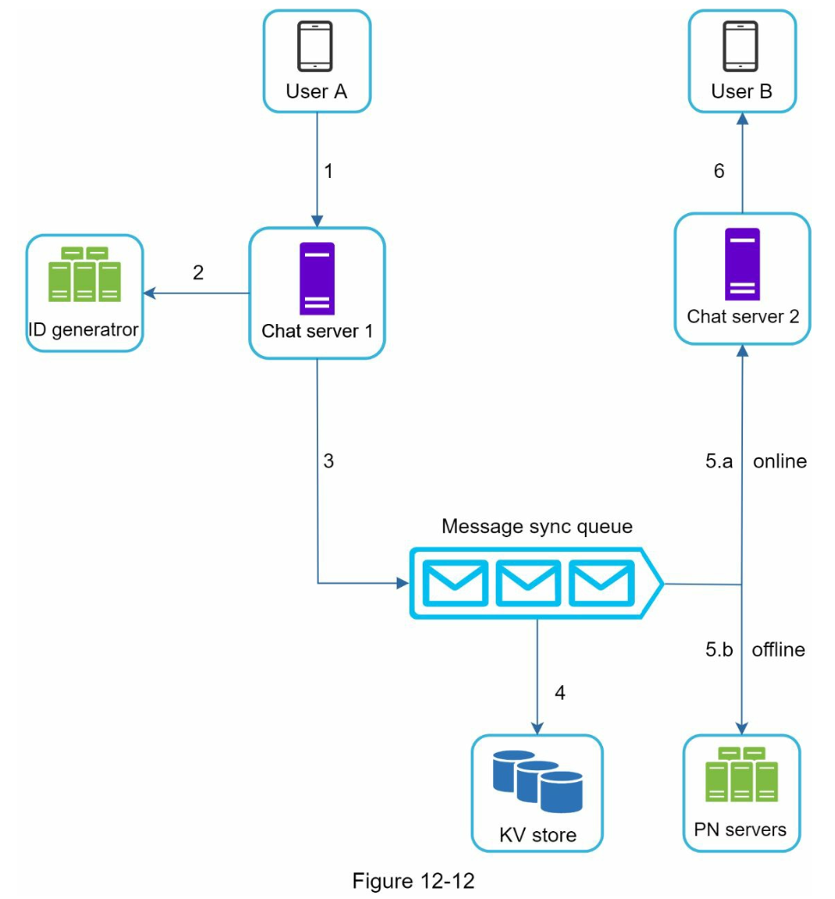

# Chapter 12 "채팅 시스템 설계"

## 1단계. 문제 이해 및 설계 범위 확정

* 응답지연이 낮은 일대일 채팅 기능
* 최대 100명 까지 참여할 수 있는 그룹 채팅 기능
* 사용자의 접속상태 표시 기능
* 다양한 단말 지원, 하나의 계정으로 여러 단말에 동시 접속 지원
* 푸시 알림
* 트래픽 규모 일별 능동 사용자 수(DAU) 5천명

## 2단계. 개략적 설계안 제시 및 동의 구하기

* 클라이언트들로 부터 메시지 수신
* 메시지 수신자 결정 및 전달
* 수신자가 online 상태가 아닌 경우 접속할 때까지 해당 메시지 보관

### 1. 프로토콜

#### 1.1. 메시지 발신

* 송신 클라이언트가 채팅 서비스에 메시지를 보낼 때, HTTP 프로토콜을 사용한다.
* keep-alive 헤더를 사용하면 클라이언트와 서버 사이의 연결을 유지할 수 있고, TCP 핸드셰이크 횟수를 줄일 수 있다.

#### 1.2. 메시지 수신

* HTTP는 클라이언트가 요청을 보내야지만 서버가 응답할 수 있는 프로토콜이므로, 클라이언트가 요청을 보내지 않는 한 서버가 "임의 시점"에 메시지를 보낼 수 없다.
* 서버가 연결을 만드는 것처럼 동작할 수 있도록 하기 위해, 폴링/롱 폴링/웹소켓 등의 기술을 사용한다.

##### 1) 폴링 (polling)

* 클라이언트가 주기적으로 서버에게 새 메시지가 있는지 물어보는 방식
* 자주 할수록 / 답할 메시지가 없는 경우 서버 자원이 불필요하게 낭비된다.

##### 2) 롱 폴링 (long polling)

* 클라이언트는 새 메시지가 반환되거나 타임아웃 될 때까지 연결을 유지하고, 새 메지시를 받으면 기존 연결을 종료하고 서버에 새로운 요청을 보내어 모든 절차를 다시 시작한다.
* 단점
    * HTTP는 stateless 하므로 메시지 송신 클라이언트와 수신 클라이언트가 같은 채팅서버에 접속하지 않을 수 있다. 
    * 서버 입장에서는 클라이언트의 연결 해제 여부를 알 수 없다.
    * 타임 아웃이 일어날 때마다 주기적으로 서버에 다시 접속해야 하므로, 여전히 비효율적이다.

##### 3) 웹소켓 (WebSocket)

* 서버가 클라이언트에게 async 메시지를 보낼때 가장 널리 사용하는 기술

* 웹소켓 연결은 클라이언트가 시작하고, 한번 맺어진 연결은 계속 유지되며 양방향이다.
* 첫 연결은 HTTP 핸드셰이크를 이용하고, 웹 소켓 연결로 업그레이드 된다.

* 웹소켓을 이용하면 메시지를 송신/수신할 때 동일한 프로토콜을 사용할수 있다.
* 다만, 웹소켓 연결은 항구적으로 유지되어야 하기 때문에 서버 측에서 연결 관리를 효율적으로 해야 하낟.

### 2. 개략적 설계안

* 대부분의 기능 (회원가입, 로그인 등)은 일반적인 HTTP 프로토콜을 사용하고, 채팅 부분만 웹소켓을 이용한다.
* 채팅 시스템 개요 

    * 무상태 서비스
    * 상태 유지 서비스
    * 제 3자 연동 서비스

#### 2.1. 무상태 서비스

* 로그인, 회원가입등 전통적인 요청/응답 서비스
* 로드밸런스 뒤에서 동작하기 때문에 특정 서비스로 라우팅 될 수 있게 설계가 필요하다.
* 서비스 디스커버리 서비스 - 클라이언트가 접속할 채팅 서버의 DNS 호스트명을 클라이언트에게 알려준다.

#### 2.2. 상태 유지 서비스 

* 채팅 서비스
* 각 클라이ㅣ언트가 채팅 서버와 독립적인 네트워크 연결을 유지해야 한다.
* 특정 서버로 부하가 몰리지 않게 적절하게 분배가 되어야 한다.

#### 2.3. 제 3자 서비스 연동

* 푸시 알림

#### 2.4. 최종 개략적 설계안

* 실시간으로 메시지를 주고받기 위해 클라이언트는 채팅 서버와 웹소켓 연결을 끊지 않고 유지한다.
* 채팅 서버: 클라이언트 사이에 메시지를 중계하는 역할
* 접속상태 서버: 사용자의 접속 여부를 관리
* API 서버: 로그인, 회원가입, 프로파일 변경 등
* 알림 서버
* 키-값 저장소: 채팅 이력 보관

#### 2.5. 저장소. 즉, 어떤 DB를 쓰느냐?

* RDB vs. NoSQL은 데이터 유형의 읽기/쓰기 연산 패턴에 달려있다.
* 데이터 유형 1. 사용자 프로파일, 설정, 친구 목록 등 일반적인 데이터
    * 안정성을 보장하는 RDB 사용
    * 다중화 / 샤딩
* 데이터 유형 2. 채팅 이력
    * 패턴
        * 채팅 앱에서 빈번하게 쓰이는 데이터는 최근 메시지이지만, 검색/언급/점프하여 무작위적인 데이터 접근을 하기도 한다.
        * 1:1 채팅 앱의 경우 읽기:쓰기 비율은 1:1 정도이다.
    * 키-값 저장소
        * 수평적 규모 확장
        * 데이터 접근 지연시간(latency) 낮음. 
        * RDB는 롱테일 데이터가 많아질수록 인덱스가 커지고 Random Access Cost가 증가한다.
        * HBase, Cassandra

#### 2.6. 데이터 모델

* 테이블 구조
    * 1:1 채팅: message_id
    * 그룹 채팅: channel_id + message_id
* 메시지 ID
    * 고유해야 한다.
    * 정렬 가능해야 하며, 시간 순서와 일치해야 한다.
    * sequence number / local sequence number generator (같은 그룹 내)

## 3단계. 상세 설계

### 3.1. 서비스 탐색

* 클라이언트에게 가장 적합한 채팅 서버를 추천한다.
* 기준 - 클라이언트의 위치, 서버의 용량
* Apache Zookeeper - 사용 가능한 서버를 등록해두고, 클라이언트가 접속을 시도하면 사전에 정한 기준에 따라 채팅 서버를 골라준다.

#### 3.2. 메시지 흐름

* 1:1 채팅 메시지 처리 흐름

* 여러 단말 사이의 메시지 동기화
    * cur_max_message_id: 해당 단말에서 관측된 가장 최신 메시지의 ID를 추적하는 용도. 저장소에 보관된 메시지의 ID가 cur_max_message_id 보다 크면 새 메시지로 간주한다.

* 소규모 그룹 채팅에서의 메시지 흐름
    * 동기화 큐(sync queue): 사용자 각각에 할당된 메시지 수신함

 

#### 3.3. 접속상태 표시

* 접속상태 서버는 클라이언트와 웹소켓으로 통신하는 실시간 서비스의 일부이다.

##### 1) 사용자 로그인

* 클라이언트와 실시간 서비스 사이에 웹 소켓 연결이 맺어지고 나면 접속상태 서버는 A의 상태와 last_active_at 타임스탬프 값을 키-값 저장소에 보관한다. 
* 이 절차가 끝나고 나면 해당 사용자는 접속 중인 것으로 표시된다.

##### 2) 로그아웃

* Api 서버를 이용해서 로그아웃 하게 되면 Api 서버에서 접속상태 서버로 해당 유저의 status를 offline으로 변경 요청 한다.

##### 3) 접속 장애

* 짧은 시간동안 인터넷 연결이 끊어졌다 복구되는 현상에 대응할 수 있는 설계를 준비해야 한다.
* heartbeat 검사
    * 온라인 상태의 클라이언트로 하여금 주기적으로 heartbeat event를 접속상태 서버로 보내고, 마지막 이벤트를 받은 지 x초 이내에 또 다른 heartbeat event 메시지를 받으면 해당 사용자의 접속 상태를 계속 온라인으로 유지한다. 
    * 그렇지 않은 경우에만 오프라인으로 바꾼다.

##### 4) 상태 정보의 전송

* publish-subscribe 모델 사용
* 각각의 친구 관계마다 채널을 하나씩 두고, 웹소켓 통신을 사용한다.
* 성능 문제 해소
    * 사용자가 그룹 채팅에 입장하는 순간에만 상태 정보를 읽어가게 한다.
    * 수동으로 친구 리스트의 접속 상태를 갱신한다.

## 4단계. 추가 논의

* 사진이나 미디어 기능 확장
* 종단간 암호화
* 캐시
* 로딩 속도 개선 
    * slack - 데이터, 채널 등으로 분산하는 네트워크를 구축하여 앱 로딩 속도를 개선
* 오류 처리
    * 채팅 서버 오류: 서버 하나가 죽으면 서비스 탐색 기능(주키퍼)가 동작하여 클라이언트에게 새로운 서버를 배정하고 다시 접속할 수 있도록 해야 한다.
    * 메시지 재전송: 재시도(retry)나 큐(queue)를 통해 메시지의 안정적 전송을 보장해야 한다.

