# 검색어 자동완성 시스템

## 1. 문제 이해 및 설계 범위 확정
* 자동완성될 검색어는 첫 부분으로 한정
* 5개의 자동완성어 표시 
* 질의 빈도에 따라 검색어 인기순위 기준
* 질의는 영어
* 대문자나 특수문자는 처리하지 않고, 소문자로 처리 
* 일간 능동사용자(DAU) 천만

### 요구사항
* 빠른 응답 속도 : 사용자가 검색어를 입력할때마다 자동완성 검색어도 빨리 표시되어야 함. 시스템 응답속도 100밀리초 이내 
* 연관성 : 자동완성되어 출력되는 검색어는 사용자가 입력한 단어와 연관된 것 
* 정렬 : 시스템의 계산 결과는 인기도 등의 순위 모델에 의해 정렬되어야함
* 규모 확장성 : 시스템은 많은 트래픽을 감당할 수 있도록 확장 가능해야함 
* 고가용성 : 시스템의 일부에 장애가 발생하거나, 느려지거나, 예상치못한 네트워크 문제가 생겨도 시스템은 사용가능해야함

### 개략적 규모 추정
* 일간 능동사용자(DAU) 천만
* 평균적으로 한 사용자는 매일 10건의 검색을 수행한다고 가정
* 질의할 때마다 평균 20바이트 데이터 입력한다고 가정 (1문자 1바이트 * 질의문 평균 4단어 * 각단어 평균 다섯글자 -> 1 * 4 * 5)
* 검색창에 글자 입력할 때마다 클라이언트는 검색어 자동완성 백엔드에 요청을 보냄 
* 대략 초당 24,000건의 질의가 발생 (10,000,000 사용자 * 10개 질의 * 20글자 / 24시간/3600초 )
* 최대 QPS = QPS * 2 = 대략 48,000
* 질의 가운데 20% 정도는 신규 검색어이며 대략 0.4G (10,000,000 * 10 * 20자 * 20%)

## 2. 개략적 설계안 제시 및 동의 구하기

### 데이터 수집 서비스 
* 사용자가 입력한 질의를 실시간으로 수집하는 서비스
* 아래 이미지는 질의문과 사용빈도를 저장하는 빈도테이블로 사용자가 검색하면 아래와같이 상태가 변경됨

  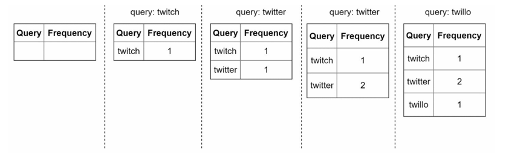

### 질의서비스 
* 주어진 질의에 다섯 개의 인기 검색어를 정렬 해 내놓는 서비스 
  * query : 질의문을 저장하는 필드
  * frequency : 질의문이 사용된 빈도를 저장하는 필드

  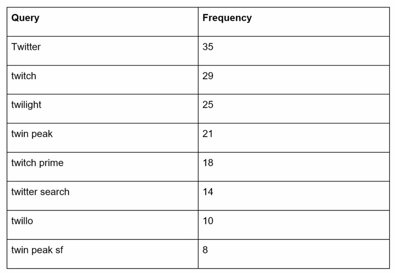
  
* 가장 많이 사용된 검색어를 SQL 질의문의 사용해 계산할 수 있으나, 데이터가 아주 많아지면 데이터베이스가 병목이 될 수 있음

## 3. 상세설계

### 트라이자료구조 
* 관계형 데이터베이스를 이용해 가장 인기 있었던 다섯개 질의문을 골라내는 방안은 효율적이지 않음 -> 트라이를 사용해 해결 
* 트라이 : 문자열 검색과 저장을 효율적으로 수행하는 트리 기반 자료구조. 주로 문자열 탐색, 자동 완성, 사전(dictionary) 구현 등에 사용
  * 트라이는 트리 형태의 자료구조 
  * 트리의 루트 노드는 빈 문자열
  * 각 노드는 글자 하나를 저장하며 26개의 자식 노드를 가질 수 있음
  * 각 트리 노드는 하나의 단어, 또는 접두어 문자열을 나타냄 

  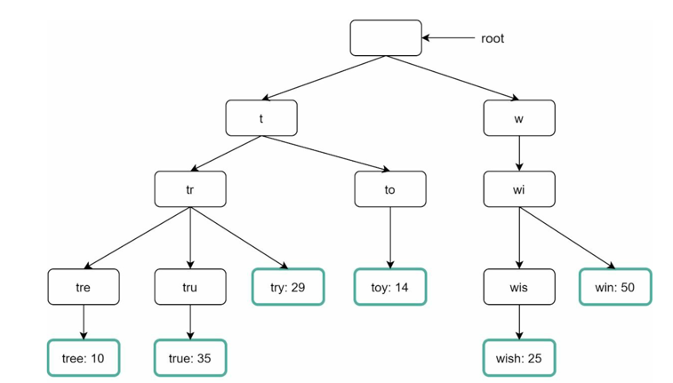

* 기본 트라이 자료구조는 노드에 문자열을 저장하며 
* 이용 빈도에 따라 정렬된 결과를 내놓기 위해 노드에 빈도 정보까지 저장할 필요가 있음
* 트라이 관련 용어 
  * p : 접두어의 길이
  * n : 트라이 안에 있는 노드 개수
  * c : 주어진 노드의 자식 노드 개수 

* 가장 많이 사용된 질의어 k개 찾기 
  * 해당 접두어를 표현하는 노드를 찾음. 시간복잡도 O(p)
  * 해당 노드로부터 시작하는 하위 트리를 탐색하여 모든 유효 노드를 찾음. 시간복잡도 O(c)
  * 유효 노드들을 정렬하여 가장 인기있는 검색어 k개를 찾음. 시간복잡도 O(clogc)

  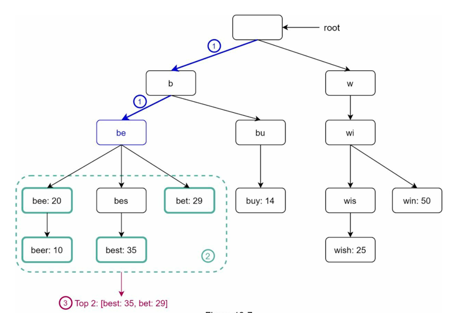

* k=2이고 사용자가 검색창에 be를 입력했다고 하자 
  * 접두어 노드 'be'를 찾음
  * 해당 노드로부터 시작하는 하위 트리를 탐색하여 모든 유효 노드를 찾음 beer:10, best:35, bet:29
  * 유효 노드를 정렬하여 2개만 골라냄 

* 이 알고리즘의 시간복잡도는 각 단계에 소요된 시간의 합 O(p) + O(c) + O(clogc)
* 최적화 방법 : 접두어의 최대 길이 제한, 각 노드에 인기 검색어 캐시 

#### 접두어 최대 길이 제한 
* 사용자가 검색창에 긴 검색어를 입력하는 일은 거의 없으므로 p값을 작은 정수값이라고 가정
* 검색어의 최대 길이를 제한할 수 있다면 시간복잡도는 O(p) => O(1)으로 바뀜

#### 노드에 인기 검색어 캐시 
* 각 노드에 k개의 인기 검색어를 저장해두면 전체 트라이를 검색하는 일을 방지할 수 있음 
* 각 노드에 인기 질의러를 캐시하면 질의하는 시간 복잡도를 엄청나게 낮출 수있음 -> 시간복잡도 O(1)
* 각 노드에 질의어를 저장할 공간이 많이 필요하게 된다는 단점도 있음 

  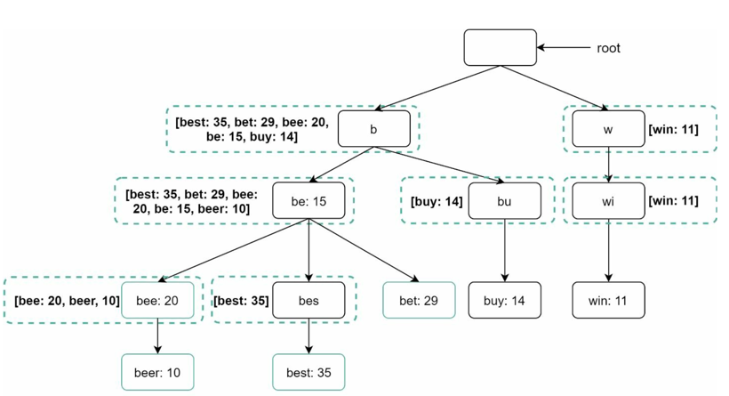

### 데이터 수집 서비스 
* 앞서 대략적인 설계안에서는 사용자가 검색 시 실시간으로 데이터를 수정했는데 
  * 그때마다 트라이를 갱신하면 질의서비스는 심각하게 느려짐
  * 트라이가 만들어지고 나면 인기 검색어는 그다지 자주 바뀌지 않음.
* 규모 확장이 쉬운 데이터 수집 서비스를 만드려면 데이터가 어디서 오고 어떻게 이용되는지를 알아야함
  * 트라이를 만드는데 쓰는 데이터는 보통 데이터 분석 서비스나 로깅 서비스로부터 옴

  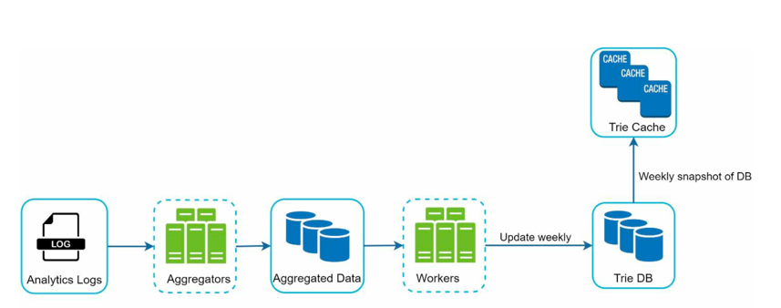

#### 데이터 분석 서비스 로그 
* 데이터 분석 서비스 로그에는 검색창에 입력된 질의에 관한 원본 데이터가 보관
* 새로운 데이터가 추가될 뿐 수정은 이루어지지 않으며, 로그데이터로 인덱스를 걸지 않음

  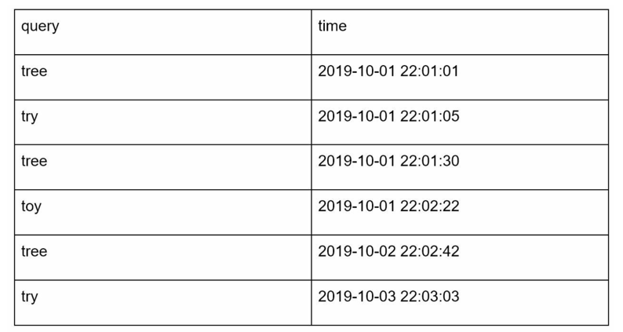

#### 로그 취합 서버
* 데이터 분석 서비스 로그는 양이 엄청 나고 데이터 형식도 제각각이기 때문에 서비스의 용례에 따라 데이터를 취함해야함.
* 트위터같은 실시간 애플리케이션은 데이터 취합 주기 짧게.
* 면접장에서 데이터 취합의 실시간성이 얼마나 중요한지 확인해야함

#### 취합된 데이터
* 아래 이미지는 매주 취합된 데이터 사례 

  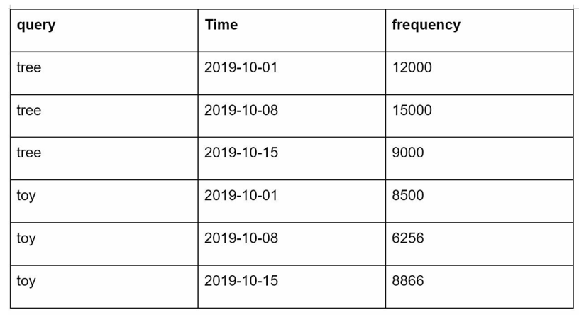

#### 작업 서버 
* 작업 서버는 주기적으로 비동기적 작업을 실행하는 서버 집합
* 트라이 자료 구조를 만들고 트라이 데이터베이스에 저장하는 역할을 담당

#### 트라이 캐시 
* 분산 캐시 시스템으로 트라이 데이터를 메모리에 유지하여 읽기 연산 성능을 높임. 
* 매주 데이터 스탭션을 떠서 갱신

#### 트라이 데이터 베이스
* 지속성 저장소
  * 문서 저장소 : 주기적으로 트라이를 직렬화하여 데이터베이스에 저장. 몽고디비 활용
  * 키-값 저장소 : 해시 테이블 형태로 변환하여 저장. 접두어를 해시 테이블 키로. 노드에 저장된 데이터를 해시 테이블 값으로. 

### 질의 서비스
  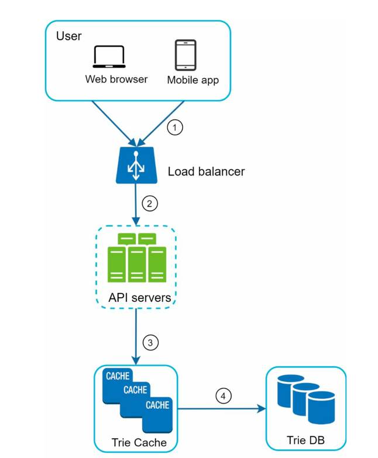

* 질의서비스 흐름도
  * 1. 검색 질의가 로드 밸러서로 전송
  * 2. 로드밸런서는 해당 질의를 API 서버로 전송
  * 3. API 서버는 트라이 캐시에서 데이터를 가져와 해당 요청에 대한 자동완성 검색어 제안 응답을 구성
  * 4. 데이터가 트라이 캐시에 없는 경우 데이터베이스에서 가져와 캐시에 채움
* 최적화 방안 
  * AJAX 요청으로 페이지 새로고침 X
  * 브라우저 캐싱 사용. cache-control= private, max-age=3600 (요청을 보낸 사용자의 캐시에만 보관, 3600초동안 유효)
  * 데이터 샘플링 : 모든 질의 결과를 로깅해두면 자원낭비이기 때문에 N개의 요청 가운데 1개만 로깅되도록 처리. 

### 트라이 연산 
* 검색어 자동 완성 시스템의 핵심 컴포넌트 

#### 트라이 생성 
* 트라이 생성은 작업 서버가 담당하며, 데이터 분석 서비스의 로그나 데이터 베이스로부터 취합된 데이터를 이용. 

#### 트라이 갱신
* 매주 한 번 갱신하는 방법 : 새로운 트라이를 만든 후에 기존 트라이를 대체 
* 트라이의 각 노드를 개별적으로 갱신하는 방법 : 성능이 좋지 않음. 트라이를 갱신할 때 그 모든 상위 노드까지 갱신. 

#### 검색어 삭제 
* 위험한 질의어의 경우 자동완성 결과에서 제거해야하는데, 
* 트라이 캐시 앞에 필터 계층을 두어 필터 규칙에 따라 겸색 결과를 자유롭게 변경할 수 있음

  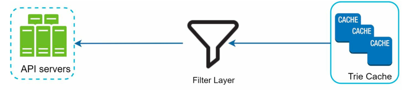

### 저장소 규모 확장
* 단순히 알파벳으로 구분하여 샤딩할수는 없음. 
* 과거 질의 데이터의 패턴을 분석하여 샤딩. 
* 검색어 대응 샤드 관리자가 어떤 검색어가 어느 저장소 서버에 저장되는지에 대한 정보를 관리 

  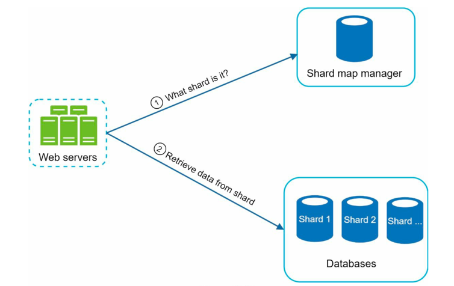

## 4. 마무리 
* 다국어 지원 하려면 ? 트라이에 유니코드 저장
* 국가별로 인기검색어 순위가 다르다면? 국가별로 다른 트라이 사용. 
* 실시간으로 변하는 검색어의 추이를 반영하려면? (현재 설계는 실시간에 적합하지 않음)
  * 샤딩을 통하여 작업 대상 데이터의 양을 줄임
  * 순위 모델을 바꾸어 최근 검색어에 보다 높은 가중치를 부여
  * 데이터가 스트림을로 올 경우. 아파치 하둡 맵리듀스 , 스파크스트리밍, 카프카 등의 시스템을 사용. 

