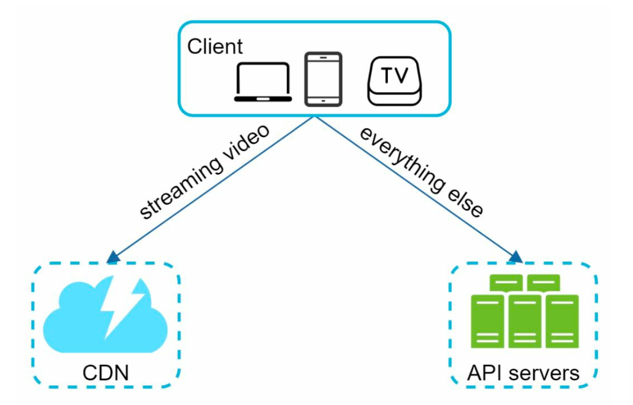
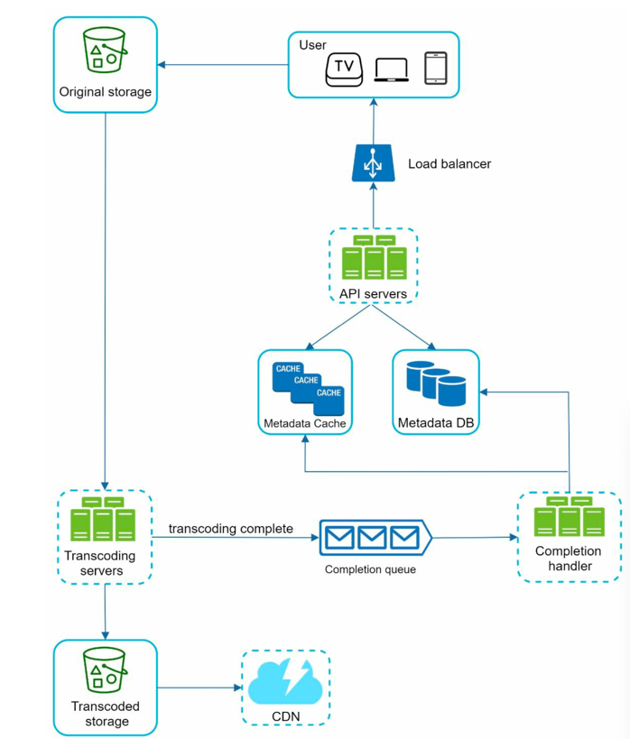
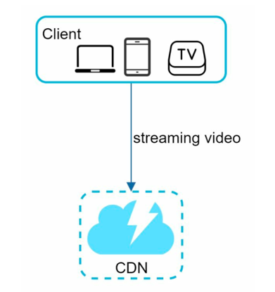
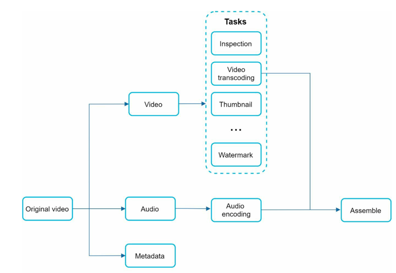
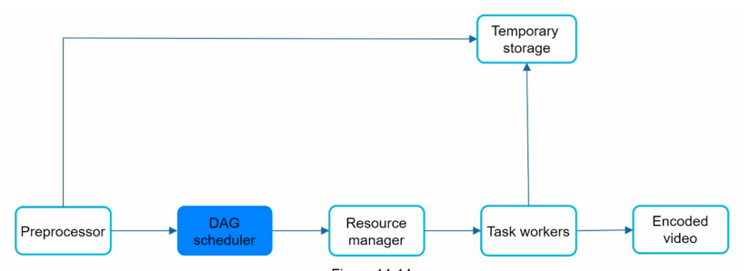
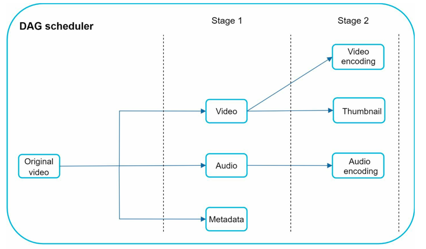
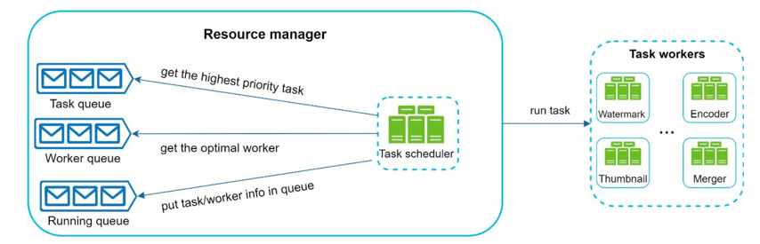
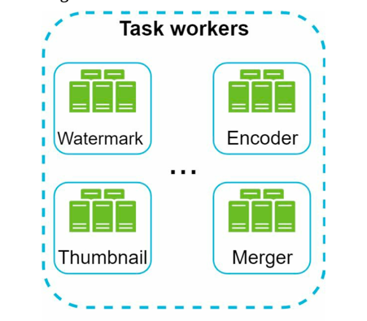
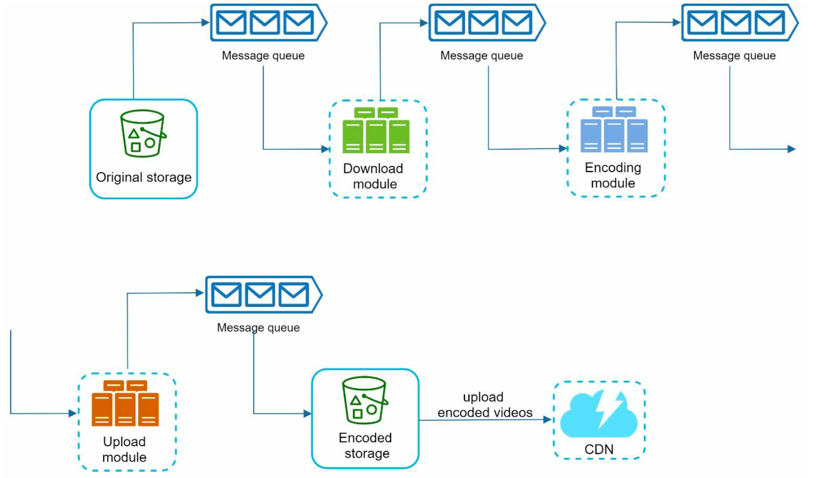

# 유튜브 설계 

## 1. 문제 이해 및 설계 범위 확정
* 비디오를 올리는 기능 & 시청하는 기능
* 지원하는 클라이언트 : 모바일 앱, 웹 브라우저, 스마트 TV
* DAU : 5백만
* 서비스 평균 소비시간 : 30분
* 다국어 지원
* 대부분의 해상도 지원
* 암호화 
* 비디오 파일 크기 : 최대 1G 제한
* 아마존이나 구글과 같은 클라우드 서비스 사용 가능 

### 요구사항
* 빠른 비디오 업로드
* 원활한 비디오 재생
* 재생 품질 선택 가능
* 낮은 인프라 비용
* 높은 가용성과 규모 확장성, 안정성
* 지원 클라이언트 : 모바일 앱, 웹 브라우저, 스마트 TV

### 개략적 규모 추정
* 일간 능동사용자(DAU) 5백만
* 평균적으로 한 사용자는 5개의 영상을 시청
* 10%의 사용자가 하루에 1비디오 업로드 
* 비디오 평균 크기 300MB
* 비디오 저장을 위한 저장 용량 = 5백만 * 10% * 300MB
* CDN 비용 : $150,000 (5백만 * 5비디오 * 0.3GB * $0.02)

## 2. 개략적 설계안 제시 및 동의 구하기

  

* 개략적으로 보면 이 시스템은 세 개의 컴포넌트로 구성됨
  * client : 컴퓨터, 모바일 폰, 스마트 TV를 통해 유튜브 시청 
  * CDN : 비디오는 CDN에 저장되며 재생 버튼을 누르면 CDN 으로부터 스트리밍
  * API 서버 : 비디오 스트리밍을 제외한 모든 요청은 API 서버가 처리 
* 비디오 업로드 절차, 비디오 스트리밍 절차에 대해 설계 

### 비디오 업로드 절차 

  

* 사용자 : 컴퓨터, 모바일, 스마트 TV 등 다양한 기기에서 유튜브를 이용하여 동영상을 시청함.
* 로드 밸런서 : 모든 API 요청을 적절하게 여러 API 서버에 분산하여 부하를 관리함.
* API 서버 : 동영상 스트리밍을 제외한 모든 사용자 요청을 처리함.
* 메타데이터 DB : 동영상의 메타데이터를 저장하는 데이터베이스로, 성능과 고가용성을 위해 샤딩 및 복제됨.
* 메타데이터 캐시 : 성능 향상을 위해 동영상 메타데이터 및 사용자 정보를 캐싱하여 빠르게 제공함.
* 원본 저장소 : 업로드된 원본 동영상을 저장하는 BLOB(Binary Large Object) 스토리지 시스템.
* 트랜스코딩 서버 : 업로드된 동영상을 다양한 포맷(MPEG, HLS 등)으로 변환하여 여러 기기와 네트워크 환경에서 최적화된 스트리밍을 제공함.
* 변환된 동영상 저장소 : 트랜스코딩된 동영상을 저장하는 BLOB 스토리지.
* CDN : 동영상을 캐싱하여 사용자에게 빠르게 스트리밍할 수 있도록 함. 사용자가 재생 버튼을 클릭하면 CDN에서 동영상이 제공됨.
* 완료 큐 : 트랜스코딩 완료 이벤트 정보를 저장하는 메시지 큐.
* 완료 핸들러 : 완료 큐에서 이벤트 데이터를 가져와 메타데이터 캐시와 데이터베이스를 업데이트하는 작업을 수행함.

### 비디오 스트리밍 절차 

  

* 유튜브에서 동영상을 재생할 때, 동영상 전체를 다운로드하지 않고 바로 스트리밍이 시작됨.
  * 다운로드: 전체 파일을 디바이스에 저장한 후 재생
  * 스트리밍: 네트워크를 통해 데이터를 조금씩 받아오면서 실시간 재생
  
* 스트리밍 프로토콜
  * 스트리밍은 특정 프로토콜을 사용하여 데이터를 전송 
    * MPEG-DASH: HTTP 기반 적응형 스트리밍 방식 
    * Apple HLS: 애플이 개발한 HTTP 라이브 스트리밍 
    * Microsoft Smooth Streaming 
    * Adobe HTTP Dynamic Streaming (HDS)
  * 각 프로토콜은 서로 다른 비디오 인코딩 및 재생 방식을 지원하므로, 서비스 설계 시 적절한 프로토콜을 선택해야 함.

* CDN(Content Delivery Network)을 활용한 스트리밍 
  * 비디오는 CDN을 통해 직접 스트리밍됨. 
  * 사용자의 위치에서 가장 가까운 엣지 서버가 동영상을 제공하여 지연 시간을 최소화함.

 
---

## 3. 상세설계
* 개략적인 설계안에서는 동영상 업로드와 동영상 스트리밍 흐름 두 부분으로 살펴봄. 
* 상세설계에서는 최적화방안과 오류 매커니즘에 대해 설명

###  비디오 트랜스코딩 (Video Transcoding)
* 트랜스코딩은 원본 비디오를 다양한 기기에서 원활하게 재생할 수 있도록 변환하는 과정
  * 동영상을 촬영하면, 카메라나 스마트폰에서 특정 형식의 파일로 저장
  * 그러나 원본 동영상은 다양한 기기에서 원활하게 재생되지 않을 수 있어, 여러 포맷과 비트레이트로 변환이 필요함.
    * 비트레이트 : 비디오를 구성하는 비트가 얼마나 빠르게 처리되어야 하는지를 나타내는 단위

* 트랜스코딩이 중요한 이유
  * 저장 공간 절약: 원본 동영상(예: 60fps 고화질 영상)은 몇 백 GB의 용량을 차지할 수 있음.
  * 기기 호환성: 기기 및 브라우저마다 지원하는 비디오 포맷이 다름 → 다양한 포맷으로 변환해야 함.
  * 적응형 스트리밍:
    * 고속 인터넷 사용자 → 고해상도(1080p, 4K) 영상 제공
    * 저속 인터넷 사용자 → 저해상도(480p, 720p) 영상 제공
  * 네트워크 환경 변화 대응: 모바일 환경에서는 네트워크 상태가 변동됨 → 실시간으로 화질 조정(자동/수동) 필요

* 비디오 인코딩 포맷 
  * 트랜스코딩 시, 동영상은 컨테이너와 코덱 두 가지 요소로 구성됨. 
  * 컨테이너 (Container)
    * 동영상, 오디오, 메타데이터를 포함하는 파일 형식 
    * 확장자로 구분됨 (.mp4, .avi, .mov 등)
  * 코덱 (Codec):
    * 동영상 크기를 줄이면서 품질을 유지하는 압축 및 해제 알고리즘
    * 대표적인 코덱: H.264, VP9, HEVC

 
---

### 유향 비순환 그래프 (DAG) 모델

* DAG(유향 비순환 그래프) 기반 트랜스코딩을 활용하여 병렬 처리 최적화
  * 동영상 트랜스코딩은 고성능 연산이 필요한 작업이며, 콘텐츠 제작자마다 다른 영상 처리 요구사항을 가짐
  * ex) 워터마크 삽입, 직접 썸네일 제공, 고해상도 영상 업로드, 일부는 저해상도
  * 이처럼 다양한 요구사항을 처리하면서도 병렬 처리를 극대화하기 위해 DAG(방향 비순환 그래프) 모델을 적용함.
  * DAG 모델을 사용하면 여러 작업을 단계별(Task Stages)로 정의하고, 병렬 실행 가능.

  

* DAG 기반 트랜스코딩 프로세스 : 원본 동영상은 영상, 오디오, 메타데이터로 분리되며, 각각의 요소에 다양한 처리를 수행할 수 있음 
  * 검사(Inspection): 동영상이 정상적으로 업로드되었는지 품질 확인
  * 비디오 인코딩(Encoding): 해상도, 코덱, 비트레이트 변환
  * 썸네일 생성(Thumbnailing):사용자가 직접 업로드 , 시스템이 자동 생성
  * 워터마크(Watermarking):동영상 위에 로고나 식별 이미지 삽입

 
---

### 비디오 트랜스코딩 아키텍쳐
* 클라우드 기반 비디오 트랜스코딩 아키텍처는 6가지 주요 컴포넌트로 구성됨: 전처리기, DAG 스케줄러, 리소스 관리자, 작업 실행 서버, 임시 저장소, 출력된 인코딩 비디오

  

#### 전처리기
* 1. 비디오 분할(Video Splitting)
  * 비디오 스트림을 GOP(Group of Pictures) 단위로 나눔
  * GOP는 독립적으로 재생 가능한 작은 프레임 그룹(보통 몇 초 단위)
  * 일부 구형 모바일 기기나 브라우저는 비디오 분할 기능 미지원 이러한 환경에서도 재생 가능하도록 GOP 단위로 비디오 분할 처리
* 2. DAG 생성(DAG Generation)
  * 클라이언트 개발자가 작성한 설정 파일을 기반으로 DAG를 생성 
  * DAG를 활용하여 비디오 처리 단계를 정의 및 최적화
* 3. 데이터 캐싱(Cache Data) 및 오류 복구
  * 임시 저장소에 분할된 비디오(GOP)와 메타데이터 저장 
  * 트랜스코딩 실패 시, 저장된 데이터를 활용해 재시도(retry) 가능

#### DAG 스케줄러 
* DAG 스케줄러는 DAG 그래프를 여러 단계로 나누고, 이를 작업 관리자의의 작업 큐에 추가함.

  

* 위 이미지는 하나의 DAG 그래프를 2단계 작업 그래프로 쪼갠 사례 
  * 1단계 : 원본 비디오를 비디오, 오디오, 메타데이터로 분리
  * 2단계 : 비디오 파일 → 비디오 인코딩, 썸네일을 생성하는 두 개의 작업으로 세분화, 오디오 파일 → 오디오 인코딩 작업 수행

#### 자원 관리자
* 자원 배분을 효과적으로 수행하는 역할을 담당, 3개의 큐와 작업 스케줄러로 구성됨

  

* 리소스 관리자의 주요 구성 요소
  * 작업 큐(Task Queue): 실행해야 할 작업 저장하는 우선순위 큐
  * 작업 서버 큐(Worker Queue): 작업 작업자의 가용 상태정보를 저장하는 우선순위 큐
  * 실행 큐(Running Queue): 현재 실행 중인 작업 및 작업 서버 정보를 저장
  * 작업 스케줄러(Task Scheduler): 최적의 작업 서버를 선택하고 작업 실행을 담당

* 작업 관리자 동작
  * 작업 관리자는 작업 큐에서 가장 높은 우선순위의 작업을 꺼냄
  * 작업 관리자는 해당 작업을 실행하기 적합한 서버를 고름
  * 작업 스케줄러는 해당 작업 서버에게 작업 실행을 지시
  * 작업 스케줄러는 작업이 어떤 서버에게 할당 되었는지 정보를 실행큐에 넣음
  * 작업 스케줄러는 작업이 완료되면 실행 큐에서 해당 작업 제거 

#### 작업 서버 
* 작업 서버는 DAG에 정의된 작업을 수행

  

#### 임시저장소
* 임시저장소는 여러 저장소 시스템을 사용할 수 있으며, 데이터의 유형, 크기, 빈도수 등에 따라 달라짐 ex) 캐시, Blob 저장소
* 비디오 프로세싱이 완료되면 임시저장소에서 삭제

#### 인코딩된 비디오
* 인코딩된 비디오는 인코딩 파이프라인의 최종 결과물로 video_720.mp4 와 같은 이름을 가짐

 
---

### 시스템 최적화
* 대규모 동영상 플랫폼에서 속도(Speed), 보안(Safety), 비용 절감(Cost-saving) 을 위한 최적화가 필요함

#### 속도 최적화 : 비디오 정렬 업로드
* 전체 영상을 한 번에 업로드하면 비효율적 → GOP 단위로 분할하여 업로드 속도 향상 
* 업로드 도중 실패해도 빠르게 다시 업로드 가능

#### 속도 최적화 : 업로드 센터를 사용자 근거리에 지정
* 여러 대륙에 업로드 센터(CDN)를 배치하여 업로드 속도를 향상
  * 미국 → 북미 업로드 센터
  * 중국 → 아시아 업로드 센터

#### 속도 최적화 : 모든 절차를 정렬화 
  

* 기존 시스템에서는 각 단계가 순차적으로 실행되어 지연 발생
* 메시지 큐(Message Queue)를 도입하여 비동기 실행 가능 → 여러 작업을 동시에 진행하여 지연 시간 단축

#### 안정성 최적화 : 미리 Singed 된 업로드 URL
* 사용자 인증 후 업로드 URL 발급 → 올바른 사용자가 올바른 위치에 업로드하도록 보장 
* Amazon S3: Pre-signed URL, Azure: Shared Access Signature(SAS)

#### 안정성 최적화 : 비디오 보호
* 디지털 저작권 관리 DRM(Digital Rights Management): Apple FairPlay, Google Widevine, Microsoft PlayReady 지원 
* AES 암호화: 영상이 암호화되어 허가된 사용자만 재생 가능 
* 워터마크 추가: 기업 로고 또는 텍스트를 삽입하여 영상 도용 방지

#### 비용 최적화  
1) 인기 콘텐츠만 CDN에서 제공 
   * 대부분의 동영상은 조회수가 낮음 → 인기 영상만 CDN에서 제공하고, 나머지는 자체 저장소에서 제공
2) 덜 인기 있는 영상은 실시간 인코딩(On-Demand Encoding)
   * 짧은 영상은 여러 품질로 미리 저장하지 않고, 필요할 때 인코딩하여 비용 절감
3) 지역별 인기 영상만 배포
   * 특정 지역에서만 인기 있는 영상은 해당 지역의 CDN에만 저장하여 불필요한 저장 비용 절감
4) 자체 CDN 구축 및 ISP 파트너십
   * Netflix처럼 자체 CDN을 구축하여 장기적으로 비용 절감 가능
   * ISP(인터넷 서비스 제공업체)와 협력하여 대역폭 비용 절감 & 속도 향상 (예: Comcast, AT&T, Verizon)

 
---

### 오류 처리 
* 대규모 시스템에서는 에러가 필연적으로 발생하므로, 복구 가능한 오류와 복구 불가능한 오류를 구분하여 신속하게 대응해야 함. 

#### 오류 유형
1) 복구 가능한 오류 (Recoverable Errors)
   * 예: 비디오 세그먼트(transcoding) 실패 
   * 해결책: 일정 횟수 재시도, 실패 지속 시 적절한 에러 코드 반환
2) 복구 불가능한 오류 (Non-recoverable Errors)
   * 예: 손상된 비디오 포맷(Malformed Video Format)
   * 해결책: 관련 작업 중단 후 적절한 에러 코드 반환

 
---

## 비디오 스트리밍 서비스 아키텍처 정리 및 추가 논의 사항
*  추가 시간이 있다면 아래 사항을 논의 가능

* API 계층 확장 (Scaling the API Tier)
  * API 서버는 무상태(Stateless) 이므로 수평 확장(Scale-out) 용이하다는것을 언급하면 좋음
* 데이터베이스 확장 (Scaling the Database)
  * DB 복제(Replication) 및 샤딩(Sharding) 기법을 활용해 데이터베이스 성능 확장 가능에 대해 이야기 
* 라이브 스트리밍 (Live Streaming) 고려사항
  * 라이브 스트리밍과 일반 스트리밍은 업로드, 인코딩, 스트리밍 과정이 유사 그러나 주요 차이점 존재 
    * 지연 시간(Latency) 문제: 실시간 송출을 위해 별도 스트리밍 프로토콜 필요
    * 병렬 처리(Parallelism) 요구 사항 낮음: 데이터가 실시간으로 작은 청크 단위로 처리됨
    * 에러 처리: 복구에 시간이 오래 걸리는 오류 처리는 라이브 스트리밍에 적합하지 않음 
* 비디오 삭제 (Video Takedown) 관리 
   * 저작권 침해, 음란물, 불법 콘텐츠 등은 삭제해야 함
   * 자동 필터링 시스템(업로드 시 탐지) + 사용자 신고 시스템(Flagging) 활용

