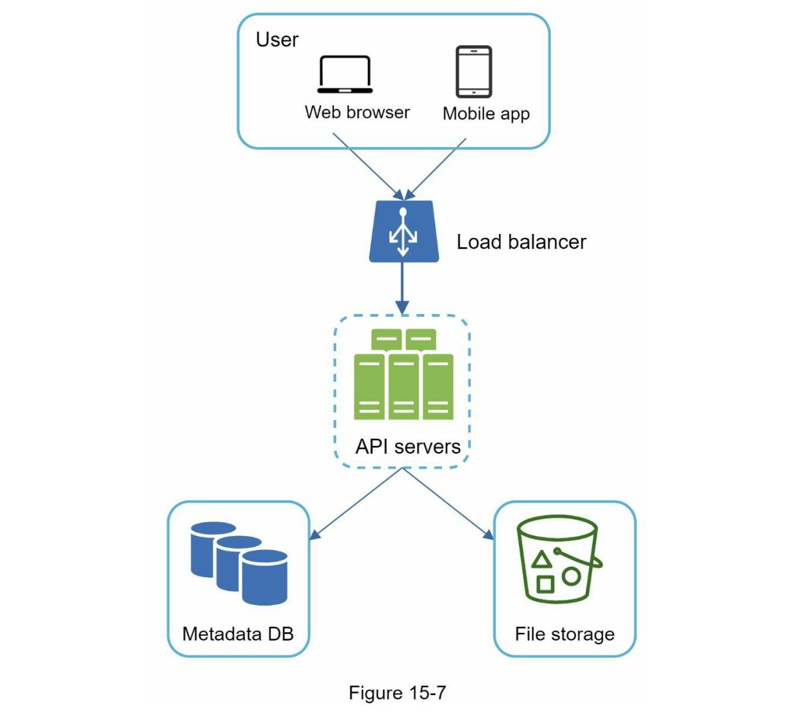
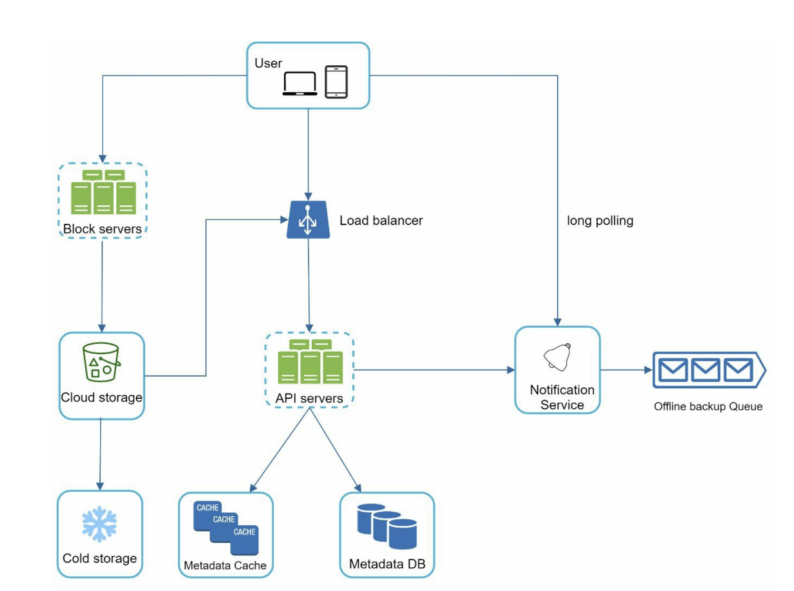
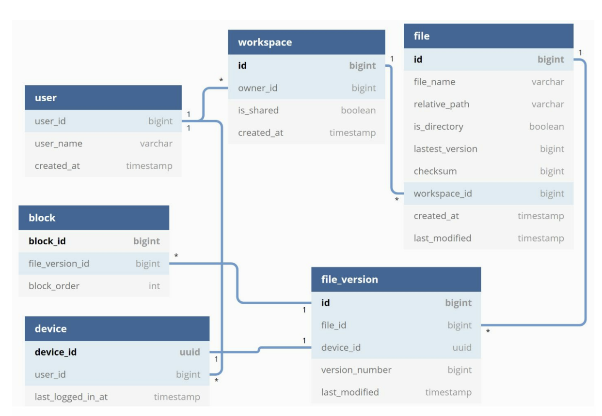

# 구글 드라이브 설계

## 1단계 문제 이해 및 설계 범위 확장

* 파일 업로드 / 다운로드
* 파일 동기화
* 알림
* 암호화
* 파일크기 제한 10GB
* DAU : 천만
* 안정성도 중요함

### 개략적 추정치

* 필요 저장공간 500 페타바이트
* 최대 QPS : 480

## 2단계 개략적 설계안 제시 및 동의 구하기

### 접근법

* 모든 것을 담은 한 대 서버에서 출발
* 파일을 다운/업 웹서버
* 메타데이터 보관용 데이터베이스
* 파일을 저장할 저장소 시스템

### API

* 기본적으로 파일 업로드, 다운로드, 갱신 히스토리 조회 API 필요

#### 1. 파일 업로드 api

* api.example.com/files/upload?uploadType=resumable
* 단순 업로드 / 이어 올리기 지원

#### 2. 파일 다운로드 api

* api.example.com/files/download
* 파일 경로를 인자로 받음

#### 3. 파일 갱신 히스톨

* api.example.com/files/list_revisions
* 파일 경로와 히스토리 길이를 인자로 전달

### 한 대 서버의 제약 극복

* 스토리지 부족현상
  * user_id를 통해 스토리지 샤딩?
  * s3와 같은 안전한 스토리지 서비스를 사용하는게 적합
  * 여러 다중화 기법을 통해 데이터 손실 및 가용성을 확보할 수 있음

* 로드밸런서 : 네티워크 트래픽을 분산하기 위해 로드밸런서 사용
* 웹 서버: 많은 트래픽을 견딜 수 있게 스케일 아웃 가능
* 메타데이터 데이터베이스
* 파일 저장 서버와 분리하여 SPOF를 회피, 다중화 및 샤딩 정책을 적용하요 가용성과 규모 확장 가능

### 동기화 충돌

* 두명 이상의 사용자가 동시에 업데이트시 충돌이 발생할 수 있음
* 나중 변경을 충돌이 발생한 것으로 표시
* 이 상태에서 두 파일을 합칠지? 아니면 다른 파일로 대체할지?
| 기존 방식 | 차등 동기화 |
|-----------|------------|
| **소유권 기반 (Locking)** | 한 사용자가 문서를 편집하는 동안 다른 사용자는 읽기만 가능함. |
| **이벤트 전달 (Event Passing)** | 모든 수정 이벤트를 실시간으로 전달해야 함. 네트워크 손실이 발생하면 데이터 불일치 발생 가능. |
| **3자 병합 (Three-way Merge)** | 변경된 내용을 병합하지만, 충돌이 많고 실시간 협업이 어려움. |
| **차등 동기화 (Differential Sync)** | 지속적으로 변경 사항을 비교(diff)하고 적용(patch)하는 방식으로 실시간 협업 지원. |

### 개략적 설계안

* 블록 저장소 서버 : 파일 블록을 클라우드 저장소에 업로드하는 서버
  * 파일을 여러개의 블록으로 나눠 저장, 각 블록에는 고유한 해시값이 할당되고 메타데이터 db에 저장
  * 파일을 재구성 하려면 순서대로 블록을 합쳐야 함
* 아카이빙 저장소 : 오랫동안 사용되지 않은 비활성 데이터를 저장
* 메타데이터 캐시 : 메타데이터 성능을 높이기 위해 자주 쓰이는 메타데이터를 캐시
* 알림 서비스 : 특정 이벤트 발생시 클라이언트에게 알리는데 쓰임
* 오프라인 사용자 백업 큐 : 클라이언트가 오프라인일때 최신 ㅅ아태를 확인할 수 있게 정보를 큐에 저장

## 3단계 상세 설계

### 블록 저장소 서버

* 최적화를 위해 아래 기법을 사용
* 델타 동기화 : 수정이 일어난 블럭만 동기화
* 압축

### 높은 일관성 요구사항

* 같은 파일이 다른 단말에서 다르게 보이는것을 허용해서는 안된다.
* 따라서 메타데이터 캐시와 db에도 같은 원칙이 적용되어야 함
* 관계형 데이터베이스를 통해 메타데이터를 관리하고, 동기화 로직을 통해 캐시에도 최종 일관성 뿐만 아니라 강한 일관성을 달성해야 한다.

### 메타데이터 데이터베이스

* file : file테이블에는 파일의 최신 정보
* file_version : 파일 갱신 이력 보관 테이블, 읽기 전용
* block : 파일 블록에 대한 정보를 담고 있음, 특정 버전의 파일은 파일 블록을 올바른 순서로 조합하여 복원

### 저장소 공간 절약

* 중복 제거
  * 블록 해시 값을 기준으로 비교해서 관리
* 지능적 백업 전략
  * 한도 설정 : 파일 버전 개수 상한
  * 중요한 버전만 보관
* 자주 쓰이지 않는 데이터는 아카이빙 저장소에 저장

### 장애 처리

* 블록 저장소 서버 장애 : 다른 서버가 미완료 상태 또는 대기 상태인 작업을 이어 받아야 함
* 메타데이터 캐시 장애 : 캐시 서버 다중화
* 메타데이터 데이터베이스 장애
  * 데이터베이스 복제 메커니즘을 통해 복구

## 질문

* 파일을 효율적으로 저장하고 검색하는 방법은?
  * 분산 파일 시스템을 어떻게 설계할 것인가?
  * 메타데이터 저장 방식과 파일 데이터 저장 방식을 분리하는 이유는?

* 파일 동기화 시스템을 어떻게 설계할 것인가?
  * 클라이언트가 변경 사항을 감지하고 동기화하는 방법은?
  * 네트워크 연결이 불안정한 환경에서 동기화를 최적화하는 방법은?

* 파일 공유 및 권한 관리를 어떻게 구현할 것인가?
  * ACL과 RBAC 중 어떤 방식을 선택할 것인가?
  * 실시간 협업 기능을 구현하려면 어떤 기술을 사용할 것인가?

* 데이터 저장소를 설계할 때 고려해야 할 점은?
  * 파일을 저장하는 방식 (Object Storage vs Block Storage vs File System Storage)
  * 데이터 일관성과 가용성을 어떻게 유지할 것인가? (CAP Theorem 적용)

* 파일 업로드 시 대량의 트래픽을 처리하려면 어떻게 해야 할까?
  * Load Balancer 및 CDN을 어떻게 활용할 것인가?
  * 업로드 속도를 높이기 위한 최적화 기법은?

* 장애 발생 시 복구 전략은 어떻게 설계할 것인가?
  * 데이터 유실을 방지하기 위한 백업 및 복구 전략
  * 다중 데이터센터를 활용한 장애 복구(Disaster Recovery) 방안
