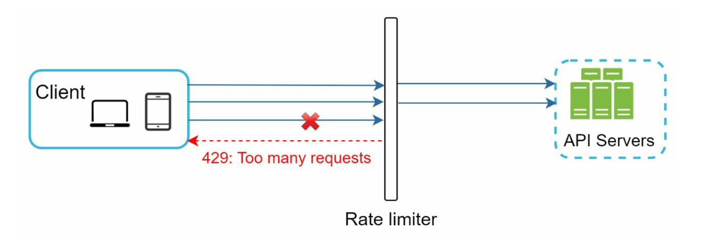
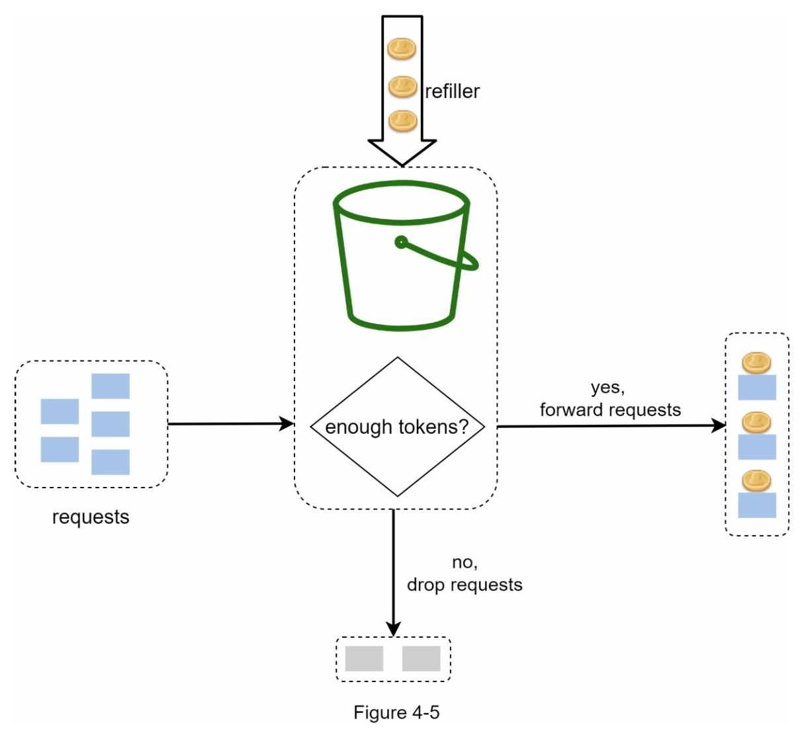
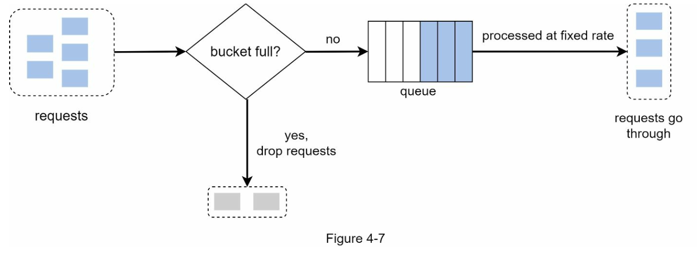
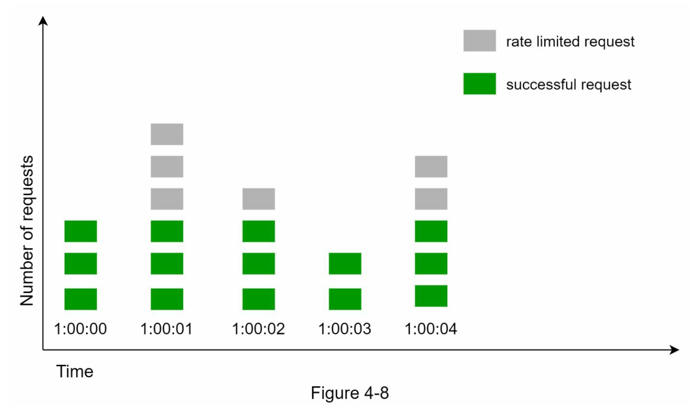
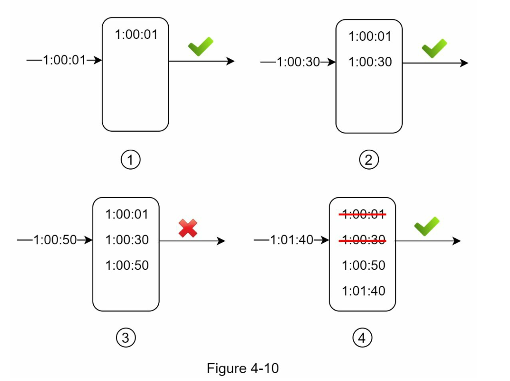
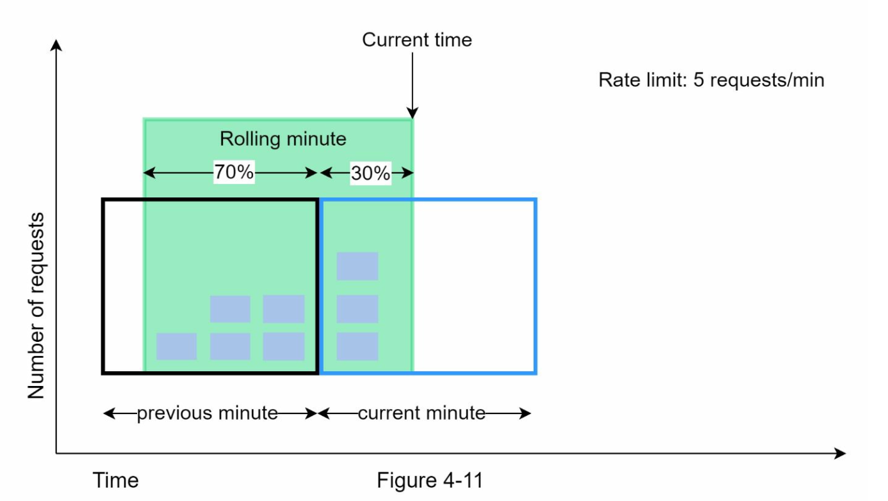
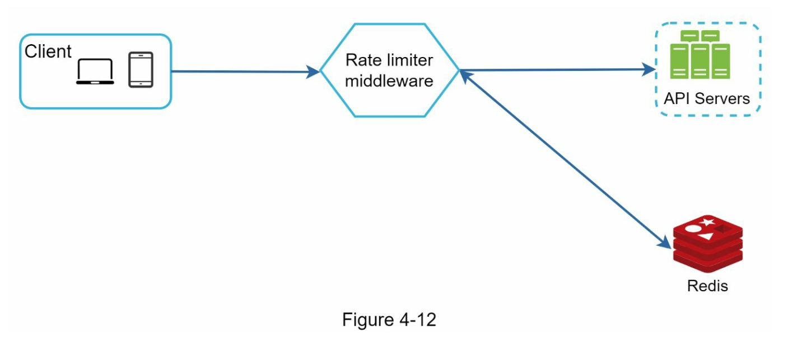
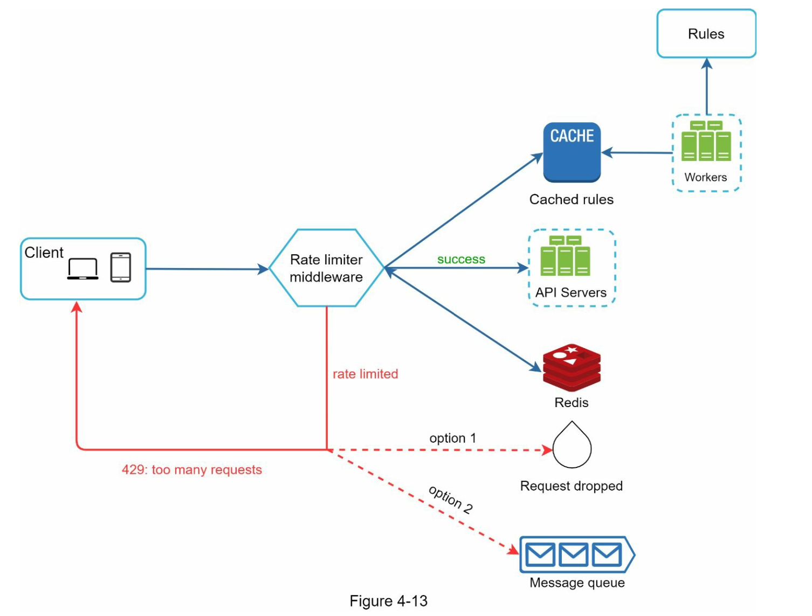
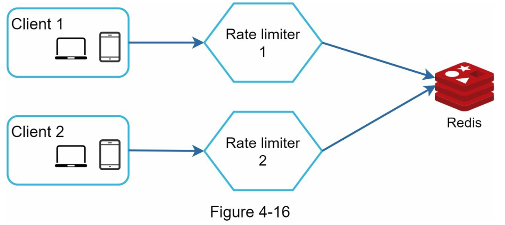

# Chapter 4 "처리율 제한 장치의 설계"

## 0. 처리율 제한 장치란? (rate limiter)

* 클라이언트 또는 서비스가 보내는 트래픽의 처리율(rate)을 제어하기 위한 장치
* 특정 시간 동안 서버로 오는 클라이언트 요청의 수를 제한한다.
* API 요청 횟수가 제한 장치에 정의된 임계치(threshold)를 넘어서면 추가로 도달한 모든 호출은 처리가 중단(block)된다.

### 예시

* 사용자는 초당 2회 이상의 새 글을 올릴 수 없다.
* 같은 IP 주소로는 하루에 10개 이상의 계정을 생성할 수 없다.

### 처리율 제한 장치는 왜 사용하는가?

* DoS(Denial of Service) 공격에 의한 자원 고갈을 방지 
* 비용 절감 - 추가 요청에 대한 처리를 제한하면 서버를 많이 두지 않아도 되고, 우선 순위가 높은 API에 더 많은 자원을 할당할 수 있다.
* 서버 과부하 방지

## 1. 1단계: 문제 이해 및 설계 범위 확정

### 문제 이해

* 호출 제한 위치가 클라이언트측/서버측? 서버측
* 호출 제한 기준은 IP주소/사용자ID/그외? 다양한 형태의 제어 규칙을 정의할수 있어야 함.
* 시스템의 규모는? 대규모 요청 처리 
* 분산 환경에서 동작? 네
* 처리율 제한 장치가 독립된 서비스/APP 코드에 포함? 면접자가 결정
* 처리율 제한에 걸렸을때, 사용자가 그 결과를 알아야 하는가?

### 요구사항 요약

* 설정된 처리율을 초과하는 요청은 정확하게 제한한다.
* 처리 과정의 응답 시간이 낮아야 한다.
* 가능한 적은 메모리를 사용해야 한다.
* 분산 처리율 제한 정치여야 한다. (하나의 처리 제한 장치가 여러 서버에서 사용 가능해야 한다.)
* 예외가 발생한다면 사용자에게 그 사실을 알려야 한다.
* 제한 장치에 장애가 생기더라도 전체 시스템에 영향을 주어서는 안된다.

## 2. 2단계: 개략적 설계안 제시

### 2.1. 처리율 제한 장치는 어디에 둘 것인가?

* Cient 측
    * 서버의 자원을 사용하지는 않겠지만, 쉽게 위변조가 가능하다.
    * 모든 클라이언트의 장치에 일괄적인 설정을 하기 어렵다.
* Server 측
* Middleware
    * 미들 웨어가 API 서버로 가는 용청을 통제하도록 한다.



* 현재 기술 스택에 맞춰서 방법을 선택하며, 처리율 제한 장치를 직접 개발하고 운영하기 어렵다면 상용 API Gateway 서비스를 이용하거나 오픈소스 라이브러리를 사용하는 것도 좋다.

### 2.2. 처리율 제한 알고리즘

#### 1) 토큰 버킷 알고리즘



* 토큰 버킷은 지정된 용량을 갖는 컨테이너이며, 이 버킷에는 사전 설정된 양의 토큰이 주기적으로 채워지고 토큰이 꽉 찬 버킷에는 더이상의 토큰은 추가되지 않는다.
<br>각 요청은 처리될 때마다 하나의 토큰을 사용하고, 충분한 토큰이 없는 경우 해당 요청은 버려진다.
* 파라미터
    * 버킷 크기: 버킷에 담을 수 있는 토큰의 최대 갯수
    * 토큰 공급률(refill rate): 초당 몇 개의 토큰이 버킷에 공급되는가
* 처리 방식
    * API 마다 호출 회수를 지정해 그에 알맞은 토큰을 설정해준다거나, IP에 대한 최대 요청 수를 설정한다거나, 서버에 대한 모든 요청 수를 제한할 수 있다.
    * 통상적으로는 API 마다 별도의 버킷을 둔다. 
* 장점
    * 구현이 쉽다. (버킷설정 + 토큰 추가 + 토큰 사용)
    * 메모리가 효율적이다. (토큰 자체가 많은 메모리를 사용하지 않음)
    * 짧은 시간에 집중되는 트래픽 처리가 가능하다. 버킷에 남은 토큰이 있기만 하면 요청은 시스템에 전달될 것이다. (토큰을 빵빵하게 채우면 대처 가능)
* 단점
    * 버킷 크기/토큰 공급률 2개 인자를 적절하게 튜닝하는 것이 까다롭다.
* 구현
    * Bucket4j
        * https://velog.io/@jaymin_e/Spring-Bucket4j%EB%A5%BC-%EC%9D%B4%EC%9A%A9%ED%95%98%EC%97%AC-%ED%8A%B8%EB%9E%98%ED%94%BD-%EC%A0%9C%EC%96%B4%ED%95%98%EA%B8%B0
    * Guava
    * RateLimitJ
    * Resilience4j

#### 2) 누출 버킷 알고리즘



* 토큰 버킷 알고리즘과 비슷하지만, 요청 처리율이 고정되어 있다.
* FIFO Queue로 구현한다.
* 처리 방식
    * 큐의 사이즈가 가득 차 있으면 새 욫어은 버리고, 빈 자리가 있으면 추가한다.
    * 지정된 시간마다 큐에서 요청을 꺼내어 처리한다.
* 파라미터
    * 버킷 크기: 큐 사이즈와 같은 값. 
    * 처리율(outflow rate): 지정된 시간당 몇 개의 항목을 처리할지 지정하는 값.
* 장점
    * 큐의 크기가 제한되어 있어, 메모리 사용량 측면에서 효율적이다.
    * 고정된 처리율을 갖고 있기 떄문에 안정적인 출력이 필요한 경우에 적합하다.
* 단점
    * 단시간에 많은 트래픽이 몰리는 경우, 큐에는 오래된 요청들이 쌓이게 되고 최신 요청들을 제때 처리하지 못함.
    * 파라미터 튜닝이 까다롭다.
* 구현
    * Nginx
        * https://foot-develop.tistory.com/55

#### 3) 고정 윈도 카운터 알고리즘



* 타임 라인을 고정된 간격의 window로 나누고 각 윈도마다 들어온 요청의 수를 카운팅을 하여, 정해진 요청의 수를 넘기면 거절하는 방식으로 동작한다.
* 장점
    * 메모리 효율이 좋고, 이해하기 쉽다.
    * 윈도가 닫히는 시점에 카운터를 초기화하는 방식은, 특정한 트래픽 패턴을 처리하기에 적합하다.
* 단점
    * window의 경계 부분에 순간적으로 많은 트래픽이 몰리면, 윈도에 할당된 양보다 더 많은 요청이 처리될 수 있다.

#### 4) 이동 윈도우 로깅 알고리즘



* 고정 윈도 카운터 알고리즘에서 발생하는 window의 경계에서 트래픽이 몰리는 경우를 해결하기 위한 알고리즘이다.
* window를 이동하면서 해당 윈도에서 걸쳐있는 요청의 개수를 체크하며 요청을 처리해 준다.
* 타임 스탬프를 저장할 때에는 Redis의 Sorted Set 과 같은 캐시에 보관한다.
* 장점
    * window를 이동하면서 해당 윈도에서 걸쳐있는 요청의 개수를 체크하며 요청을 처리하므로, 모든 영역에서 원하는 양의 트래픽을 처리할 수 있다.
* 단점
    * 각 요청들이 언제 들어왔는지 타임 스탬프를 저장해야 하기 때문에, 메모리 사용량이 많다.

#### 5) 이동 윈도우 카운터 알고리즘



* 고정 윈도 카운터 알고리즘과 이동 윈도 로깅 알고리즘을 결합한 것이다.
* 현재 윈도의 요청 수 계산 = 현재 1분간의 요청 수 + 직전 1분간의 요청 수 * 이동 윈도와 직전 1분이 겹치는 비율 
    * 3 + 5*0.7 = 6.5
    * 1분의 30% 시점에 도착한 신규 요청은 시스템으로 전달되지만, 그 직후에는 한도에 도달하였으므로 더 이상의 요청은 받을 수 없을 것이다.
* 장점
    * 이전 시간의 평균 처리율에 따라 현재 윈도의 상태를 계산하므로 짧은 시간에 몰리는 트래픽에도 잘 대응한다.
    * 타임스탬프를 저장하지 않아서 메모리 효율이 좋다.
* 단점
    * 요청이 균등하게 분포되어 있다고 가정한 상태에서 추정치를ㄹ 계산하기 때문에 다소 느슨하다. 그러나 큰 문제는 아니라고 한다.

### 2.3. 개략적인 아키텍처



* 카운터는 어디에 보관할 것인가? 데이터베이스는 디스크 접근 때문에 느리니까, 메모리상에서 동작하는 캐시가 적합하다. 빠르고, 시간에 기반한 만료 정책을 지원한다.

## 3. 3단계: 상세 설계

### 3.1. 처리율 제한 규칙

* 예시) Lyft는 처리율 제한에 오픈 소스를 사용하고 있다. Configuration File 형태로 디스크에 저장한다.

```yml
domain: messaging
descriptors:
    - key: message_type
    Value: marketing
    rate_limit:
        unit: day
        requests_per_unit: 5
```

### 3.2. 처리율 한도 초과 트래픽의 처리

* 한도 제한에 걸리면 HTTP 429 응답 (too many requests)를 클라이언트에게 보낸다.
* 처리율 제한 장치에서 사용되는 HTTP 헤더
    * X-Ratelimit-Remaining : 윈도우에 남은 처리 가능한 요청 수
    * X-Ratelimit-Limit : 매 윈도우마다 클라이언트가 전송 가능한 요청 수
    * X-Ratelimit-Retry-After : 한도 제한에 걸리지 않으려면 몇 초 뒤에 요청을 다시 보내야 하는지 알림

```xml
HTTP/1.1 429 Too Many Requests
Content-Type: application/json
X-Ratelimit-Limit: 100
X-Ratelimit-Remaining: 0
X-Ratelimit-Retry-After: 30

{
    "error": "Too many requests. Please wait before retrying."
}
```

### 3.3 상세 설계 도면



* 처리율 제한 규칙은 디스크에 보관하고, 작업 프로세스 workers는 수시로 규칙을 디스크에서 읽어 캐시에 저장한다.
* 처리율 제한 미들웨어는 제한 규칙을 캐시에서 가져오고, 카운터/타임스탬프를 레디스 캐시에서 가져온다. 

### 3.4.분산 환경에서의 처리율 제한 장치의 구현 (여러 대의 서버와 병렬 스렐드 지원)

#### 1) 경쟁 조건 (race condition)

* 동시에 읽고 카운터 값을 증가시켜 예기치 않은 결과를 초래할 수 있음.
* 해결책
    * lock - 시스템의 성능을 떨어트림.
    * 루아 스크립트 - Redis 서버에서 원자적으로 실행되도록 설정
    * 정렬 집합 - 레디스 자료구조. 시간 기반 요청 관리

#### 2) 동기화 (synchronization)

* 웹 계층은 stateless 이므로, 고정 세션을 활용하여 같은 클라이언트로부터의 요청은 같은 처리율 제한 장치로 보내도록 해야 한다.
<br>→ 규모면에서 확장 가능하지도, 유연하지도 않다.
* 레디스와 같은 중앙 집중형 데이터 저장소를 사용하여 해결한다.



#### 3) 성능 최적화

* 여러 데이터 센터를 지원 - 사용자의 트래픽을 가장 가까운 에지 서버로 전달하여 지연 시간을 줄인다.
* 제한 장치 간에 데이터를 동기화할때 최종 일관성 모델을 사용한다.
    * 최종 일관성 모델 - 특정 시점에서 일시적으로 데이터 불일치가 발생할 수 있지만, 시간이 지나면 모든 복제본이 동일한 상태로 수렴하는 것을 보장하는 일관성 모델

#### 4) 모니터링

* 채택된 처리율 제한 알고리즘이 효과적인지
* 정의한 처리율 제한 규칙이 효과적인지

## 4. 4단계: 마무리 (추가로 고민할 것들)

* hard/soft 처리율 제한
    * hard - 임계치를 절대 넘어설 수 없다.
    * soft - 잠시 동안은 임계치를 넘어설 수 있다.
* 다양한 계층에서의 처리율 제한
    * 애플리케이션 계층(OSI 7번 계층)에서의 처리율 제한만 살펴보았지만, IP 주소 (OSI 3번 네트워크 계층) 에 처리율 제한하는 것도 가능하다.
* 처리율 제한을 회피하기 위한 클라이언트 설계 방법
    * 클라이언트 측 캐시를 사용하여 API 호출 횟수를 줄인다.
    * 처리율 제한의 임계치를 이해하고, 짧은 시간 동안 너무 많은 메시지를 보내지 않도록 한다.
    * 예외나 에러를 처리하는 코드를 도입하여, 클라이언트가 예외적 상황으로부터 안정적으로 복구될 수 있도록 한다.
    * retry 로직을 구현할 때는 충분한 back-off (대기) 시간을 둔다.

## Reference

* https://dev-qhyun.tistory.com/27
* https://donghyeon.dev/%EC%9D%B8%ED%94%84%EB%9D%BC/2022/03/18/%EC%B2%98%EB%A6%AC%EC%9C%A8-%EC%A0%9C%ED%95%9C-%EC%9E%A5%EC%B9%98%EC%9D%98-%EC%84%A4%EA%B3%84/
* https://leedongyeop.notion.site/4-8d4fcdfc382e41b4bcb1b17731463140


