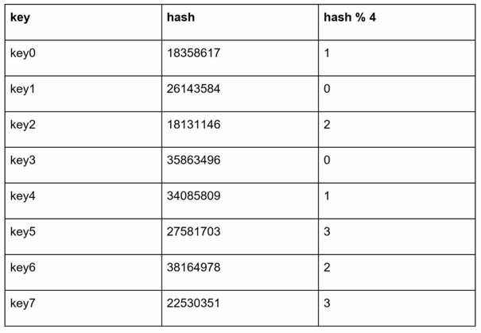
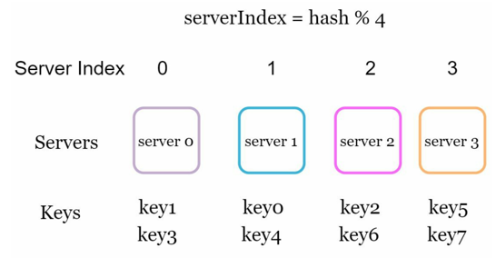
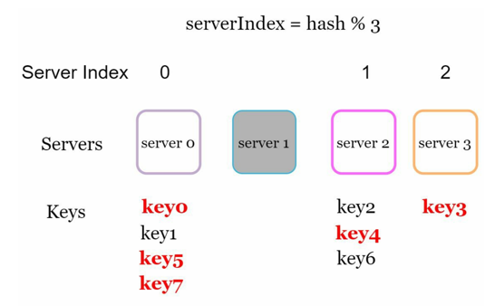
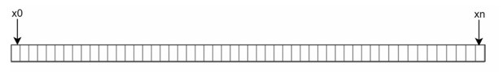
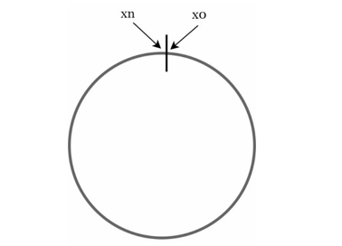
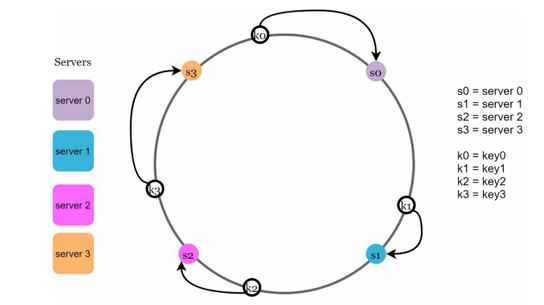
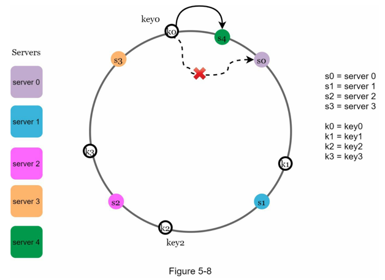
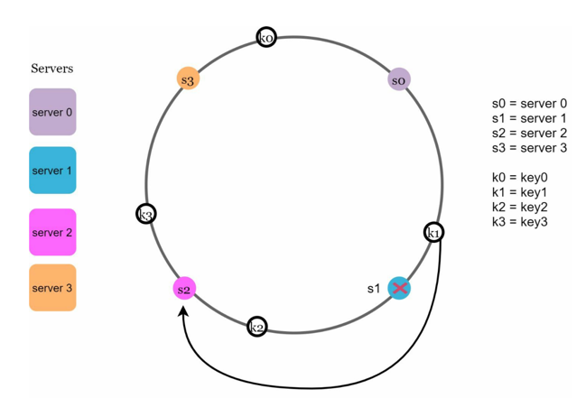
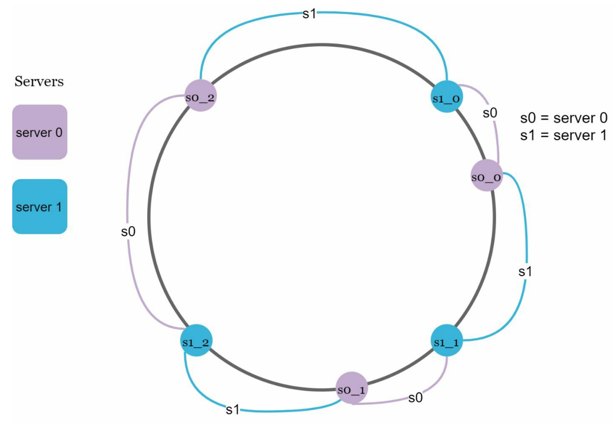

# Chapter5 안정 해시 설계

* 안정 해시
  * 새로운 서버가 추가되거나 기존 서버가 제거되었을 때 데이터의 배치를 최소화하는 기법
  * 수평적 규모 확장성을 달성하기 위해 요청이나 데이터를 서버에 균등하게 나누기 위한 목표로 사용

## 해시 키 재배치 문제 
* N개의 캐시 서버가 있을 경우 serverIndex = hash(key) % N 로 부하를 균등하게 나눔
* 서버 풀 크기가 고정되어있을 때 데이터 분포가 균등할때 잘 동작하나, 서버가 추가되거나 삭제될 경우 문제가 생김

* 해시키를 서버수로 나눠 나머지 연산을 통해 해당 서버에 분배 

* 서버 한대에 장애가 발생하면 대부분의 키가 재분배됨. 대규모 캐시 미스 발생

---

## 안정 해시 
* 전통적인 해시 테이블은 슬롯의 수가 바뀌면 거의 대부분의 키를 재배치
* 안정 해시는 해시 테이블 크기가 조정될 때 평균적으로 오직 "키의 개수/슬롯 개수"개의 키만 재배치 하는 해시 기술

 

### 해시 공간과 해시 링
* 해시 공간 : 해시 함수를 사용하여 데이터를 특정 범위 내의 값으로 매핑하는 개념을 기반으로 한 공간
* 해시 함수로 SHA-1 사용(범위 : 0 ~ 2¹⁶⁰-1), 함수의 출력값 범위를 x0, x1, x2, x3 ... xn라 한다면
* 0는 x0, xn이 2¹⁶⁰-1, 1~xn -1 까지는 그 사이값을 갖게됨

  

 

* 해시 링 : 해시 공간을 양쪽으로 구부려 접으면 해시링이 만들어짐. 

  

 

### 해시 서버, 해시 키 & 서버 조회

  

* 서버와 해시 키를 해시 링 위에 배치 할 수 있음
* 키가 저장되는 서버는 해당 키의 위치로부터 시계방향으로 링을 탐색해 나가면서 만나는 서버

 

### 서버 추가 & 서버 제거 

  

  

* 서버를 추가하더라도 키의 가운데 일부만 재배치하면 됨
* 서버가 제거 되더라도 키 가운데 일부만 재배치 됨 

 

### 기본 구현법의 두 가지 문제
* 서버와 키를 균등 분포 해시 함수를 사용해 해시 링에 배치
* 키의 위치에서 링을 시계방향으로 탐색하다 만나는 최초의 서버가 키가 저장될 서버
* 문제점 1. 서버가 추가되거나 삭제되는 상황을 감안하면 파티션 크기를 균등하게 유지하는게 불가능
* 문제점 2. 키의 균등 분포를 달성하기 어려워서 아무 데이터도 갖지 않는 서버가 생길 수 있음

---

### 가상 노드 

  

* 기본 구현법의 문제를 해결하기 위해 하나의 서버는 링 위에 여러개의 가상 노드를 생성 
* 각 서버는 하나가 아닌 여러 개의 파티션을 관리 (S0 서버가 S0_0, S0_1, S0_2)
* 키의 위치로부터 시계방향으로 링을 탐색하다가 만나는 최초의 가상 노드가 해당 키가 저장될 서버 
* 가상 노드의 개수를 늘리면 키의 분포는 점점 더 균등해짐 
* 가상 노드를 늘리면 데이터 저장공간이 많이 필요하니, 시스템 요구사항에 맞게 가상 노드의 개수를 적절하게 조정해야함 

 

### 안정 해시 이점
* 서버가 추가되거나 삭제될 때 재배치 되는 키의 수가 최소화
* 데이터가 보다 균등하게 분포하게 되므로 수평적 규모 확장성을 달성하기 쉬우며, 핫스팟 키 문제를 줄임

 

### 안정 해시 사용처
* 아마존 다이나모 데이터 베이스의 파티셔닝 관련 컴포넌트
* 아마존 S3에서 데이터 분산 및 복제에서 안정해시 사용
* Redis 클러스터 모드에서 데이터 분배 시 안정해시를 사용하여 키-값 쌍을 다양한 노드에 분산
* 아파티 카산드라 클러스터에서의 데이터 파티셔닝

