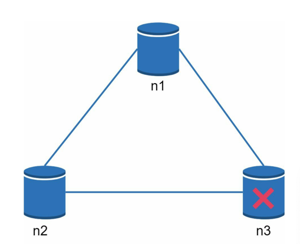
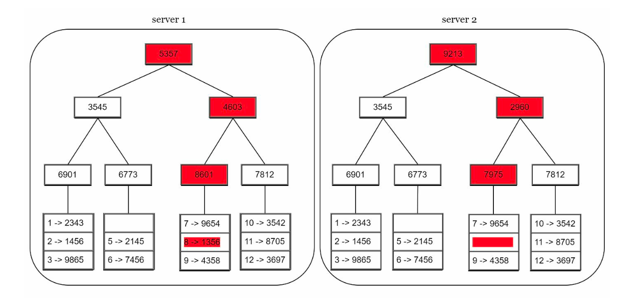

# Chapter6 키-값 저장소 설계 
* 키-값 저장소는 키-값 데이터베이스라고도 불리는 비 관계형 데이터베이스 
* 키-값 쌍에서 키는 유일해야하고, 해당 키에 매핑 된 값은 키를 통해서만 접근 가능
* 아마존 다이나모, memcached, 레디스 등이 있음

## 문제 이해 및 설계 범위 확정
* 키-값 쌍의 크기는 10MB 이하 
* 큰 데이터를 저장할 수 있어야한다. 
* 높은 가용성을 제공해야한다. 장애가 있더라도 빨리 응답해야한다 
* 높은 규모 확장성을 제공해야 한다. 트래픽에 따라 자동적으로 서버 증설.삭제가 이루어져아한다.
* 데이터 일관성 수준은 조정이 가능해야한다. 
* 응답 지연시간이 짧아야한다 

---

## 단일 서버 키-값 저장소
* 단일 서버에 키-값 저장소를 설계의 직관적인 방법은 키-값 쌍 전부를 메모리에 해시 테이블로 저장하는 것. 
* 빠른 속도를 보장하나, 모든 데이터를 메모리 안에 두는 것은 불가능 할 수 도 있다는 약점이 있음

## 분산 키-값 저장소
* 분산 키-값 저장소는 키-값 쌍을 여러 서버에 분산시키기에 분산 해시 테이블이라고도 불림

### CAP
* CAP 모두 만족하는 분산 시스템을 설계하는 것은 불가능함
  * Consistency 데이터 일관성 : 분산 시스템에 접속하는 모든 클라이언트는 어떤 노드에 접속했느냐와 관계없이 언제나 같은 데이터를 봄
  * Availability 가용성 : 분산 시스템에 접속하는 클라이언트는 일부 노드에 장애가 발생하더라도 항상 응답을 받을 수 있어야함.
  * Partition Tolerance 파티션 감내 : 파티션(두 노드사이의 통신장애)이 생기더라도 시스템은 계속 동작해야함

  

* CP 시스템 : 일관성과 파티션 감내를 지원하는 키-값 저장소로, 가용성을 희생
* AP 시스템 : 가용성과 파티션 감내를 지원하는 키-값 저장소로, 일관성을 희생
* CA 시스템 : 일관성과 가용성을 지원하는 키-값 저장소. 파티션 감내를 지원하지 않으나 장애대응을 위해 분산 시스템은 반드시 파티션 문제를 감내할 수 있도록 설계되어야함.

#### 이상적인 상태
* 네트워크가 파티션되는 상황은 이뤄나지 않으며, 데이터 일관성과 가용성도 만족

#### 실세계의 분산 시스템
* 분산 시스템은 파티션 문제를 피할 수 없음
* 파티션 문제가 발생하면 일관성과 가용성 사이에서 하나를 선택해야함
 

* n3에 장애가 발생하면 n3에는 기록되었으나 n1, n2는 오래된 사본을 가지고 있을 가능성이 있음
* CP를 선택한다면 데이터 불일치를 최소화 하기 위해 n1과 n2에 대해 쓰기 연산을 중단
* AP를 선택한다면 낡은 데이터를 반환할 위험이 있더라도 읽기 연산을 허용해야함. 

---

## 시스템 컴포넌트 
* 키-값 저장소 구현에 사용될 핵심 컴포넌트 
  * 데이터 파티션
  * 데이터 다중화 
  * 일관성
  * 일관성 불일치 해소
  * 장애처리
  * 시스템 아키텍쳐 다이어그램
  * 쓰기/읽기 경로 

 
  
### 데이터 파티션 
* 데이터를 파티션으로 분할하여 여러 서버에 저장할때는 다음 문제를 중요하게 따져야함
  * 데이터를 여러 서버에 고르게 분산할 수 있는가
  * 노드가 추가되거나 삭제될 때 데이터의 이동을 최소화 할 수 있는가 
* 안정해시를 사용 시 장점
  * 규모 확장 자동화 : 시스템 부하에 따라 서버가 자동으로 추가되거나 삭제되도록 만들 수 있음
  * 다양성 : 각 서버의 용량에 맞게 가상 노드의 수를 조정할 수 있믐

 

### 데이터 다중화 
* 높은 가용성과 안정성을 확보하기 위해서는 데이터를 N개 서버에 다중화할 필요가 있음
* N개 선정 방법 : 키를 해시 링 위에 배치한 후 그 지점으로부터 시계방향으로링을 순회하며 만나는 첫 N개의 서버에 데이터 사본 보관

* N=3로 설정하면 key0은 s1, s2, s3에 저장됨
* 가상 노드 사용 시 노드를 선택할 때 같은 물리 서버를 중복 선택하지 않도록 해야함

 

### 데이터의 일관성 
* 여러 노드에 다중화된 데이터는 적절히 동기화가 되어야함
* 정족수의 합(Quorum Consensus) 프로토콜을 사용하면 읽기/쓰기 연산 모두에 일관성 보장이 가능함
  * N = 사본 개수
  * W = 쓰기 연산에 대한 정족수. 쓰기 연산이 성공한 것으로 간주하려면 적어도 W개의 서버로부터 쓰기연산이 성공했다는 응답을 받아야함.
  * R = 읽기 연산에 대한 정족수. 읽기 연산이 성공한 것으로 간주하려면 적어도 R개의 서버로부터 쓰기연산이 성공했다는 응답을 받아야함.

* 위 그림과 같이 S0, S1, S2에 대중화된 상황
* W = 1 는 쓰기 연산이 성공했다고 판단하기 위해 최소 한대의 서버로부터 쓰기 성공 응답을 받아야함 -> S0으로부터 응답을 받았다면 S1, S2로부터 응답을 받을 필요 없음
* W = 1, R = 1인 구성의 경우 중재자는 한대의 서버로부터 응답만 받으면되니 응답속도는 빠름
* W, R의 값이 1보다 큰 경우에는 데이터 일관성 수준은 향상될테지만 가장 느린 응답속도를 가진 서버로부터 응답을 기다려야하므로 응답속도는 느림
* 면접 시에는 요구되는 일관성 수준에 따라 W, R, N을 조정하면 됨 
  * R=1, W=N : 빠른 읽기 연산에 최적화된 시스템
  * W=1, R=N : 빠른 쓰기 연산에 최적화된 시스템
  * W+R > N : 강한 일관성이 보장됨
  * W+R <= N : 강한 일관성이 보장되지 않음

#### 일관성 모델
* 일관성 모델 또한 키-값 저장소를 설계할 때 고려해야할 중요한 요소 
  * 강한 일관성 : 모든 읽기 연산은 가장 최근에 갱신된 결과를 반환. 모든 사본에 현재 쓰기 연산의 결과가 반영될 때까지 읽기/쓰기를 금지
  * 약한 일관성 : 읽기 연산은 가장 최근에 갱신된 결과를 반환 못할 수 있음
  * 결과적 일관성 : 약한 일관성의 한 형태로 갱신 결과가 결국 모든 사본에 반영 되는 모델
* 강한 일관성은 고가용성 시스템에 적합하지 않으며, 결과적 일관성 모델을 따를 경우 일관성이 깨지면 클라이언트가 해결해야함

#### 비 일관성 해소 기법 : 데이터 버저닝
* 데이터를 다중화하면 가용성은 높아지지만, 사본 간 일관성이 깨질 가능성이 높음
* 버저닝과 벡터 시계를 사용하여 문제를 해소 
  * 버저닝 : 데이터를 변경할때마다 해당 데이터의 새로운 버전을 만드는것.
  * 벡터 시계 : [서버, 버전]의 순서쌍을 데이터에 매단 것. 어떤 버전이 선행 버전인지, 후행 버전인지, 아니면 다른 버전과 충돌이 있는지 판별하는데 쓰임 
    * 단점 1. 충돌 감지 및 해소 로직이 클라이언트에 들어가야하므로, 클라이언트 구현이 복잡해짐
    * 담점 2. [서버:버전]의 순서쌍 개수가 굉장히 빨리 늘어남 -> 해결책으로 임계치를 설정하고 임계치 이상이 되면 오래된 순서쌍을 백터시계에서 제거 

* D([S1, v1], [S2, v2], ..., [Sn, vn]) 라고 표현한다고 가정
  * 1. Sx가 데이터 D1을 시스템에 기록. D1([Sx, 1])
  * 2. Sx가 데이터 D1을 D2로 업데이트. D2([Sx, 2])
  * 3. Sy가 데이터 D2를 D3로 업데이트. D3([Sx, 2], [Sy, 1])
  * 4. Sz가 D2를 D4로 업데이트. D4([Sx, 2], [Sz, 1])
  * 5. 어떤 클라이언트가 D3, D4를 읽으면 데이터간 충돌이 있다는 것을 알게되며, 이 충돌은 클라이언트가 해소한 후 서버에 기록. D5([Sx, 3], [Sy, 1], [Sz, 1])

 

### 장애 

#### 장애 감지 
* 모든 노드 사이에 멀티캐스팅 채널을 구축하는 것이 서버 장애를 감지하는 손쉬운 방법이나, 서버가 많을 때는 분명 비효율적이다
* 가십 프로토콜 같은 분산형 장애 감지 솔루션을 택하는 것이 효율적
  * 각 노드는 멤버십 목록(멤버 ID, 박동카운터)을 유지.
  * 각 노드는 주기적으로 자신의 박동 카운터를 증가
  * 각 노드는 무작위로 선정된 노드들에게 주기적으로 자기 박동 카운터 목록을 보냄
  * 박동 카운터 목록을 받은 노드는 멤버십 목록을 최신 값으로 갱신
  * 어떤 멤버의 박동 카운터 값이 지정된 시간 동안 갱신되지 않으면 해당 멤버는 장애 상태인 것으로 간주

#### 일시적 장애 처리 

* 엄격한 정족수 접근법 : 읽기와 쓰기 연산을 금지 
* 느슨한 정족수 접근법 : W개의 쓰기 서버와 R개의 읽기 서버를 해시 링에서 고르며, 장애 상태인 서버는 다른서버가 맡아서 처리. 장애가 해소 되면 갱신 내용을 장애 서버에 전달

#### 영구 장애 처리 

* 반-엔트로피 프로토콜 : 반-엔트로피(Anti-Entropy) 프로토콜은 분산 시스템에서 데이터 일관성을 유지하기 위해 사용되는 동기화 방법 중 하나
  * 무작위 동기화 
    * 반-엔트로피는 무작위로 선택된 두 노드 간에 데이터를 교환하거나 병합하여 데이터 일관성을 확보 
    * 노드 A와 노드 B가 서로 데이터를 비교하고, 차이가 있는 경우 데이터의 최신 상태로 동기화

 

* 머클트리 : 머클 트리는 데이터 검증과 무결성을 보장하기 위한 데이터 구조. 주로 블록체인, 파일 시스템, 분산 네트워크에서 데이터의 변조 여부를 검증하는 데 사용
  * 머클 트리는 이진 트리 형태를 가지며, 각 노드에는 데이터 블록의 해시값(Hash)이 저장
  * 트리의 리프 노드는 원본 데이터 블록의 해시값이고, 상위 노드는 자식 노드의 해시값을 조합해 생성된 해시
  * 트리의 최상단에 있는 루트 해시는 전체 데이터 세트의 유효성을 나타냄. 
  * 데이터의 일부만 변경되어도 루트 해시가 달라지기 때문에, 데이터 변조를 쉽게 감지할 수 있음

#### 데이터 센터 장애 처리 
* 데이터 센터 장애에 대응할 수 있는 시스템을 만드려면 데이터를 여러 데이터 센터에 다중화 하는 것이 중요함.

 

### 시스템 아키텍쳐 다이어그램 

* 아키텍쳐 주된 기능
  * 클라이언트 키-값 저장소가 제공하는 get, put API와 통신
  * 중재자(위 이미지 n5)는 클라이언트에게 키-값 저장소에 대한 프락시 역할을 하는 노드
  * 노드는 안정해시, 해시 링 위에 분포
  * 노드는 자동으로 추가/삭제 가능, 시스템은 완전 분산
  * 데이터는 여러 노드에 다중화 
  * 모든 노드가 같은 책임을 지므로 SPOF(spingle point of failure)는 존재하지 않음

 

### 쓰기 경로 

  * 1. 쓰기 요청이 커밋 파일에 기록
  * 2. 데이터가 메모리 캐시에 기록
  * 3. 메모리 캐시가 가득차거나 사전에 정의된 어떤 임계치에 도달하면 데이터는 디스크에 있는 SSTable에 기록
    *SSTable : Stored-String Table의 약어로 키-값 순서쌍을 정렬된 리스트 형태로 관리하는 테이블 

### 읽기 경로

* 1. 데이터가 메모리에 있는지 검사
* 2. 데이터가 없으므로 블룸 필터(특정 원소가 집합에 속하는지를 확인하는 확률적 자료구조)를 검사
* 3. 블룸 필터를 통해 어떤 SSTable에 키가 보관되어 있는지 알아낸다 
* 4. SSTable 에서 데이터를 가져온다
* 5. 해당 데이터를 클라이언트에게 반환한다 

