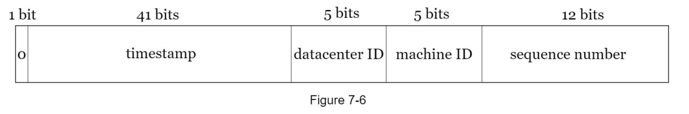

# 분산 시스템을 위한 유일 ID 생성기 설계
* auto increment 쓰면 되는거 아니야?
* DB 서버도 여러대 또는 샤딩 또는 ID를 만드는 노드가 여러곳일 수 있음

## 1. 문제 이해 및 설계 범위 확장
### 조건
* 정렬 가능
* 항상 증가해야 함
* 초당 10000개의 많은 수의 ID를 생성할 수 있어야함
### 요구사항
* ID는 유일
* ID는 숫자로만
* 64비트 표현될 수 있는 값
* 발급 날짜에 따라 정렬
* 초당 10000개 생성 가능

## 2. 개략적 설계안 제시 및 동의 구하기
* 분산 시스템을 만드는 방법은 여러개
    * 다중 마스터 복제
    * UUID
    * 티켓 서버
    * 트위터 스노 플레이크 접근법

### 다중 마스터 복제
* 유일성 보장을 DB auto_increment 기능을 활용한 것
* 데이터베이스 서버수를 기반으로 ID를 채증함
#### 단점
* 데이터베이스 노드가 늘어나면 K 값이 달라져 이슈가 있음
* 한 노드에서 ID를 대량으로 발행해버리면 순서를 보장할 수 없음
* 서버 추가/삭제가 어렵다.

### UUID
* 128비트 수
* 웹서버가 독립적으로 생성 가능
* 시간 및 하드웨어 기반으로 생성하기 때문에 독립적으로 생성 가능
#### 단점
* 길이가 김
* 시간순 정렬이 힘듬
* 숫자가 아닌 값이 포함

### 티켓 서버
* auto_increment 기능을 가진 티켓 서버를 중앙 집중형으로 사용
#### 단점
* 티켓 서버가 SPOF가 될 가능성이 있음
* 여러대를 둔다면 동기화 이슈가 발생

### 트위터 스노플레이크 접근법
* 생성 ID 구조를 여러 절(section)로 분할하는 것

* 타임스템프
    * 41비트할당
    * 기원 시각 이후로 몇 밀리초가 경과했는지를 나타내는 값
* 데이터 센터 ID : 5비트 할당, 2^5 = 32 개의 데이터 센터를 지원
* 서버 ID : 5비트 할당 32개 서버 지원
* 일련번호 : 12비트를 할당, 각 서버에서는 ID를 생성할때마다 일련 버호를 1만큼 증가, 밀리초마다 리셋

## 3. 상세 설계
* 데이터 센터 ID, 서버 ID는 고정
#### 타임스탬프
* 현 타임 스탬프 - 특정 기원 시간(여기서는 트위터? 기원시간) 으로 저장
* 그렇게 하면 41비트 69년에 해당하는 값을 저장 가능
#### 일련번호
* 12비트이므로 4096개 값을 가질 수 있음
* 특정 서버가 1밀리초 동안 하나 이상의 ID를 생성해야만 가능

## 4. 마무리
* 시계 동기화? 
    * 모든 노드가 같은 시계를 사용한다고 가정했음
    * 만약 다른 시계를 사용한다면? NTP가 문제를 해결 할 수 있음
* 각 절의 비트수를 조정하는것도 시스템 특징에 따라 생각해 볼만함