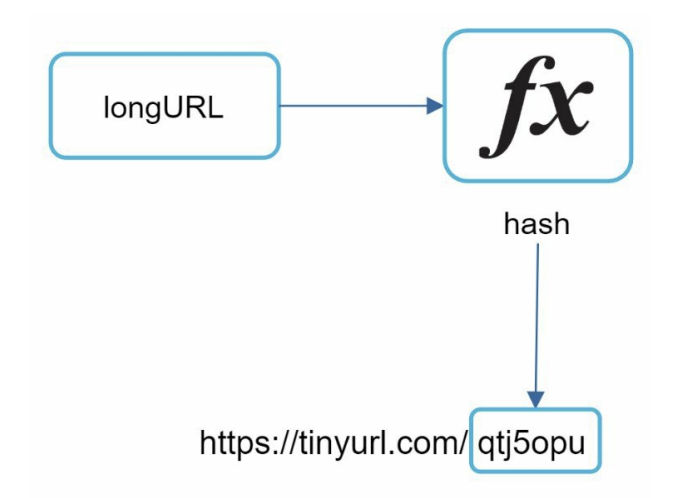
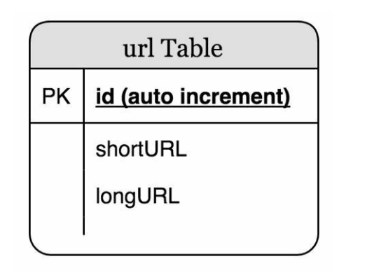
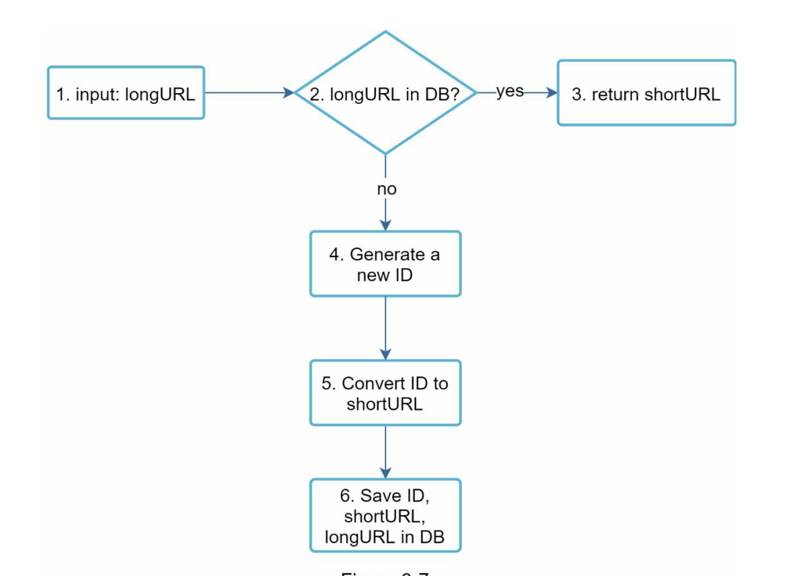

# URL 단축기 설계

## 1. 문제 이해 및 설계 범위 확정
* 긴 URL 입력에 대응하는 단축 URL로 결과를 제공
* 트래픽은 하루 1억개 단축 URL을 만들 수 있어야함
* 길이는 짧을 수록 좋음
* [0-9][a-z][A-Z] 만 사용가능

### 개략적 추정
* 쓰기 연산 : 매일 1억개
* 초당 쓰기 연산 : 1억 / 24 / 3600 = 1160
* 읽기 연산 : 비율은 10:1이라 가정, 초당 11600회
* 10년간 운영을 예상으로 1억 * 365일 * 10년 = 3650개의 레코드
* 축약 전 URL의 평균 길이는 100
* 따라서 3650억 * 100바이트 = 36.5테라바이트

## 2. 개략적 설계안 제시 및 동의 구하기

### API 엔드포인트
* POST /api/v1/data/shorten
    * 인자 : longUrl
    * 반환 : 단축 url
* GET /api/v1/shortUrl
    *반환 : 원래 url

### URL 리다이렉션
* 301응답 코드 응답의 Location 헤더에 원래 URL을 넣어 응답

| **특징**             | **301 (영구적 리다이렉션)**           | **302 (임시적 리다이렉션)**           |
|---------------------|------------------------------------|------------------------------------|
| **목적**             | 영구적으로 URL 변경                  | 임시적으로 URL 변경                  |
| **클라이언트 동작**    | 새로운 URL을 기억하고 이후 요청에 사용     | 기존 URL을 계속 사용                   |
| **SEO 영향**         | 기존 URL의 점수를 새로운 URL로 전이       | 기존 URL의 점수를 유지                  |
| **캐싱**             | 클라이언트와 검색 엔진에서 리다이렉션 캐시 가능 | 캐시하지 않음 (클라이언트는 항상 원본 URL로 요청) |
| **사용 예**          | 도메인 변경, URL 구조 개편             | 임시 이벤트 페이지, 유지보수 상태         |

### URL 단축
* 긴 URL을 해시값으로 대응시킬 해시 함수를 찾는게 중요

## 3. 상셰 설계
### 데이터 모델
* 모든 데이터를 메모리에 두는건 힘듬
* 데이터베이스에 저장
* 테이블 스키마

### 해시 함수
#### 해시 값 길이
* 10년간 3650억개를 만든다고 가정
* [0-9][a-z][A-Z]는 총 10 + 26 + 26 = 62개
* 62^n 중 3650억개를 커버할 수 있는 n값은? 7
* 짧은 url은 길이가 7자리인 haseValue로 표현 가능

#### 해시 후 충돌 해소
* 기존 hash 함수(CRC32, MD5, SHA-1 등등)를 사용
* 7자리보다 긴 haseValue값은 앞 7글자만 사용
* 그렇게되면 충돌이 발생할 확률이 생김
* 사전에 정의한 문자열을 추가하여 haseValue를 다시 정의
* url 저장시 한번 이상의 질의가 필요해서 오버헤드가 큼
* 블룸필터라는 자료구조를 사용하면 어느정도는 해결가능

#### base-62 전환
* hashValue에서 사용할 수 있는 문자 개수가 62개이기 때문에 62진법으로 각 문자열을 맵핑함
* 
### URL 단축기 상세 설계

* 고유 ID 생성기를 통해 ID를 생성
* 해당 ID를 62진수로 변환
* 이때 10^12 ~ 10^12 + 3650억 -1 범위의 10진수 수는 62진법으로 변환시 항상 7자리
* longUrl과 맵핑
* 고유 ID 생성기는 7장에서 학습

