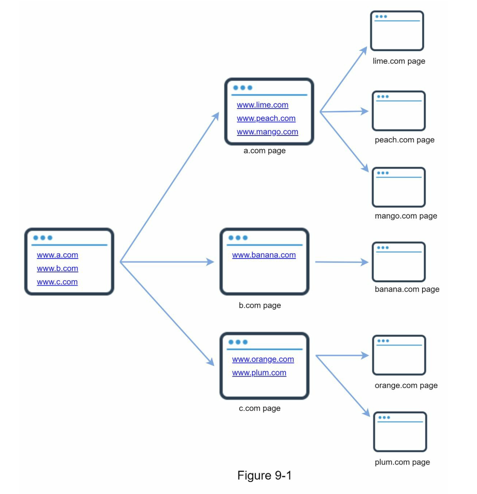
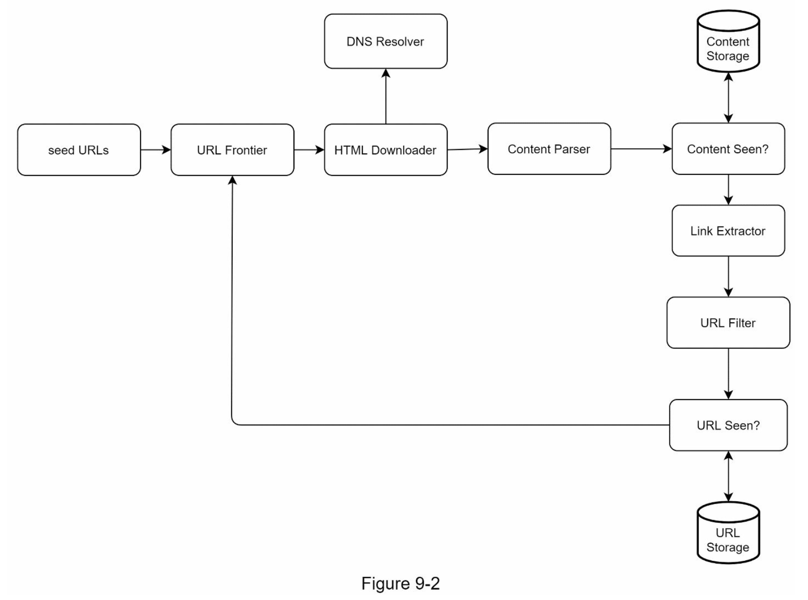
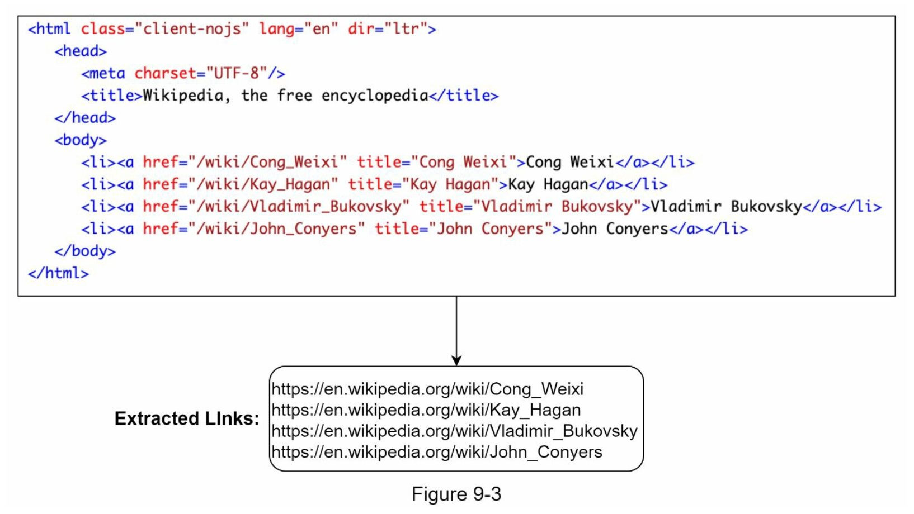
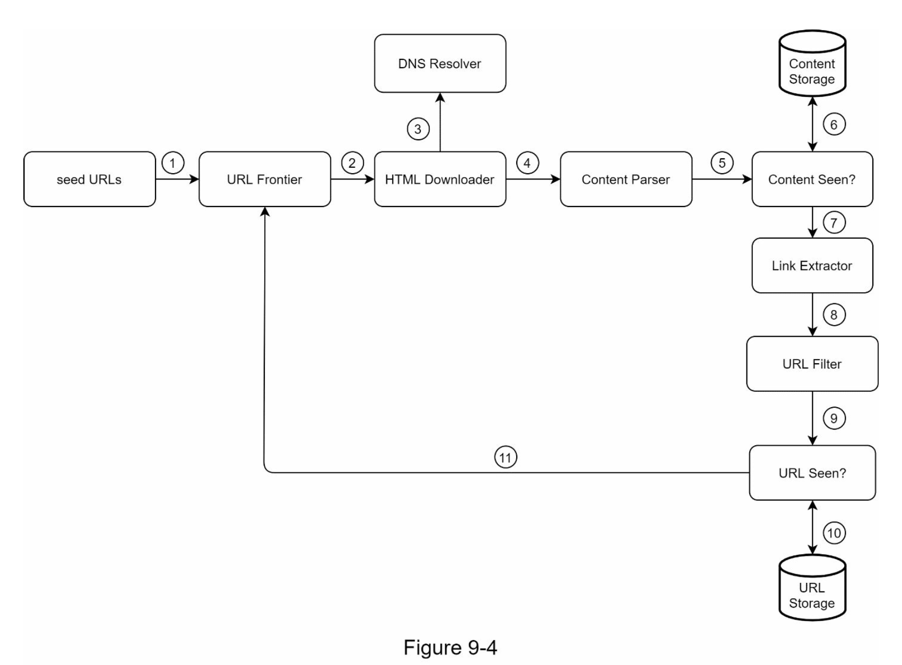
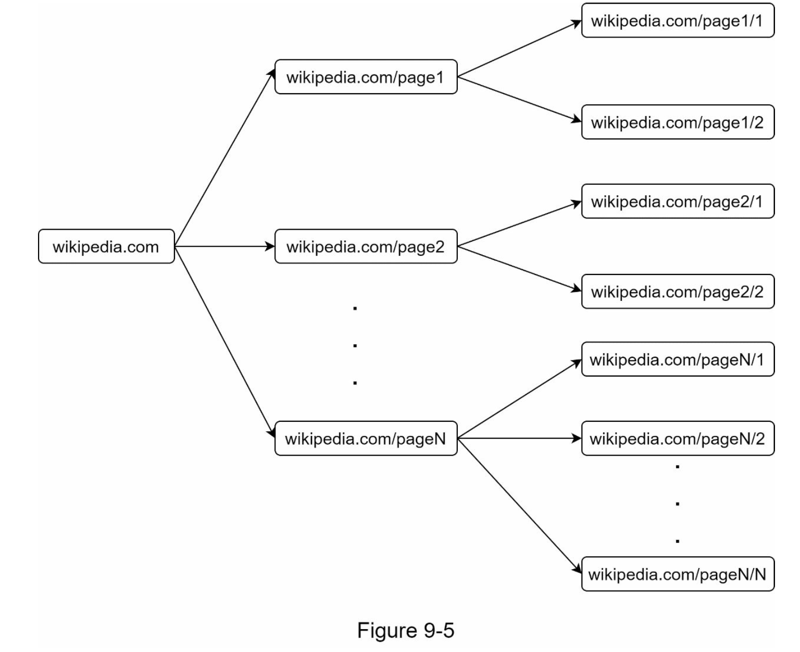
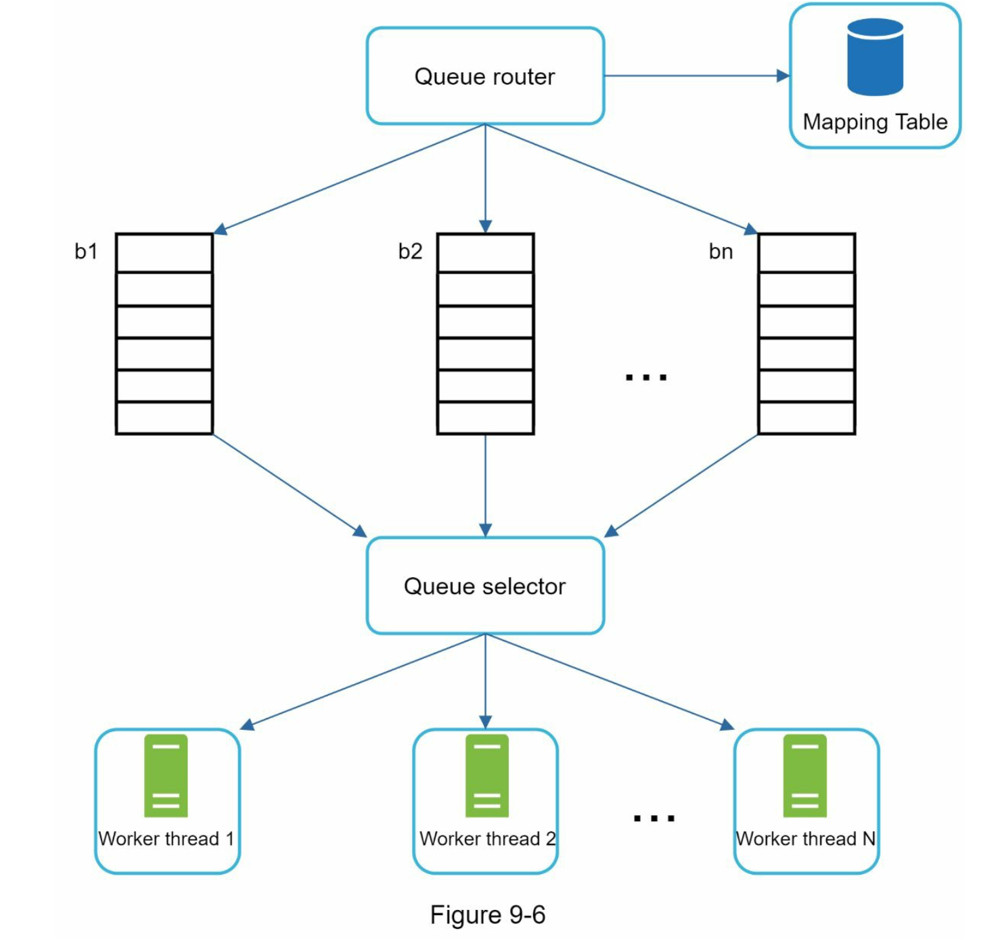
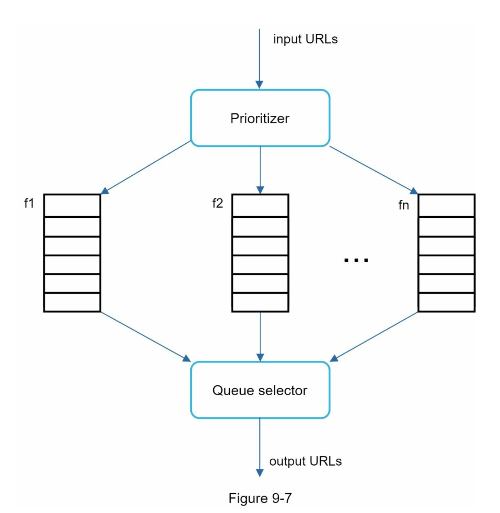
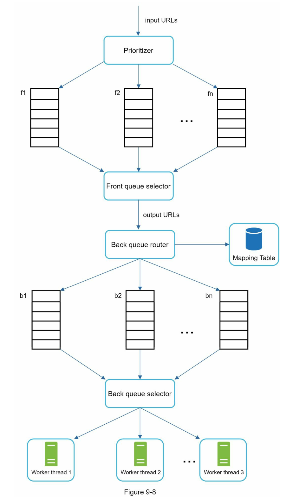
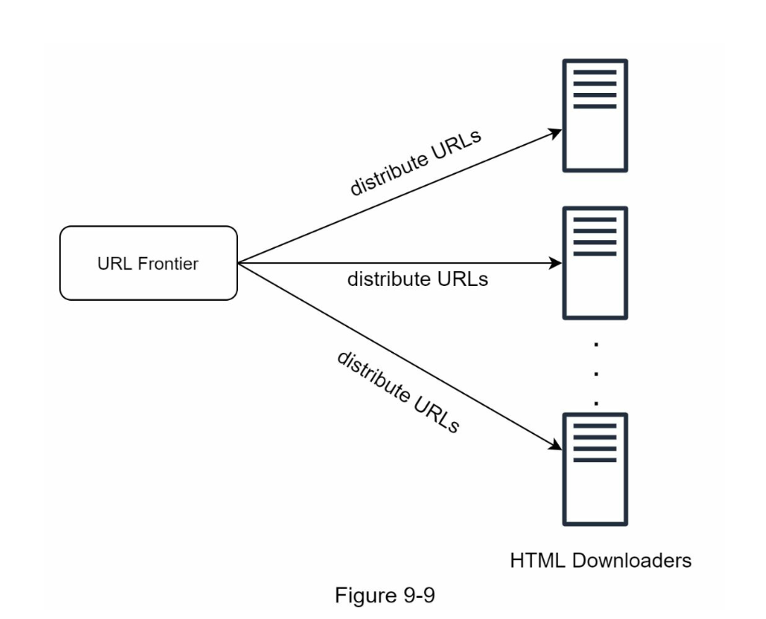
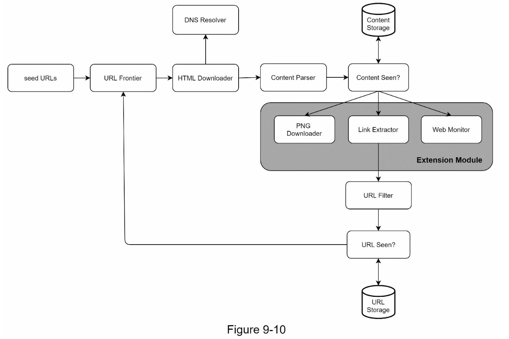

# 웹 크롤러 설계
#### 웹 크롤러 기본 알고리즘
</img>
```
1. URL 집합이 입력으로 주어지면, 해당 URL들이 가리키는 모든 웹 페이지를 다운로드 한다.
2. 다운받은 웹 페이지에서 URL들을 추출한다.
3. 추출된 URL들을 다운로드할 URL 목록에 추가하고 위의 과정을 처음부터 반복한다.
```
* 검색 엔진 인덱싱(search engine indexing)
    * 웹 페이지를 모아 검색 엔진을 위한 로컬 인덱스(local index)를 만든다.
    * ex) Googlebot(구글 검색엔진 웹 크롤러)
* 웹 아카이빙(web archiving)
    * 나중에 사용할 목적으로 장기보관하기 위해 웹에서 정보를 모으는 절차
    * ex) 미국 국회 도서관(US Library of Congress), EU 웹 아카이브
* 웹 마이닝(web mining)
    * 웹을 통한 데이터 마이닝(data mining)
    * ex) 유명 금융 기업은 주주총회, 자료 연차 보고서 등으로 기업의 핵심 사업 방향을 알아내기도 한다.
* 웹 모니터링(web monitoring)
    * 저작권이나 상표권이 침해되는 사례를 모니터링
    * ex) 디지마크(Digimarc)사는 해적판 저작물을 찾아내서 보고한다.

## 1. 문제 이해 및 설계 범위 확정
* 검색 엔진 인덱싱
* 매 달 10억 개의 웹 페이지 수집
* new/modified 웹 페이지 고려
* 수집 웹 페이지는 5년간 저장
* 중복 컨텐츠 무시

#### 좋은 웹 크롤러가 만족시켜할 할 속성
```
- 규모 확장성 : 병행성(parallelism) 활용
- 안전성 : 비정상적 입력이나 환경에 대응
- 예절 : 수집 대상 웹 사이트에 짧은 시간 동안 너무 많은 요청을 보내면 안 된다.
- 확장성 : 새로운 형태의 콘텐츠를 지원하기 쉬워야 한다.
```

### 개략적 규모 추정
* 매 달 10억 개의 웹 페이지를 다운로드
* QPS = 10억/30일/24시간/3600초 = 400pages/1초
* 최대 QPS = 2 x QPS = 800
* 웹 페이지의 크기 평균은 500k 추정
* 1개월 데이터 저장 용량 = 10억 페이지 x 500k = 500TB
* 5년 데이터 저장 용량 = 500TB x 12개월 x 5년 = 30PB


## 2. 개략적 설계안 제시 및 동의 구하기
</img>

#### 시작 URL 집합(seed URLs)
* 웹 크롤러가 크롤링을 시작하는 출발점
* 전체 URL 공간을 작은 부분집합으로 나누는 전략을 많이 사용한다.
    * 지역별, 주제별 등 정답은 없다.

#### 미수집 URL 저장소(URL Frontier)
* 다운로드할 URL을 저장 관리하는 컴포넌트

#### HTML 다운로더(HTML Downloader)
* 웹 페이지를 다운로드하는 컴포넌트다.
* 다운로드할 페이지의 URL은 미수집 URL 저장소가 제공한다.

#### 도메인 이름 변환기(DNS Resolver)
* URL을 IP 주소로 변환

#### 콘텐츠 파서(Content Parser)
* 웹 페이지 다운 시, 파싱(parsing)과 검증(validation) 절차를 거친다.
* 이상한 웹 페이지의 경우 문제를 일이키고 저장 공간만 낭비하게 한다.

#### 중복 콘텐츠인가?(Content Seen?)
* 29% 가량의 웹 페이지 콘텐츠는 중복
* 데이터 중복을 줄이고 데이터 처리에 소요되는 시간을 줄인다.
* 효과적인 방법은 웹 페이지의 해시 값을 비교

#### 콘텐츠 저장소(Content Storage)
* HTML 문서를 보관하는 시스템
* 본 설계안의 경우 디스크, 메모리를 동시에 사용하는 저장소 채택
    * 대부분의 콘텐츠는 디스크 저장
    * 인기 콘텐츠는 메모리

#### URL 추출기(Link Extractor)
</img>

* HTML 페이지를 파싱하여 링크들을 골라내는 역할

#### URL 필터(URL Filter)
* 특정 URL을 배제하는 역할
    * 특정 콘텐츠 타입 or 파일 확장자 URL
    * 접속 시 오류가 발생하는 URL
    * 접근 제외 목록(deny list) 포함되는 URL

#### 이미 방문한 URL?(URL Seen?)
* 이미 방문한 URL이나 미수집 URL 저장소에 보관된 URL을 추적
    * 만약 존재한다면 버림
    * 만약 존재하지 않는다면 URL 저장소 저장 + 미수집 URL 저장소 저장

#### URL 저장소(URL Storage)
* URL 저장소는 이미 방문한 URL을 보관하는 저장소다.

### 웹 크롤러 작업 흐름
</img>

1. 시작 URL들을 미수집 URL 저장소에 저장한다.
2. HTML 다운로더는 미수집 URL 저장소에서 URL 목록을 가져온다.
3. DNS Resolver를 통해 Domain에 대한 IP 정보를 가져온다.
4. 콘텐츠 파서는 다운된 HTML 페이지를 파싱하여 올바른 형식을 갖춘 페이지인지 검증한다.
5. 콘텐츠 파싱과 검증이 끝나면 중복 콘텐츠인지 검사한다.
6. 중복 콘텐츠인지 확인하기 위해서, 해당 페이지가 이미 저장소에 있는지 확인한다.
    - 저장소에 있다면, 버린다.
    - 저장소에 없다면, 저장소 저장 + URL 추출기로 전달한다.
7. URL 추출기는 해당 HTML 페이지에서 링크를 골라낸다.
8. 골라낸 링크를 URL 필터로 전달한다.
9. 필터링이 끝나고 남은 URL만 중복 URL 판별 단계로 전달한다.
10. URL 저장소에 보관된 URL인지 확인한다.
    - 있다면, 버린다.
    - 없다면, URL 저장소 저장 + 미수집 URL 저장소 전달

## 3. 상세 설계
### DFS를 쓸 것인가, BFS를 쓸 것인가
* DFS는 Stack인데 얼마나 깊숙이 가게 될지 몰라서 사용하기 어렵다.
* BFS는 FIFO 큐이므로 사용하기 나쁘지 않다.
    * 하지만 URL 간에 우선순위가 없다면 '예의 없는(impolite)' 크롤러로 간주된다. (wikipedia 예시)
    * 예의 없는 : 하나의 도메인에 수 많은 요청을 하며 과부하를 걸리게 함
    * 페이지 순서, 사용자 트래픽 양, 업데이트 빈도 등 여러 가지 척도에 비추어 처리 우선순위를 구별해야 한다.
</img>

### 미수집 URL 저장소
* URL 저장소는 다운로드할 URL을 보관하는 장소
* 예의(politeness)를 갖춘 크롤러를 구현할 수 있다.
* URL 사이의 우선순위와 신선도(freshness)를 구별하는 크롤러를 구현할 수 있다.

#### 예의
* 초당 수천 건의 페이지 요청을 동일한 웹 사이트로 보내어 사이트를 마비시킬 수 있다(Abuse)
* 동일 웹 사이트에 대해서는 한 번에 한 페이지만 요청
</img>
    * 큐 라우터(queue router): 같은 호스트에 속한 URL은 언제나 같은 큐(b1, b2, ..., bn)로 가도록 보장하는 역할
    * 매핑 테이블(mapping table): 호스트 이름과 큐 사이의 관계를 보관하는 테이블
    * 큐 선택기(queue selector): 큐들을 순회하면서 큐에서 URL을 꺼내서 해당 큐에서 나온 URL을 다운로드하도록 지정된 작업 스레드에 전달하는 역할
    * 작업 스레드(worker thread): 작업 스레드는 전달된 URL을 다운로드하는 작업을 수행한다. 전달된 URL은 순차적으로 처리될 것이며, 작업들 사이에는 일정한 지연시간(delay)을 둘 수 있다.

#### 우선순위
* 유용성에 따라 URL의 우선순위를 나눌 때는 페이지랭크(PageRank), 트래픽 양, 갱신 빈도(update frequency) 등 다양한 척도를 사용
</img>
    * 순위결정장치(prioritizer): URL을 입력으로 받아 우선순위를 계산한다.
    * 큐(f1, ..., fn): 우선순위별로 큐가 하나씩 할당된다. 우선순위가 높을수록 선택 확률도 올라간다.
    * 큐 선택기: 순위가 높은 큐에서 더 자주 꺼내도록 한다.

</img>

##### 신선도
* 웹 페이지는 수시로 추가되고, 삭제되고, 변경된다.
* 이미 다운로드한 페이지라고 해도 주기적으로 재수집할 필요가 있다.
    * 웹 페이지의 변경 이력(update history) 활용
    * 우선순위 활용하여, 중요 페이지 자주 재수집

#### 미수집 URL 저장소를 위한 지속성 저장장치
* 대부분의 URL은 디스크에 두지만 IO 비용을 줄이기 위해 메모리 버퍼에 큐를 두는 것이다. 버퍼에 있는 데이터는 주기적으로 디스크 기록

### HTML 다운로더
* HTML 다운로더는 HTTP 프로토콜을 통해 웹 페이지를 내려 받는다.

#### Robots.txt
* 로봇 제외 프로토콜
* Robots.txt는 웹사이트가 크롤러와 소통하는 표준적 방법이다.
* https://naver.com/robots.txt

#### 성능 최적화
1. 분산 크롤링 : 크롤링 작업 여러 서버에 분산
</img>

2. 도메인 이름 변환 결과 캐시 : DNS Resolver 작업은 동기적 특성을 지님. 따라서 DNS 조회 결과로 얻어진 도메인 이름과 IP 주소 사이의 관계를 캐시에 보관해 놓고 Scheduling -> 갱신
3. 지역성 : 크롤링 서버가 크롤링 대상 서버와 지역적으로 가까우면 지연시간이 줄어듬
4. 짧은 타임아웃 : 특정 웹서버(응답이 없거나 느린경우)로 성능이 줄어들 수 있으므로 타임아웃 정책을 가져감

####  안정성
* 안정 해시를 통한 서버 추가/삭제
* 크롤링 상태 및 수집 데이터 저장으로 장애 발생 시에도 쉽게 복구할 수 있도록 함
* 예외 처리로 전체 시스템이 중단되지 않도록 함
* 데이터 검증

#### 확장성
* 새로운 형태의 콘텐츠를 쉽게 지원할 수 있도록 해야함
</img>

#### 문제 있는 콘텐츠 감지 및 회피
1. 중복 콘텐츠: 웹 콘텐츠의 30% 가량은 중복이다. 해시나 체크섬(check-sum)을 사용하면 중복 콘텐츠를 보다 쉽게 탐지할 수 있다.
2. 거미 덫(spider trap): 크롤러를 무한 루프에 빠뜨리도록 설계한 웹 페이지로 회피해야 한다.
3. 데이터 노이즈(data noise): 가치가 없는 콘텐츠를 제외할 수 있어야 한다.