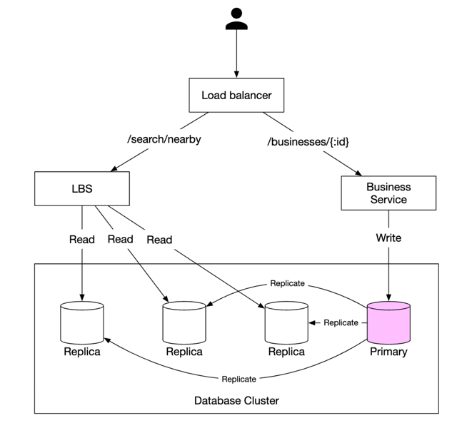
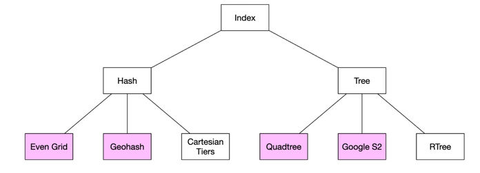
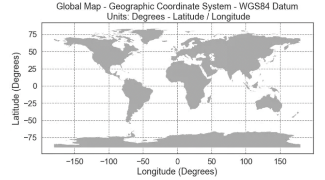
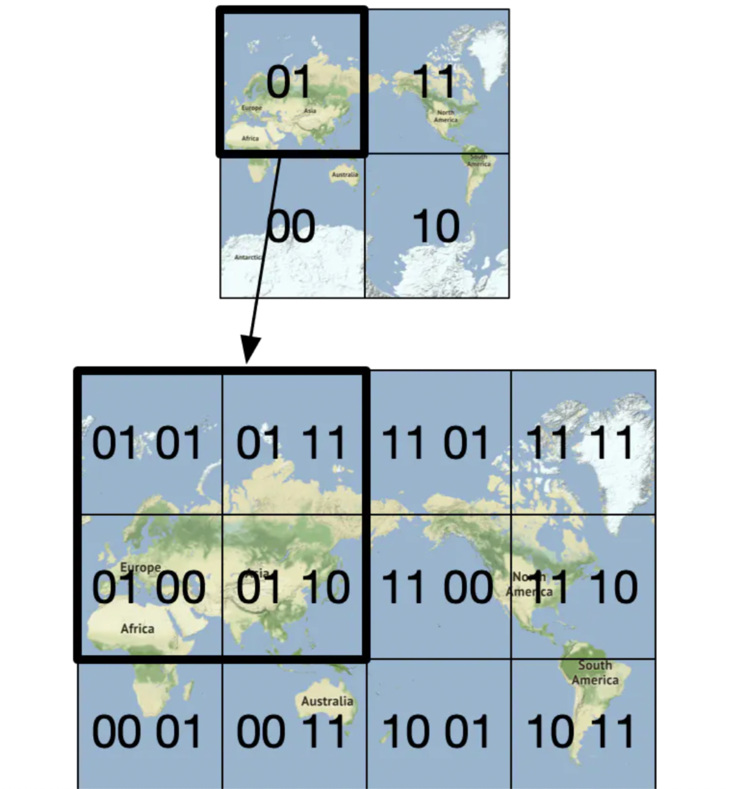
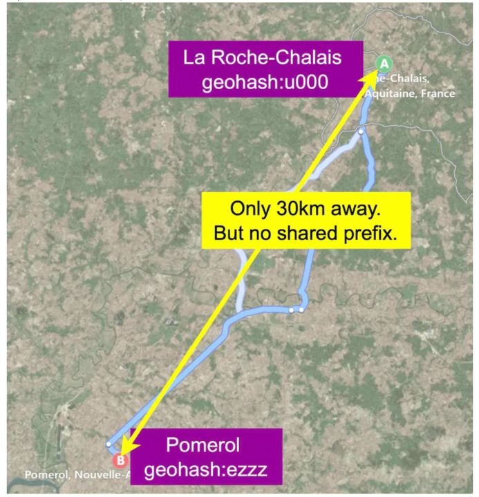
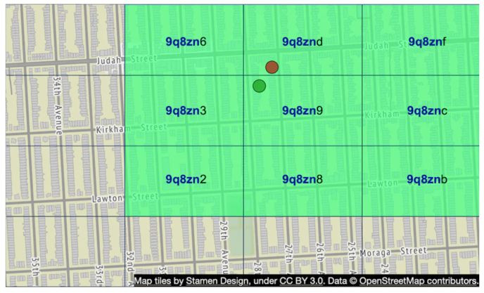
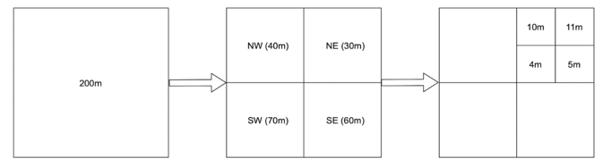
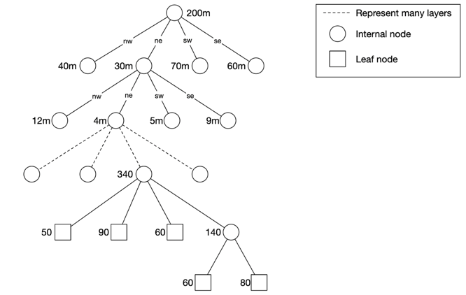
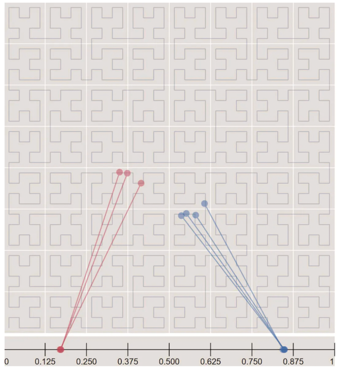
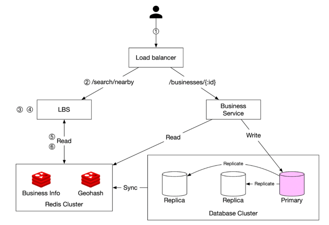

# 근접성 서비스 
* 사용자 위치 기반으로 식당, 호텔, 극장 등 근처 비즈니스를 검색하는 서비스

## 1. 설계 범위 및 요구사항 정의

### 📍기능적 요구사항
* 사용자 위치 기준으로 근처의 모든 비즈니스를 검색하여 제공.
* 사업자는 비즈니스 정보를 추가/삭제/수정 가능 (정보 반영은 즉시가 아닌 다음날 적용)
* 사용자는 비즈니스 상세 정보를 조회 가능.
* 사용자는 검색 반경(radius)을 선택 가능 (옵션: 0.5km, 1km, 2km, 5km, 20km)

### 📍비기능적 요구사항
* 낮은 지연성(Low latency) : 빠른 검색 결과 제공
* 데이터 프라이버시(Data privacy) : 사용자 위치정보 보호 및 규제 준수
* 높은 가용성 및 확장성(High availability & scalability) : 트래픽 급증 상황에서도 안정적 서비스 제공

### 📍개략적 규모 추정 
* DAU : 1억 명
* 사업장 수: 2억 개
* 평균 하루 사용자 검색 횟수: 5회
* 예상 QPS (초당 요청 수): 약 5000 요청/sec (하루 평균 기준)

## 2. 개략적 설계안 제시 및 동의 구하기
* API 설계
* 개략적 설계안
* 주변 사업장 검색 알고리즘
* 데이터 모델

### 📍API 설계 

* 사업장 목록 조회 API
  * GET /v1/search/nearby
  * 요청 파라미터: latitude (위도), longitude (경도), radius (검색 반경)
  * 응답 결과
```text
    {
    "total": 10,
    "businesses": [{business object}]
    }
```

* 사업장 관련 API
  * GET	/v1/businesses/{id}	특정 비즈니스의 상세 정보 조회 
  * POST /v1/businesses	새로운 비즈니스 추가 
  * PUT /v1/businesses/{id}	기존 비즈니스 정보 수정 
  * DELETE /v1/businesses/{id}	비즈니스 삭제

### 📍데이터 모델

#### 🔹 읽기/쓰기 비율, DB 선택 기준
* 읽기(Read) 빈도가 높고, 쓰기(Write)는 상대적으로 낮음.
* 주변 비즈니스 검색과 상세 정보 조회는 빈번히 일어남
* 비즈니스 정보 수정은 드물게 발생
* 읽기 중심(Read-heavy)의 워크플로우에 최적화된 관계형 DB(MySQL) 사용이 적합.

#### 🔹 테이블 구성
* business 테이블 
  * 비즈니스의 기본 정보 및 상세 정보 저장
* geo-index 테이블 (지리적 위치 색인 테이블)
  * 공간 연산(주변 비즈니스 검색)을 효율적으로 처리하기 위한 테이블 
  * Geohash 활용하여 위치 데이터 관리

### 📍개략적 설계 



#### 🔹 시스템 구성요소 및 역할
* 로드 밸런서(Load Balancer)
  * 외부에서 들어오는 트래픽을 여러 서비스 인스턴스에 자동 분산 처리 
  * 단일 DNS 진입점으로 진입, 내부적으로 URL 경로 기반 라우팅 수행  
* 위치 기반 서비스(Location-based service, LBS)
  * 읽기(Read) 중심 서비스로 QPS가 높음
  * 무상태(stateless) 서비스로 수평적 규모 확장이 쉽다 
* 사업장 서비스(Business service)
  * 비즈니스 정보의 CRUD(생성, 조회, 수정, 삭제) 작업 수행
* 데이터베이스 클러스터(Database cluster)
  * 주-부(primary-secondary) 데이터베이스 형태로 주에서 쓰기 수행. 부는 읽기 수행
  * 읽기 확장성을 확보하는 대신, 복제 지연으로 일부 데이터 불일치 가능성 존재 (본 시스템에서는 문제되지 않음)
  
#### 🔹 확장성(Scalability)
* LBS 및 비즈니스 서비스 모두 무상태 서비스이므로 수평 확장(horizontal scaling)이 용이함.
* 서비스 인스턴스 추가로 쉽게 확장 가능하여 트래픽 증가에 대응.
* 시스템을 클라우드에 둔다면 여러 지역, 여러 가용성 구역에 서버를 두어 시스템 가용성을 높일 수 있음


### 📍사업장 검색 알고리즘

#### 🔹 방안1. 2차원 검색
* 가장 직관적이고 쉬운 방법 
* 사용자를 중심으로 원(circle)을 그리고, 해당 원 안에 있는 모든 비즈니스를 검색하는 방식.
```sql
SELECT business_id, latitude, longitude
FROM business
WHERE (latitude BETWEEN {:my_lat} - radius AND {:my_lat} + radius)
  AND (longitude BETWEEN {:my_long} - radius AND {:my_long} + radius)
```
* 문제점 
  * 비효율적인 방식으로, 테이블 전체를 탐색할 수 있음. 
  * 위도(latitude)와 경도(longitude)에 단순 인덱스를 걸어도, 한 차원의 검색속도만 개선됨. 많은 데이터가 필터링되지 않고 조회됨.
* 2차원 데이터를 한 차원에 대응시킬 수 있는 방법
  * 지도를 가장 작은 영역으로 분할하고 고속 검색이 가능하도록 색인을 만듬
    * 해시 기반 방안 : 균등 격자, 지오해시, 카르테시안 계충
    * 트리 기반 방안 : 쿼드트리, 구글 S2, R 트리 



#### 🔹 방안2. 균등 격자



* 지구 전체를 작은 크기의 균일한 격자(grid) 로 나누어 관리하는 방식. 
* 각 격자마다 속한 사업장의 정보를 저장하고, 사용자가 위치한 격자와 주변 격자만 탐색해 근처 사업장을 조회  
* 장점 
  * 간단한 구현 방식과 직관적 구조, 특정 격자 내 데이터를 빠르게 조회 가능
* 단점 
  * 데이터 밀집도 문제. 사업장 분포가 균등하지 않음

#### 🔹 방안3. 지오 해시
* 2차원의 위도, 경도 데이터를 1차원의 문자열로 변환
* 위치(위도, 경도)를 기반으로 지구 전체를 사각형 형태의 격자로 나누고, 이를 이진수로 인코딩하여 짧은 문자열(보통 base32)로 표현하는 방식.

  

```text
Google 본사 위치:
1001 10110 01001 10000 11011 11010 (이진수) → "9q9hvu" (base32)
```

* 최대 12단계의 세밀한 정밀도를 지원하지만, 일반적 서비스에서는 4~6단계 수준이면 충분함.
* 최적의 정밀도는 사용자가 지정한 반경으로 그린 원을 덮는 최소 크기 격자를 만드는 지오 해시 길이를 구하면 됨. 

##### Geohash의 장점
* 간단한 구현 및 위치 데이터 인덱싱
* Geohash 문자열의 접두사(prefix)가 유사할수록 위치가 서로 가까움
* 위치 데이터 기반의 범위 조회가 용이
* 데이터베이스에서 인덱싱 및 쿼리 최적화가 쉬움

##### Geohash의 주요 문제점
* 격자 가장 자리 이슈1 
  * 가까운 두 위치가 어떤 공통 접두어도 갖지 않을 수 있음 
  * 단순한 접두어 기반 SQL 질의문을 사용하면 주변 모든 사업장을 가져올 수 없음 
  * (select * from geohash_index where geohash like '9q8zn%')
  
  

* 격자 가장 자리 이슈 2
  * 사용자가 격자 경계선 부근에 위치한 경우, 실제로 가까운 두 비즈니스가 서로 다른 Geohash 문자열을 가질 수 있음.

  


#### 🔹 방안4. 쿼드트리 
* 쿼드트리는 공간 데이터를 효율적으로 관리하기 위해 2차원 공간을 특정 기준에 따라 사분면으로 재귀적으로 분할하는 자료구조
* 쿼드트리의 분할 기준 예시  : 각 격자(사분면)에 허용되는 최대 사업장 수를 정하여, 이를 초과하면 다시 4개의 작은 격자로 분할함

  

  

##### 쿼드트리 노드 구성
* 말단 노드(Leaf Node)
  * 격자의 좌상단, 우하단 좌표 (8바이트 * 4 = 32바이트)
  * 격자 내 사업장 ID 목록 (최대 100개, ID당 8바이트, 총 800바이트)
  * 말단 노드 크기: 약 832바이트 
* 내부 노드(Internal Node)
  * 격자의 좌상단, 우하단 좌표 (8바이트 * 4 = 32바이트)
  * 자식 노드를 가리키는 포인터 4개 (32바이트)
  * 내부 노드 크기: 총 64바이트

##### 쿼드트리 메모리 사용량 예시
* 전체 사업장 수: 약 2억 개
* 말단 노드 수: 사업장 수(2억 개) ÷ 노드당 허용 사업장 수(100개) ≈ 200만 개 
* 내부 노드 수: 말단 노드 수의 약 1/3 ≈ 67만 개
* 메모리 요구량 계산
```text
말단 노드 메모리: 200만 개 × 832바이트 ≈ 1.66GB
내부 노드 메모리: 67만 개 × 64바이트 ≈ 41MB
총 메모리 사용량: 약 1.71GB
```
* 2억 개의 사업장을 저장하기 위한 쿼드트리 메모리는 현실적으로 충분히 작아 서버 한 대의 메모리에서 관리 가능.

##### 쿼드트리 기반 주변 사업장 검색 방식
* 메모리에 구축된 쿼드트리를 탐색하여 사용자의 위치를 기준으로 격자를 찾음.
* 격자 내의 사업장 수가 부족할 경우, 인접 노드로 확장하여 검색 가능.

##### 쿼드트리 운영 시 고려 사항
* 초기 로딩 시간 
  * 쿼드트리를 최초로 구축할 때 수 분의 시간이 소요될 수 있음. 
  * 서버 시작 시 트리 생성 시간이 길어질 수 있으므로 헬스체크(health check) 기능 등을 통해 준비 상태 확인 필요. 
  * 청색/녹색 배포(blue/green deployment) 전략을 사용하여 무중단 서비스 운영 권장.
* 쿼드트리 업데이트 방식
  * 신규 사업장 추가, 기존 사업장 변경 정보 반영 방법:
    * 점진적으로 갱신하는 것이 가장 간단한 방식 
    * 하루 한 번 야간 배치 작업으로 트리를 새롭게 구축하는 방법 추천 
  * 실시간 갱신은 가능하나 복잡성과 성능 문제가 발생할 수 있음. 
    * 실시간 갱신 시 동시 접근을 제어하는 락(lock) 메커니즘 필요.


#### 🔹 방안5. 구글S2
* 구글 S2 기하(geometry) 라이브러리는 공간 데이터를 효율적으로 인덱싱하는 방법 중 하나. 
* 힐베르트 곡선(Hilbert Curve)을 사용하여 2차원 공간을 1차원으로 변환(indexing)하여 빠른 검색을 가능하게 함. 
* 힐베르트 곡선의 특징: 가까운 두 지점은 변환 후에도 1차원 공간 내에서 가깝게 유지됨 → 검색 효율성 향상.

  

##### 주요 특징 
* 지오펜스(Geofence)
  * 특정 영역(가상의 경계)을 설정하여 해당 범위 내에서 검색을 수행할 수 있음.
* 영역 지정 알고리즘 (Region Cover Algorithm)
  * S2는 고정된 격자가 아닌 가변적인 최소 수준(min level), 최고 수준(max level), 최대 셀 개수(max cells) 등을 조정하여 최적의 공간 분할을 수행.


#### Geohash vs Quadtree 요약 비교
* ✅ Geohash
  * 사용 및 구현이 간단하며, 트리 구조를 만들 필요 없음
  * 특정 반경 내 비즈니스 검색 지원
  * 고정된 정밀도(precision) 사용 → 더 세밀한 검색이 필요하면 추가 로직 필요
  * 인덱스 업데이트가 쉬움

* ✅ Quadtree
  * 트리 구조를 구축해야 하므로 구현이 다소 어려움
  * 특정 반경 내 검색이 아니라 K번째로 가까운 사업장 검색 지원 → 일부 기능에서 유용
  * 인구 밀도에 따라 동적으로 격자 크기 조절 가능
  * 인덱스 업데이트가 어려우며, 트리 구조의 균형(balance) 유지 등의 문제가 존재


## 3. 상세 설계

### 📍데이터베이스 규모 확장성

#### 사업장 테이블 
* 데이터를 한 서버에 담을 수 없으므로 ID를 기준으로 샤딩을 적용하여 부하를 분산하고 관리 용이성 확보

#### 지리 정보 색인 테이블
* 지오해시 사용
* 방안1 : JSON 배열에 모든 사업장 ID를 저장 (데이터 갱신 시 전체 JSON을 읽고 수정해야 함 → 비효율적)
* 방안 2: 사업장 ID를 개별적으로 저장하여 수정/삭제가 용이하도록 구성 (추천 방식)

#### 지리 정보 색인의 규모확장 :: 확장성 고려 사항
* 전체 색인 데이터는 최신 데이터베이스 서버 한 대로 충분히 감당 가능하지만, 읽기 부하가 높아지면 사본 데이터베이스(Replica DB) 를 활용해 분산 처리 권장. 
* 관계형 DB에서 샤딩 대신 사본 데이터베이스 방식이 더 간단하고 유지보수 용이함.


### 📍캐시

#### 캐시 도입 시 고려 사항
* 캐시가 정말 필요한지 신중하게 검토해야 함
* 데이터베이스 크기가 작고 한 대의 서버로 충분히 감당할 수 있다면, 캐시를 사용하지 않아도 성능 차이가 크지 않을 수 있음
* 읽기 부하가 병목이라면 사본 데이터베이스(Replica DB) 를 추가하여 해결 가능

#### 캐시 키 선정
* 사용자 위치(위도, 경도)를 캐시 키로 사용하는 것은 적절하지 않음
* GPS 좌표는 측정될 때마다 미세한 변동이 발생할 수 있음
* 사용자가 이동하지 않아도 좌표가 바뀌는 경우가 많아 캐시 활용도가 낮아짐
* 대신, 지오해시나 쿼드트리의 격자 ID를 캐시 키로 사용하면 효율적

#### 캐시 데이터 유형
* 키 (지오해시) : 값(해당 격자 내 사업장 ID 목록)
* 키 (사업장 ID) : 값 (사업장 상세 정보 객체)

##### 격자 내 사업자 ID
* 사업장 정보는 자주 변경되지 않으므로 특정 지오해시에 해당하는 사업장ID 목록을 캐시에 저장
* 사업장이 추가/삭제되면 기존 캐시 데이터가 무효화(Invalidate)됨
* 사업장 변경 빈도가 낮아 락(Lock) 없이 캐시 무효화를 쉽게 처리 가능
* Geohash 기반 캐싱을 적용하는 경우 필요 메모리 5GB -> 서버 한대로 충분
  * 사업장 수: 2억 개 (200m)
  * 3가지 정밀도 수준에서 캐싱을 수행할 경우 : 8바이트(사업장ID) * 200m * 3가지 정밀도 = 총 5GB 메모리 필요
  * Key 저장 공간은 무시할 만한 수준
* 메모리 요구량으로는 서버 한대로도 충분하나, 고가용성을 보장하고 대륙 경계를 넘는 트래픽의 전송지연을 방지하기 위해 
* 레디스 클러스터를 활용하여 지역별 데이터 중복 저장하여 네트워크 지연 감소


##### 클라이언트 애플리케이션에 표시할 사업장 정보 
* 키 (business_id) : 값 (사업장 정보)


### 📍지역 및 가용성 구역 
* 위치 기반 서비스(LBS)는 여러 지역의 데이터센터 및 가용성 구역(Availability Zone)에 배치되어야 함.
* 사용자의 물리적 거리를 최소화하기 위해 해당 지역의 데이터센터에 연결되도록 구성 ex) 미국 서부 사용자는 US West 데이터센터, 유럽 사용자는 유럽 데이터센터에 연결
* 기대 효과 : 성능 향상, 트래픽 부하 분산, 국가별 데이터 보호 준수, DNS 라우팅으로 트래픽 지역내 자동 분산 가능

#### 최종 설계도 

  

* 주변 사업장 검색
  * 사용자의 위치 및 검색 반경 정보를 로드밸런서에 전송. 
  * LBS가 해당 요청을 처리. 
  * LBS는 지오해시 길이를 계산하여 반경 조건을 충족하는 격자를 조회. 
  * 인접한 지오해시를 포함한 리스트를 생성. 
  * 각 지오해시에 대해 LBS는 '지오해시' 레디스 서버에서 사업장 ID를 조회. 
  * 사업장 ID를 이용하여 사업장 정보 레디스 서버에서 상세 정보를 가져옴. 
  * 사용자의 위치와 사업장 간 거리를 계산하여 우선순위를 정한 후 클라이언트에 반환
* 사업장 정보 조회, 갱신, 추가, 삭제
  * 사업장 정보 관련 API는 LBS와 분리되어 독립적으로 운영됨.
  * 사업장 상세 정보를 확인하기 위해 캐시 조회 -> 캐시에 있으면 반환, 없으면 DB 조회 후 캐시 저장 
  * 새로 추가하거나 갱신한 정보는 다음날 반영되기로 협의했기에 밤사이에 작업을 돌려서 처리 

