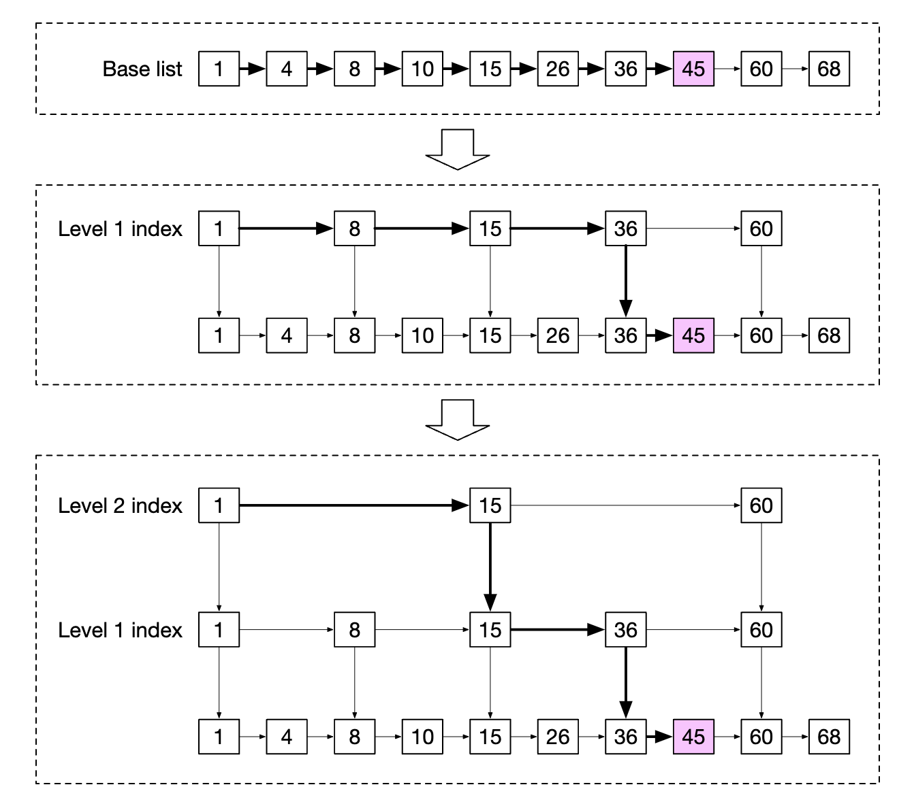
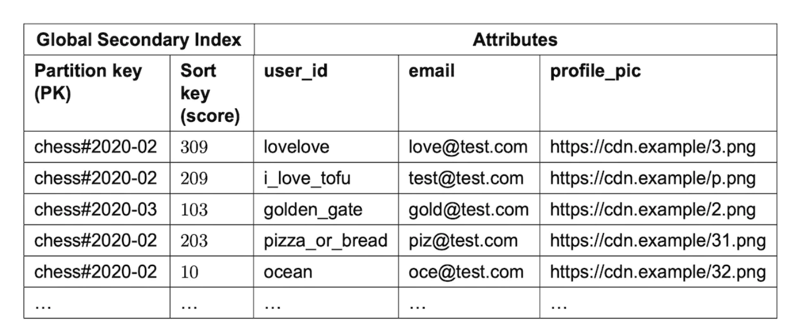
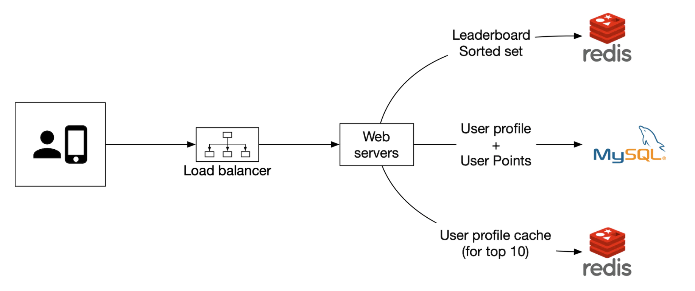
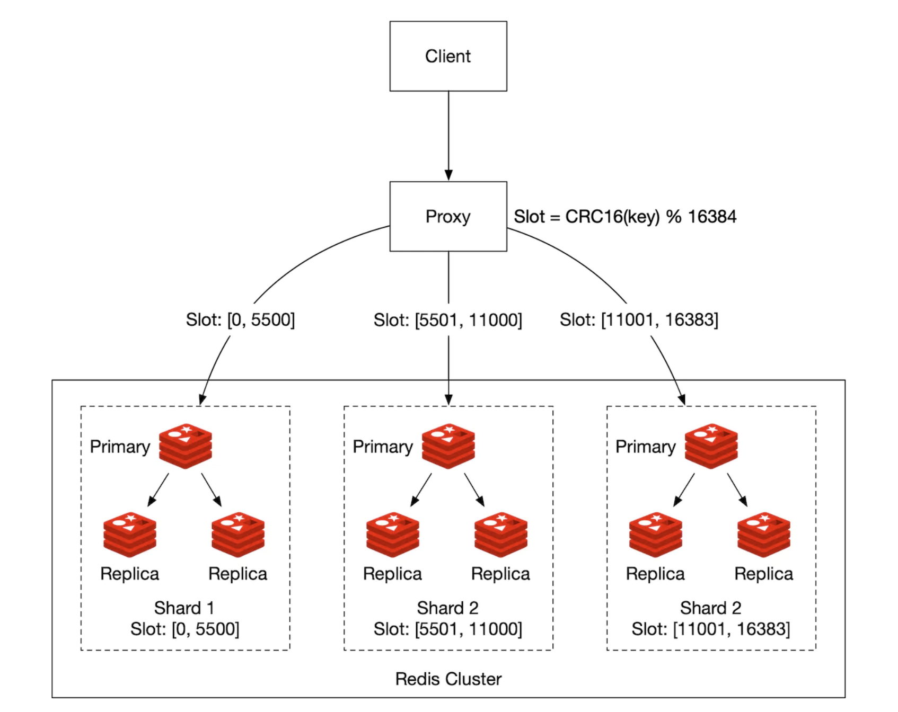

# Chapter 10 "실시간 게임 순위표"

## 1단계. 문제 이해 및 설계 범위 확정

### 1. 기능 요구사항

* 순위표에 상위 10명의 플레이어를 표시한다.
* 특정 사용자의 순위를 표시한다.
* 어떤 사용자보다 4순위 위와 아래에 있는 사용자를 표시한다. (보너스 문제)

### 2. 비기능 요구사항

* 점수 업데이트는 실시간으로 순위표에 반영한다.
* 일반적인 확장성, 가용성 및 안정성 요구사항

### 3. 개략적 규모 추정

* 사용자
    * DAU가 50만 명. 초당 평균 50명의 사용자가 게임을 플레이한다.
    * 사용량이 균등한 경우는 없기 때문에 최대 부하가 평균의 5배라고 가정하면, 초당 250명의 사용자를 감당할 수 있어야 한다.
* QPS
    * 사용자 점수 획득 QPS: 한 사용자가 하루 평균 10개의 게임을 가정<br>
    → 50 * 10 = 500, 최대 500 * 5 = 2500
    * 상위 10명 순위표 가져오기: 하루에 한번 게임, 게임 열때 순위표 표시한다고 가정<br>
    → 50

## 2단계. 개략적 설계안 제시 및 동의 구하기

### 1. API 설계

* POST /v1/scores
    * 사용자가 게임에서 승리하면 순위표에서 사용자의 순위를 갱신한다.
    * 클라이언트는 해당 API를 통하지 않고 순위표 점수를 직접 업데이트할 수 없다.
* POST /v1/scores
    * 순위표에서 상위 10명의 플레이어를 가져온다.
* GET /v1/scores/{:user_id}
    * 특정 사용자의 순위를 가져온다.

### 2. 개략적 설계안

#### 2.1. 설계안


1. 사용자가 게임에서 승리하면 클라이언트는 게임 서비스에 요청을 보낸다.
2. 게임 서비스는 순위표 서비스에 점수 갱신 요청을 보낸다.
3. 순위표 서비스는 사용자의 스코어를 갱신한다.
4. 클라이언트는 순위표 서비스에 요청하여 실시간 상위 게임 순위표와 해당 사용자의 순위 데이터를 가져온다.

#### 2.2. 다른 대안은 없었는가?

##### 1) 클라이언트가 순위표 서비스와 직접 통신해야 하나?

* 사용자가 프록시를 설치하고 점수를 마음대로 바꾸는 중간자 공격을 할 수 있기 때문에 보안상 안전하지 않다. (중간자 공격)
* 따라서, 점수는 클라이언트가 아니라 서버가 설정해야 한다.

##### 2) 게임 서비스와 순위표 서버 사이에 메시지 큐가 필요한가?


* 해당 데이터가 다른 곳에서도 이용되거나 여러 기능을 지원해야 한다면 카프카를 활용할 수 있다. 
    * 분석, 푸시 알림 등 여러 컨슈머가 동일한 데이터를 사용하는 경우
    * 다른 플레이어에게 점수가 바뀌었음을 알려야 하는 경우 (순번제 게임)

### 3. score 저장을 위한 데이터 모델

#### 3.1. 관계형 데이터베이스

* 규모 확장성이 중요하지 않고 사용자 수가 많지 않은 경우에 좋다.
* Leaderboard Table Schema
    * user_id(varchar)
    * score(int)
* 단점
    * 전체 정렬, 특정 사용자 순위 조회시 성능이 떨어진다.
    * 실시간 순위를 조회해야 하므로 캐시 도입이 불가능하고, 다량의 읽기 부하를 처리하기 어렵다. 
    * index를 추가하더라도 규모 확장성이 좋지 않다. 

#### 3.2. Redis

* 메모리에서 동작하므로 빠른 읽기 및 쓰기가 가능하다.
* `정렬 집합`이라는 자료형을 제공한다.

##### 1) Sorted Set (ZSet)

* 개념
    * Set: 순서 없이 중복 없는 원소를 가지는 묶음
    * Sorted Set: 멤버(원소) 하나하나 마다 순서를 정의한 자료구조
* 구조
    * 
    * 한개의 key에 여러 value(member)/score를 가지고 있다.
    * 중복되지 않는 value로 score 순으로 데이터를 정렬한다. (주로 sort가 필요한 곳에 사용된다.)
* 내부 저장 구조
    * 정렬 집합은 내부적으로 스킵 리스트(Skip List)와 해시 테이블(Hash Table)를 사용한다.

##### 2) Skip List



* 정렬된 상태를 유지하면서 데이터를 삽입/삭제/탐색할 수 있다.
* 링크드 리스트의 단점 `정렬된 상태를 유지하므로 N번째 node를 찾으려면 N번 비교해야 한다.`을 개선한다. 
* 즉, 탐색 시간을 단축하기 위해 비교 횟수를 줄인다. 

##### 3) Sorted Set을 사용한 구현

* ZADD
    * 값을 추가한다. 멤버 간의 순서를 정해주어야 하므로 score도 입력한다.
    * 스킵 리스트를 스캔하여 추가할 노드의 위치를 찾아서 넣어주고, 전후 연결된 레벨을 다시 조정한다.<br>
    * 해시 테이블에 멤버 문자열을 key 값으로 하여 버킷에 스코어를 넣어준다.<br>
    * 시간복잡도 O(log(N))
```
> ZADD key1 1234 value1  # value1 원소를 score 1234로 저장
(integer) 1
> type key1  # 타입을 확인해보면 zset으로 조회
zset
```

* ZRANK/ZREVRANK
    * 특정 원소의 순위를 조회한다.<br>
    * span 변수
        * 노드의 레벨마다 저장되어, 다음 가리키는 노드가 몇번째 뒤에 있는지를 기록한다.
        * 스킵 리스트에 노드가 추가/제거될 때마다 인근 노드의 span 값이 갱신된다.
    * rank 계산
        * 거쳐간 레벨의 span 값을 모두 더하면 그 값이 바로 rank 이다.
        * rank는 0부터 시작한다.
    * 시간복잡도 O(log(N))
```
> ZADD key2 123 first
(integer) 1
> ZADD key2 111 second
(integer) 1
> ZADD key2 999 third
(integer) 1
> ZRANK key2 second
(integer) 0  # 처음 rank는 0부터 시작
```

* ZRANGE/ZREVRANGE
    * 시작/종료 인덱스를 입력하여, 특정 범위에 드는 값을 조회한다.<br>
    * span 값을 게산하여 처음 출력할 노드를 찾고, 해당 부분에서 종료 인덱스에 다다를 때까지 다음 노드로 넘어가면서 멤버를 반환한다.
    * 시간복잡도: 모든 멤버 개수를 N, 출력하는 데이터의 개수를 M이라고 할 때, O(log(N) + M) 

```
> ZRANGE key2 0 10  # score 기준 오름차순으로 처음 10개 반환(인덱스)
1) "second"
2) "first"
3) "third"
```

* ZINCRBY
    * 지정된 값만큼 score를 증가시킨다.
    * 시간복잡도: O(log(N))

```
> ZINCRBY key1 3 first
(integer) 1
```

##### 4) Redis 저장소 요구사항

* 용량
    * 사용자 ID와 점수를 저장해야 한다.
    * 순위표 한 항목당 24 character * 16bit 정수 → 순위표 한 항목당 26byte 필요
    * 최악의 시나리오) 모두가 순위표에 올라야 하는 경우, 26byte * 전체 사용자 2,500만 =  약 650MB. 충분하다.
* CPU 및 I/O 사용량
    * 갱신 연산의 최대 QPS는 2,500/초이므로, 부하 감당 가능하다.
* 데이터 영속성
    * 주 서버에 장애가 생기면 읽기 사본을 승격시켜 주 서버로 만들어준다.

#### 3.3. (대안) NoSQL 

##### 1) 요건 및 특징

* 쓰기 연산에 최적화되어 있다.
* 같은 파티션 내의 항목을 점수에 따라 효율적으로 정렬 가능하다.
* 예) DynamoDB, 카산드라, MongoDB 등

#### 2) DynamoDB

* 안정적인 성능과 뛰어난 확장성을 제공하는 완전 관리형 NoSQL DB
* 기본 key 이외의 속성을 활용하여 데이터를 효과적으로 질의할 수 있도록, 전역 보조 색인을 제공한다.

#### 3) DynamoDB의 전역 보조 색인 (global secondary index)

* 부모 테이블의 속성들로 구성되지만 기본 키는 부모 테이블과는 다르다.
* 순위표 설계
    * 단계 1) 비정규화 테이블<br>
        * 레코드가 많아지면 상위 점수를 찾기 위해 전체 테이블을 뒤져야 한다.
    * 단계 2) 파티션 키 사용<br>
        * `game_name#{year-month}`을 파티션 키로, 점수를 정렬키로 사용하면 테이블 전체를 읽어야 하는 일을 피할 수 있다.
        * 그러나 이 경우, 최근 한 달치 데이터가 동일한 파티션에 저장된다.
    * 단계 3) 쓰기 샤딩<br>
        * 데이터를 n개 파티션으로 분할하고 파티션 번호를 파티션 키에 추가한다.
        * 파티션 키: `game_name#{year-month}#p{partition_number}`
* 분산/수집<br>
    * 쓰기 샤딩 패턴에서, 같은 파티션 내 데이터는 점수 기준으로 정렬된 n개의 파티션이 만들어진다.
    * Top 10 사용자를 가져오려면, 분산/수집 접근법을 사용한다.


## 3단계. 상세 설계

### 1. 클라우드 vs 자체 구축

#### 1.1. 자체 구축



* Redis + MySQL + 캐시 활용

#### 1.2. 클라우드


* 아마존 API Gateway + AWS Lambda로 구성 (서버리스)
* AWS Lambda
    * 서버를 직접 준비하거나 관리할 필요 없이 코드를 실행할 수 있다.
    * 필요할 때만 실행되며 트래픽에 따라 그 규모가 자동으로 확장된다.
* 프로세스
    1. 게임 서비스는 API Gateway를 호출하고, 이 게이트웨이는 적절한 람다 함수를 호출한다.
        | API                          | 람다 함수                     |
        |-----------------------------|------------------------------|
        | GET /v1/scores              | LeaderboardFetchTop10       |
        | GET /v1/scores/{:user_id}   | LeaderboardFetchPlayerRank  |
        | POST /v1/scores             | LeaderboardUpdateScore      |
    2. 이 람다 함수는 스토리지 계층(Redis, MySQL)의 명령을 호출하여 얻은 결과를 API Gateway에 반환한다.

### 2. 레디스 규모 확장 (샤딩)

#### 2.1. 고정 파티션

* 순위표에 등장하는 점수의 범위에 따라 파티션을 나눈다.


* 이 기능이 제대로 동작하려면, 점수 범위를 조정하여 순위표 전반에 점수가 고르게 분포되어야 한다.
* 특정 사용자의 점수를 입력/갱신 할 때에는 해당 사용자가 어느 샤드에 있는지 알아내어 처리한다.
* 사용자의 score가 높아져 다른 샤드로 옮겨야 할 때는 기존 샤드에서 해당 사용자를 제거한 후 다음 새 샤드로 옮겨야 한다.

#### 2.2. 해시 파티션



* 레디스 클러스터는 여러 노드에 데이터를 자동으로 샤딩하는 방법을 제공한다.
    * 각각의 키가 특정한 hash slot에 속하도록 한다.
    * 모든 키를 재분배하지 않아도 클러스터에 쉽게 노드를 추가하거나 제거할 수 있다.
* score를 갱신하려면 CRC16(key) % 16384(hash slot 개수) 연산을 수행하여 어떤 key가 어느 slot에 속하는지를 찾아내어 score를 변경하면 된다.
* 사용자들의 점수가 특정 대역에 과도하게 모여 있는 경우 효과적이다.
* Top 10/순위 계산은 까다롭다. 
    * 모든 샤드에서 상위 10명을 받아 애플리케이션 내에서 다시 정렬해야 한다.
    * 
* ➡️ 따라서 고정 파티션 방안을 사용할 것!

## 4단계. 마무리

### 1.  더 빠른 조회 및 동점자 순위 판정 방안

* 레디스 해시를 사용하면 문자열 필드와 값 사이의 대응 관계를 저장해 둘 수 있다.
* 순위표에 표시할 사용자 ID와 사용자 객체 사이의 관계를 저장해두면, DB에 질의하지 않아도 빠르게 사용자 정보를 확인할 수 있다.
* 사용자의 점수가 같을 때, 마지막 승리한 경기의 타임 스탬프를 저장하여 순위를 처리한다.

### 2. 시스템 장애 복구

* Redis 장애 발생시, MySQL 타임스탬프 이력을 기반으로 리더보드 재구성하여 복구할 수 있다.

## Reference

* Sorted Set 구조
	* https://redisgate.kr/redis/configuration/internal_skiplist.php
	* https://miintto.github.io/docs/recently-viewed-items
* Sorted Set 활용
	* https://velog.io/@hgs-study/redis-sorted-set