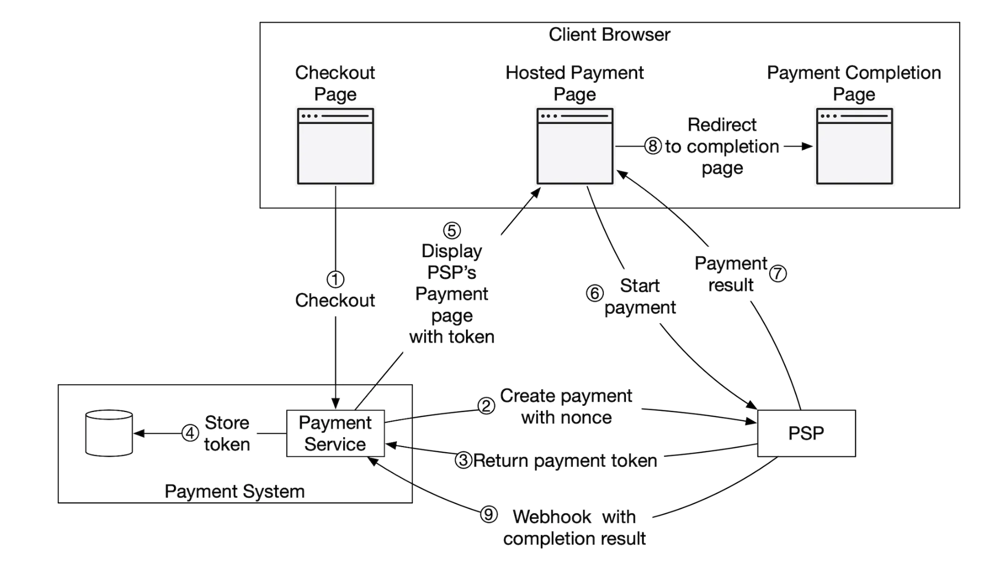
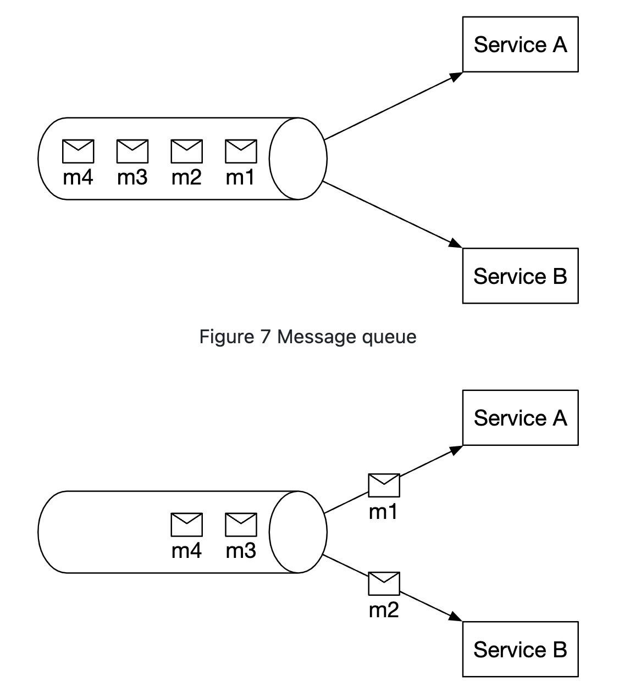

# Chapter 11 결제 시스템

## 1단계. 문제 이해 및 설계 범위 확정
* 전자상거래 애플리케이션을 위한 결제 백엔드 시스템 구축
* 신용 카드 결제 처리(전문 결제 서비스 업체)
* 하나의 통화만 지원
* 하루 100만 건의 거래
* 조정 작업 수행

### 1.1. 기능 요구사항 

* 대금 수신(pay-in): 결제 시스템이 판매자를 대신하여 고객으로부터 대금을 수령
* 대금 정산(pay-out): 결제 시스템이 전 세계의 판매자에게 제품 판매 대금을 송금

### 1.2. 비기능 요구사항 및 제약사항

* 신뢰성 및 내 결함성: 결제 실패는 신중하게 처리
* 내부서비스/외부서비스 간의 조정 프로세스: 시스템 간의 결제 정보가 일치하는지 확인

### 1.3. 개략적 규모 추정
* TPS: 1000000/10^5 = 10TPS
   * TPS 자체가 높지 않음
   * 결제 트랜잭션의 정확한 처리에 초점 

## 2단계. 개략적 설계안 제시 및 동의 구하기


### 2.1. 대금 수신 흐름


#### 2.1.1 결제 서비스
* 사용자로부터 결제 이벤트를 수락하고 결제 프로세스를 조율
* 결제에 대한 risk-check(AML/CFT)
* 일반적으로 제3자 제공업체 이용

#### 2.1.2 결제 결제 실행자
* 결제 서비스 공급자(PSP)를 통해 결제 주문 하나를 실행한다.
* 하나의 결제 이벤트에는 여러 결제 주문이 포함될 수 있다.
   * 여러 판매자들의 물품이 한번에 결제될 수 있음

#### 2.1.3 결제 서비스 공급자
* PSP(Payment Service Provider)는 A 계정에서 B 계정으로 돈을 옮기는 역할을 담당한다.
   * 구매자의 신용 카드 계좌에서 돈을 인출하는 역할 담당

#### 2.1.4 카드 유형
* 신용 카드 업무 처리
* 비자/마스터카드/디스커버리(Discovery) 등이 있다.

#### 2.1.5 원장
* 원장은 결제 트랜잭션에 대한 금융 기록이다.
* 사용자가 판매자에게 1달러를 결제하면 사용자로부터 1달러를 인출하고 판매자에게 1달러를 지급하는 기록을 남긴다.

#### 2.1.6 지갑
* 판매자의 계정 잔액을 기록한다.

### 2.2. 결제 서비스 API
* `POST /v1/payments`: 결제 이벤트 실행
   * payment_order_id: Global Unique ID
   * PSP는 payment_order_id를 중복 제거 ID(duplication ID)로 사용한다.(멱등키)
   * Double API Response는 String으로..?
```
{
  "buyer_info": {...},
  "checkout_id": "some_id",
  "credit_card_info": {...},
  "payment_orders": [
      {
         "seller_account": "SELLER_IBAN",
         "amount": "3.15",
         "currency": "USD",
         "payment_order_id": "globally_unique_payment_id"
      },
      {
         "seller_account": "SELLER_IBAN",
         "amount": "3.15",
         "currency": "USD",
         "payment_order_id": "globally_unique_payment_id"
      },
  ]
}
```

* `GET /v1/payments/{:id}`: 단일 결제 주문의 실행 상태 반환


### 2.3. 결제 서비스 데이터 모델
* 결제 서비스에는 결제 이벤트(payment event)와 결제 주문(payment order)의 두개 테이블이 필요함
* 성능보다는 안전성/모니터링/데이터탐사/관리자(DBA) 채용 시장을 고려하여 NoSQL보다는 ACID 트랜잭션을 지원하는 RDB를 선호한다.
* 결제 이벤트
   * checkout_id - string, pK
   * buyer_info - string(구매자) 
   * seller_info - string(판매자)
   * credit_card_info - 카드 제공업체마다 Type 다름
   * is_payment_done - boolean(결제상태)
* 결제 주문
   * payment_order_id - string, pK
   * buyer_account - string
   * amount - string
   * currency - string
   * checkout_id - string, foreign key
   * payment_order_status - enum (NOT_STARTED, EXECUTING, SUCCESS, FAILED)
   * ledger_updated - boolean(원장 Updated)
   * wallet_updated - boolean(지갑 Updated)

### 2.4. 복식부기 원장 시스템
* 원장 시스템에는 복식부기(double-entry)라는 설계 원칙이 있다.
* 모든 결제 거래를 두 개의 별도 원장 계좌에 가은 금액으로 기록한다.
   * 차감
   * 입금
* 복식부기 시스템에서 모든 거래 항목의 합계는 0임을 확인한다.
* 자금의 흐름을 처음부터 끝까지 추적 -> 일관성 보장

### 2.5. 외부 결제 페이지
* 신용 카드 정보를 내부에 저장하지 않기 위해 PSP에서 제공하는 외부 신용 카드 페이지를 사용한다.
* 외부 신용 카드 페이지는 위젯(widget) 또는 iframe
* 모바일 APP의 경우에는 결제 SDK에 포함된 사전에 구현된 페이지다.

### 2.6. 대금 정산 흐름
* 대금 수신 - PSP를 사용하여 구매자의 신용 카드에서 전자상거래 웹사이트 은행 계좌로 돈을 이체
* 대금 정산 - 정산 흐름에서는 타사 정산 서비스를 사용하여 전자상거래 웹사이트 은행 계좌에서 판매자 은행 계좌로 돈을 이체

## 3단계. 상세 설계

### 3.1. PSP 연동
* 결제 시스템이 은행이나 비자 또는 마스터카드와 같은 카드 시스템에 직접 연결한다면 PSP 없이도 결제 가능
* 규모가 큰 회사가 아니면 PSP 업체를 이용함
* 회사가 민감한 결제 정보를 안전하게 저장가능하다면, API를 통해 PSP와 연동하는 방법을 택함. (회사의 결제 웹페이자 사용)
* 회사가 민감한 결제 정보를 저장하지 않는다면, PSP에 안전하게 저장할 수 있도록 외부 결제 페이지를 제공(외부 페이지로 랜딩)


1. 사용자가 클라이언트 브라우저에서 '결제' 버튼 클릭
2. 결제 서비스는 결제 등록 요청을 PSP로 전송
   * 결제 주문이 정확히 한 번만 등록될 수 있도록 UUID 필드를 둔다.
   * UUID는 비중복 난수(Number used Only Once, Nonce)라고 한다.
   * 일반적으로 UUID는 결제 주문의 ID로 사용된다.
3. PSP는 결제 서비스에 토큰을 반환한다.
   * PSP가 발급한 UUID
   * 토큰을 이용하여 결제 등록 및 결제 실행 상태를 확인
4. 결제 서비스는 PSP가 제공하는 외부 결제 페이지를 호출하기 전 토큰을 데이터베이스에 저장한다.
5. 토큰을 저장한 후 PSP에서 제공하는 외부 결제 페이지를 표시한다.
6. PSP가 결제 처리를 시작한다.
7. PSP가 결제 상태를 반환한다.
8. 사용자는 리디렉션 URL을 가리키는 웹 페이지로 보내진다.
9. 비동기적으로 PSP는 웹훅을 통해 결제 상태와 함께 결제 서비스를 호출한다.
   * 웹훅을 통해 결제 이벤트를 다시 수신하면 결제 상태를 결제 주문 데이터베이스 테이블의 payment_ordeer_status 필드를 최신 상태로 업데이트 한다.
* 여기서 장애가 발생한다면 -> 조정(reconciliation) 프로세스

### 3.2. 조정
* PSP나 은행 같은 외부 시스템도 비동기 통신을 선호함
* 관련 서비스 간의 상태를 주기적으로 비교하여 일치하는지 확인함
* 결제 시스템의 마지막 방어선
* PSP나 은행은 고객에게 매일 밤 정산 파일을 송신하고, 원장에 저장된 정보와 비교하여 결제 정보를 조정한다. (일 배치 대사)


* 조정은 결제 시스템의 내부 일관성을 확인할 때도 사용된다. (원장/지갑)

### 3.3. 결제 지연 처리
* 대부분의 결제 요청은 수 초 만에 처리되지만, 완료되거나 거부되기까지 오랜 시간이 걸리는 경우도 있다.
   * PSP가 해당 결제 요청의 위험성이 높다고 보고 담당자 검토를 요구
   * 신용 카드사가 구매 확인 용도로 카드 소유자의 추가 정보를 요청하는 3D 보안 인증(like. CDD/EDD 이행 등)
* PSP는 결제가 대기(pending) 상태임을 알리는 상태 정보를 클라이언트에게 반환하고, 클라이언트는 사용자에게 표시.
* 클라이언트 또한 고객이 현재 결제 상태를 확인할 수 있는 페이지 제공
* PSP는 우리 회사를 대시하여 결제의 진행 상황을 추적하고, 상태가 바뀌면 PSP에 등록된 웹훅을 통해 결제 서비스에 알린다.
* PSP -> 웹훅 -> 클라이언트
* 클라이언트 -> PSP (Polling) 방식도 존재함.


### 3.4. 내부 서비스 간 커뮤니케이션
* 내부 서비스 통신 동기/비동기 패턴 설명

#### 3.4.1. 동기식 통신
* 소규모 시스템에서는 잘 작동하지만 규모가 커지면 단점 존재
   * 성능 저하/장애 격리 곤란/높은 결합도/낮은 확장성
* 비즈니스 로직이 복잡하고 타사 서비스 의존성이 높은 대규모 결제 시스템에는 비동기 통신이 유리

#### 3.4.2. 비동기식 통신
* 단일 수신자
   * 각 요청은 하나의 수신자 또는 서비스가 처리한다.
   * 서비스 A/B는 모두 같은 메시지 큐를 구독한다.
   * 처리 후 메시지는 큐에서 사라진다.


* 다중 수신자
   * 각 요청은 여러 수신자 또는 서버가 처리한다.
   * 카프카 토픽 구독
   * 하나의 요청이 푸시 알림 전송/재무 보고 업데이트/분석 결과 업데이트 등의 다양한 용도에 쓰일 수 있다.


### 3.5. 결제 실패 처리

#### 3.5.1. 결제 상태 추적
* 결제 거래의 현재 상태를 파악하고 재시도/환불이 필요한지 결정한다. 
* 결제 상태는 데이터 추가만 가능한 데이터베이스 테이블에 보관한다.
   * insert 하는 테이블에 보관하자!

#### 3.5.2. 재시도 큐 및 실패 메시지 큐
* 실패를 우아하게 처리하기 위해서는 재시도 큐(retry queue), 실패 메시지 큐(dead letter queue)를 두는 것이 바람직하다.
* 재시도 큐: 일시적 오류 같은 재시도 가능 오류는 재시도 큐를 보낸다.
* 실패 메시지 큐 : 반복적으로 처리에 실패한 메시지는 결국에는 실패 메시지 큐로 보낸다.


1. 재시도 가능한지 확인
   * 재시도 가능한 실패는 재시도 큐로 보낸다.
   * 재시도가 불가능한 실패는 오류 내역을 데이터베이스에 저장한다.(validation)
2. 결제 시스템은 재시도 큐에 쌓인 이벤트를 읽어 실패한 결제를 재시도 한다.
3. 결제 거래가 다시 실패하는 경우
   * 재시도 횟수가 임계값 이내라면 다시 재시도 큐로 보낸다.
   * 재시도 횟수가 임계값을 넘으면 실패 메시지 큐에 넣는다.

### 3.6. 정확히 한 번 전달
* 고객에게 이중으로 청구하면 절대 안됨.
* 결제 주문이 정확히 한 번만 실행되도록 결제 시스템 설계
* 최소 한번은 실행된다 -> 재시도
* 최대 한번 실행된다 -> 멱등키

#### 3.6.1. 재시도
* 재시도 메커니즘을 활용하면 어떤 결제가 최소 한번은 실행되도록 보장 가능하다.
* 재시도는 얼마나 간격을 두고 재시도할지 결정하는 것이 중요.
   * 즉시 재시도
   * 고정 간격
   * 증분 간격: 재시도 전에 기다리는 시간을 특정한 양만큼 점진적으로 늘려 나가는 방안
   * 지수적 백오프: 재시도 전에 기다리는 시간을 직전 재시도 대비 두 배 씩 늘려 나가는 방안
   * 취소
* 네트워크 문제가 단시간 내에 해결될 것 같지 않다면 지수적 백오프 추천
* 지나치게 공격적인 재시도 전략은 컴퓨팅 자원을 낭비하고 서비스 과부하를 유발
* 재시도 시 발생할 수 있는 잠재적 문제는 이중 결제이고 이를 방지하려면 최대 한번 실행 원칙을 지켜야한다.

#### 3.6.2. 멱등성
* 같은 api를 실행해도 같은 결과가 나와야함.
* 멱등 프로그래밍 중요함! (API/배치)
* UUID를 멱등 키로 권장하며 실제로 널리 쓰인다.
* 결제 요청의 멱등성을 보장하기 위해서 HTTP 헤더에 <멱등 키: 값>의 형태로 멱등 키를 추가하면 된다.

##### 1) 시나리오1: 결제 버튼 따닥!
* 전자상거래 웹사이트에서 멱등 키는 일반적으로 결제가 이루어지기 직전의 장바구니 ID다.


* 데이터 베이스의 고유 키 제약 조건(unique key constraint) 사용
* 그런데.. DB 처리 전에 요청이 들어오면..?

##### 2) 시나리오2: PSP 결제 성공했지만 응답이 결제 시스템에 전달되지 못한 상태에서 사용자가 결제 버튼을 다시 클릭
 * PSP에 비중복 난수를 전송하고 PSP는 이와 대응되는 토큰을 반환하기 때문에, 유일하게 식별이 가능하다.
 * 사용자가 결제 버튼을 다시 누른다 해도 결제 주문이 같으니 PSP로 전송되는 토큰도 같다.

### 3.7. 일관성
* 데이터를 다중화 하는 경우에는 복제 지연으로 인해 기본 데이터베이스와 사본 데이터가 불일치하는 일이 생길 수 있다.
   * 주 데이터베이스에서만 읽기/쓰기 연산 -> 자원 낭비
   * 모든 사본이 항상 동기화하면 되는데.. 복제 지연이 없는 database가 있냐..? (Oracle?)

### 3.8. 결제 보안
* 요청/응답 도청: HTTPS 사용
* 데이터 변조: 암호화/무결성 강화 모니터링
* 중간자 공격: 인증서 고정과 함께 SSL 사용
* 데이터 손실 : 여러 지역에 걸쳐 데이터베이스 복제 및 스냅샷 생성
* 분산 서비스 거부 공격(DDOS): 처리율 제한 및 방화벽
* 카드 도난: 토큰화, 실제 카드 번호 대신 토큰 저장 및 결제
* PCI 규정 준수
* 사기: 주소 확인, 카드 확인번호(cvv), 사용자 행동분석 등

?????