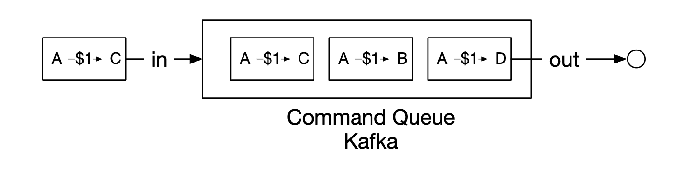
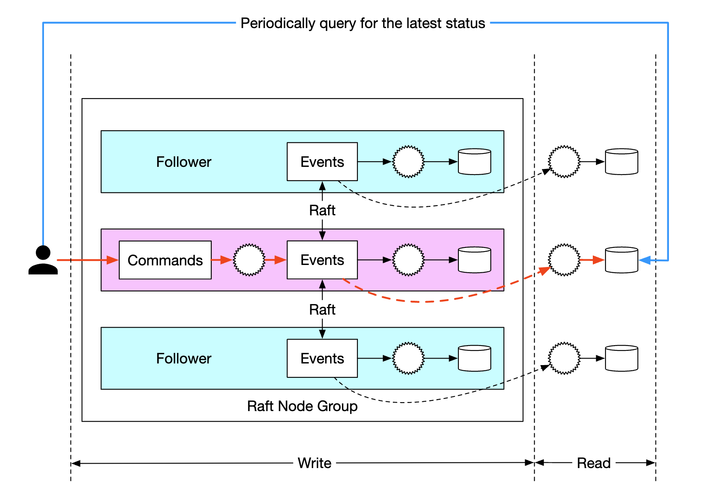
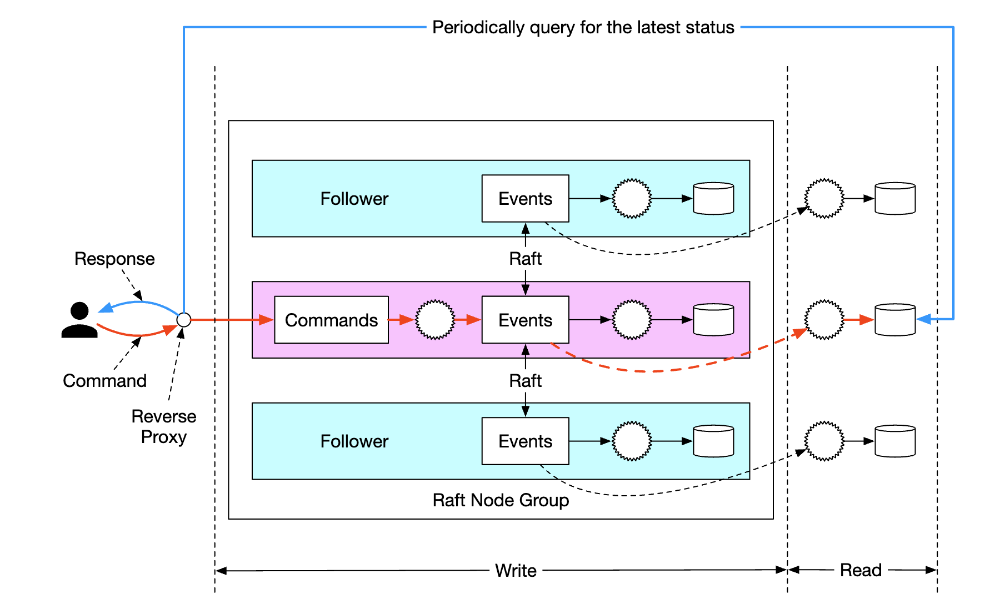
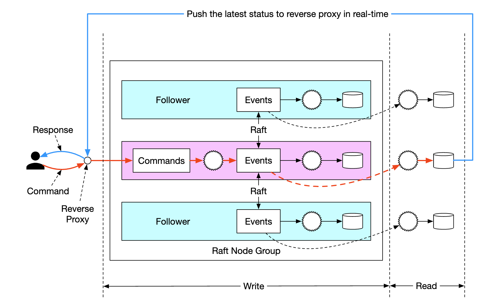

# 1단계 : 문제 이해 및 설계 범위 확장

* 전자 지갑 간 이체 가능
* 1,000,000TPS
* 99.99%의 안전성
* 트랜잭션
* 재현성

### 개략적 추정

* TPS -> 트랜잭션 기반 DB 사용
* 하나의 db 노드는 1,000TPS 사용 가정
* 이체 명령에서는 인출/입금 연산이 필요 -> 2개의 트랜잭션 사용
* 1,000,000TPS를 지원하기 위해서는 2000개 노드가 필요 하다는 가정

# 2단계 : 개략적 설계안 제시 및 동의 구하기

* 3가지 개략적 설계안 제시
  * 메모리 기반
  * db 기반 분산 트랜잭션
  * 재현성을 갖춘 이벤트 소싱

## API 설계

* POST /v1/wallet/balance_transfer : 지갑 간 이체

```JSON
{
    from_account: "",
    to_account: "",
    amount: "", // string
    ...
}
```

* amount는 플랫폼 및 여러 환경별 자릿수 취급을 다르게 할 수 있기 때문에 string으로 설정 후 계산에서 변환해 사용

## 인메모리 샤딩

* <사용자, 잔액> 형태로 표현하면 관계를 나타내기 쉬움\
* 인메모리 저장소에서 해당 형태로 사용하기 쉬움
* redis? 한개의 노드로는 사용하기 힘듬 -> 샤딩이 필요

* 다만 레디스를 사용할때 원자적 트랜잭션을 사용하기 힘듬

## 분산 트랜잭션

### 데이터베이스 샤딩

* redis 노드를 트랜잭션을 지원하는 db로 변경
* 하나의 명령으로 분산된 두개의 계정 모두 업데이트가 필요함

### 분산 트랜잭션 : 2단계 커밋 (2PC)

* db 자체의 트랜잭션에 의존하는 방법

* 월렛 서비스가 DB a와 b에 읽기/쓰기를 실행함 -> lock 
* 데이터 반영(커밋) 가능해? 라고 물어봄 -> yes나 fail로 응답
* 모두 yes라고 하면 커밋 요청, 아니면 트랜잭션 중단 요청

* 단점으로는
  * 2PC를 실행하려면 데이터베이스가 X/Open XA 표준을 따라야함
  * lock이 오래 걸림 (사진에서 빨간줄)
  * 조정자(월렛 서비스)가 중단되면? SPOF가 됨

### 분산 트랜잭션 : TC/C

* 시도(try)후 두 단계로 구성된 보상 트랜잭션
* try : 필요한 자원을 예약 -> A 계좌에서 -1원 / B 계좌에는 NOP
* C/C
  * 확정 : try에서 모두 yes이면 작업 확인 요청 -> A 계좌에는 NOP / B 계좌에는 +1원
  * 취소 : try에서 어느 하나라도 no이면 작업 취소 요청 -> A 계좌에서 +1원 / B 계좌에는 NOP
* 2pc와 다른점은 각 단계가 독립된 트랜잭션이다


* 아래는 그림으로 표시 
* 붉은 선은 lock을 표시
* try 단계 


* 확정 단계


* 취소 단계


#### 2pc vs tc/c

|                     | 1단계 (First Phase)                             | 2단계: 성공 (Second Phase: success)            | 2단계: 실패 (Second Phase: fail)                    |
|---------------------|--------------------------------------------------|--------------------------------------------------|------------------------------------------------------|
| **2PC**             | 트랜잭션이 아직 완료되지 않음                   | 모든 트랜잭션을 커밋                   | 모든 트랜잭션을 취소                                |
| **TC/C**      | 모든 트랜잭션이 완료됨 (커밋되었거나 취소됨)     | 필요 시 새로운 트랜잭션 실행                     | 이미 커밋된 트랜잭션을 되돌림(undo)                        |

* tc/c는 보상기반 분산 트랜잭션이라고 불림
* 트랜잭션을 지원하는 db기만 하면 사용 가능 -> 비즈니스 로직 단계에서 실행(고수준), 그대신 복잡

#### 단계별 상세 테이블

* tc/c중 지갑 서비스가 다시 실행되면?
* 각 단계별 상태 정보를 트랜잭션 데이터베이스에 저장
* 시도 단계 : not sent yet, has been sent, response received 3가지 값중 하나 
* 두번째 단계 : Confirm, CXancel 둘중 하나 

#### 불균형 상태

* 2PC 같은 경우 격리성 때문에 중간 값을 알수가 없음
* tc/c는 두개의 트랜잭션이기 때문에 중간단계에서 불균형이 생김
* 어플리케이션 단계에서 직접 처리 필요

#### 유요한 연산 순서

* 시도 단계에서 2번 3번 선택을 한다면?


* TCC는 Try 단계에서 “확보만 하고 확정은 하지 않는다"
* 돈이 실제로 존재해야 출금을 시도
* 3단계에서는 복구 하기가 힘듬
* C에서는 돈이 들어갔는데, 이미 누가 써버렸으면? → 복구 불가능

#### 잘못된 순서로 실행된 경우

* 단계별 상태 테이블에에 플래그를 둬서 설정

### 분사 트랜잭션 : 사가

* 모든 연산은 순서대로 정렬, 각 연산은 자기 db 독립 트랜잭션으로 실행
* 연산은 첫 번째 부터 마지막까지 순서대로 실행, 한 연산이 완료되면 다음 연산이 개시
* 연산이 실패하면 전체 프로세스는 실패한 ㅇ녀산부터 맨 처음 연산까지 역순으로 보상 트랜잭션을 통해 롤백

* 가로줄은 일반적인 실행 순서
* 수직선은 오류 발생시 시스템이 해야 하는 작업


* 연산 실행 순서 조율은 분산 조율과 중앙 집중형 조율이 있음
* 분산 조율 : 각 서비스가 각자 이벤트를 구독하고 이벤트를 발행 (복잡함)
* 중앙 집중형 : 하나의 조정자가 모든 서비스 순서를 실행

#### tc/c vs 사가

|                            | TCC                                          | Saga (사가 패턴)                           |
|--------------------------------|----------------------------------------------|--------------------------------------------|
| 보상 트랜잭션 실행                      | Cancel 단계에서 수행                         | Rollback 단계에서 수행                     |
| 중앙 조정                      | 있음                                          | 있음 (오케스트레이션 모드)                |
| 실행 순서                      | 임의                               | 선형                         |
| 병렬 실행 가능성               | 가능함                                       | 불가능함 (선형 실행만 가능)               |
| 일시적인 불일치 상태 노출 가능성 | 있음                                          | 있음                                       |
| 구현 위치                      | 애플리케이션                                 | 애플리케이션                               |

* 지연 시간 요구사항이 없거나 관여 서비스가 적다면 둘다 적합
* 지연 시간에 민감하고 많은 서비스가 운영된다면 TC/C가 유리

## 이벤트 소싱

### 배경

* 문제를 역추적 하려면? (특정 시점 계정 잔액, 비즈니스 변경 후 로직이 올바른가? 등등)

### 정의

#### 명령

* 외부에서 전달된, 의도가 명확한 요청
* 'a에서 b로 이체하라'
* 명령은 일반적으로 fifo 큐에 저장

#### 이벤트

* 명령은 의도가 정확하지만 fact는 아님
* 유효 하지 않은 명령은 실행 할 수가 없다
* 유효성 검사를 통과한 명령은 반드시 이행되어야 하는데 이때 이행 결과를 이벤트라고 부름
* 이벤트는 검증된 상태로, 실행이 끝난 상태 -> '송금을 완료 하였음'
* 하나의 명령으로 여러 이벤트가 만들어 질 수있음
* 외부 무작위성 때문에 같은 명령에 항상 동일한 이벤트 보장은 없음

#### 상태

* 이벤트가 적용될 때 변경되는 내용 (잔액 등등)

#### 상태 기계

* 이벤트 소싱 프로세스를 구동
* 명령의 유효성 검사 & 이벤트 실행
* 이벤트를 적용하여 상태를 갱신


### 지갑 서비스 예시

* 명령 큐



* 상태 기계 동작

1. 명령 read
2. 잔액 상태 검사
3. 잔액을 통해 명령 유효성 검사 후 이벤트 생성
4. 이벤트 read
5. 잔액 상태 반영


### 재현성

* 분산 트랜잭션 기반 서비스는 상태 업데이트 후 변경된 이유나 과거 상태를 알기 어려움
* 이벤트 소싱 기반 아키텍처는 처음 부터 다시 재생하면 그만


### 명령-질의 책임 분리(CQRS)

* 계정 잔액을 알 수 있는 방법?
* 직관적인 해결책은 읽기 전용 사본 만들기? 
* 이벤트 소싱에서는 발생하는 이벤트를 외부로 보내 read 요청을 담당하는 주체가 직접 상태를 재구축 할 수 있게 만듬
* 이런 이벤트를 받은 읽기 담당 주체는 read 하는 요구 조건에 맞게 이벤트를 기반으로 다양한 view를 구축 가능

# 3단계 상세 설계

## 고성능 이벤트 소싱

### 파일 기반의 명령 및 이벤트 목록

* 명령과 이벤트를 kafka 같은 외부 저장소가 아닌 로컬 디스크에 저장
* fifo 방식이기때문에 순차적 쓰기는 파일에 잘 어울림
* 그리고 디스크 기반이라 순차적 읽기도 잘 어울림
* mmap 방식을 사용해 최근 명령과 이벤트를 메모리에 캐시

### 파일 기반 상태

* 파일 기반 로컬 관계형 데이터 베이스를 사용해 상태를 관리

### 스냅샷

* 재현 프로세스의 속도를 높이는 방법은? -> 처음부터 전부 다시 재생할 수는 없잔아?
* 상태 스냅샷을 생성
* 그 이후 이벤트 부터 상태 스냅샷을 기반으로 계산하면 됨

## 신뢰할 수 있는 고성능 이벤트 소싱

### 신뢰성 분석

* 데이터만 신뢰할 수 있다면 계산 결과를 다른 노드에서 돌려도 복구 가능
* 데이터 신뢰성이 중요
* 지금 설계안에서 4가지 데이터가 존재
  * 파일 기반 명령
  * 파일 기반 이벤트
  * 파일 기반 상태
  * 상태 스냅샷

* 여기서 중요한건? 바로 파일 기반 이벤트!
  * 스냅샷은 어차피 결과물
  * 상태 또한 이벤트만 다시 재현하면 만들기 가능
  * 그럼 명령은? -> 명령은 시점이나 외부 입출력, 난수 등의 무작위 요소가 있다면 신뢰할 수 있는 대상이 아님
  * 예를 들어 환전이 있다면 그날 그날 환율이 다르기 때문에 명령을 다시 실행 한다면 상태가 달라짐
* 결국 이벤트만 잘 살리면 신뢰성을 확보할 수 있음

### 합의

* 높은 안정성을 위해 이벤트 목록을 여러 노드에 복제 필요
* 많은 곳에서 사용하고 있는 **합의 기반 복제**를 사용
* 래프트 알고리즘을 사용
  * 리더 / 후보 / 팔로어가 존재 
* 꾸준하게 모든 데이터를 팔로어에게 복제
* 리더 장애시 나머지 정상 노드 중 새 리더 선출

## 분산 이벤트 소싱

* 전자 지갑 업데이트는 결과를 즉시 받고 싶지만 CQRS시스템에서는 요청/응답 흐름이 느림
* 클라이언트가 주기적 폴링을 해야 결과를 알 수 있음
* 일정 규모 이상에서는 데이터를 샤딩하고 분산 트랜잭션을 구현해야 함 

### 풀 VS 푸시

* 읽기 전용 상태 기계에서 주기적으로 실행 상태를 읽는다.
* 너무 짧게 설정하면 과부하가 걸릴 수도 있음



* 역방향 프록시를 추가하면 개선 가능



* 추가로 읽기 전용 상태 기계에다가 역방향 프록시로 푸시 하는 상태로 변경하면 실시간 응답이 이루어지는 느낌을 줄 수 있음



### 분산 트랜잭션

* 동기적(?) 실행 모델을 채택하면 각 노드를 하나의 db로 추상화 해서 사용 가능
* 이렇게 되면 분산 트랜잭션 솔루션(tc/c, 사가)을 사용할 수 있음

