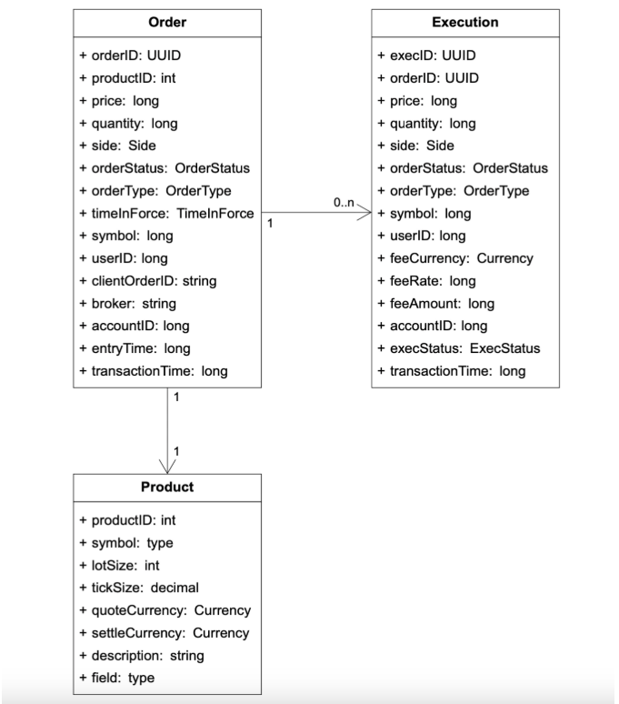

# 증권거래소  📍 🔹 ✅

## 문제 이해 및 설계 범위 확정

* 주식, 옵션, 선물 중 주식만 거래 
* 새 주문, 주문취소 지원. 주문 유형으로는 지정가 주문만 지원
* 시간 내 거래만 처리 
* 주문 체결되면 실시간으로 알 수 있어야함
* 호가 창 정보는 실시간으로 갱신 
* 최소 수만 명 사용자가 동시에 거래 할 수 있어야하며, 100가지 주식 거래가 가능 해야함
* 거래량은 하루에 수 십억 건의 주문 발생 가능
* 위험성 점검(규칙을 위반하는 거래 체크)가 가능해야함

### 비기능 요구사항

* 가용성 : 최소 99.999%  거래소 가용성은 매우 중요
* 결함 내성 : 프로덕션 장애의 파급을 줄이려면 결함 내성과 빠른 복구 매커니즘이 필요 
* 지연 시간 : 왕복 지연 시간(주문이 거래소에 들어오는 순간부터 주문 체결 사실이 반환되는 시점)은 밀리초 수준이여야함 
* 보안 : 계정 관리시스템을 갖춰야함. 신원 확인을 위한 KYC(Know Your Client) 확인 수행. DDos 방지 

### 개략적 규모 추정 

* QPS : 10억 / (6.5시간 * 3600) = 43,000
* 최대 QPS : 5 * QPS = 215,000

## 개략적 설계안 제시 및 동의 구하기 

### 증권 거래 101

#### 브로커 
* 브로커 시스템은 개인 사용자가 증권 거래하고 시장 데이터를 확인할 수 있도록 편리한 사용자 인터페이스를 제공 
* ex) 미래에셋증권, 한국투자증권

#### 기관고객
* 기관고객은 전문 증권 거래 소프트웨어를 사용하여 대량으로 거래 
* 기관고객마다 요구사항이 다르며, 낮은 응답시간으로 거래하거나 분할 거래 같은 기능을 필요로 함. 

#### 지정가 주문
* 가격이 고정된 매수 도는 매도 주문. 시장가 주문과 달리 즉시 체결되지않고 부분적으로만 체결될 수도 있음

#### 시장가 주문
* 가격을 지정하지 않는 주문으로 시장가로 즉시 체결 

#### 시장 데이터 수준
* L1 : 최고 매수 호가, 매도 호가, 수량이 포함됨
* L2 : L1 + 체결을 기다리는 물량의 호가
* L3 : L2 + 각 주문 가격에 체결을 기다리는 물량 정보까지 보여줌

#### 봉차트 
* 특정 기간 동안의 주가 

#### FIX (Finalcial Information Exchange Protocal)
* 금융 정보 교환 프로토콜로 증권 거래 정보 교환을 위한 기업 중립적 통신 프로토콜 

### 개략적 설계안 

  

* 거래 흐름
  * 1단계 : 고객이 브로커의 웹 또는 앱을 통해 주문
  * 2단계 : 브로커가 주문을 거래소에 전송
  * 3단계 주문이 클라이언트 게이트웨이를 통해 거래소로 들어감. 입력 유효성검사, 속도 제한, 인증, 정규화 등과 같은 기본적인 게이트키핑 기능 수행
  * 4~5단계 : 주문 관리자가 위험관리자가 설정한 규칙에 따라 위험성 점검을 수행
  * 6단계 : 위험성 점검 과정을 통과하면, 지갑에 주문 처리 자금 확인
  * 7~9단계 : 주문이 체결 엔진으로 전송. 시퀀서는 주문 및 집행 기록을 일정 순서로 정렬
  * 10~14단계 : 주문 집행 사실을 클라이언트에 전송

* 시장 데이터 흐름 
  * M1 단계 : 체결 엔진은 주문이 체결되면 집행 기록 스트림을 만드며, 이 스트림은 시장 데이터 게시 서비스로 전송
  * M2 단계 : 시장 데이터 게시 서비스는 집행 기록 및 주문 스트림에서 얻은 데이터를 시장 데이터로 사용하여 봉 차트와 호가 창을 구성 
  * M3 단계 : 시장 데이터는 실시간 분석 전용 스토리지에 저장. 브로커는 데이터 서비스를 통해 실시간 시장 데이터를 읽음며 고객에게 전달

* 보고 흐름
  * R1~R2 단계 : 보고 서비스는 주문 및 실행 기록에서 보고에 필요한 모든 필드 값 (client_id, price, quantity, order_type 등)을 모아 레코드 데이터베이스에 기록 

#### 체결 엔진
* 거래 흐름의 핵심은 체결 엔진
* 체결 엔진의 역할
  * 주식 심벌(주식을 식별하는 고유 코드)에 대한 주문서 내지 호가 창(특정 주문에 대한 매수 및 매도 목록)을 유지 관리
  * 매수 주문과 매도 주문을 연결 
  * 집행 기록 스트림을 시장 데이터로 배포 

#### 시퀀서 

  

* 체결 엔진을 결정론적으로 만드는 핵심 구성요소 
* 체결 엔진에 주문을 전단하기 전에 순서 ID를 붙여서 보냄 -> 입력 시퀀서
* 체결 엔진이 처리를끝낸 모든 집행 기록 쌍에도 수서 ID를 붙임 -> 출력 시퀀서 
* 시의성 및 공정성, 빠른복구 및 재생, 정확한 1회 보증의 이유로 순서 ID를 붙임
* 시퀀서는 메시지 큐 역할도 함 

#### 주문 관리자 
* 주문 관리자는 한쪽에서는 주문을 받고, 다른 쪽에서는 집행 기록을 받음 
* 주문 상태를 관리하는 것이 주문 관리자의 역할 
* 클라이언트 게이트웨이를 통해 주문을 수신하고, 다음과 같은 일들을 수행함.
  * 위험 점검 : 위험 점검 컴포넌트에 주문을 보내어 위험성을 검토. (ex. 사용자 거래량이 하루 100만달러 이하인지 확인)
  * 사용자 잔금 확인 : 사용자의 자금이 거래를 처리하기에 충분한지 확인.
  * 시퀀서로 주문 전달 : 주문을 시퀀서에 전달, 순서 ID를 기록 후 체결 엔진으로 전달. 
  * 체결 엔진으로부터 집행 기록 수신 : 시퀀서를 통해 체결 엔진으로부터 집행 기록을 받고, 이를 클라이언트 게이트웨이에 반송.

#### 클라이언트 게이트웨이
* 클라이언트로부터 주문을 받아 주문 관리자에게 보냄 
* 클라이언트 게이트웨이는 중요 경로상에 놓이며, 지연시간에 민감하기에 복잡한 기능이라면 체결 엔진이나 위험 점검 컴포넌트에 맡겨야함
* 고객 유형별(개인/기관)로 클라이언트 게이트웨이는 다양하며 주요 요구사항은 지연시간, 거래량 보안 요구사항

#### 시장 데이터 흐름

  

* 시장 데이터 : 호가 창과 봉 차트를 통칭하여 시장 데이터라고 함
* 시장 데이터 게시 서비스(MDP)는 체결 엔진에서 집행 기록을 수신하고 집행 기록 스트림에서 호가 창과 봉 차트를 만들어냄 
* 시장 데이터는 데이터 서비스로 전송되어 해당 서비스의 구독자가 사용할 수 있게 됨. 

#### 보고 흐름

  

* 보고 서비스는 거래 이력, 세금 보고, 규정 준수 보고, 결산 등의 기능 제공 
* 보고 서비스는 지연시간 보다는 정확성과 규정 준수가 더 중요함 
* 보고 서비스는 입력으로 들어오는 세부 주문정보와 그 결과로 나가는 집행 기록 (주문ID, 가격, 수량, 집행 상태 정보)를 결합하여 보고서를 만듬

### API 설계

#### 주문

| POST /v1/order

* 주문을 처리하며 인증이 필요
* Request
  * symbol : 주식을 나타내는 심벌
  * side : 매수 or 매도 
  * price : 지정가 주문의 가격
  * orderType : 지정가 또는 시장가
  * quantity : 주문 수량
* Response
  * body
    * id : 주문ID
    * creationTime : 주문이 시스템에 생성된 시간
    * filledQuantity : 집행이 완료된 수량
    * remainingQuantity : 아직 체결되지 않은 주문 수량
    * status : new / canceled / filled 
  * 코드 
    * 200 성공 / 40x 클라이언트 오류 / 500 서버오류

#### 집행

| GET /v1/execution?symbol={:symbol}&orderId={:orderId}&startTime={:startTime}&endTime={:endTime}

* 집행 정보를 질의 
* Request
  * symbol : 주식을 나타내는 심벌
  * orderId : 주문 ID, 선택적 인자
  * startTime : 질의 시작 시간
  * endTime : 질의 종료 시간
* Response
  * body
    * excution : 범위 내 모든 집행 기록의 배열
    * id : 집행 기록 ID
    * orderId : 주문 ID
    * symbol : 주식 심벌
    * side : 매수, 매도
    * price : 체결 가격
    * orderType : 지정가, 시장가
    * quantity : 체결 수량
  * 코드
    * 200 성공 / 40x 클라이언트 오류 / 500 서버오류

#### 호가 창/주문서

| GET /v1/marketdata/orderBook/L2?symbol={symbol}&depth={:depth}

* 주어진 주식 심벌, 주어진 깊이 값에 대한 L2 호가 창 질의 결과를 반환
* Request
  * symbol : 주식을 나타내는 심벌
  * depth : 반환할 호가 창의 호가 깊이 
  * startTime : 질의 시작 시간
  * endTime : 질의 종료 시간
* Response
  * body
    * bids : 가격과 수량 정보를 담은 배열
    * asks : 가격과 수량 정보를 담은 배열
  * 코드
    * 200 성공 / 40x 클라이언트 오류 / 500 서버오류

#### 가격 변동 이력 (봉 차트)

| GET /v1/marketdata/candles?symbol={symbol}&resolution={:resolution}&startTime={:startTime}&endTime={:endTime}

* 주어진 시간 범위, 해상도(resolution), 심벌에 대한 봉 차트 데이터 질의 결과를 반환
* Request
  * symbol : 주식을 나타내는 심벌
  * resolution : 봉 차트의 윈도 길이 
  * startTime : 질의 시작 시간
  * endTime : 질의 종료 시간
* Response
  * body
    * candles : 각 봉의 데이터를 담은 배열
    * open : 해당 봉의 시가
    * close : 해당 봉의 종가
    * high / low : 해당 봉의 고가 / 저가 
  * 코드
    * 200 성공 / 40x 클라이언트 오류 / 500 서버오류

### 데이터 모델 

#### 상품, 주문, 집행

  

* 상품 
  * 상품의 유형, 거래에 쓰이는 심벌, UI에 표시될 심벌, 결산에 이용되는 통화단위, 매매 수량 단위, 호가 가격 단위
  * 주로 UI 표시를 위한 데이터 
  * 아무 데이터베이스에나 저장 가능하며 캐시를 적용하기 좋음
* 주문 
  * 매수, 매도를 실행하라는 명령
* 집행 기록
  * 체결이 이루어진 결과
  * 모든 주문이 집행되지 않으며, 체결은 하나의 주문 체결에 관여한 매수 행위와 매도 행위를 나타내는 두개의 집행 기록을 결과로 출력

* 주문과 집행 기록은 데이터베이스에 저장하지 않고, 성능을 높이기 위해 메모리에 저장 
* 주문과 집행 기록은 빠른 복구를 위해 시퀀서에 저장 데이터 보관은 장 마감 후에 실행

#### 호가 창 
* 특정 증권 또는 금융 상품에 대한 매수 및 매도 주문 목록으로 가격 수준별로 정리되어 있음
* 체결 엔진이 빠른 주문 체결을 위해 사용하는 핵심 구조로 효율성 높아야하며 아래 요구사항을 만족해야함
  * 일정한 조회 시간
  * 빠른 추가/취소/실행 속도
  * 빠른 업데이트
  * 최고 매수 호가 / 최저 매도 호가 질의
  * 가격 수준 순회 

  

* 애플 주식 2700주에 대한 대량 시장가 매수 주문
  * 최저 매도 호가 큐의 모든 매도 주문 체결 후 호가 100.11 큐의 첫번째 매도 주문이 체결되면 거래가 끝남
  * 주식 가격은 100.11로 상승 

~~~ java

// 각 가격대의 매도/매수 호가 정보를 담는 클래스 
class PriceLevel{
    private Price limitPrice; // 가격
    private long totalVolume; // 총 수량
    private List<Order> orders; // 주문 목록
}

// 매도 호가창/ 매수 호가창을 표현
class Book<Side> {
    private Side side; // 매수/매도 구분
    private Map<Price, PriceLevel> limitMap; // 가격 -> 가격대정보 매핑 
}

// 주문 전체 관리 
class OrderBook {
    private Book<Buy> buyBook; // 매수 호가창
    private Book<Sell> sellBook; // 매도 호가창
    private PriceLevel bestBid;  // 최상위 매수 호가 
    private PriceLevel bestOffer; // 최상위 매도 호가 
    private Map<OrderID, Order> orderMap; // 주문ID -> 주문 정보 매핑 
}
~~~

* 성능 문제
  * orders 를 List<Order>로 저장하면 특정 주문을 삭제, 체결 할 때 O(1)이 아니라 O(n)
  * 성능을 높이려면 이중 연결 리스트를 사용 

#### 봉 차트 
* 봉차트는 시장 데이터 프로세서가 시장 데이터를 만들 때 호가 창과 더불어 사용하는 핵심 자료구조 

~~~ java
//시간 단위로 묶은 하나의 봉(데이터 집합)
class Candlestick {
    private long openPrice;  // 시가
    private long closePrice; // 종가
    private long highPrice;  // 고가  
    private long lowPrice;   // 저가 
    private long volume;     // 거래량
    private long timestamp;  // 시작 시각
    private int interval;    // 봉의 시간 간격 (1분, 5분, 1시간 ....)
}

// 봉들의 시계열 차트 
class CandlestickChart {
    private LinkedList<Candlestick> sticks; // 봉들을 시간 순서로 연결 LinkedList를 사용 -> 봉 추가/삭제 쉬움
}
~~~

* 메모리 최적화 : 시장에서 데이터가 계속 쌓이기 때문에, 봉의 개수가 많아지면 메모리 문제가 생길 수  있음
  * 링 버퍼(ring buffer) 사용
    * 고정된 크기의 메모리만 사용
    * 새로운 봉이 들어오면 가장 오래된 봉부터 덮어씀
  * 일부 봉만 메모리에 유지, 나머지는 디스크로
    * 메모리에 유지할 봉 개수를 제한
    * 그 이상 데이터는 디스크(파일/DB)에 저장해서 필요할 때만 불러옴

## 상세 설계 

### 성능
* 지연 시간은 거래소에서 아주 중요한 문제. 평균 지연시간은 낮아야하고, 전반적인 지연 시간 분포는 안정적
* 지연 시간이 안정적인지 보는 척도는 p99(99% 백분위수) 지연 시간

#### 지연 시간 단축 방법 1 : 작업 수 줄이기 
* 중요 경로에서 필요 없는 작업을 제거.
* 예를 들어, 게이트웨이 → 주문 관리자 → 시퀀서 → 체결 엔진 등으로 구성된 중요 경로에서 필요한 요소만 남겨 작업 시간을 단축

#### 지연 시간 단축 방법 2 : 작업 소요 시간 단축
* 네트워크 및 디스크 사용량 검사, 각 작업의 실행 시간 단축.
* 모든 것을 단일 서버에 배치하여 네트워크 통하는 구간을 없앰. 같은 서버 내 컴포넌트간 통시은 이벤트 저장소인 mmp를 통함
* 단일 서버 기반 설계안

  

* 어플리케이션 루프 
  * 루프 형태의 while문을 돌면서 계속 polling을 수행, 작업을 빠르게 처리 (작업 요청이 오자마자 처리 가능)
  * 루프는 한 CPU 코어에 고정되어, 문맥 전환(context switch) 없이 빠르게 실행.
  * 락(lock contention)도 거의 없어서 지역 시간을 극단적으로 낮춤

* mmap(2) 시스템 콜 
  * mmap(2)은 프로세스 간 고속 메모리 공유를 가능케 하는 시스템 콜. 
  * /dev/shm(메모리 전용 파일시스템)에 파일을 매핑해 디스크 접근 없이 메모리만으로 통신. 
  * 따라서 네트워크나 디스크 접근 병목을 해소하여 거래소 서버의 지역 시간을 최소화.

### 이벤트 소싱

#### 전통적인 애플리케이션 아키텍처 VS 이벤트 소싱(Event Sourcing) 아키텍처
* 전통적인 애플리케이션 아키텍처
  * 현재 상태(state)를 데이터베이스에 저장함. 
  * 문제 발생 시 현재 상태만 보존되므로, 문제가 발생한 경위를 추적하기 어려움.
* 이벤트 소싱(Event Sourcing) 아키텍처
  * 현재 상태가 아니라 '상태 변화' 자체를 이벤트로 기록함. 
  * 상태를 변경하는 모든 이벤트를 불변 로그(immutable log)로 보관 → 나중에 순서대로 재생성 가능. 
  * 모든 상태는 이벤트를 순서대로 재생성하면 얻을 수 있음.

#### 데이터베이스 구조의 차이 

  

* 전통적 방식: 주문 테이블에서 상태(신규, 체결 등)를 최신값만 유지. 
* 이벤트 소싱: 이벤트 테이블에서 모든 상태 변화를 ‘이벤트 로그’로 보관 (예: NewOrderEvent, OrderFilledEvent 등)

#### 이벤트 소싱 설계 

  

* 게이트웨이: 거래 요청을 받고, 이벤트를 ‘NewOrderEvent’ 형식으로 변환.
* 이벤트 저장소 클라이언트: 게이트웨이에서 받은 이벤트를 저장소(mmap)에 저장.
* 이벤트 저장소 sequence : 이벤트 저장소에 있는 시퀀서가 시퀀스를 넣으며, 이벤트를 순서대로 정렬
* 체결 엔진/주문관리자: 이벤트 저장소에서 NewOrderEvent를 읽고, 유효성 검사 → 주문 상태에 추가 → OrderFilledEvent 생성 시 다시 이벤트 저장소에 저장.
* 시장 데이터 서비스/보고 서비스: 새로운 이벤트를 실시간으로 구독하여 처리.

### 고가용성
* 고가용성을 위한 사항
  * 거래소 아키텍쳐의 단일 장애 지점 식별
  * 장애 감지 및 백업 인스턴스로의 장애 조치 결정이 빨라야함 
* 클라이언트 게이트와 같은 무상태 서비스는 서버를 추가하여 수평적 확장가능
* 주문관리자나 체결 엔진 같은 상태를 저장하는 컴포넌트는 사본간에 상태 데이터를 복사할 수 있어야함 -> 주 체결엔진, 부체결엔진
* 주 체결엔진 문제 발생 시 모니터링 방안으로 하드웨어/프로세스 모니터링, 박동메시지 
* 고가용성을 달성하려면 주/부 체결엔진 -> 주/부 서버의 클러스터로 구성해야함

### 결함 내성 

#### 결함 내성설계
* 주/부 서버 설계는 비교적 간단하며, 주 서버가 다운되면 부 서버로 전환
* 확률은 낮지만, 모든 서버가 동시에 다운되는 치명적 상황도 발생할 수 있어 이에 대비해야 함.

#### 주요 질문과 대응
* 주 서버 다운 시 부 서버 전환
  * 단순 장애 시에는 자동 전환으로 극복 가능하나, 버그나 특정 상황에서는 주/부 모두 다운될 수 있음.
  * 이를 위해 카오스 엔지니어링(의도적으로 장애 실패 발생)과 같은 장애 실험 및 복구 테스트를 통해 사전에 대응력을 키우는 것이 필요 
  * 복구 절차를 자동화해 운영 효율성을 높이는 방식으로 대응력을 확보해야 함
* 부 서버 리더 선출
  * 리더 선출 알고리즘 Raft 알고리즘을 통해 리더를 선출하며, 팔로워가 리더의 메시지를 수신하지 못하면 스스로 리더가 됨. 
  * 이 과정에서 다른 팔로워들 끼리 투표를 통해 새로운 리더를 선출하며, 안정적 운영을 위해 최소 투표수를 확보해야 함.
* 복구 시간 목표(RTO)
  * 장애 후 가능한 한 빨리 시스템을 복구해야 함 
  * RTO : 애플리케이션이 다운되어도 사업에 심각한 피해가 없는 시간의 최대값
* 복구 지점 목표(RPO)
  * 데이터 손실을 허용할 수 있는 범위를 명확히 정하고 대응해야 함.
  * 증권 거래소는 데이터 손실을 용납할 수 없으므로 RPO가 0에 가까움

### 체결 알고리즘
* 체결 알고리즘은 FIFO(선입선출) 사용 

### 결정론
* 기능적 결정론 
  * 시퀀서나 이벤트 소싱 아키텍처를 도입함으로써 이벤트를 동일한 순서로 재생하면 항상 같은 결과를 얻을 수 있도록 보장
* 지연 시간 결정론
  * 각 거래의 처리 시간이 거의 같음 -> 안정적인 성능 제공 

### 시장 데이터 게시 서비스 최적화
* L3 호가 창/주문서 데이터를 통해 시장의 세부 흐름을 파악할 수 있음 
* Google Finance 등 무료로 데이터를 볼 수 있는 서비스도 있지만, 더 세부적인 L2/L3 호가 데이터를 얻으려면 비용이 듬
* Market Data Publisher (MDP)는 체결 엔진의 체결 결과를 기반으로 호가 창과 봉 차트를 생성해 구독자에게 제공
* MDP는 링 버퍼 (circular buffer)를 사용해 데이터를 효율적으로 관리, 링 버퍼는 고정 크기로 앞뒤가 연결된 구조로, 데이터를 순환시키면서 삭제/생성 연산 없이 데이터를 지속적으로 소비

### 시장 데이터의 공정한 배포
* 거래소는 데이터의 지연을 최소화하여 공정하게 배포해야 함.
* 일부 구독자는 더 빠른 데이터 수신이 가능할 수 있는데, 이를 방지하기 위해 멀티캐스트(multicast) 방식과 같은 안정적 UDP 전송을 사용
  * 멀티캐스트는 한 번의 전송으로 여러 참가자에게 동시에 데이터를 전달하는 방식

### 로코케이션
* 많은 거래소가 헤지 펀드 또는 브로커의 서버를 거래소와 같은 데이터 센터에 둘 수 있도록 하는 것을 로코케이션 서비스로 함
* 유료 VIP서비스 라고 보면 됨

### 네트워크 보안과 최적화
* 공개된 서비스의 보안을 위해 DDoS 방어를 고려해야 함. 
* 캐싱, URL 강화, 데이터 분리, 허용/차단 리스트 사용. 처리율 제한 기능 활용

