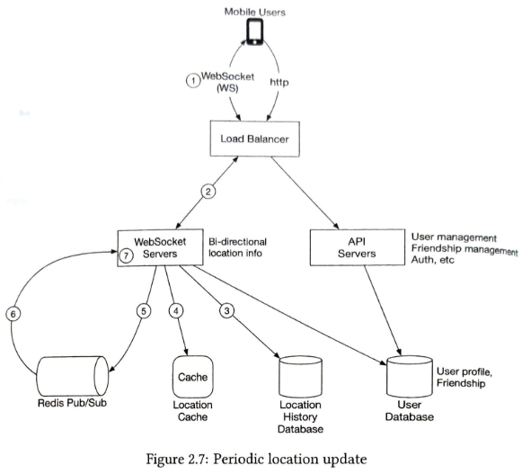
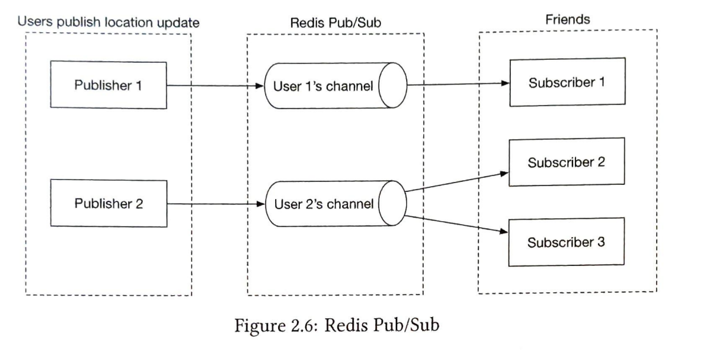
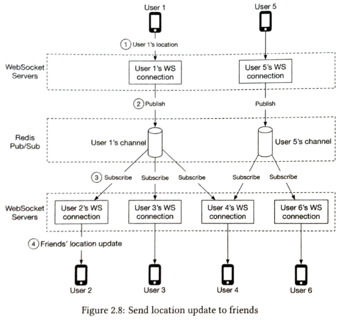
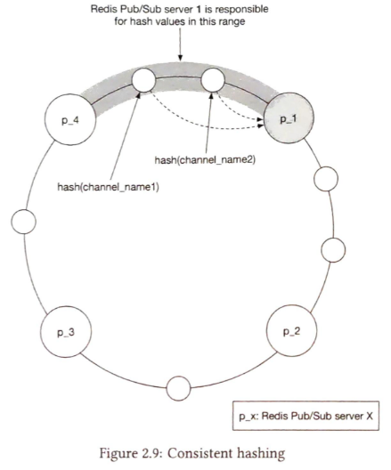
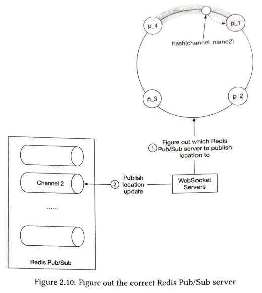
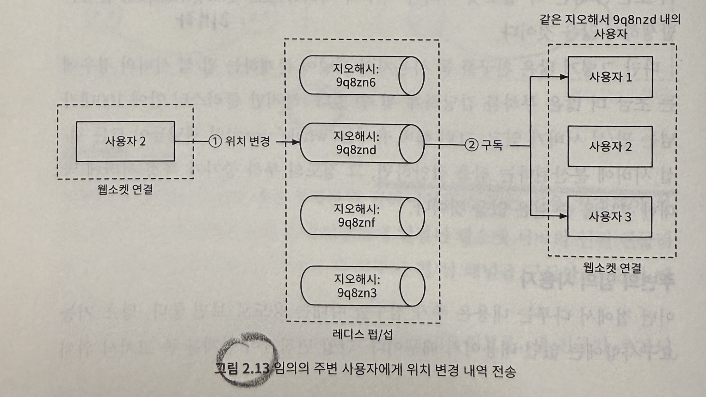

# Chapter 2 "주변 친구"

## 1단계. 문제 이해 및 설계 범위 확정

### 1.1. 기능 요구사항

* 주변 친구 목록 표시
* 주변 친구 목록 갱신

### 1.2. 비기능 요구사항

* 낮은 지연 시간
* 안정성
* 결과적 일과성
    * 강한 일관성을 지원하는 db는 필요 없음
    * 복제본이 원본과 동일하게 되기까지 몇 초의 딜레이 용인 가능

### 1.3. 개략적 규모 추정

* DAU (일일 활성 사용자 수) 1억명
* 친구 위치 정보는 30초 주기로 갱신
* 동시 접속 사용자는 DAU의 10%로 가정. 1천만명.
* 평균 한 사용자는 400명의 친구를 갖는 것으로 가정.
* 위치 정보 갱신 QPS(Queries per Second) = 천만 / 30초 = 334,000

## 2단계. 개략적 설계안 제시 및 동의 구하기

### 2.1. 개략적 설계안 

#### 1) 공용 벡엔드 사용할 때의 문제점

* 역할
    * 사용자 위치 변경 내역을 수신할 때마다, 모든 활성 상태 친구를 찾아서 그 친구들의 단말로 변경 내역을 전달한다.
* 문제
    * QPS 334,000 * 친구 수 400 * 10%가 인근에서 활성화 상태라고 가정하면 
    = 초당 1,400만 건의 위치 정보 갱신 요청을 해야 한다. 
    => 큰 규모에 적용하기가 쉽지 않다.

#### 2) 레디스 펍/섭 서버 설계안

 출처: https://velog.io/@gunkim95/

##### 로드밸런서

* 서버 앞단에 위치파여, 부하를 고르게분산하기 위해 트래픽을 서버들에 배분하는 역할을 한다.

##### RESTful API 서버

* 사용자/친구 관리, 인증 등 통상적인 요청/응답 트래픽을 처리하기 위한 무상태 API 서버

##### 웹소켓 서버

* 친구 위치 정보 변경을 실시간에 가깝게 처리하는 stateful 서버 클러스터
* 각각의 클라이언트는 서버 클러스터 중 하나와 웹소켓 연결을 유지한다.

##### 레디스 위치 정보 캐시
* Redis는 활성 상태 사용자의 가장 최근 위치 정보를 캐시한다.
* 보관되는 캐시 항목에는 TTL(Time to Live) 필드가 있다.

##### 위치 이동 이력 DB
* 사용자의 위치 변동 이력

##### 레디스 펍/섭 서버

* 초경량 message bus.
* 여기에 새로운 채널을 생성하는 것은 아주 값싼 연산이다.
    * Redis가 채널을 별도로 저장하지 않는다.
    * 채널은 단순한 메모리 구조체이고, 별도의 테이블이나 저장 공간이 필요하지 않는다.
* 웹소켓 서버를 통해 수신한 특정 사용자의 위치 정보 변경 이벤트는 해당 사용자에게 배정된 펍/섭 채널에 발행한다.

 출처: https://velog.io/@haron/

##### 주기적 위치 갱신

* 항구적으로 유지되는 웹소켓 연결을 통해 주기적으로 위치 변경 내역을 전송한다.

 출처: https://velog.io/@haron/

1. User1의 위치가 변경되면 그 변경 내역은 User1과 연결을 유지하는 웹소켓 서버에 전송한다.
1. 변경 내역은 redis pub/sub 내의 User1 전용 채널로 발행한다.
1. redis pub/sub 서버는 변경 내역을 구독자에게 broadcast 한다. 이때 구독자는 User1과 친구 관계에 있는 모든 웹소켓 연결 핸들러다.
1. User1과 User2(구독자) 사이의 거리가 검색 반경을 넘지 않는다면 새로운 위치가 User2에게 전송된다.

### 2.2. API 설계

* 주기적인 위치 정보 갱신
* 클라이언트가 갱신된 친구 위치를 수신하는 데 사용할 API
* 웹소켓 초기화 API (위도, 경도, 시간 정보를 전송하여 친구들의 위치 데이터를 수신)
* 새 친구 구독 API
* 구독 해지 API

### 2.3. 데이터 모델

#### 위치 정보 캐시

* 데이터 구조
    * 키 : 사용자 ID
    * 값 : {위치, 경도, 시각}
* 사용자의 현재 위치만을 이용한다. 
* 레디스는 읽기/쓰기 연산속도가 빠르고, TTL을 지원하여 적합하다.

#### 위치 이동 이력 데이터베이스

* 데이터 구조
    * 사용자 ID, 위치, 경도, 시각
* 막대한 쓰기 연산 부하를 감당할 수 있고, 수평적 규모 확장(샤딩)이 가능한 DB가 필요하다. 
    * 예: 카산드라 (분산구조, 수평적 규모 확장에 용이)

## 3단계. 상세 설계

> 규모를 늘려나가면서 확장해보자!

### 3.1. 각 컴포넌트의 규모 확장 전략

#### 1) API 서버

* 클러스터를 CPU, I/O 사용률에 따라 수평적, 수직적 규모 확장

#### 2) 웹소켓 서버 클러스터

* 규모를 자동으로 늘리는 것은 쉽다.
* 유상태 서버이므로 노드를 제거하기 전, 기존 연결을 종료시키는 것이 중요하다. => 즉, 좋은 로드 밸런서가 있어야 한다.

#### 3) 사용자 정보 데이터베이스

* 사용자 ID를 기준으로 데이터를 샤딩하면, 관계형 데이터 베이스라 하더라도 수평적 규모 확장이 가능하다.

#### 4) 위치 정보 캐시

* TTL을 설정하면, 최대 메모리 사용량은 일정 한도 아래로 유지된다. 
* 사용자의 위치 정보는 서로 독립적인 데이터이므로, 사용자 ID를 기준으로 여러 서버에 샤딩하면 부하를 고르게 분배할 수 있다.

#### 5) 레디스 펍/섭 서버 클러스터

##### 레디스 펍/섭 서버 

* 펍/섭 서버를 모든 온라인 친구에게 보내는 위치 변경 내역 메시지의 라우팅 계층으로 활용한다. 
    * 이유: 아래 자료구조가 아주 소량의 메모리만을 사용하여, 채널을 만드는 비용이 저렴하다.
        * 해시 테블 - 채널과 구독자 간의 매핑 관리
        * 연결 리스트 - 각 채널마다 여러 구독자가 있을 수 있기 때문에, 구독자 목록을 저장하는 자료구조가 필요한데, 연결 리스트를 사용하여 구독자를 동적으로 추가/삭제하는 작업이 빠르고 효율적이다.

##### 왜 확장해야 하는걸까?

* (X)메모리 사용량
    * 채널 1억개 * 채널 관리에 필요한 자료구조 20바이트 * 100명의 친구 (byte) = 200GB
    * 모든 사용자에게 채널 하나씩을 할당해도, 큰 메모리를 요구하지는 않는다.
* (O)CPU 사용량
    * 펍/섭 서버가 구독자에게 전송해야 하는 위치 정보 업데이트 양은 초당 1400만 건이다.
    * ===> 분산 레디스 펍/섭 클러스터가 필요하다!

#### 분산 레디스 펍/서버 클러스터

 출처: https://velog.io/@gunkim95/

* 수백 대의 redis 서버에 채널을 분산할 방법은?
* 모든 채널은 서로 독립적이기에 user_id를 기준으로 펍/섭 서버들을 샤딩하면 되고, 이를 해시 링으로 구현한다.

 출처: https://velog.io/@gunkim95/

* 웹소켓 서버가 특정 사용자 채널에 위치 정보 변경 내역을 발행하는 과정
    1. 웹소켓 서버는 해시 링을 참조하여 메시지를 발행할 redis pub/sub 서버를 선정한다.
    1. 웹소켓 서버는 해당 서버가 관리하는 사용자 채널에 위치 정보 변경 내역을 발행

#### 레디스 펍/섭 서버 클러스터의 규모 확장 고려사항

* redis pub/sub 서버는 무상태 vs 유상태?
    * 특정 채널을 담당하던 pub/sub 서버를 교체/제거하면 채널의 모든 구독자에게 그 사실을 알려야 한다.
    * 그래야 기존 채널에 대한 구독 관계를 해지하고 새 서버에 마련된 대체 채널을 다시 구독할 수 있기 때문이다.
    * => 이런 관점에서 pub/sub 서버는 유상태 서버이다.
* 유상태 서버 클러스터는 혼잡 시간대 트래픽을 무리 없이 감당하고 불필요한 크기 변화를 피할 수 있도록, 여유를 두고 더 많은 자원을 할당하는 것이 보통이다. (오버 프로비저닝)

### 3.2. 친구 추가/삭제

* 친구 추가/삭제시에 웹소켓 서버로 친구의 펍/섭 채널을 구독/해지 하라고 메시지를 보낸다.

### 3.2. 친구가 많은 사용자

* 수천 명의 친구를 구독하는 데 필요한 펍/섭 구독 관계는 클러스터 내의 많은 웹소켓 서버에 분산되어 있다.
* 부하는 각 소켓 서버가 나누어 처리하므로 과부하는 없을 것이다.

### 3.3 주변의 임의 사용자

* 추가 요구 사항) 주변 사용자를 무작위로 보여줄 수 있도록 하여라.
* 지오해시에 따라 구축된 법/섭 채널 풀을 둔다.

## 4단계. 마무리

* 웹소켓
    * 클라이언트와 서버 사이의 실시간 통신을 지원한다.
* 레디스
    * 위치 데이터의 빠른 읽기/쓰기를 지원한다.
* 레디스 펍/섭
    * 실시간 메시징을 위한 경량 메시지 브로커 역할을 수행한다.
    * 메시지를 저장하지 않고 즉시 전달하는 방식이므로 실시간 채팅, 알림, IoT 시스템에 적합하다.
    * Kafka 와의 차이점
        * Redis Pub/Sub - 실시간 메시징. 메시지 전달 이후 삭제
        * Kafka - 메시지 저장 및 분산 처리

| 비교 항목         | Redis Pub/Sub                            | Kafka                                      |
|------------------|--------------------------------|--------------------------------|
| 메시지 저장 여부 | ❌ 저장 안 함 (즉시 전달) | ✅ 디스크 저장 (로그 기반) |
| 메시지 전달 방식 | 구독자(Subscriber)에게 즉시 전달, 이후 삭제 | 메시지를 브로커가 저장, 소비자가 나중에 읽음 |
| 메시지 손실 가능성 | 가능 (구독자가 없으면 메시지 소멸) | 없음 (디스크에 저장되어 언제든 읽기 가능) |
| 구독자 방식 | Push 방식 (즉시 전송) | Pull 방식 (소비자가 필요할 때 가져감) |
| 확장성 | 낮음 (싱글 노드 성능에 의존) | 높음 (분산 처리 가능) |
| 사용 목적 | 실시간 알림, 채팅, 경량 메시징 | 로그 처리, 이벤트 소싱, 빅데이터 스트리밍 |
| 메시지 순서 보장 | 보장 안 됨 | 파티션 내에서는 순서 보장 |
| 컨슈머 그룹 지원 | ❌ (없음) | ✅ (여러 개의 컨슈머 그룹 지원) |

