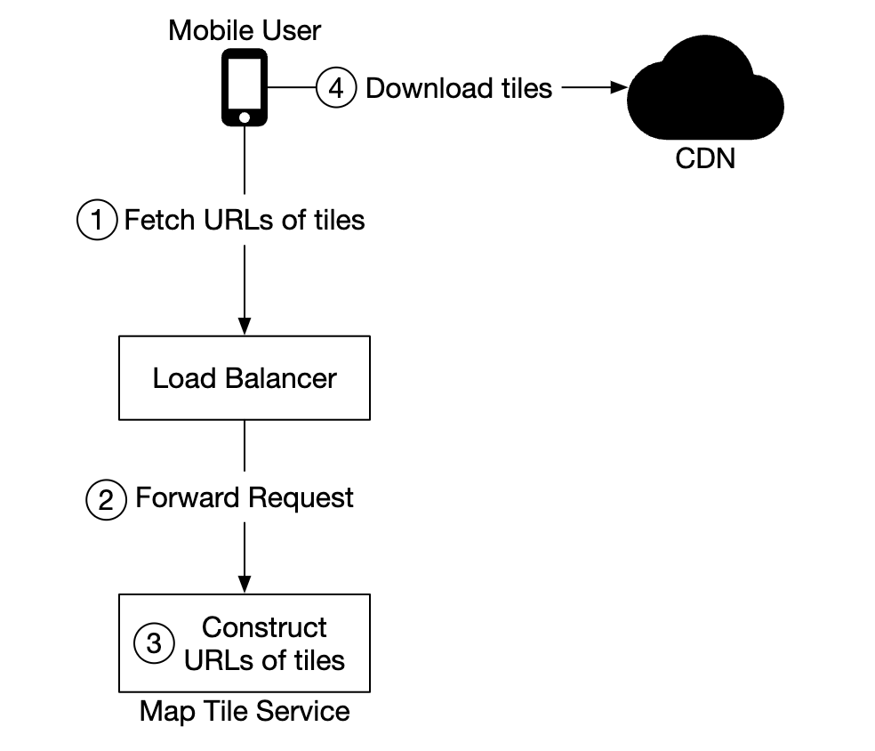
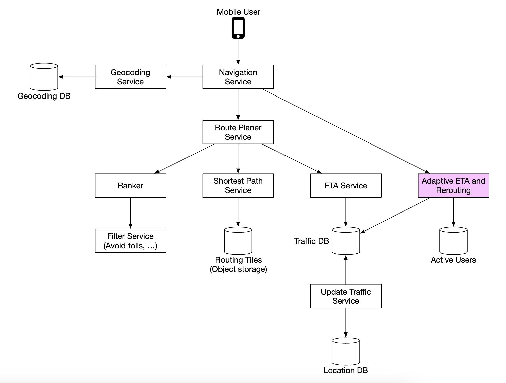

# Chapter 3 "구글 맵"

## 1단계. 문제 이해 및 설계 범위 확정

### 1.1. 기능 요구사항

* 10억 DAU
* 사용자 위치 갱신 / 경로 안내 서비스 (ETA 서비스 포함) / 지도 표시
* 도로 데이터는 확보 (수 TB 수준의 가동되지 않은 raw 데이터)
* 다양한 이동 방법 지원

### 1.2. 비기능 요구사항 및 제약사항

* 정확도
* 부드러운 경로 표시
* 모바일 데이터 및 배터리 사용량

#### 지도 101
* 측위 시스템
    * 위도(Latitude)[남/북]
    * 경도(Longitude)[동/서]

* 3차원 위치의 2차원 변환
    * 3차원 구 위의 위치를 2차원 평면에 대응시킴 (지도 투영법 또는 도법)
    * 구글 맵은 메르카토르 도법을 조금 변경한 웹 메르카토르 도법을 택하고 있음


* 지오코딩
    * 주소를 지리적 측위 시스템의 좌표로 변환하는 프로세스
    * ex) '1600 Amphi....., CA'는 위도 37.423021, 경도 -122.083739로 변환됨.

* 지오해싱
    * 지도 위 특정 영역을 영문자와 숫자로 구성된 짧은 무자열에 대응시키는 인코딩
    * 2차원의 평면 공간으로 표현된 지리적 영역 위의 격자를 더 작은 격자로 재귀적으로 분할해 나감


* 지도 표시
    * 지도를 화면에 표시(rendering)하는데 가장 기본이 되는 개념은 타일(tile)이다.
    * 클라이언트가 보려는 지도 확대 수준(zoom level)에 근거하여 어떤 크기의 타일을 가져올지 고른다.
    * ex) 사용자가 전체 지도를 한눈에 다 보려고 할때, 수십만 타일을 전부 다운로드할 필요 없이 하나의 이미지(256x256)로 표현하는 지도 한 장만 다운받으면 된다.

* 경로 안내 알고리즘을 위한 도로 데이터 처리
    * 수 TB 수준의 Raw 도로 데이터는 이미 확보된 상태라 가정하였다.
    * 경로 안내 알고리즘을 위해 이 도로 데이터를 경로 탐색을 위해 가공한다.
    * 교차로를 노드(node), 도로는 노드를 잇는 선(edge)로 표현하는 그래프 자료 구조를 가정한다.
    * 전 세계 도로망을 하나의 그래프로 표현하는 것은 불가능하여 그래프를 관리 가능 단위로 분할할 필요가 있다.
    * 아래 각 타일을 경로 안내 타일(routing tile)이라 부르고 각타 타일은 도로로 연결된 다른 타일에 대한 참조(reference)를 유지한다.


```
유의할 점
지도 타일은 PNG 이미인 반면 경로 안내 타일은 도로 데이터로 이루어진 이진 파일(binary file)이다.

-> 각 타일은 인접한 8개 타일에 대한 reference 정보 및 경로 탐색 알고리즘에 필요한 node/edge 데이터가 포함되어야하므로 PNG가 될 수 없다. 
```

* 계층적 경로 안내 타일
    * 경로 안내가 효과적으로 동작하려면 필요한 수준의 구체성을 갖춘 도로 데이터가 필요하다.
    * 구체성 정도를 상/중/하로 구분하여 세 가지 종류의 경로 안내 타일을 준비한다.
        * 상 : 지방도(local roads) 데이터만 다룬다.
        * 중 : 규모가 비교적 큰 관할구(district)를 잇는 간선 도로 데이터만 다룬다.
        * 하 : 도시와 주를 연결하는 주요 고속도로 데이터만 다룬다,
        * 상 -> 중 -> 하 -> 중 -> 상


### 1.3. 개략적 규모 추정

* 세계 지도 : 지원하는 확대 수준(zoom level)별로 지도 타일을 한 벌씩 두어야 한다. [모두 더하기]
    * 0 level : 1 (4^0)
    * 1 level : 4 (4^1)
    * .....
    * 20 level : 1099511627776 (4^20)
    * 21 level : 4398046511104 (4^21)
    * 그래도 지구 표면 가운데 90%는 인간이 살지 않는 바다/사막/호수/산간 지역임으로 높은 비율로 압축 가능하다.
    * 440PB -> 100PB 용량으로 압축
* 메타데이터 : 거의 없음
* 도로 정보 : raw 도로 데이터 -> 경로 안내 타일 변환 용량
* 서버 대역폭
    * 경로 안내 요청 : 클라이언트가 경로 안내 세션을 시작할때 전송하는 메시지
    * 위치 갱신 요청 : 클라이언트가 경로 안내를 진행하는 동안 변경된 사용자의 위치를 전송하는 메시지
    * DAU 10억, 경로 안내 기능 주당 35분 사용 = 50억분/하루
    * GPS 매초 전송 : 50억분 * 60 = 3000억 건/하루
    * 3000억 건/하루 총 초 = 3백만 건/1s
    * 클라이언트 쪽에서 모아 두었다가 덜 자주 보내도록(15초)
    * 3백만/15s = 20만 QPS
    * 최대 QPS는 평균치의 다섯 배 = 1백만 QPS

## 2단계. 개략적 설계안 제시 및 동의 구하기

### 2.1. 개략적 설계안 


1. 위치 서비스(location service)
2. 경로 안내 서비스(navigation service)
3. 지도 표시(map rendering)

#### 1) 위치 서비스(location service)

* 사용자의 위치를 기록하는 역할을 담당
* 클라이언트가 t초마다 자기 위치를 전송한다고 가정한다.
* 위치 정보를 전송하면 좋은 점
    * 실시간 교통 상황 모니터링
    * 새로 만들어진 도로나 폐쇄된 도로 탐지
    * 개인화된 경험을 제공
    * 거의 실시간 정보에 가까우므로 ETA를 좀 더 정확히 산출
    * 교통 상황에 따라 다른 경로를 안내
* Batch request, 버퍼링해 두었다가 일괄 요청하여 전송 빈도를 줄임
* 아주 높은 쓰기 요청 빈도에 최적화 되어 있고 규모 확장이 용이한 No-SQL 카산드라 데이터베이스 추천 (다이나모도 유리함)
* 카프카 같은 스트림 처리 엔진을 활용하여 위치 데이터 로깅
* Http keep-alive 옵션을 함께 사용하여 효율을 높임


#### 2) 경로 안내 서비스(navigation service)

* A에서 B 지점으로 가는 합리적으로 빠른 경로를 찾아 주는 역할

#### 3) 지도 표시(map rendering)

* 확대 수준에 따라 필요한 타일을 서버에서 가져오는 접근법이 바람직하다.
    * 클라이언트가 가지고 있는 것은 용량 문제로 불가함
* 클라이언트는 언제 지도 타일을 서버에서 가져오는가?
    * 사용자가 지도를 확대 또는 이동시키며 주변을 탐색한다.
        * 클라이언트가 보는 지도의 확대 수준에 근거하여 필요한 지도 타일을 즉석에서 만드는 방안
        * 모든 지도 타일을 동적으로 만들어야 하는 서버 클러스터에 심각한 부하
        * 캐시 활용이 어려움
    * 사용자의 위치가 현재 지도 타일을 벗어나 인접한 타일로 이동한다.
        * 현재 확대 수준에 근거하여 필요한 지도 타입 집합을 결정(zoom-level)
        * 지도 타일은 정적이므로 캐시를 통해 서비스하기에 아주 적합
        * CDN을 통한 캐시


```
데이터 사용량 계산
사용자가 30km/h로 이동
한 이미지가 200m x 200m 영역 표현 (zoom-level)
이미지 하나는 256 x 256 pixel 이미지이며, 100KB
1km x 1km 영역 표현은 25장이 필요
1km당 용량 : 25 x 100KB = 2.5MB
2.5MB x 30km/h = 75MB/h = 1.25MB/m
```

```
CDN을 통해 서비스되는 트래픽 규모
매일 50억 분 가량의 경로 안내 처리
50억 x 1.25MB = 6.25PB/일
6.25PB/하루 총 합계 초 = 62,500MB
전 세계에 200개의 POP가 있다고 가정하면, 62,500/200 = 300MB 정도의 트래픽만 처리하면 됨
```
* 클라이언트는 CDN에서 지도 타일을 가져올 URL을 어떻게 결정할까?
* 지오해시 및 URL로 CDN에서 지도 타일을 가져오면 됨
    * ex) https://cdn.map-provider.com/tiles/9q9hvu.png
* 클라이언트가 지오해시 계산을 수행해도 되지만, 좋은 생각이 아님.
* 서버(타일 지오해싱하는 Module)에서 Tile URL 집합 가져오기
* 사용자가 새로운 위치로 이동하거나 확대 수준을 변경하면 지도 타일 서비스는 어떤 타일이 필요할지 결정하여 해당 타일들을 가져오는 데 필요한 URL 집합을 계산한다.
* 표시할 타일 하나와 8개의 주변 타일이 응답에 포함된다.(reference)



## 3단계. 상세 설계

### 3.1. 데이터 모델

#### 1) 경로 안내 타일
* 방대한 양의 도로 데이터 및 그 메타데이터(이름, 관할구, 위도, 경도 등의 도로 부속 정보)로 구성
* 경로 안내 타일 처리 서비스(routing tile processing service)라 불리는 오프라인 데이터 가공 파이프라인을 주기적으로 실행하여 경로 안내 타일로 변환
    * 그래프의 노드와 선분으로 표현된 해당 지역 내 교차로와 도로 정보
    * 다른 타일의 도로와 연결되는 경우에는 해당 타일에 대한 참조 정보도 포함
    * 경로 안내 알고리즘은 이들 타일이 모인 결과로 만들어지는 도로망 데이터를 점진적으로 소비
* 저장 방법
    * S3 같은 객체 저장소에 파일을 보관하고 그 파일을 이용할 경로 안내 서비스에서 적극적으로 캐싱
    * 타일을 객체 저장소에 보관할때는 지오해시 기준으로 분류해 두면 좋음

#### 2) 사용자 위치 데이터

* 도로 데이터 및 경로 안내 타일을 갱신하는 데 이용
* 실시간 교통 상황 데이터나 교통 상황 이력 데이터베이스를 구축하는 데도 활용
* 데이터 스트림 프로세싱 서비스는 이 위치 데이터를 처리하여 지도 데이터를 갱신
* 엄청난 양의 쓰기 연산을 잘 처리할 수 있으면서 수평적 규모 확장이 가능한 데이터베이가 필요함 (no-sql, 카산드라)


#### 3) 지오코딩 데이터베이스

* 주소를 위도/경도 쌍으로 변환하는 정보를 보관
* 읽기 연산은 빈번한 반면 쓰기 연산은 드물게 발생 (redis)

#### 4) 미리 만들어 둔 지도 이미지

* 이미지는 지도 표시에 사용하는 확대 수준별로 미리 만들어 두고 CDN을 통해 전송한다.
* CDN 원본 서버로는 아마존 S3 같은 클라우드 저장소를 활용한다.

### 3.2. 서비스

* 구글 맵 구현에 가장 중요한 위치 서비스, 지도 표시 서비스, 경로 안내 서비스

#### 1) 위치 서비스

* 사용자 위치 데이터 저장에는 키-값 저장소를 활용한다.
* 쓰기 연산 지원에 탁월한 데이터베이스가 필요하다.
* 데이터 일관성(consistency)보다는 가용성(availability)이 더 중요하다.
    * CAP 정리에 따라 모두를 만족할 수 없으므로 A(availability), P(Partition tolerance)를 만족하는데 집중
* 카산드라 추천
* 데이터베이스 키 (user_id, timestamp), 위도/경도 쌍(지오해시)
    * user_id 는 파티션 키
    * timestamp는 클러스터링 키
    * DynamoDB PK/SK 동일함


#### 1-2) 사용자 위치 데이터는 어떻게 이용되는가

* 사용자 위치 데이터를 이용하여 지도 데이터의 정확성을 점차 개선(개설/폐쇄된 도로 등)
* 실시간 교통 현황을 파악
* 카프카와 같은 메시지 큐에 로깅한다.
    * 카프카를 통해 전달되는 사용자 위치 데이터 스트림을 각자 용도에 맞게 활용한다.
    * 실시간 교통 상황 서비스 -> 교통량 DB
    * 개인화를 위한 기계 학습 서비스 -> 개인화 DB
    * 경로 안내 타일 처리 서비스 -> 경로 안내 타일(S3)
    * 분석 서비스 -> 분석 DB


#### 2) 지도 표시 - 지도 타일 사전 계산

* 사용자가 보는 지도 크기나 확대 수준에 맞는 세부사항을 보여주기 위해서 확대 수준별 지도 타일을 미리 만들어야 한다.
* 구글 맵은 21단계로 지도를 확대할 수 있다.
* 타일 하나 당 256 x 256 픽셀
    * 확대 수준 0 : 256 x 256 타일 1 (4^0)
    * 확대 수준 1 : 256 x 256 타일 4 (4^1) -> 512 x 512 픽셀
    * 확대 수준 2 : 256 x 256 타일 16 (4^2) -> 1024 x 1024 픽셀
* 최적의 네트워크 비용으로 클라이언트에 설정된 확대 수준에 최적인 크기의 지도를 표시할 수 있다.
* 벡터 타일을 활용하면 이미지에 비해 월등한 압축률로 많은 네트워크 대역폭을 아낄 수 있다고 한다.


#### 3) 경로 안내 서비스

* 가장 빠른 경로를 안내하는 역할을 담당한다.


#### 3-1) 지오코딩 서비스

* 주소를 위도와 경도 쌍으로 바꿔주는 서비스
* 출발지와 목적지 주소를 위도/경도 쌍으로 변환한 뒤 추후 다른 서비스 호출에 이용한다.

#### 3-2) 경로 계획 서비스

* 경로 계획 서비스(route planner service)는 현재 교통상황과 도로 상태에 입각하여 이동 시간 측면에서 최적화된 경로를 제안하는 역할을 담당한다.
* 최단 경로 서비스, 예상 도착 시간 서비스, 순위 결정 서비스, 중요 정보 갱신 서비스 등 다른 서비스들과 통신하여 결과를 만들어 낸다. 

#### 3-3) 최단 경로 서비스

* 최단 경로 서비스(shortest path service)는 출발지와 목적지 위도/경도를 입력으로 받아 k개 최단 경로를 반환하는 서비스다.
* 교통이나 도로 상황은 고려하지 않고 도로 구조에만 의존하여 계산을 수행한다.
* 도로망 그래프는 거의 정적이므로 캐시해서 사용한다.
* 객체 저장소에 저장된 경로 안내 타일에 대해 A* 경로 탐색 알고리즘을 실행한다.
    * 입력으로 출발지와 목적지의 위도/경도를 받는다.
    * 지오해시로 변환한 후 출발지와 목적지 경로 안내 타일을 얻는다.
    * 출발지 타일에서 그래프 자료 구조를 탐색한다.
    * 탐색 범위를 넓히는 과정에서 필요한 주변 타일을 객체 저장소에서 가져온다. (같은 지역의 다른 확대 수준 타일로도 연결이 존재할 수 있음에 유의)
    * 해당 알고리즘을 반복한다.


#### 3-4) 예상 도착 시간 서비스

* 경로 계획 서비스는 최단 경로 목록을 수신하면 예상 도착 시간 서비스(ETA service)를 호출하여 그 경로 각각에 대한 소요 시간 추정치를 구한다.
* 기계 학습을 활용해 현재 교통 상황 및 과거 이력에 근거하여 예상 도착 시간을 계산한다.
* 실시간 교통 상황 데이터만 필요한게 아니라 앞으로 10분에서 20분 뒤에 교통 상황이 어떻게 달라질지도 예측해야 한다.

#### 3-4) 순위 결정 서비스

* 경로 계획 서비스는 ETA 예상치를 구하고 나면 순위 결정 서비스(ranker)에 관련 정보를 모두 전달하여 사용자가 정의한 필터링 조건을 적용한다.
    * 유료 도로 제외, 고속도로 제외 등
* 순위 결정 서비스는 필터링이 끝나고 남은 경로를 소요 시간 순으로 정렬하여 최단 시간 경로 k개를 구한 다음 경로 안내 서비스에 결과를 반환한다.

#### 3-5) 중요 정보 갱신 서비스들

* 카프카 위치 데이터 스트림을 구독하고 있다가 중요 데이터를 비동기적으로 업데이트 함
* 실시간 교통 정보, 경로 안내 타일 등 최신으로 유지하는 역할
* 새로 발견된 도로, 폐쇄되었음이 확인된 도로 정보를 반영하여 경로 안내 타일을 갱신
* 실시간 교통 상황 데이터베이스에 반영하여, 예상 도착 시간 서비스가 더욱 정확한 결과를 내는 데 쓰임

#### 3-6) 적응형 ETA와 경로 변경

* 현재 경로 안내를 받고 있는 모든 사용자를 추적하면서 교통 상황이 달라질 때마다 각 사용자의 ETA를 변경해 주어야 한다.
    * 현재 경로 안내를 받고 있는 사용자는 어떻게 추적하나?
    * 교통 상황 변화에 영향을 받는 경로와 사용자를 효율적으로 가려낼 방법은 무엇인가?
* r_2에서 교통사고가 발생했다면, 레코드 수(n), 평균 길이(m)이라고 하면 전수조사를 해야하므로 시간 복잡도는 O(n x m)
    * user_1: r_1, r_2, r_3, ...., r_k
    * user_2: r_4, r_6, r_9, ...., r_n
    * user_3: r_2, r_8, r_9, ...., r_m
    * .....
    * user_n: r_2, r_10, r_21, ...., r_l
* 경로 안내 타일의 확대 수준을 점점 더 높여가며 저장한다면, 어떤 타일의 교통 상황이 변했을때 경로 안내 ETA가 달라지는 사용자는, 해당 사용자의 데이터베이스 레코드 마지막 타일에 그 타일이 속하는 사용자로 O(n)의 시간복잡도를 갖는다.
    * user_1, r_1, super(r_1), super(super(r_1)), ....
* 교통 상황이 개선되었을 때 해야 하는 일까지 해결해주지는 않음
* 현재 경로 안내를 받는 사용자가 이용가능한 경로의 ETA를 주기적으로 재계산하여 더 짧은 ETA를 갖는 경로가 발견되면 알린다.

#### 3-7) 전송 프로토콜

* 클라이언트로 데이터를 보내는데 활용할 수 있는 프로토콜은 모바일 푸시 알림, 롱 폴링, 웹소켓, 서버 전송 이벤트 등이 있다.
* 모바일 푸시 알림 : 메시지 크기가 제한적이므로 불가능, 웹 애플리케이션은 지원하지 않음
* 웹소켓 : 서버에 주는 부담이 크지 않아 일반적으로 롱 폴링보다는 좋은 방안
* 롱 폴링
    * 클라이언트가 서버에 HTTP 요청을 보냄
    * 서버가 즉시 응답하지 않고 새로운 데이터가 있을때까지 대기
    * 새로운 데이터가 생기면 서버가 응답하고 연결 종료
    * 클라이언트는 응답을 받으면 다시 요청을 보내 연결을 유지
* 웹 소켓 (본 설계안 채택)
    * 클라이언트가 서버에 Websocket 연결 요청(ws://, wss://)
    * 서버가 요청을 승인하면 하나의 연결 유지
    * 서버와 클라이언트가 데이터를 실시간으로 주고 받음


