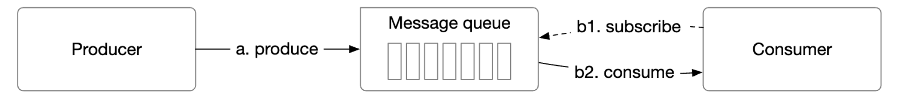
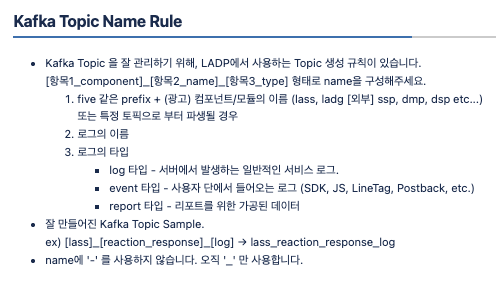
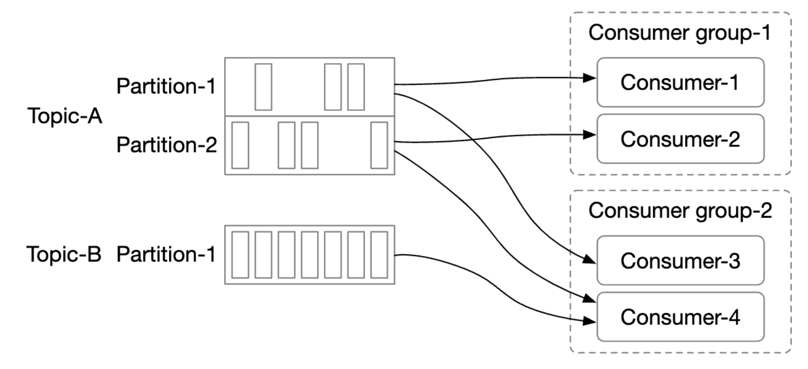
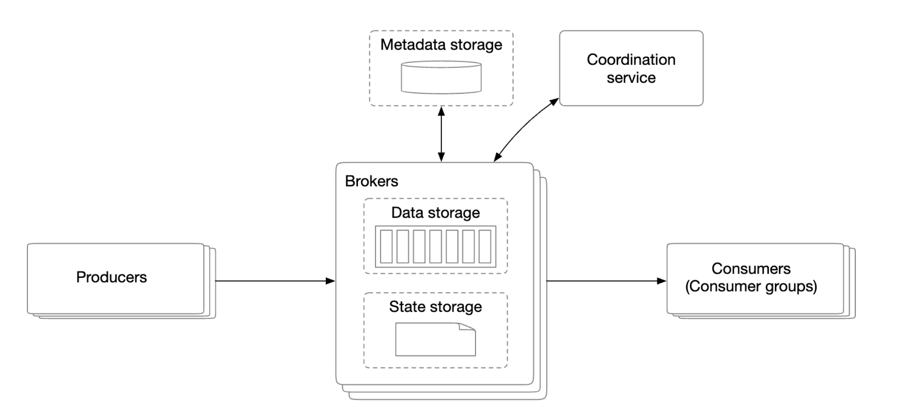
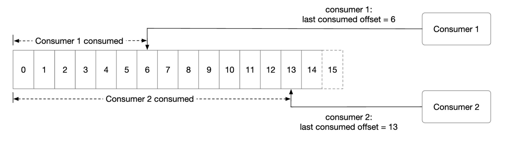
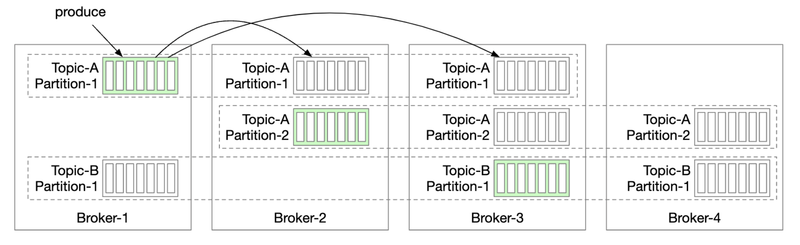
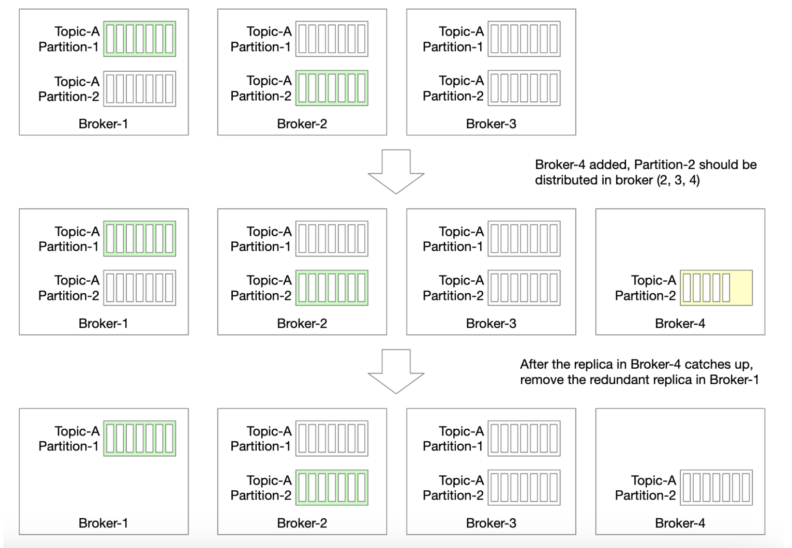

# 분산 메시지 큐

- 메시지 큐 사용시 얻을 수 있는 이득
  - 결합도 완화 : 컴포넌트 사이의 강한 결합이 사라짐
  - 규모 확장성 개선 : 생산자와 소비자 규모에 맞게 독립적으로 확장 가능
  - 가용성 개선 : 특정 컴포넌트 장애가 발생하더라도 다른 컴포넌트는 큐와 상호작용 가능
  - 성능 개선 : 비동기 통신이 쉬워짐

### 메시지 큐 VS 이벤트 스트리밍

- 이벤트 스트리밍 : 데이터 장기 보관, 메시지 반복 소비 기능이 있음
- 최근에는 다양한 메시지 큐에서 이벤트 스트리밍 기능을 제공
- 대표적인 이벤트 스트리밍 플랫폼과 메시지 큐 : 카프카 / 레빗MQ

# 1단계 : 문제 이해 및 설계 범위 확장

- 메시지 큐의 기본 기능은 간단하게 생상자는 메시지 큐를 보내고, 소비자는 큐에서 메시지를 꺼낼 수 있으면 된다.

## 기능 요구 사항

- 생상자는 메시지 큐에 메시지를 보낼 수 있어야 함
- 소비자는 메시지 큐를 통해 메시지를 수신할 수 있어야 함
- 반복적 수신, 단 한번만 수신 설정 가능
- 오래된 이력 데이터는 삭제될 수 있다.
- 메시지 크기는 킬로바이트
- 생성된 순서대로 소비자에게 전달
- 전달 방식은 최소 한번, 최대 한번, 정확히 한번 가운데 결정 할 수 있어야 한다.

# 2단계 : 개략적 설계안 제시 및 동의 구하기

## 메시지 모델

- 일대일과 발행 구독 모델

### 일대일 모델

- 전통적인 모델로 큐에 전송된 메시지는 오직 한 소비자만 가져갈 수 있다.
- 소비자 그룹을 통해 구현 가능

### 발행-구독 모델

- 토픽 : 메시지를 주제별로 정리하는데 사용
- 메시지 큐 서비스 전반에 고유한 이름
- 메시지를 보낼때 토픽에 보내고 받음
- 토픽을 통해 구현 가능

- 

## 토픽, 파티션, 브로커

- 메시지는 토픽에 보관되는데 이때 데이터양이 커지다면? -> 파티션을 활용함
- 토픽을 여러 파티션으로 분할한 다음 메시지를 모든 파티션에 분할해서 보냄
- 파티션을 유지하는 서버를 보통 브로커라고 부른다.
- 각 토픽 파티션은 FIFO 큐처럼 동작 -> 같은 파티션 안에서는 메시지 순서가 유지
- 파티션 내에서의 메시지 위치는 오프셋
- 토픽을 구독하는 소비자들을 토픽의 소비자 그룹이라고 부름

## 소비자 그룹

- 하나의 소비자 그룹은 여러 토픽을 구독할 수 있고 오프셋을 별도로 관리한다.
- 같은 그룹내 소비자는 메시지를 병렬로 소비

- 
- 병렬로 읽을때 문제점 : 한 파티션 안에서 메시지 순서 보장이 힘듬
- 특정 파티션의 메시지는 한 그룹 안에서는 오직 한 소비자만 읽을 수 있다는 제약사항이 필요
- 파티션을 많이 늘려 두면 동적으로 파티션을 늘릴 필요가 없고, 소비자를 추가하면 처리 용량이 늘어남

## 개략적 설계안

- 클라이언트
  - 생산자 : 메세지를 특정 토픽으로 보낸다
  - 소비자 그룹 : 토픽을 구독하고 메시지를 소비한다.
- 핵심 서비스 및 저장소
  - 브로커 : 파티션들을 유지
  - 하나의 파티션은 특정 토픽에 대한 메시지의 부분 집합
- 저장소
  - 데이터 저장소 : 메시지는 파티션 내 데이터 저장소에 보관
  - 상태 저장소 : 소비자 상태 저장
  - 메타데이터 저장소 : 토픽 설정, 토픽 속성 등은 이 저장소에 유지
- 조정 서비스
  - 서비스 탐색 : 어떤 브로커가 살아 있는지
  - 리더 선출 : 브로커 가운데 하나는 컨트롤러 역할을 담당, 이 컨트롤러가 파티션 배치를 책임짐
  - 아파치 주키퍼나 컨트롤러 선출을 담당

# 3단계 : 상세 설계

## 데이터 저장소

- 읽기/쓰기 빈번 , 갱신/삭제 연산 발생하지 않음
- 순차적인 읽기/쓰기가 대부분
- 읽기/쓰기 빈번에는 DB는 조금 부족함

#### 쓰기 우선 로그(WAL)

- 디스크에 쓰기우선 로그 방식으로 보관할것을 추천
- 읽기/쓰기가 모두 순차적이라 회전식 디스크 저장에 적합
- 세그먼트 단위로 나눠 보관 -> 연속된 저장공간에 유리
- 오프셋을 관리

## 메시지 자료 구조

- 발행 - 큐 - 소비자 사이에 메시지를 변경하는 과정이 없도록 해야함
- 필요없는 copy를 제거

### 메시지 키

- 파티션을 정할때 사용
- 파티션 번호 아님
- 고유값도 아님
- 키-파티션 대응 알고리즘이 적절하면 균등한 파티션 분배가 가능

### 메시지 값

- 일반 텍스트, 압축된 이진 블록일수도 있음

### 메시지의 기타 필드

- 토픽 / 파티션/  오프셋 등등

## 일괄처리

- 메시지 하나하나를 처리하면 너무 많은 리소스가 들어감, 특히 네트워크 비용
- 많은 메시지를 쓸수록 순차쓰기에 유리 ( 회전식 디스크 저장방식에 유리)
- 다만 낮은 응답지연을 포기해야함

## 생산자측 작업 흐름

- 생상자가 발행하는 메시지를 받는 브로커가 '리더' 브로커
- 리더 브로커를 따르는 브로커들은 리더로 부터 데이터를 전달 받음
- '충분한 수'의 브로커들이 동기하 되면 리더는 데이터를 디스크에 기록, 그리고 해당 데이터는 소비 가능한 상태가 됨
- 리더를 선출하는 방법은 생상자 클라이언트 라이브러리에서 직접 결정

## 소비자측 작업 흐름

- 소비자는 특정 파티션의 오프셋을 주고 해당 위치에서부터 이벤트를 묶어서 가져온다.
- 

### 푸시 vs  풀

- 브로커가 데이터를 소비자에게 보낼것이냐 아니면 소비가 브로커에게서 가져갈 것이냐?

#### 푸시 모델

- 장점
  - 낮은 지연 : 브로커는 메시지를 받는 즉시 소비자에게 보냄
- 단점
  - 메시지 생산/처리 속도때문에 소비자 부하가 걸릴 수 있음
  - 컴퓨팅 능력이 생산자 의존적

#### 풀 모델

- 장점
  - 메시지를 소비하는 속도를 소비자가 결정
  - 일괄 처리에 적합 (오프셋 기반 가능)
- 단점
  - 소비자가 데이터를 계속 요청 - 롱 폴링으로 어느정도 처리 가능

## 소비자 재조정

- 어떤 소비자가 어떤 파티션을 책임지는지 다시 정하는 프로세스
- 새로운 소비자 합류 / 소비자 떠날때 / 소비자 장애 / 파티션 조정
- 소비자 재조정을 위해 소비자들과 통신하는 코디네이터라는 역할이 필요
- 컨슈머 그룹별로 존재
- 브로커중 한대가 코디네이터를 담당
- 코디네이터는 자신에 연결한 소비자 목록을 유지하는데 변경이 생기면 소비자 그룹에서 새 리더를 선출
- 리더는 파티션 배치계획을 만들고 코디네이터에게 전달, 다른 소비자들에게 내용을 다시 전달

## 상태 저장소

- 소비자에 대한 파티션의 배치 관계
- 각 소비자 그룹이 각 파티션에서 마지막으로 가져간 메시지의 오프셋
- 소비자 상태 정보 데이터가 이용되는 패턴
  - 읽기 쓰기가 빈번하게 발생 / 양은 적음 ->  I/O 빈도는 높지만 데이터 사이즈는 작다
  - 데이터 갱신은 빈번 / 삭제는 거의 없다 -> 컨슈머 그룹의 상태 정보는 갱신 위주지 삭제 위주가 아님
  - 읽기와 쓰기 연산은 무작위 패턴 -> 순차 접근보다 랜덤 접근
  - 데이터 일관성 중요 -> 오프셋 저장의 정합성은 매우 중요
- 위 특성을 가지는 저장소 기술은 주키퍼가 가장 바람직해 보임

## 메타데이터 저장소

- 저장소에는 토픽 설정이나 속성 정보를 보관
- 파티션 수, 메시지 보관기간, 사본 배치 정보 등

## 주키퍼

- 계층적 키-값 저장소
- 데이터 읽기/쓰기 갱신은 아토믹한 연산이라 안전하게 처리 가능
- znode 구조 : /경로/자식1, /경로/자식2 형태로 계층형 구조
  - /brokers/ids/brokerId : 각 브로커 정보 저장
  - /controller : 컨트롤러 블로커가 저장
  - 소비자 리더도 같은 형태고 저장 가능

## 복제

- 생산자는 파티션에 메시지를 보낼 때 리더에게만 보냄
- 완전 동기화한 사본의 개수가 지정된 임계값(min.insync.replicas)을 넘으면 리더는 생상자에게 메시지를 잘 받았다는 ack 응답을 보냄
- 브로커 노드 중 하나가 리더로 선출되면 사본 분산 계획을 만들고 계획대로 움직임

## 사본 동기화

- 동기화된 사본(ISR)은 리더와 동기화된 사본을 일컫는 용어
  - 리더 파티션과 동기화된 사본 파티션 집합
  - 리더 파티션 메시지를 따라잡고 있음
  - 사본 임계값을 넘어야  message를 commit 할 수 있음
- replica.lag.max.messages / replica.lag.time.max.ms 와 같은 임계값을 통해 ISR 여부를 판단
- 생상자는 K개의 ISR이 메시지를 받았을때 응답을 받도록 k 값을 설정할 수 있음

### ACK=all

- 임계값을 넘는 ISR이 메시지를 수신한 뒤에 ACK 응답을 받음 (책에는 all이라고 된 상태)
- 영속성 측면에서는 가장 좋음 / 메시지를 보내기 위한 시간은 길어짐

### ACK=1

- 리더가 메시지를 저장하고 나면 바로 ACK
- 응답 지연은 개선 / 리더에게 장애가 생기면 사본 반영이 불가능해 메시지 유실 가능성 있음

### ACK=0

- 생상자가 ack를 기다리지 않고 계속 메시지를 전송

## 규모 확장성

- 주요 구성 요소의 규모 확장성이 필요

### 생상자

- 그룹 단위 조정에 가담할 필요가 없음
- 새로운 생성자를 추가하기만 하면 됨

### 소비자

- 새 소비자 그룹은 쉽게 추가 / 삭제 가능
- 다만 재조정이 발생함 -> 많은 리벨런싱은 응답률을 낮춤

### 브로커

- 메시지가 성공적으로 commit되었다고 판단하기 위해서는 얼마나 많은 사본에 메시지가 반영되어야 하는가?
- 가본은 같은 노두에 두면 안된다
- 데이터 미러링등과 같은 기법으로 데이터 센터간 데이터 복사를 용의하게 해야 함
- 추가/삭제시 사본을 재배치 하면됨 -> 한시적으로 사본 수보다 더 많은 사본을 허용
-

### 파티션

- 파티션을 늘리는건 크게 문제가 안됨 -> 줄이면 문제가 생김
- 제거된 파티션을 일시적으로 유지하고, 데이터를 읽고 있는 소비자가 없다면 그때 데이터를 삭제하고 파티션을 줄일 수 있음

## 메시지 전달 방식

### 최대 한번

- 메시지를 최대 한번만 전달하는 방식, 소실 되더라도 다시 전달안됨
- 생상자 (ACK=0) / 소비자는 메시지 처리전 오프셋 부터 갱신

### 최소 한 번

- 같은 메시지가 한 번 이상은 전달될 수 있는 방식, 메시지 소실 없음
- 생산자 (ACK=1 or ACK=all)
- 소비자는 데이터를 성공적으로 처리한 뒤에만 오프셋 갱신
- 소비자가 성공적으로 처리하지 못했다면 동일한 메시지를 읽게됨

### 정확히 한 번

- 카프카 내부에서는 가능
  - 생상자
    - enable.idempotence=true : 네트워크 문제등 여러 이슈로 동일한 메시지를 보내지 못하게 함, 시퀀스 넘버 기반
    - transactional.id : 보내는 메시지를 하나의 트랜잭션으로 묶어줘
    - enable.idempotence=true + transactional.id : 하나의 트랜잭션 묶음 안에서 시퀀스 기반으로 중복 메시지를 검사
  - 소비자
    - isolation.level=read_committed : 커밋된 메시지만 읽게함
- 이렇게 되면 정확히 한번을 카프카에서 제공 가능 (특정 버전 이상에서만)
- 다만 소비자가 읽고 offset을 갱신 하고 난 뒤에는 문제가 발생할 수 있음 -> 정확히 한번 케이스에서 생길수 있는 데이터 유실 시나리오
