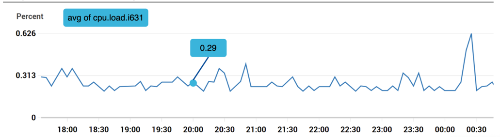
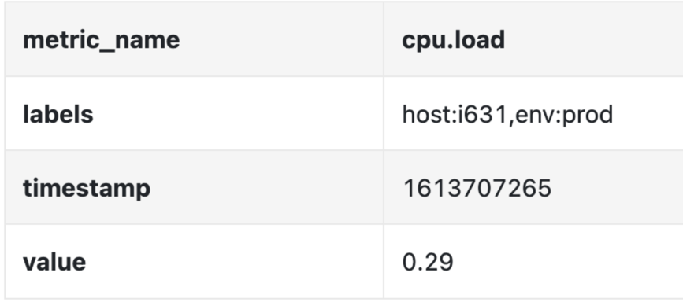
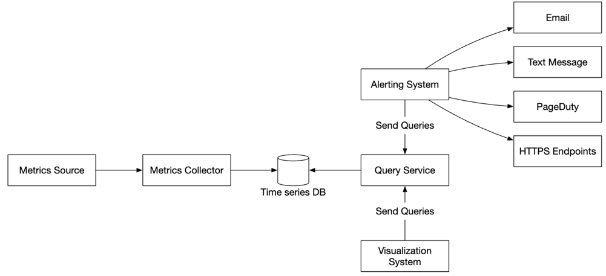
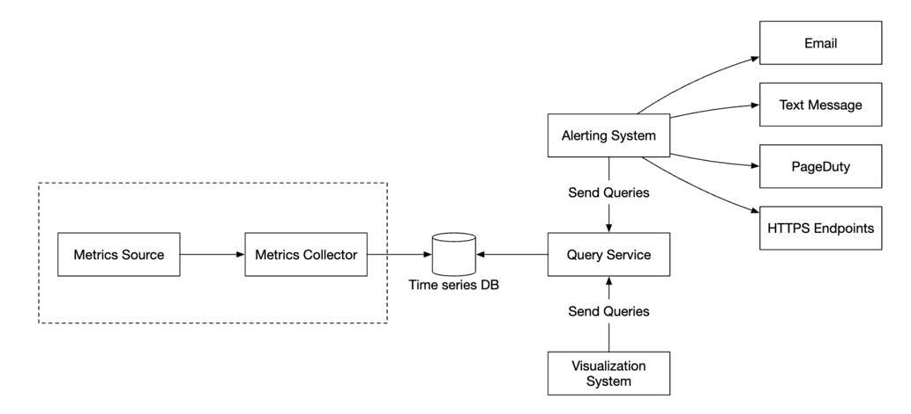
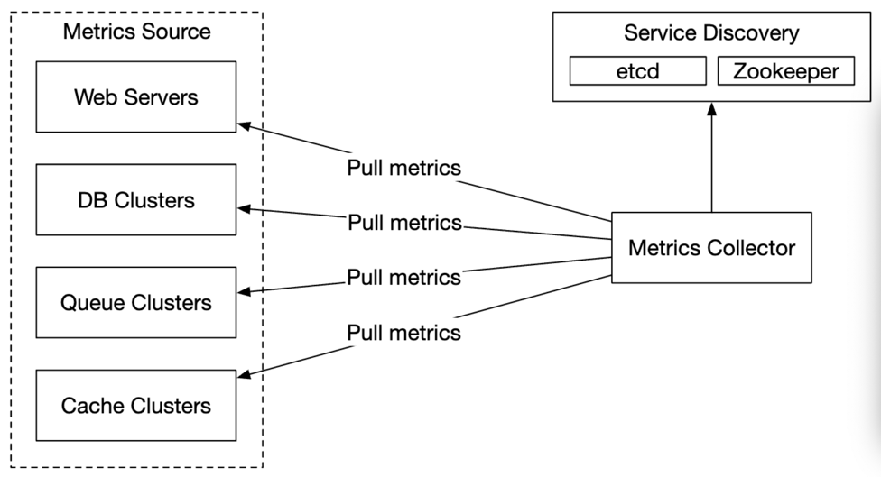
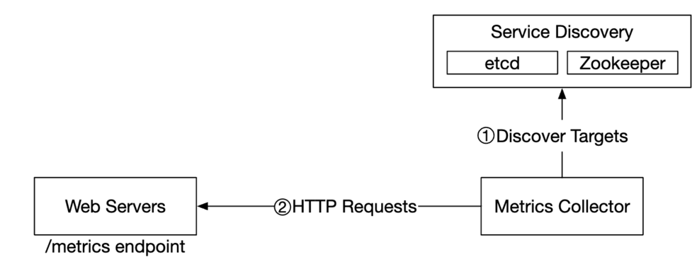
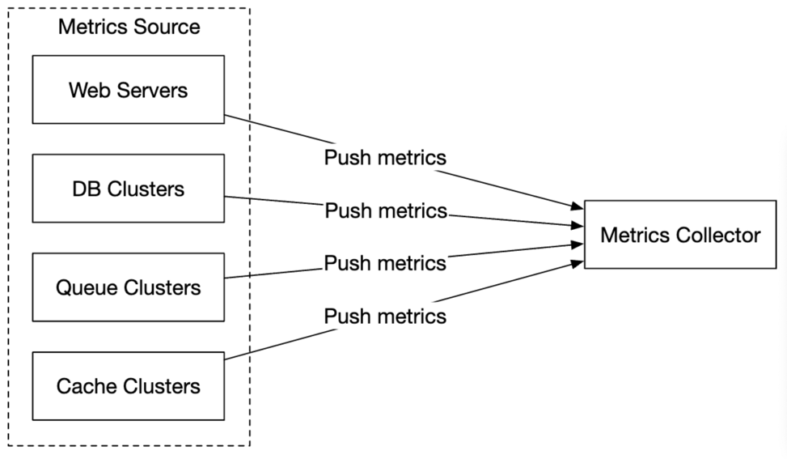
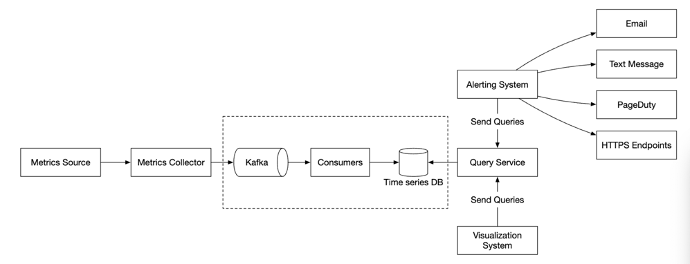
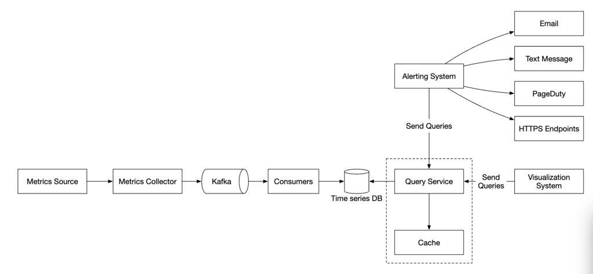
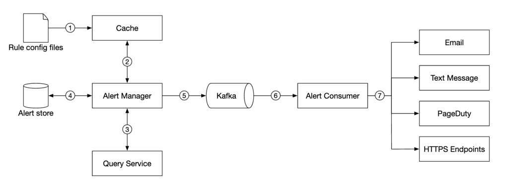

# 지표 모니터링 및 경보 시스템 📍 🔹 ✅
* 잘 설계된 지표 모니터링 및 경보 시스템은 높은 가용성과 안정성을 달성하는데 중추 역할

## 1. 문제 이해 및 설계 범위 확정

### 📍개략적 요구사항 및 가정
* 회사 내부에서 사용할 시스템
* 운영 지표 수집 : CPU 부하, 메모리사용률, 디스크사용량, 서버 초당요청수, 
* 모니터링할 규모 : DAU 1억명, 1000개의 서버풀, 풀마다 100개의 서버 하드웨어 
* 보관 기간 : 1년 보관, 새로수집한 데이터는 7일 보관, 7일 뒤에는 1분단위로 데이터 만들어 30일 보관, 그 이후엔 1시간 단위로 보관
* 경보 채널 : 이메일, 전화, 페이저듀티, 웹훅

### 📍비 기능 요구사항
* 규모 확장성 : 시스템은 늘어나는 지표, 경보에 따라 확장될 수 있어야한다
* 낮은 응답 지연 : 신속하게 처리할 수 있도록 낮은 응답 지연 보장
* 안정성 : 높은 안정성으로 중요 경보를 놓치지 않아야함.
* 유연성 : 미래 신기술을 쉽게 통합할 수 있도록 유연하게 변경 가능해야함.

## 2. 개략적 설계안 제시 및 동의구하기

### 📍 시스템 구축을 위한 기본적 사항
* 데이터수집 : 여러 출처로부터 지표 데이터 수집
* 데이터 전송 : 지표 데이터를 지표 모니터링 시스템으로 전송
* 데이터 저장소 : 전송되어 오는 데이터를 정리하고 저장
* 경보 : 데이터 분석 후 이상징후 감지해서 경보 발생
* 시각화 : 데이터를 차트나, 그래프로 제공 

### 📍 데이터 모델  
* 지표 데이터는 시계열 데이터 형태로 기록 (값 집합에 타임스템프)

  | 이름   | 지료형 |
  |--------|------|
  | 지표 이름  | 문자열   | 
  | 태그/레이블 집합   | <키:값> 쌍의 리스트(List)   |
  | 지표 값 및 타임스탬프의 배열   | <값, 타임스탬프> 쌍의 배열   | 

#### 사례 1 : 인스턴스의 CPU 부하 
* 지표이름, 레이블, 타임스템프, 지표값으로 구성
    
  
  

#### 사례 2 :10분간 us-west에 위치한 모든 웹 서버의 CPU 부하 평균값 
* 지표 이름이 CPU.load, 지역 이름이 us-west 인 데이터에서 수치의 평균을 구하면됨. 

~~~
CPU.load host=webserver01,region=us-west 1613707265 50

CPU.load host=webserver01,region=us-west 1613707265 62

CPU.load host=webserver02,region=us-west 1613707265 43

CPU.load host=webserver02,region=us-west 1613707265 53

...
~~~

#### 데이터 접근 패턴 
* 지표 시스템은 쓰기부하가 크며, 읽기 부하는 일시적인 편

### 📍 데이터 저장소 시스템 
* 시계열 데이터를 효율적으로 저장·처리하기 위해 전통적인 RDB보다 특화된 설계가 필요. 
* 일반 RDB는 시계열 데이터 처리에 성능 튜닝이 필요하고 복잡한 인덱스 관리가 필요함. 
* NoSQL이나 특화된 시계열 DB (예: Cassandra, Bigtable 등)은 확장이 용이한 스키마 설계, 데이터베이스 내부 구조에 대한 해박한 지식 필요
* 시계열 데이터베이스 : 
  * OpenTSDB, MetricsDB, InfluxDB, 프로메테우스  
  * InfluxDB, 프로메테우스가 인기있으며 다량의 시계열 데이터를 저장, 빠른 실시간 분석 지원, 메모리캐시아 디스크 저장소를 사용, 영속성, 높은 성능
  * 좋은 시계열데이터베이스는 막대한 양의 데이터를 레이블 기준으로 집계하고 분석. InfluxDB의 경우 신속한 질의를 지원하기 위해 레이블별로 인덱스 구축

### 📍개략적 설계안

  

* 지표 출처 : 데이터가 만들어지는 곳으로 애플리케이션 서버, SQL 데이터베이스, 메시지큐
* 지표 수집기 : 지표 데이터를 수집하고 시계열 데이터에 기록하는 역할
* 시계열 데이터베이스 : 지표 데이터를 시계열 데이터 형태로 보관하는 저장소
* 질의 서비스 : 시계열 데이터베이스에 보관된 데이터를 질의하고 가져오는 과정을 돕는 서비스
* 경보 시스템 : 경보를 받아야흔 다양한 대상으로 경보 알림 전송
* 시각화 시스템 : 지표를 다양한 형태의 그래프/차트로 시각화 하는 기능을 제공 

## 3. 상세 설계 

### 📍지표 수집 

  

#### 풀모델 vs 푸시 모델

* 풀 모델

  

  * 실행중인 애플리케이션에서 주기적으로 지표데이터를 가져옴
  * 지표 수집기 안에 서비스 엔드포인트의 DNS/IP 정보를 담은 파일을 두거나 -> 대규모 운영환경에 적용이 어려움 
  * etcd, 아파치 주키퍼 같은 서비스 탐색 서비스를 활용하여 서비스 엔드포인트 목록에 변화가 생길때마다 지표 수집기에 통보 

  

  * 지표 수닙기는 SDS 에서 서비스엔드포인트 설정 메타데이터(지표수집주기, IP주소, 타임아웃, 재시도인자)를 가져옴. 
  * 지표 수집기는 사전에 협의된 HTTP 엔드포인트에서 지표 데이터를 가져옴
  * 서비스 엔드포인트 목록 변화를 통보받기 위해 이벤트알림 콜백을 서비스 탐색 컴포넌트에 등록할 수 있음
  * 안정해시링을 통해 지표 수집기 서버가 여러대일때에도 데이터를 중복해서 가져오지 않을 수 있음

* 푸시 모델 

  

  * 지표 출처에 해당하는 서버가 직접 지표를 수집기에 전송하는 모델
  * 푸시모델의 경우 모니터링 대상 서버에 수집 에이전트를 설치한 후 지표 데이터를 모아 주기적으로 수집기에 전달
  * 푸시 모델을 채택한 지표 수집기가 밀려드는 지표 데이터를 제때 처리하지 못하는 일을 방지하려면 지표 수집기도 자동 규모확장이 가능해야함 (앞에 로드밸런서 두고)

 

* 풀모델 vs 푸시 모델
  * 각각 장단점이 있으므로 비교하여 필요한 방법으로 사용하면 됨. 

    |             | 풀 모델                                                                | 푸시 모델                                                                                                      |
    |-------------|---------------------------------------------------------------------|------------------------------------------------------------------------------------------------------------|
    | 사례          | 프로메테우스                                                              | 아마존 클라우드와치, 그래파이트                                                                                          | 
    | 손쉬운 디버깅     | 애플리케이션쪽에 엔드포인트를 호출해서 언제든지  지표 데이터볼 수 있으므로 풀모델이 더 나음             |                                                                                                            |
    | 상태진단        | 엔드포인트 호출 시 응답이없다면 바로  장애 발생한 것으로 진단                             | 지표 수집기가 지표를 받지 못하면 네트워크 장애가 원인인지  서버 장애가 원인인지 알기 어려움                                                   | 
    | 생존기간        |                                                                     | 생명주기가 짧은 일괄 작업 프로세스의 경우  수집기가 미처 지표를 끌어가기도 전에 종료되어버릴 수 있음  푸시 모델이 낫고, 풀모델도 푸시게이트웨이를 도입하면 문제점 해결 가능 |
    | 방화벽,네트워크 구성 | 수집기가 지표데이터를 수집하려면 엔드포인트에 접근  가능하도록 구성되어야하므로 네트워크 인프라 세심하게 설계 필요 | 지표 수집기가 로드밸런서 및 자동 규모 확장 클러스터 형태로 구성되어있다면 어디서 오는 지표라도 수집 가능                                            |
    | 성능          | TCP 사용                                                              | UDP 사용                                                                                                     |
    | 데이터 신빙성     | 지표 데이터를 가져올 애플리케이션이 이미 정의되어있으므로 신뢰성 높음                              | 아무나 지표 수집기에 데이터를 보낼 수 있다는 문제가 있으며 지표 전송을 허용할 서버 목록을 수집기측에 유지하거나 인즈을 강제하면 해결 가능                     |

### 📍지표 전송 파이프라인의 규모 확장
* 지표 수집기는 서버 클러스터 형태로 엄청난 양의 데이터를 받아 처리해야하며, 자동으로 규모 확장이 가능하도록 설정해야함
* 시계열 데이터에 장애가 생기면 데이터 손실발생가능성이 있음
* 카프카 같은 큐를 두어 해결할 수 있음

    

* 카프카는 데이터 수집 컴포넌트와 처리 컴포넌트 사이의 결합도를 낮추며, 카프카에 보관하기 때문에 데이터베이스에 장애가 생겨도 데이터는 소실되지 않음

#### 카프카를 통한 규모 확장
* 카프카에 내장된 파티션 메커니즘을 사용하면 시스템의 규모를 다양한 방법으로 확장할 수 있음
  * 대역폭 요구사항에 따라 파티션의 수를 설정
  * 지표 이름에 다라 어떤 지표를 어느 파티션에 배치할지 결정하면 소비자는 지표 이름에 따라 데이터를 집계 가능
  * 태그/레이블에 따라 지표 데이터를 더욱 세분화한 파티션으로 나눔
  * 중요 지표가 먼저 처리될 수 있도록 지표를 분류하고 우선순위를 지정 

#### 카프카의 대안 
* 큐 없이도 대규모 데이터 처리가 가능한 모니터링 시스템이 있음 ex. 페이스북 메모리 기반 시계열 데이터베이스 시스템 고릴라
* 고릴라는 일부 네트워크 장애가 발생해도 높은 수준의 쓰기연산 가용성을 유지하기에 카프카같은 큐를 면접관이 반대할 수 있음

### 📍데이터 집계 지점
* 지표 집계는 다양한 지점에서 실행 가능

#### 수집 에이전트 집계 
* 클라이언트에 설치된 수집 에이전트는 복잡한 집계로직은 불가하고, 분단위로 집계하여 지표 수집기에 보내는 정도 가능

#### 데이터 수집 파이프라인에서 집계하는 방향
* 데이터를 저장소에 기록하기 전에 집계할 수 있으려면 스트림 프로세싱 엔진이 필요함
* 늦게 도착하는 지표 데이터의 처리가 어렵고, 원본 데이터를 보관하지 않기 떄문에 정밀도나 유연성 측면에서 손해임 

#### 질의 시에 집계하는 방안 
* 데이터를 날것 그대로 보관한 다음 질의할 때 필요한 시간 구간에 맞게 집계 
* 데이터 손실 문제는 없으나 질의를 처리하는 속도가 느림

### 📍질의 서비스 

    

* 질의서비스는 질의 서버 클러스터 형태로 시각화 또는 정보시스템에서 접수된 요청을 시계열 데이터베이스를 통해 처리하는 역할을 담당 
* 질의서비스를 별도로 두면 클라이언트와 시계열 데이터베이스 사이의 결합도를 낮출 수 있음
* 질의 결과를 저장할 캐시 서버를 도입하면 부하를 낮추고 성능을 높일 수 있음
* 캐시 도입할 필요가 없는 시계열 데이터베이스도 있기 때문에 질의서비스를 두지 않는 것도 고려해야함. 

### 📍시계열 데이터베이스  질의어
* 시계열 데이터는 SQL로는 질의하기가 까다롭기 때문에 프로메테우스나 InfluxDB 같은 널리 사용되는 지표 모니터링 시스템들은 SQL이 아닌 독자 질의어를 제공 
~~~ 
from(db:"telegraf")
    |> range(start:-1h)
    |> filter(fn: (r) => r._measurement == "foo")
    |> exponentialMovingAverage(size: -10s)
~~~

### 📍저장소 계층 

#### 시계열 데이터베이스는 신중하게 선택할 것
* 운영 저장소에 대한 질의의 85%는 지난 26시간 내에 수집된 데이터를 대상으로 함
* 이 사실을 잘알고 시계열 데이터베이스를 택해야함.

#### 저장 용량 최적화 
* 데이터 인코딩 및 압축
* 다운샘플링 
  * 데이터의 해상도를 낮춰 저장소 요구량을 줄이는 기법 -> 시간 단위를 더 큰 단위로 묶어 시계열 그래프에서 세세한 것 보다는 큰 흐름을 볼 수 있음  
  * 요구사항에 맞춰 오래된 데이터는 해상도를 낮춰도 됨
* 냉동 저장소
  * 잘 사용되지 않는 비활성 상태 데이터를 보관하는 곳으로 냉동 저장에 드는 비용은 일반 저장소에 비해 훨씬 낮음

### 📍경보 시스템
* 경보시스템은 직접 만들기보다는 상용품을 가져다 쓰는 편이 훨씬 나음

    

* 1. 설정 파일을 가져와 캐시 서버에 보관 (경보 규칙은 디스크에 파일 상태로 보관하며, 규칙을 정의하는데 YML이 널리 사용됨)
* 2. 경보 관리자는 경보 설정 내역을 캐시에서 가져옴
* 3. 설정된 규칙에 근거하여 경보관리자는 지정된 시간마다 질의 서비스를 호출하며, 질의 결과가 설정된 임계값을 위반하면 경보 이벤트를 생성 
* 4. 경보 저장소는 카산드라 같은 형태의 키-값 저장소. 모든 경보의 상태가 여기에 보관
* 5. 경보 이벤트를 카프카에 전달
* 6. 경보 소비자는 카프카에서 경보 이벤트를 읽음
* 7. 경보 소비자는 카프카에서 읽은 경보 이벤트를 처리하여 이메일, 단문메시지, 페이저듀티, HTTP 서비스 엔드포인트 등의 다양한 채널로 알림을 전송.

### 📍시각화 시스템 
* 시각화 시스템은 데이터 계층 위에 만들어짐
* 지표 대시보드에는 지표를 다양한 시간 범위로 표시하고, 경보 대시보드에는 다양한 경보의 상태를 표시. 
* 시각화 시스템은 구현하기 어렵기 때문에 상용품을 구입해서 쓰자고 주장하는 것이 바람직

