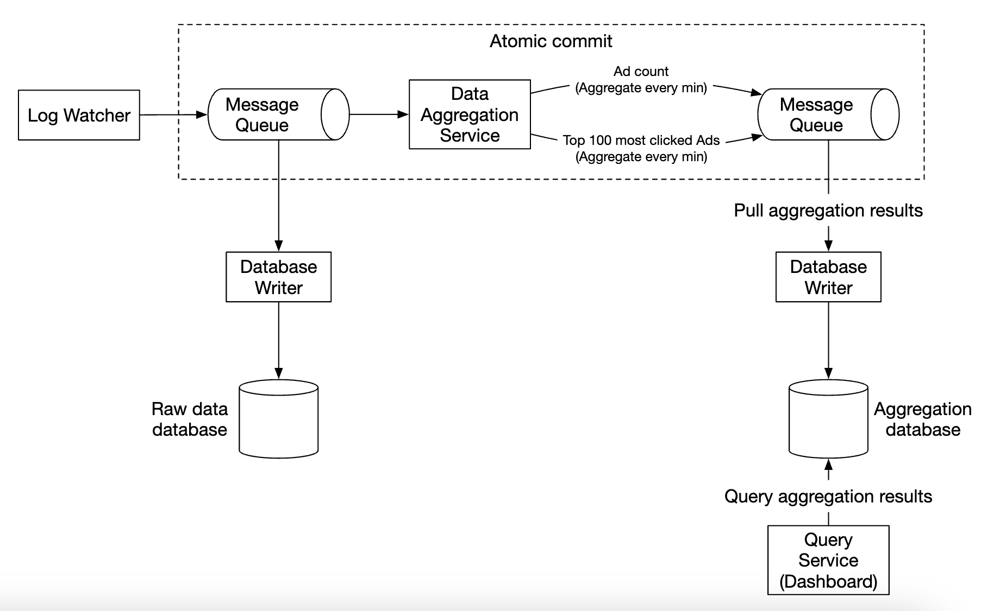
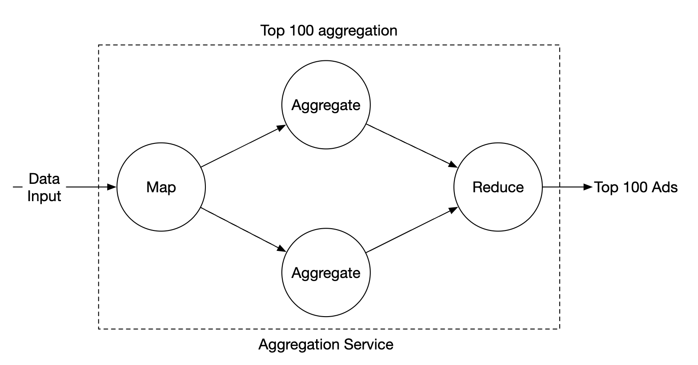
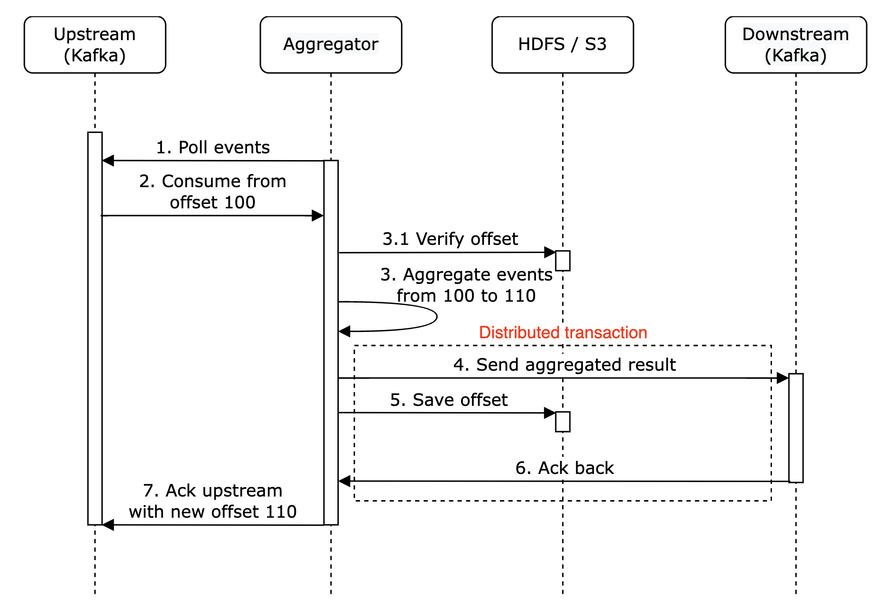
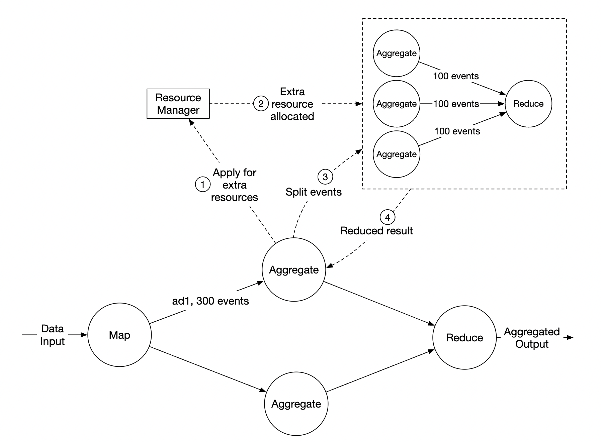

# Chapter 06 "광고 클릭 이벤트 집계"

## 개념

* 온라인 광고의 장점
    * 실시간 데이터를 통해 광고 효과를 정량적으로 측정할 수 있다.
* RTB(Real-Time Bidding). 실시간 경매
    * 누군가 웹사이트나 앱을 열었을 때, 그 사람이 누구인지에 맞춰 광고를 보여줄지를 광고주들이 경쟁하는 시스템
    * 온라인 광고의 핵심 프로세스. 속도가 중요하다. 1초 내에 모든 프로세스가 마무리된다.
* 데이터 정확성
    * 광고 클릭 이벤트 집계는 온라인 광고가 얼마나 효율적이었는지 측정하는데 결정적인 역할을 하며, 광고주가 얼마나 많은 돈을 지불할지에 영향을 끼친다.
    * 클릭 집계 결과에 따라 광고 캠페인 관리자는 광고 예산을 조정하기도 하고, 타깃 그룹이나 키워드를 변경하는 등 광고 전략을 수정하기도 한다.
* 핵심 지표
    * CTR(Click-Through Rate, 클릭률)
    * CVR(Conversion Rate, 전환률)

## 1단계. 문제 이해 및 설계 범위 확정

### 1. 요건

* 입력 데이터의 형태와 양은?
    * 분산된 로그 파일에 추가되는 형태
    * 10억개의 광고 클릭, 광고 200만 회 게시, 클릭 이벤트의 수는 매년 30% 증가
* 중요 질의
    * 특정 광고에 대한 M 분간의 클릭 이벤트 수는?
    * 지난 1분간 가장 많이 클릭되는 광고 100개, 질의 기간과 광고 수는 변경 가능해야 한다. (집계는 분당 진행)
    * ip, user_id, country 등의 속성으로 상의 2개 질의 결과를 필터링 할 수 있어야 한다.
* 엣지 케이스에 대한 처리
    * 예상보다 늦게 도착한 이벤트
    * 중복된 이벤트
    * 시스템 일부의 장애 복구 고려
* 지연시간 요건
    * 모든 처리는 수 분 내에 처리
    * RTB는 1초 이내 처리, 광고 클릭 집계는 주로 광고 과금 및 보고에 사용되기 때문에 몇 분 정도 지연은 허용

### 2. 기능 요구사항

* 지난 M분 동안의 ad_id 클릭 수 집계
* 매분 가장 많이 클릭된 상위 100개 광고 아이디를 반환
* 다양한 속성에 따른 집계 필터링을 지원
* 데이터의 양은 페이스북이나 구글 규모

### 3. 비기능 요구사항

* 집계 결과 적황성은 데이터가 RTB 및 광고 과금에 사용되므로 중요
* 지연되거나 중복된 이벤트를 적절히 처리할 수 있어야 함
* 견고성: 부분적인 장애는 감내할 수 있어야 함
* 지연 시간 요구사항: 전체 처리 시간은 최대 수 분을 넘지 않아야 함

### 4. 개략적 추정

* 일간 능동 사용자 수 10억명 / 하루에 10억 건의 광고 클릭 이벤트가 발생 <br>
->  QPS: 10억건의 이벤트 / 86,400초(하루) = 대략 10,000 
* 최대 광고 클릭은 평균의 다섯배 50,000QPS로 가정
* 광고 클릭 이벤트 하나당 0.1KB의 저장 용량이 필요<br>
-> 일 저장 요구량 0.1KB * 10억 = 100GB / 월 저장 요구량 대략 3TB

## 2단계. 개략적 설계안 제시 및 동의 구하기

### 1. 질의 API 설계

#### 1.1. 기능 요구사항

* 지난 M분 동안 ad_id 클릭 수 집계
* 매분 가장 많이 클릭된 상위 100개의 광고 아이디 반환
* 다양한 속성에 따른 집계 필터링 지원

#### 1.2. 공통 API 설계

* 주어진 ad_id에 발생한 이벤트 수를 집계하여 반환

```
GET /v1/ads/{:ad_id}/aggregated_count

요청 인자: 

- from(long, 집계 시작 시간)
- to(long, 집계 종료 시간)
- filter(long, 필터링 전략 식별자)

응답 값:

- ad_id(string, 광고 식별자)
- count(long, 집계된 클릭 횟수)
```

* 지난 M분간 가장 많은 클릭이 발생한 상위 N개 ad_id 목록

```
GET /vi/ads/popular_ads

요청 인자:

- count (integer, 상위 광고 개수)
- window (integer, 집계 시간 범위 in 분)
- filter (long, 필터링 전략 식별자)

응답 값:

- ad_ids (array, 상위 광고 식별자 목록)
```

### 2. 데이터 모델

#### 2.1. 원시 데이터

```
[AdClickEvent] ad001, 2021-01-01 00:00:01, user 1, 207.48.22.22, USA
```

* 로그 파일에 포함되어, 여러 어플리케이션 서버에 기록되어 있다.
* 이 방법으로는 원본 데이터를 손실 없이 보관 가능하며 데이터 필터링 및 재계산에 이용할 수 잇다.
* 하지만 데이터 용량을 많이 차지하고, 질의 성능이 낮아 연산이 오래 걸린다.

#### 2.2. 집계 결과 데이터

| ad_id | click_minute | filter_id | count |
|-------|--------------|-----------|-------|
| ad001 | 202101010000 | 0012      | 2     |
| ad001 | 202101010000 | 0023      | 3     |
| ad001 | 202101010001 | 0012      | 1     |

* 광고 필터링을 지원하기 위해 이 기록에는 filter_id 를 추가한다. 이 필터 ID에 따라, 다른 집계 결과 데이터를 갖게 된다.
* 지난 M 분 동안 가장 많이 클릭된 상위 N개의 광고를 반환하는 질의를 지원하기 위해서는 다음 구조를 사용한다.
    * window_size (integer, 분 단위 집계 윈도우 사이즈)
    * update_time_minute (timestamp, 마지막으로 갱신된 타임 스탬프)
    * most_clicked_ads(array, ID 목록)

#### 2.3. 비교

##### 장단점

* 원시 데이터
    * 장점 - 문제가 발생하거나 버그로 집계 데이터가 손상된 경우, 정상화 후 집계 결과를 다시 생산할 수 있다.
    * 단점 - 양이 엄청나므로 직접 질의하는 것은 비효율적이다.
    * 원시 데이터는 백업 데이터로 활용하고, 오래된 데이터는 cold storage로 옮겨 비용을 절감한다.
* 집계 결과 데이터
    * 장점 - 데이터 용량이 절감되며 질의 또한 빠르다.
    * 단점 - 데이터가 손실되어 저장되기 때문에 재가공이 어렵다.
    * 집계 결과 데이터는 활성 데이터이므로 질의 성능을 높이기 위해 튜닝한다.

##### 결론

* 두 데이터를 모두 저장하는 것이 바람직하다.

### 3. 올바른 데이터베이스의 선택

#### 3.1. 평가 사항

* 데이터는 어떤 모습인가? 관계형 데이터? 문서 데이터? 이진 대형 객체?
* 작업 흐름이 읽기 중심인가? 쓰기 중심인가? 아니면 둘다 인가?
* 트랜잭션을 지원해야하는가?
* 질의 과정에서 분석 처리 함수를 많이 사용해야하는가?

#### 3.2. 분석 및 선택

* 원시 데이터
    * 질의가 거의 필요없다.
    * 쓰기 중심 서비스이기 때문에 백업과 재계산 용도로만 사용되어 읽기 연산 빈도가 낮다. (평균 쓰기가 10,000/s~50,000/s)
    * 쓰기 및 시간 범위 질의에 최적화된 카산드라나 InfluxDB를 사용하는 것이 바람직하다.
* 집계 결과 데이터
    * 시계열 데이터 (시간의 흐름에 따라 순서대로 수집된, 타임스탬프가 함께 존재하는 데이터)
    * 읽기/쓰기 연산을 둘 다 많이 사용한다.
    * 마찬가지로 같은 데이터 베이스를 이용하거나 시계열 데이터베이스 InfluxDB를 이용한다.

#### 3.3. DB

##### Apache Cassandra

* 대용량 데이터의 분산 저장에 특화된 NoSQL 데이터베이스
* 초당 수만 건 이상 쓰기 요청이 많은 시스템에 적합하다. (로그 저장, 광고 클릭 이벤트, 센서 데이터)
* 복잡한 조인은 안 되고, 단순한 조회 중심으로 설계해야 한다.

##### InfluxDB

* 시계열 데이터를 저장하고 분석하는 데 최적화된 전용 시계열 DBMS
* 초당 수만 건 쓰기 가능하면서, 시간 범위 질의에 특화되어 있다.
* SQL과 비슷한 쿼리를 사용한다.
* 분/초 단위로 집계되는 메트릭 처리에 적합하다. (서버 모니터링, 시계열 집계, 센서 데이터, 광고 클릭 수 집계)

##### 비교

* 원시 데이터 - 쓰기 중심이라 Cassandra 또는 InfluxDB
* 집계된 시계열 데이터 -  읽기도 자주 있으니 InfluxDB 유리


### 4. 개략적 설계안


* 입력은 원시 데이터(무제한 데이터 스트림)이고, 출력은 집계 결과이다.
* 로그 모니터에서 데이터를 푸쉬하면, 데이터 집계 서비스에서 요구사항 결과를 데이터베이스에 저장하고 이를 질의 서비스가 질의한다.

#### 4.1. 비동기 처리

* 위 처리 방법은 기본적 동기 방식이다.
* 생산자와 소비자가 항상 같은 스펙이 아니므로, 트래픽이 갑자기 증가하여 발생하는 이벤트 수가 소비자의 처리 용량을 훨씬 넘어서는 경우에는 소비자는 메모리 부족 오류 등의 예기치 않은 문제를 겪게 될 수 있다.
* 특정 컴포넌트의 장애가 전체 시스템의 장애가 되는 것을 피하기 위해 비동기 방식을 채택한다.

#### 4.2. 메시지 큐



* 카프카 같은 메시지 큐를 도입하여 생산자와 소비자의 결합을 끊는다.
* 그 결과로 전체 프로세스를 비동기로 동작하게 하여 규모를 독립적으로 확장하도록 한다.
* 원시 데이터베이스 기록 프로세스와 데이터 집계 서비스를 각각 소비자 그룹으로 나눠 메시지를 분배하고, 데이터 집계 서비스에서도 메시지 큐로 집계 결과를 보내 집계 결과 데이터베이스에 저장하는 것을 비동기화 시킨다.
* 집계 결과를 바로 DB에 넣으면 중복되거나 빠질 수 있으므로, Kafka 같은 메시지 큐를 중간에 사용한다. (exactly one 데이터를 처리하기 위해. automic commit)

##### 첫 번째 메시지 큐

* 광고 클릭 이벤트 데이터

```
| ad_id | click_timestamp | user_id | ip | country |
```

##### 두 번째 메시지 큐 

* 분 단위로 집계된 광고 클릭 수

```
| ad_id | click_minute | count |
```

* 분단위로 집계한, 가장 많이 클릭한 상위 N개 광고

```
| update_time_minute | most_clicked_ads |
```

### 5. 집계 서비스

#### 5.1. 맵리듀스 프레임워크



* 유향 비순환 그래프 모델(directed arcyclic graph, DAG)을 사용해 입력 데이터를 맵/집계/리듀스 노드 등의 작은 컴퓨팅 단위로 세분화한다
* 각 노드는 한 가지 작업만 처리하며, 처리 결과를 다음 노드에 인계한다.

#### 5.2. 맵 노드

* 입력 데이터를 필터링하고 변환하는 역할을 담당한다. (정규화)
    * 예) 특정 조건에 만족하는 데이터는 노드1로 보내고, 그렇지 않은 노드는 2로 보낸다.
* 데이터가 생성되는 방식에 대한 통제를 할 수 없는 경우에 같은 ad_id를 갖는 이벤트들이 다른 카프카 파티션에 입력될 수 있는데,<br>
맵 노드는 동일한 ad_id가 항상 같은 집계 노드로 가도록 보장할 수 있다. (성능이 좋고 정확함)

#### 5.2. 집계 노드

* ad_id별 광고 클릭 이벤트 수를 매 분 메모리에 집계한다.
* 맵 리듀스 패러다임에서 집계 노드는 리듀스 프로세스의 일부이다.

#### 5.3. 리듀스 노드

* 모든 집계 노드가 산출한 결과를 최종 결과로 축약한다.
* 각 집계 노드는 자기 관점에서 가장 많은 클릭이 발생한 광고 N개를 추려 리듀스 노드로 보내고, 리듀스 노드는 그 결과를 모아 최종적으로 N개의 광고만 남긴다.
* DAG
    * 데이터 처리 작업(Task)들이 순서대로 연결되고 있고, 절대 뒤로 돌아가지 않는 방향성 있는 그래프
    * 빅데이터를 입력으로 받아 병렬 분산 컴퓨팅 자원을 활용하여 빅데이터를 작은, 또는 일반적인 크기 데이터로 변환할 수 있도록 설계된 모델이다.
    * 병렬 처리에 최적화 - 노드 간 의존 관계만 보장하면, 독립적인 작업은 동시에 실행 가능하다.

#### 5.4. 주요 사용 사례

* 클릭 이벤트 수 집계
    * 맵 노드는 시스템에 입력되는 이벤트를 ad_id % 3 을 기준으로 분배하며, 분배한 결과는 각 집계 노드가 집계한다.
    * 
* 가장 많이 클릭된 상위 N개 광고 반환
    * 가장 많이 클릭된 상위 광고 3개를 가져오는 방법에서 상위 N개 광고로도 확장될 수 있다.
    * 
* 데이터 필터링
    * 데이터 필터링을 지원하려면 필터링 기준으로 사전에 정의한 다음에 해당 기준에 따라 집계하면 된다.

## 3단계. 상세 설계

### 1. 스트리밍 vs 일괄 처리

#### 1.1. 3가지 시스템 비교

| 항목 | 온라인 시스템 | 일괄 처리 시스템 | 스트리밍 시스템 |
|---|---|---|---|
| 응답성 | 클라이언트에게 빠르게 응답 | 클라이언트에게 응답 X | 클라이언트에게 응답 X |
| 입력 | 사용자의 요청 | 유한한 크기를 갖는 입력, 큰 규모 데이터 | 입력에 경계가 없음 |
| 출력 | 클라이언트에 대한 응답 | 구체화 뷰, 집계 결과 지표 | 구체화 뷰, 집계 결과 지표 |
| 성능 측정 | 가용성, 지연 시간 | 처리량 | 처리량, 지연 시간 |
| 사례 | 온라인 쇼핑 | 맵리듀스 | 플링크 |

#### 1.2. 본 시스템 설계

* 본 설계안은 스트림 처리와 일괄 처리 방식을 모두 사용한다.
    * 스트림 처리 - 데이터를 오는 대로 처리하고 거의 실시간으로 집계된 결과를 생성하는데 사용
    * 일괄 처리 - 이력 데이터를 백업하기 위해 활용

#### 1.3. 아키텍처 비교 

* 람다 아키텍처
    * 일괄 및 스트리밍 처리 경로를 동시에 지원하는 시스템.
    * 같은 데이터를 두번 처리해야 하고, 유지 관리해야 할 코드가 두벌이라 유지 보수가 힘들다.
* 카파 아키텍처*
    * 이 문제를 해결하기 위하여, 일괄 처리와 스트리밍 처리 경로를 하나로 결합하여 스트리밍 처리만 사용한다.
    * 단일 스트림 엔진을 사용하여 실시간 데이터 처리 및 데이터 재처리 문제를 모두 해결한다.

#### 1.4. 데이터 재계산 (historical data replay)

* 집계한 데이터가 중대한 버그로 인해 다시 계산하는 경우가 있는데, 이때에는 버그 발생 시점부터 원시 데이터를 다시 읽어 재계산 한다.
* 흐름
    * 원시 데이터 저장소에서 직접 데이터를 검색한다.
    * 추출된 데이터는 전용 집계 서비스로 전송된다. 전용 집계 서비스를 두는 것은 실시간 데이터 처리 과정이 과거 데이터 재처리 프로세스와 간섭하는 일을 막기 위해서이다.
    * 집계 결과는 두 번째 메시지 큐로 전송되어 집계 결과 데이터베이스에 반영된다.


### 2. 시간

#### 2.1. 타임스탬프 수집 방식

* 이벤트 시각: 광고 클릭이 발생한 시각으로 클라이언트 의존
* 처리 시각: 집계 서버가 클릭 이벤트를 처리한 시스템 시각으로 서버에 의존
* 특징
    * 네트워크 지연이나 비동기적 처리 환경 때문에 이벤트가 발생한 시각과 처리 시각 사이의 격차가 커질 수 있다.
    * 이벤트가 발생한 시각을 집계에 사용하는 경우에는 지연된 이벤트 처리 문제를 잘 해결해야 한다.
    * 처리 시각을 집계에 사용하는 경우에는 집계 결과가 부정확할 수 있다는 점을 고려해야 한다.

#### 2.2. 시스템에 늦게 도착한 이벤트를 어떻게 처리할까? 워터마크


* "이벤트가 늦게 도착할 수도 있으니까, '잠깐 기다렸다가' 그 윈도를 닫자"
* 지연된 이벤트도 윈도에 포함시켜 정확도를 향상시킨다.
* 워터마크의 크기는 비즈니스 요구사항에 따라 달리 잡는다.
    * 짧게 설정하면 - 빨리 집계 종료됨 / 지연된 이벤트 누락 가능
    * 길게 설정하면 - 정확한 집계 가능 / 지연 시간(latency)이 증가

### 3. 집계 윈도 (aggregation window)

#### 3.1. 윈도(Window)
* '어느 시점의 데이터를 집계할지' 를 정하는 기준점.
* 흐르는 데이터를 시간 단위로 잘라서 처리하는데, 이 잘라낸 시간 단위를 '윈도(Window)'라고 한다.

#### 3.2. 종류

* 텀블링 윈도
    * 시간을 같은 크기의 겹치지 않는 구간으로 분할헌더,
    * 예) 매 5분간 발생한 클릭 이벤트 집계
    * 
* 슬라이딩 윈도
    * 데이터 스트림을 여러 구간을 하나의 윈도로 하여 겹칠 수 있다.
    * 예) 지난 M분간 가장 많이 클릭된 상위 N개의 광고 집계
    * 
* 호핑 윈도
    * 윈도 간격을 크게 하여 틈을 둔다.
    * 예) 매 10분마다 5분간 클릭 수 집계
* 세션 윈도
    * 사용자 활동 기준으로 윈도 구간을 나눈다.
    * 예) 사용자가 30초 이상 클릭 안 하면 세션 종료

### 4. 전달 보장 (delivery guarantee)

#### 4.1. 데이터의 정확성과 무결성

* 집계 결과는 과금 등에 활용될 수 있기 때문에 데이터의 정확성과 무결성이 중요하다. 
    * 이벤트의 중복 처리를 어떻게 피할 수 있는가?
    * 모든 이벤트의 처리를 어떻게 보장할 수 있는가?

#### 4.2. 어떤 전달 방식을 택할 것인가?

*  데이터의 몇 퍼센트 차이가 수백만 달러 차이로 이어지기 떄문에, `정확히 한 번 방식`을 권장한다.

#### 4.3. 데이터 중복 제거

* 중복 데이터 사례
    * 클라이언트 측: 한 클라이언트가 같은 이벤트를 여러 번 보내는 경우, 악의적인 의도로 전송되는 중복 이벤트를 처리하는 데는 광고 사기/위험 제어 컴포넌트가 적합하다.
    * 서버 장애: 집계 도중에 집계 서비스 노드에서 장애가 발생하였고 업스트림 서비스가 이벤트 메세지에 대해 응답을 받지 못하였다면, 같은 이벤트가 다시 전송되어 재차 집계될 가능성이 있다.
* 서버 장애에 대한 근본적 해결: 분산 트랜잭션
    * 여러 시스템(업스트림 카프카, 다운스트림 카프카, 오프셋 저장소)을 한 트랜잭션으로 묶어서 처리
    * 트랜잭션 매니저가 '셋 다 성공해야 진짜 처리 완료'라고 보장하고, 실패하면 모두 롤백한다.
    * 

### 5. 시스템 규모 확장

* 메세지 큐, 집계 서버, 데이터베이스 3 가지 독립 구성 요소들은 상호 결합도가 낮으므로 각기 독립적으로 규모를 늘릴 수 있다.

#### 5.1. 메시지 큐

* 생산자
    * 데이터를 보내는 쪽(생산자)은 몇 개든, 어디서 추가하든 제한이 없으므로 확장은 쉽게 가능하다.
* 소비자
    * 소비자 그룹 내의 재조정 메커니즘은 노드 추가/삭제를 통해 그 규모를 쉽게 조정할 수 있다.
* 브로커
    * 해시 키
        * ad_id 를 갖는 이벤트를 같은 카프카 파티션에 저장하기 위해 ad_id를 해시 키로 사용한다.
        * 이렇게 하면, 집계 서비스는 같은 ad_id를 갖는 이벤트를 전부 같은 파티션에서 구독할 수 있다.
    * 파티션의 수
        * 파티션의 수가 변하면 같은 ad_id를 갖는 이벹트가 다른 파티션에 기록되는 일이 생길 수 있다.
        * 파티션의 수가 동적으로 늘어나는 일은 피하는 것이 좋다.
    * 토픽의 물리적 샤딩
        * 하나의 토픽만으로 충분한 경우는 거의 없다.
        * 지역에 따라, 사업 유형에 따라 토픽을 나누면, 시스템의 처리 대역폭을 높일 수 있지만, 복잡성이 증가하고 유지 관리 비용이 늘어난다.

#### 5.2. 집계 서비스의 규모 확장

* 집계 서비스의 처리 대역폭을 높이려는 2가지 방법

##### 방법 1. 광고 id 마다 별도의 처리 스레드를 두는 방식 (멀티 쓰레딩)

* 예) ad001 클릭은 Thread A가, ad002 클릭은 Thread B가 처리한다.
* 쉽게 구현이 가능하며 자원 공급자에 대한 의존 관계가 없어진다.

##### 방법 2. 집계 서비스 노드를 아파치 하둡 같은 자원 공급자에 배포하는 방식 (멀티 프로세싱)

* 집계 노드를 아예 여러 대의 머신(혹은 컨테이너)에 배포해서 각 노드가 병렬로 집계 작업을 수행한다.
* 예) 1번 노드에서 ad001 ~ ad1000를, 2번 노드에서 ad1001 ~ ad2000 를 처리한다.
* 장점 - 컴퓨팅 자원을 수평 확장할 수 있고, 대규모 트래픽에 더 적합하다.
* 단점 - 인프라 구성이 복잡하고(배포, 자원 할당 등) 구현이 어렵다. 

#### 5.3. 데이터베이스의 규모 확장


* 카산드라는 안정 해시와 유사한 방식으로 수평적인 규모 확장을 기본적으로 지원한다.
* 데이터는 각 노드에 균등하게 분산된다.
* 각 노드는 해시 링 위의 특정 해시 값 구간의 데이터 보관을 담당하며, 다른 가상 노드의 데이터 사본도 보관한다.

#### 5.4. 핫스팟 문제



* 핫스팟: 다른 서비스나 샤드보다 더 많은 데이터를 수신하는 서비스나 샤드
* 이벤트 파티션을 광고 ID에 따라 나누기 때문에, 특정 집계 서비스 노드가 다른 노드보다 더 많은 광고 클릭 이벤트를 수신할 수 있고, 서버 과부하 문제가 발생할 수 있다.
* 이 문제는 더 많은 집계 노드를 할당하여 완화할 수 있다(맵 -> 집계 -> 리듀스)
    1. 자원 관리자가 새로운 집계 노드를 할당해 원래의 집계 노드가 이벤트를 분할한다.
    1. 각자 처리 후 결과를 리듀스해서 다시 원래의 집계 노드에 결과를 반환한다.

### 6. 결함 내성 (fault tolerance)

* 집계 노드에 장애가 생기면, 업스트림 카프카 브로커를 통해 이벤트를 다시 받아와 손실된 값을 다시 받아올 수 있다.
* 카프카 데이터를 원점부터 다시 재생하면 집계가 오래 걸리므로, 시스템 상태를 스냅샷으로 저장하고 마지막으로 저장된 상태부터 복구하는 것이 바람직하다.
* 장애 발생 시, 스냅샷으로 메모리 집계 데이터를 복구하고, 카프카 오프셋을 기반으로 안 읽은 이벤트만 다시 처리하면 안전하게 다시 시작할 수 있다.

### 7. 데이터 모니터링 및 정확성

* 집계 결과는 RTB 및 청구서 발행 목적으로 사용될 수 있다.

#### 7.1. 지속적으로 모니터링 해야 하는 지표

* 지연 시간
    * 데이터를 처리하는 단계마다 지연시간이 추가될 수 있으므로 시스템 중요 부분에서 추적이 가능하도록 해야 한다.
* 메세지 큐 크기
    * 큐에 데이터가 점점 많아지면 더 많은 집계 서비스 노드를 추가해야 한다. 
    * 카프카를 사용하는 경우에는 레코드 처리 지연 지표를 추적하면 된다.
* 집계 노드의 시스템 자원
    * CPU, 디스크, JVM 등

#### 7.2. 조정 (Reconciliation)

* 조정: 다양한 데이터를 비교하여 데이터 무결성을 보증하는 기법
* 실시간 집계는 스트림 처리라서 이벤트가 발생하는 대로 계속 처리되는데, 정확하게 처리되는지 어떻게 검증할수 있을까?
    * 하루에 한 번, 저장된 로그(카프카 파티션 등)를 기반으로 다시 일괄 집계하여 `실시간 집계 결과 vs. 일괄 처리로 재계산한 집계 결과`를 비교한다.
    * 윈도 크기에 관계 없이 일부 이벤트는 늦게 도착할 수 있으므로, 2개의 결과가 정확히 일치하지 않을 수 있다.
* 조정 또한 재계산 서비스와 마찬가지로, 일괄 처리를 위해 별도의 서비스를 구축하는 것이 좋다.

### 8. 대안 설계안

#### 8.1. 설계안


* 광고 클릭 데이터를 하이브에 저장한 다음 빠른 질의는 ElasticSearch 계층에 얹어서 처리한다.
    * Hive: 대용량 저장소. 배치 분석이나 이력 보관용.
* 집계는 클릭하우스나 드루이드 같은 OLAP 데이터 베이스를 통해 처리한다.
    * ClickHouse: 빠른 쿼리 성능을 위한 실시간 분석 저장소.

#### 8.2. 비교

| 항목 | Raw + Aggregation DB | ClickHouse + Hive |
|-|-|-|
| 아키텍처 | 카파 아키텍처 | 람다 아키텍처 |
| 구성 요소 | - 이벤트를 실시간으로 처리<br>- 스냅샷이나 DB에 저장 후 쿼리 | - 배치 경로: Hive → ElasticSearch<br>- 실시간 경로: ClickHouse → ElasticSearch |
| 목적 | 단순성 + 실시간성: 하나의 경로로 데이터 처리 | 정확도 보장: 실시간은 부정확할 수 있어도, 배치로 보정 가능 |
| 장점 | - 아키텍처 단순<br>- 유지보수 용이<br>- 실시간 처리에 최적화 | - 실시간 + 배치 보완 가능<br>- 정확한 결과 도출 |
| 단점 | - 늦은 이벤트 보정이 어려움<br>- 완전 정확한 집계 어려울 수 있음 | - 시스템 복잡 (2개 경로 동시 유지)<br>- 데이터 중복 처리 위험 |


