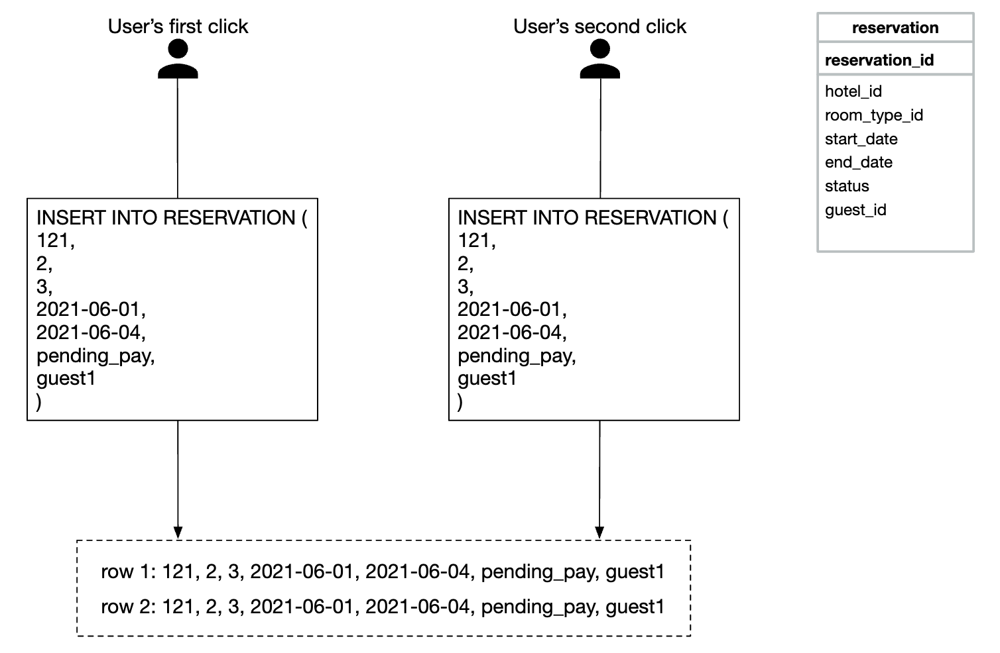
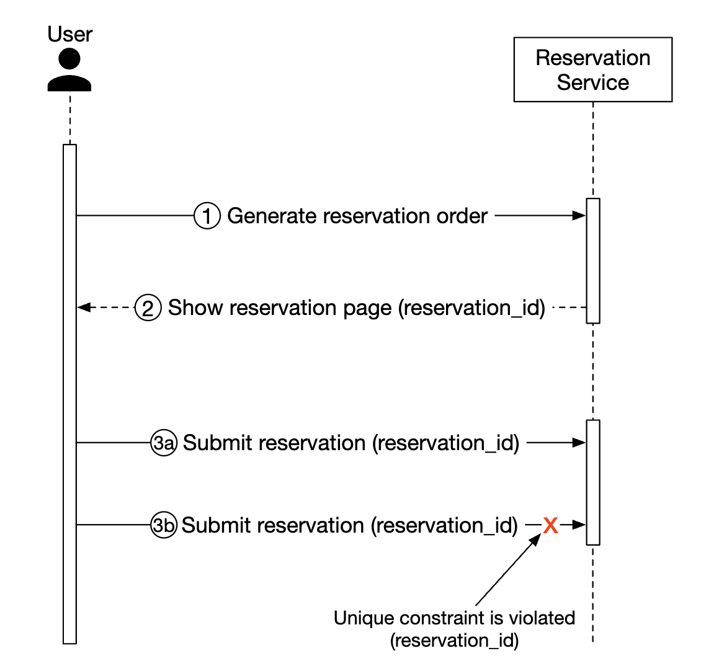
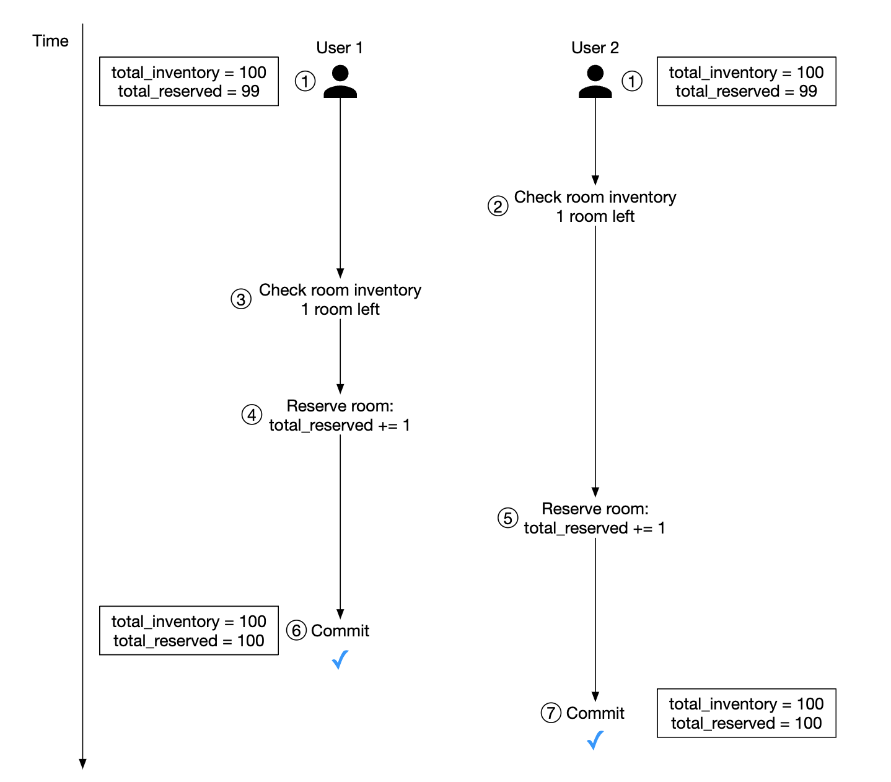
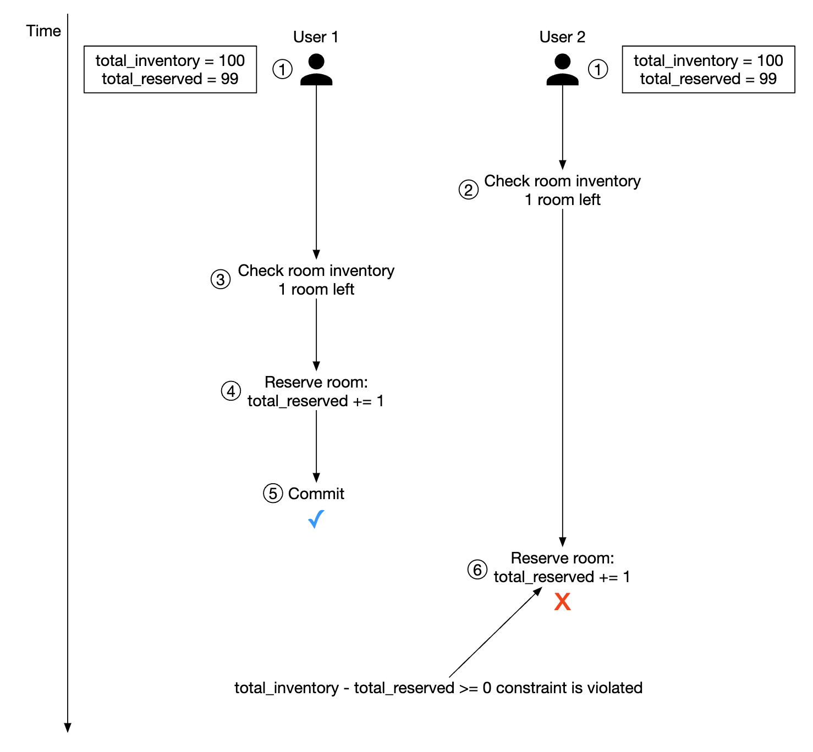
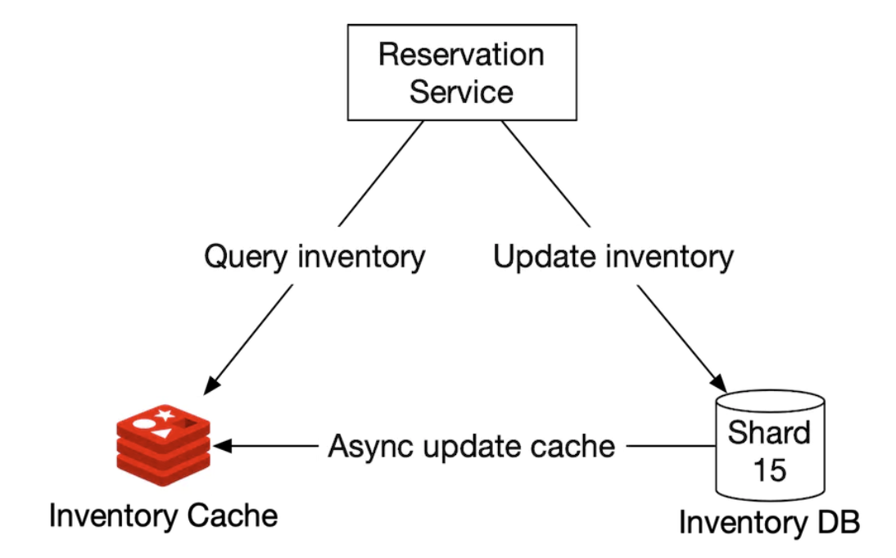
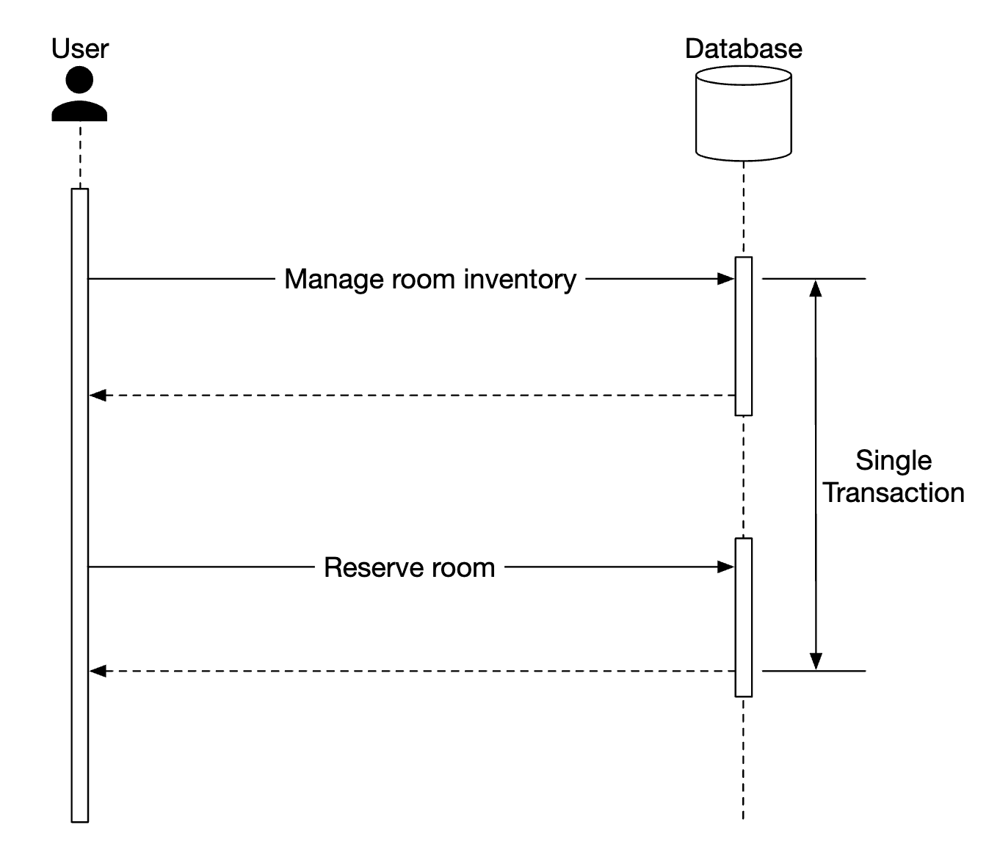

# Chapter 3 호텔 예약 시스템

## 1단계. 문제 이해 및 설계 범위 확정

### 1.1. 기능 요구사항

* 5000개 호텔 / 100만개 객실
* 대금은 예약 시 전액 지불
* 10% 초과 예약이 가능
* 객실 검색 제외
* 객실 가격은 유동적(일마다 다름)

### 1.2. 비기능 요구사항 및 제약사항

* 높은 수준의 동시성(concurrency)
* 적절한 지연 시간

### 1.3. 개략적 규모 추정
* 총 5000개 호텔 / 100만 개 객실
* 평균적으로 객실의 70% 사용 중, 평균 투숙 기간 3일
* 일일 예상 예약 건수: 1백만 x 0.7 / 3 = 약 240000건
* 서비스 TPS
    * 객실 최종 예약(x) = 240000/10000 = 3 (Write)
    * 예약 상세 페이지(y) = 10x = 30 (Read)
    * 객실 상세 페이지 = 10y = 300 (Read)

## 2단계. 개략적 설계안 제시 및 동의 구하기

### 2.1. API 설계

**호텔 관련 API**
 * `GET /v1/hotels/{id}` - 호텔의 상세 정보 반환
 * `POST /v1/hotels` - 신규 호텔 추가. 호텔 직원만 사용 가능
 * `PUT /v1/hotels/{id}` - 호텔 정보 갱신. 호텔 직원만 사용 가능
 * `DELETE /v1/hotels/{id}` - 호텔 정보 삭제. 호텔 직원만 사용 가능

**객실 관련 API**
 * `GET /v1/hotels/{id}/rooms/{id}` - 객실 상세 정보 반환
 * `POST /v1/hotels/{id}/rooms` - 신규 객실 추가. 호텔 직원만 사용 가능
 * `PUT /v1/hotels/{id}/rooms/{id}` - 객실 정보 갱신. 호텔 직원만 사용 가능
 * `DELETE /v1/hotels/{id}/rooms/{id}` - 객실 정보 삭제. 호텔 직원만 사용 가능

**예약 관련 API**
 * `GET /v1/reservations` - 로그인 사용자의 예약 이력 반환
 * `GET /v1/reservations/{id}` - 특정 예약의 상세 정보 반환
 * `POST /v1/reservations` - 신규 예약
 * `DELETE /v1/reservations/{id}` - 예약 취소

### 2.2. 데이터 모델
* 데이터베이스는 관계형 데이터베이스 선택
    * 호텔 예약 시스템은 Write보다 Read 요청이 압도적으로 높음
    * Read 많은 시스템은 관계형 데이터베이스가 유리함
* ACID 속성을 보장
    * 예약 트랜잭션에 대해 데이터베이스 내에서 ACID를 보장해주므로 애프리케이션이 훨씬 단순해지고 이해하기 쉬워짐
    * 보장이 되지 않는다면 잔액마이너스/이중청구/이중예약 등 고려할게 많아짐
* 데이터 모델링이 쉬움 (아래 참고)
    * 호텔은 room_id 예약이 아닌 room_type_id 예약이므로 상세 설계에서 개선될 예정
    * reservation.status
        * pending : 결제 대기
        * paid : 결제 완료
        * refunded : 환불 완료
        * canceled : 취소
        * rejected : 승인 실패


### 2.3. 개략적 설계안
**마이크로서비스 아키텍처(MSA)**
 * API Gateway(Public)
    * Authentication / Authorization
    * Rate Limiting
    * Pulbic
 * Service(호텔/요금/예약/결제)
    * micro service
    * 실제 Business Service
    * Database 분리에 대한 고찰
    * Internal
 * Admin Service
    * 관리자용 서비스
    * Internal
 * MSA의 경우 Service들끼리 통신은 불가피함
    * Ex) 예약 서비스의 경우, 요금 서비스를 호출하여 금액정보를 가져와야함
    * gPRC(Remote Procedure Call, RPC) 프레임워크(고성능)

## 3단계. 상세 설계

### 3.1. 개선된 데이터 모델
* room_type_rate: 특정 객실 유형의 특정 일자 요금 정보를 담는다. (책에서는 잘못 설계 되어있는 듯)
* room_type_inventory: 호텔의 모든 객실 유형을 담는 테이블
    * total_inventory : 총 예약가능 객실 수
    * total_reserved : 예약된 모든 객실 수


* 저장 용량 추정
    * 5000개의 호텔, 각 호텔에는 20개의 객실 유형
    * 2년 이내 모든 미래 날짜에 대한 가용 객실 데이터를 확보
    * 5000 x 20 x 2년 x 365일 = 7300만 Rows
    * 데이터의 양은 방대하지 않음, SPOF 고려

* 면접관 왈: "예약 데이터가 단일 데이터베이스에 담기에 너무 크면 니가 뭘 할 수 있는데?"
    * Data Archiving
    * Data cold storage
    * Database Sharding(key: hotel_id)

### 3.2. 동시성 문제
**같은 사용자가 예약 버튼을 여러 번 누름(따닥 이슈)**



 * 클라이언트 측 구현 : '예약' 버튼 핸들링
    * 어차피 해도 서버에서 막아야함
 * 멱등(dempotent) API: 예약 API 요청에 멱등 키를 추가하는 방안
    * reservation_id를 멱등 키로 사용하여 이중 예약 문제를 해결
    * reservation_id를 예약 주문서 표시 시점에 서버에서 생성하여 던져주는게 핵심


 * Database의 Transaction을 이용할 수 없다면, 다른 방안을 찾아야함


**여러 사용자가 같은 객실을 동시에 예약**



 * Database Isolation Serializable 설정이 아니라면 무조건 발생할 수 있음
    * Serializable : DB Read 트랜잭션도 Locked.
    * 일반적인 시스템이라면 사용하기 어려움 (성능)

#### 동시성 해결책
* 트랜잭션 : 잔여 객실 확인 + 객실 예약
* 비관적 락 (Pessimistic Locking)
* 낙관적 락 (Optimistic Locking)
* 데이터베이스 제약 조건 (Database Constraint)

#####  1) 비관적 락


 * SELECT ... FOR UPDATE
 * 트랜잭션 2는 트랜잭션 1이 끝날 때까지 대기
 * 성능으로 사용하기 어려움
 * DeadLock 우려

#####  2) 낙관적 락


 * 일반적으로 버전 번호(version number)와 타임스탬프(timestamp) 방법으로 구현
 * 데이터베이스 테이블에 version이라는 새 열 추가
 * 사용자가 데이터베이스 레코드를 수정하기 전 애플리케이션은 해당 레코드의 버전 번호를 읽음
 * 사용자가 레코드를 갱신할 때 애플리케이션은 버전 번호에 1을 더한 다음 데이터베이스에 다시 기록
 * 유효성 검사. 다음 버전 번호는 현재 버전 번호보다 1만큼 큰 값이여햐 함. 아니면 트랜잭션 중단(abort)
 * 동시성 수준이 아주 높으면 성능이 급격하게 나빠진다.
    * 잔여 객실 수를 읽을 수 있는 클라이언트 수에 제한이 없으므로, 모든 클라이언트는 같은 잔여 객실 수와 같은 버전 번호를 취득
    * 실제 같은 버전 번호 정보를 취득한 사용자 중 1명만 성공
    * 나머지는 Retry 후 다시 경쟁 
    * 반복
 * 데이터베이스 관점에서는 락이 없다.
 * 데이터에 대한 경쟁이 치열하지 않은 상황에 적합하다.

#####  3) 데이터베이스 제약조건


 * 데이터베이스 테이블 내 제약조건을 추가하여 체크한다.
 * 데이터베이스 제약 조건은 관리가 쉽지 않지 않을까..함


### 3.3. 시스템 규모 확장

* 시스템 요청이 엄청나게 늘어나는 경우

#### 시스템 규모 확장 해결책
 * 데이터베이스 샤딩
 * 캐시
 * 서비스 간 데이터 일관성

##### 1) 데이터베이스 샤딩
 * 데이터베이스를 여러 대 두고, 각각에 데이터의 일부만 보관하도록 함
 * hotel_id를 샤딩 Key로 가져감(이 시스템의 대부분 질의 Key)
 * TPS 30000이면 30000/16 = 1875 TPS / Database Server

##### 2) 캐시
 * 호텔 잔여 객실 데이터는 현재/미래 데이터만 중요
 * 데이터 보관 시, 과거 데이터는 자동적으로 소멸되도록 TTL
 * 데이터 로딩 속도와 확장성이 문제가 되면 데이터베이스 앞에 캐시 계층을 두고 잔여 객실 확인 및 객실 예약 로직이 해당 계층에서 실행되도록 함
 * 캐시는 최종데이터가 아니므로 예약 확정 최종 데이터는 데이터베이스 결과에 따라야 한다.

 

 * 예약 서비스
    * 이용 가능한 객실의 수를 질의
    * 객실을 예약하고 total_reserved 값 1 증가
 * 잔여 객실 캐시
    * key : hotel_id:room_type_id:base_date
    * value : 잔여 객실 수
 * 잔여 객실 데이터베이스
    * Real 잔여 객실 수

```
캐시가 주는 새로운 과제
- 캐시를 사용하면 시스템 확장/처리량 대폭 증가하지만 데이터베이스와의 데이터 일관성 유지에 관한 Challenge가 항상 존재한다.

1. [캐시] 잔여 객실 수를 질의하여 충분한지 확인
2. [데이터베이스] 잔여 객실 데이터 갱신
   [캐시] 비동기적으로 캐시에 잔여 객실 수를 갱신

- 2번의 과정에서 데이터 불일치가 발생할 수 있지만, 어차피 객실 예약 시 데이터베이스가 최종적으로 잔여 객실을 확인하도록 하면 문제가 되지 않는다.
- 사용자 경험에 좋지 않을 수 있을 수 있다.
- tradeoff
```

##### 3) 서비스 간 데이터 일관성


 * 모놀리식 아키텍처
    * 단일 트랜잭션을 통해 Database의 트랜잭션 ACID를 보장하여 Application 개발이 용이함.


 * MSA
    * 서비스 Module 분리 시에는 하나의 트랜잭션에서 Commit 할 수 없으므로 데이터 일관성 문제를 해결하기 위한 방법 소개
    * 복잡도가 아주 높아짐

 
 * 데이터 일관성 문제 해결 방법
    * 2단계 커밋 : 여러 노드에 걸친 원자적 트랜잭션 실행을 보증하는 프로토콜. Blocking Protocol. 어느 한 노드에 장애가 발생하면 해당 장애가 복구될 때까지 진행 중단
    * 사가(Saga) : 보상 트랜잭션 발행


```
책에서 조금 이해되지 않는 부분
- Service Module 분리 + Database 1개 설계에서 DB Transaction을 이용할 수 있는가 ?
- 이용할 수 있다는 식으로 책에서 적혀있는 것 같음
- 모르겠다..
```