# S3와 유사한 객체 저장소  📍 🔹 ✅
* S3는 AWS가 제공하는 서비스로 RESTFul API 기반 인터페이스로 이용 가능한 객체 저장소. 

## 저장소 시스템 101

  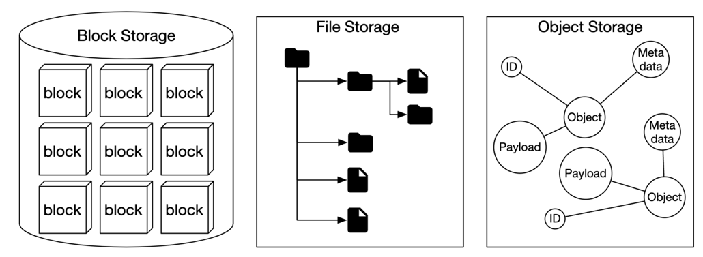

### 블록 저장소 
* 데이터를 블록 단위로 나누어 저장하고 관리하는 저장 방식. HDD, SSD
* 아무 것도 없는 '빈 하드디스크'를 빌려주는 것이라고 보면됨. 
* 블록 저장소는 OS가 포맷해서 일반적인 파일처럼 쓰거나, 특정 프로그램(DB, VM 등)이 직접 쓰게 할 수도 있음
* 블록 저장소는 하드처럼 직접 서버에 연결하거나 네트워크(FC, iSCSI)를 통해 연결 할 수 있음 

### 파일 저장소 
* 블록 저장소에 파일 시스템(ext4, NTFS 등)으로 포맷 후 그 위에 폴더, 파일 형태로 네트워크 공유할 수 있도록 만든 저장 방식
* 파일 수준 네트워크 프로토콜(SMB/CIFS, NFS) 을 사용하면 하나의 저장소를 여러 서버에서 접근 가능
* 조직 내 파일 공유 솔루션으로 사용하기 좋음

### 객체 저장소 
* 각 파일마다 고유한 ID와 메타정보를 붙여 인터넷을 통해 호출해서 사용하는 스토리지 
* 설계 목표 : 안정적으로 오래 보관(영속성), 저렴하게 많이 저장(성능 낮음)
* 제품 이미지, 로그파일 등 실시간으로 갱신할 필요가 없는 데이터 보관에 초점
* 계층적 데이터 구조(디렉토리, 폴더)는 제공하지 않으며, 데이터 접근은 보통 RESTful API로 함
* AWS S3, Azure Blob Storage

|                | 블록 저장소 | 파일 저장소 | 객체 저장소                                |
|----------------|----------|----------|---------------------------------------|
| 저장된 내용의 변경 가능성 |  Y | Y | N (직접 변경은 불가능하나 객체 변경을 통해 추가하는 것은 가능) | 
| 비용             |  고 | 중~고 | 저                                     |
| 성능             | 중~고 혹은 최상 | 중~고 | 저~중                                   |
| 데이터 일관성        | 강력 | 강력 | 강력                                    |
| 데이터 접근         | SAS/iSCSI/FC | 표준 파일 접근, CIFS/SMB/NFS | RESTful API                           |
| 규모확장성 | 중 | 고 | 최상                                    | 
| 적합한 응용 | 가상머신, DB같은 높은 성능 필요 애플리케이션 | 범용적 파일 시스템 접근 | 이진 데이터, 구조화되지 않은 데이터                  |

 

### 용어 정리 

#### 버킷 
* 객체를 보관하는 논리적 컨테이너로 이름은 유일해야함
* 데이터를 S3에 업로드 하려면 우선 버킷부터 생성 필요 

#### 객체 
* 객체는 버킷에 저장하는 개별데이터로 데이터(이미지와 같은 파일)와 메타데이터(크기, 형식 등)를 갖음
* 객체 데이터로의 형식 제한 없음

#### 버전 
* 한 객체의 여러 버전을 같은 버킷 안에 둘 수 있도록 하는 기능
* 버킷마다 별도 설정이 가능하며 실수로 지웠거나 덮어 쓴 객체를 복구할 수도 있음

#### URI
* 객체 저장소는 버킷과 객체에 접근할 수 잇도록 하는 RESTful API를 제공 
* 각 객체는 해당 API URI를 통해 고유하게 식별할 수 있음

#### SLA (Service-Level Agreement)
* 서비스 수준 협약(SLA)는 서비스 제공자와 클라이언트 사이에 맺어지는 계약
* 서비스가 어떤 품질 수준으로 제공될지 약속

 

## 문제의 이해 및 설계 범위 확정
* 기능 : 버킷 생성, 객체 업로드 및 다운로드, 객체 버전, 버킷 내 객체 목력 출력 기능. aws s3 ls 명령어와 유사 
* 데이터 크기 : 아주 큰 객체(수 GB 이상), 다량의 소형 객체(수 KB 정도)를 효율적으로 저장
* 매년 추가되는 데이터는 100페타바이트(PB)
* 99.999%의 내구성, 99.99%의 서비스 가용성 보장 

### 비기능 요구사항
* 100PB 데이터 
* 식스나인(99.9999%) 수준의 데이터 내구성
* 포나인(99.99%) 수준의 서비스 가용성
* 저장소 효율성 : 높은 수준의 안정성과 성능은 보증하되 저장소 비용은 최대한 낮춰야함 

### 대략적 규모 추정 
 * 100PB 저장소에 객체 크기 분포(소형 0.5MB 20%, 중형 32MB 60%, 대형 200MB 20%), 40% 공간 사용율을 고려해 약 6.8억 개 저장 가능.
   * (100PB * 0.4) / (0.2*0.5MB + 0.6*32MB + 0.2*200MB) = 6억 8천만개 
 * 객체당 메타데이터 1KB 기준 0.68TB 메타데이터 공간 필요.

## 개략적 설계안 제시 및 동의 구하기 

### 객체 저장소의 속성
* 객체 불변성 : 객체 저장소에 보관되는 객체들은 변경이 불가능, 삭제 후 새 버전 객체로 대체 가능
* 키-값 저장소 : URI를 사용하여 데이터를 가져올 경우 URI는 키, 데이터는 값 
* 저장은 1회, 읽기는 여러번 : 데이터 접근 패턴 측면에서 보면 쓰기는 1회, 읽기는 여러번 발생 (95%)
* 소형 및 대형 객체 동시 지원 : 다양한 크기의 객체 저장 가능하며 UNIX 파일 시스템 설계 철학과 비슷함

 

### UNIX 파일 시스템과 객체 저장소 비교 

  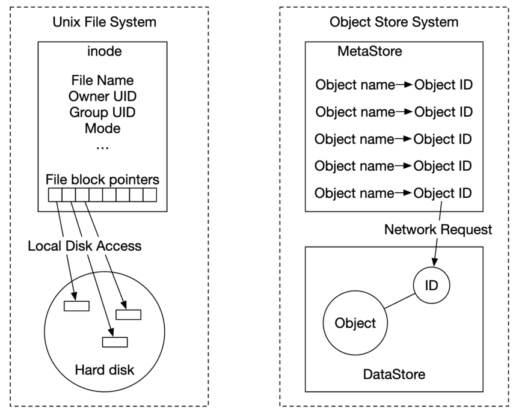

| 항목 | 설명   |
|-----|------|
|UNIX | 파일 이름은 아이노드 자료구조에 보관. 아이노드는 디스크 블록의 위치(포인터)를 가지고 있음|
|객체저장소 | 객체 메타데이터에 고유 식별자(ID)만 저장되고, 해당 ID를 통해 네트워크 상 저장소에서 데이터를 요청함|

* 메타 데이터와 객체의 실제 데이터를 분리하면 설계가 단순해지며, 메타데이터는 불변, 실제 데이터는 변경 가능
* 두 컴포넌트를 독립적으로 구현, 최적화 가능 

 

### 개략적 설계안

  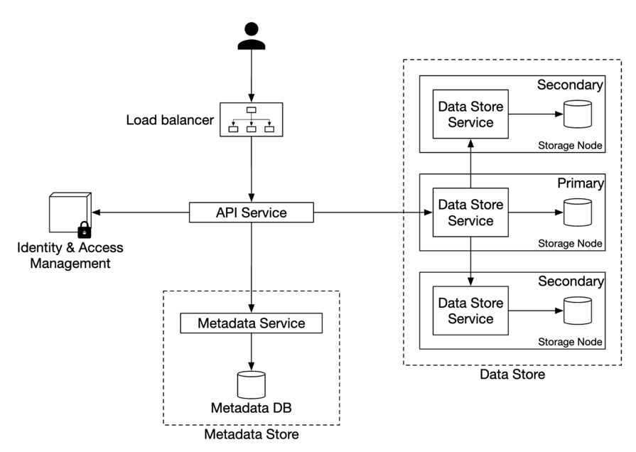

* 로드밸런서 : RESTful API에 대한 요청을 서버에 분산
* API 서비스 : IAM 서비스, 메타데이터 서비스, 저장소 서비스에 대한 호출을 조율. 무상태 서비스로 수평적인 규모 확장 가능
* IAM 서비스 : 인증, 권한 부여, 접근 제어 역할 
* 데이터 저장소 : 데이터를 저장/조회 장소로.  모든 연산은 객체 ID(UUID)
* 메타 데이터 저장소 : 객체 메타 데이터를 보관하는 저장소

 

### 객체 업로드

  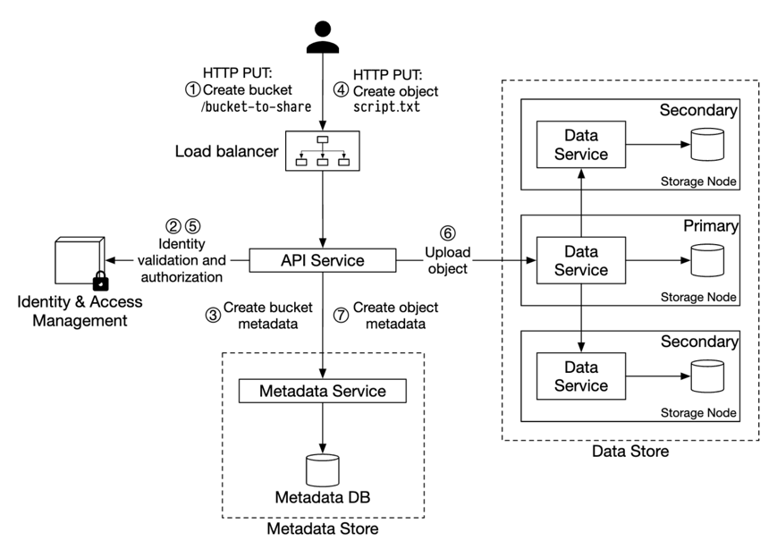

* 클라이언트에서 버킷을 생성하기 위한 HTTP PUT 요청
* API 서비스는 IAM에 클라이언트 WRITE 권한 확인
* API 서비스는 메타데이터 데이터베이스에 버킷 정보를 등록하기 위해 메타 데이터 저장소를 호출
* 버킷 생성 후 클라이언트는 script.txt 객체를 생성하기 위해 HTTP PUT 요청
* API 서비스는 신원 및 WRITE 권한 소유 여부를 확인
* API 서비스는 객체 데이터를 저장소로 보내고, 저장소에서는 저장 후 UUID 반환
* API 서비스는 메타 저장소를 호출하여 새로운 항목을 등록. 항목에는 object_id(UUID), bucket_id(버킷), object_name등의 정보가 포함

|object_name | object_id | bucket_id|
|------------|------------|------------|
|script.txt| 239D5866-0052-00F6-014E...| 82AA1B2E-F599-3902-B4E5...|

 

### 객체 다운로드

  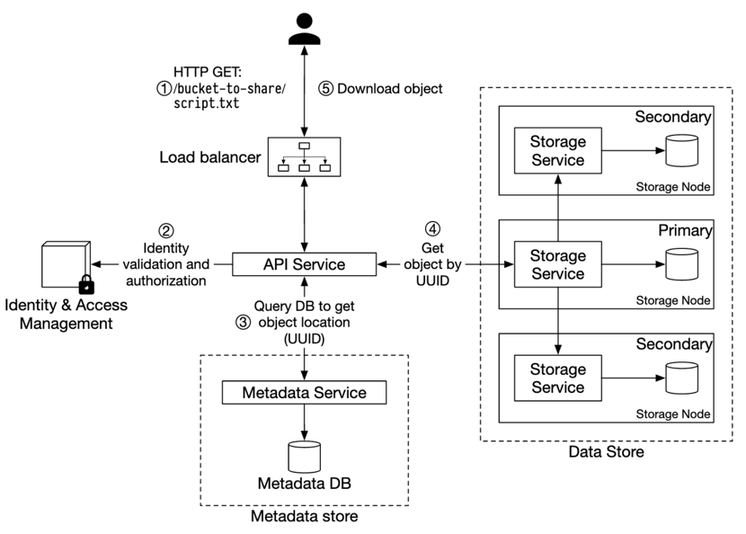

* 클라이언트는 다운로드 할 객체 이름 GET 요청을 로드밸런서로 보냄 (GET /bucket-to-share/script.txt) 로드벨런서는 요청을 API 서버로 보냄
* API 서버는 IAM에 클라이언트 READ 권한 확인
* API 서비스는 해당 객체의 UUID를 메타데이터 저장소에서 가져옴
* API 서비스는 해당 UUID를 사용해 데이터 저장소에서 객체 데이터를 가져옴
* API 서비스는 HTTP GET 요청에 대한 응답으로 해당 객체 데이터를 반환

 

## 상세 설계

### 데이터 저장소 

  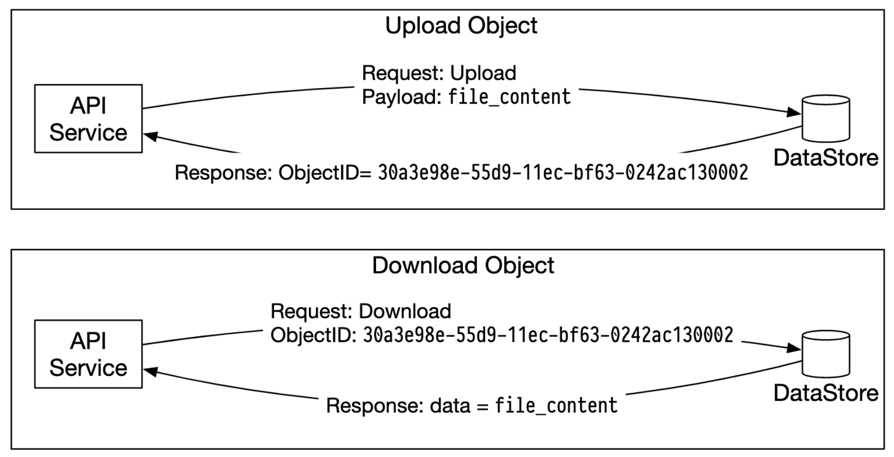

* API 서비스에서는 객체를 저장하거나 가져오는 요청을 받으면 데이터 저장소를 호출 

 

### 데이터 저장소의 개략적 설계 

  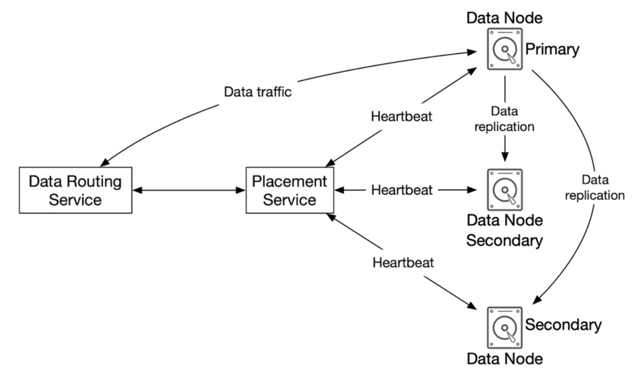

#### 데이터 라우팅 서비스 
* 데이터 노드 클러스터에 접근하기 위한 RESTful 또는 gRPC 서비스를 제공함
* 더 많은 서버를 추가하여 쉽게 규모를 확장할 수 있는 무상태 서비스 
* 역할
  * 배치 서비스를 호출하여 데이터를 저장할 최적의 데이터 노드를 판단
  * 데이터 노드에서 데이터를 읽어 API 서비스에 반환 
  * 데이터 노드에 데이터 기록

 

#### 배치 서비스

  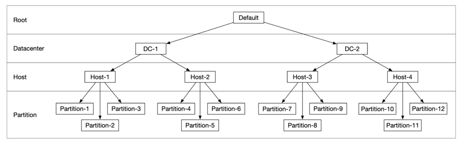

* 어느 데이터 노드에 데이터를 저장할지 결정하는 역할을 담당 
* 가상 클러스터 지도(클러스터의 물리적 형상 정보 보관)를 기반으로 데이터의 주 데이터 노드와 부 데이터 노드를 정해 유지함.
* 배치 서비스는 클러스터의 노드 상태를 주기적으로 감시함
* 노드가 비정상일 경우 15초의 시간 동안 추가적인 메시지를 기다렸다가 문제가 있다고 판단되면 노드 다운 상태로 인식함 
* 배치 서비스는 합의 프로토콜을 사용하여 노드 상태 판단의 신뢰성을 높임. 여러 노드가 동일한 판단을 내릴때만 노드 상태를 변경함. 
* (위 이미지- 가상클러스터 지도) 파티션 단위로 주/부 노드가 다르게 지정되어 데이터가 여러 노드에 안전하게 분산됨. 

 

#### 데이터 노드
* 실제 객체 데이터가 보관되는 곳. 여러 노드에 데이터를 복제하여 데이터의 안정성과 내구성을 보장
* 데이터 노드에는 배치 서비스에 주기적으로 박동 메시지를 보내는 서비스 데몬이 있음 
* 박동 메시지에는 디스크 드라이브(HDD/SDD) 수, 데이터의 양 정보가 있음 
* 배치서비스는 못보던 데이터 노드로부터 박동 메시지를 받으면 ID를 부여하고 가상 클러스터 노드에 추가함

 

#### 데이터 저장 흐름 

  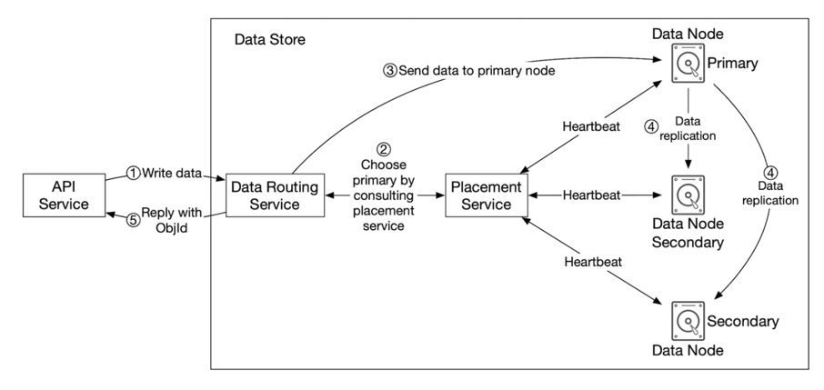

* API 서비스는 객체 데이터를 데이터 저장소로 포워딩
* 데이터 라우팅 서비스는 객체에 UUID를 할당하고 배치 서비스에 객체를 보관할 데이터 노드를 질의. 배치서비스는 가상클러스터 지도를 확인하여 주 데이터 노드 반환
* 데이터 라우팅 서비스는 저장할 데이터를 UUID와 함께 주 데이터 노드에 전송
* 주 데이터 노드는 데이터를 저장하고, 두개의 부 노드에 다중화 한 후 라우팅 서비스에 응답응을 보냄 
* 데이터 라우팅 서비스는 객체 UUID를 API 서비스에 반환 

 

#### 데이터는 어떻게 저장되는가
* 각각의 객체를 개별 파일로 저장 (작은 파일)
  * 문제점 1 : 낭비되는 데이터 블록 수가 늘어남 (디스크 블록의 크기는 보통 4KB로 전부 같으며 크기가 그보다 작아도 온전히 블록 하나를 씀)
  * 문제점 2 : 시스템의 아이노드(파일의 위치 등 정보 저장) 용량 한계 초과 
* 작은 객체들을 큰 파일 하나로 모아서 해결

  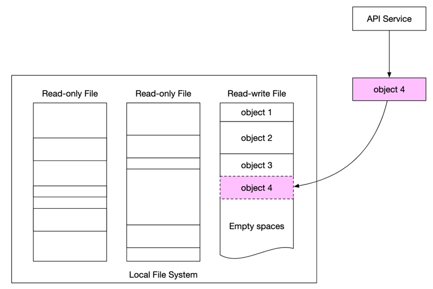

* WAL(Write-Ahead Log) 와 같이 객체를 저장할 때 존재하는 파일에 추가. 
* 용량 임계치에 도달한 파일은 읽기 전용 파일로 변경하고, 새로운 파일에 읽기-쓰기 파일로 만들어 객체를 저장함
* 읽기-쓰기 파일에 대한 쓰기 연산은 순차적으로 이루어짐

 

#### 객체 소재 확인
* 파일안에 객체를 UUID로 찾기 위해서는 아래가 필요함 

| 필드           | 설명             | 
|--------------|----------------|
| object_id    | 객체의 UUID       | 
| file_name    | 객체를 보관하는 파일 이름 | 
| start_offset | 파일 내 객체의 시작주소  |
| object_size  | 객체의 바이트 단위 크기  | 

* 위 데이터를 저장하기 위한 두가지 방법
  * RocksDB : SSTable에 기반한 방법. 쓰기 연산 성능은 좋으나 읽기 성능은 느림
  * 관계형 데이터베이스 : B+ 트리 기반으로 읽기 연산은 좋으나 쓰기 성능은 느림 -> 읽기 연산이 더 좋은 관계형 데이터베이스가 좋음
  *  데이터 노드에 저장되는 위치 데이터를 다른 데이터 노드와 공유할 필요X -> 로컬 관계형 데이터베이스 SQLite를 사용하면 좋음

 

#### 개선된 데이터 저장 흐름

  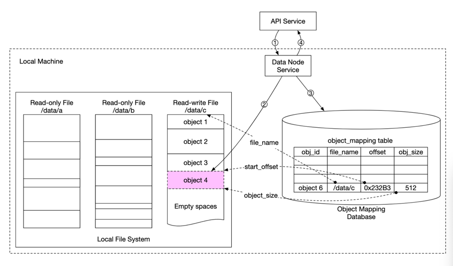

* API 서비스는 새로운 객체를 저장하는 요청을 데이터 노드 서비스에 전송
* 데이터 노드 서비스는 객체를 읽기-쓰기 파일 /data/c의 마지막 부분에 추가 
* 해당 객체에 대한 새로운 레코드를 object_mapping 테이블에 추가 
* 데이터 노드 서비스는 API 서비스에 해당 객체의 UUID를 반환 

 

#### 데이터 내구성
* 데이터 안정성을 높이려면 장애가 발생할 모든 경우를 살핀 후 데이터를 적절하게 다중화 해야함 

##### 다중화 하드웨어 장애와 장애 도메인 
* 하드디스크 장애는 피할 수 없음. 여러대의 하드 드라이브에 복제하여 장애가 전체 데이터 가용성에 영향을 주지 않도록 해야함
* 장애 도메인 : 중요한 서비스에 문제가 발생했을 때 부정적인 영향을 받는 물리적 또는 논리적 구획 -> 장애가 나면 망가지는 단위 
  * 랙(rack) : 같은 전원, 네트워크 스위치를 공유하는 서버 묶음
  * 데이터 센터 : 지진 정전 등으로 데이터 전체가 다운될 수 있음 

 

#### 소거 코드 
* 데이터를 작은 단위로 분할하여 다른 서버에 배치하고, 일부가 소실되었을 때 패리티라는 정보를 만들어 중복성을 확보 
* 장애가 생기면 남은 데이터와 패리티를 조합하여 소실된 부분을 복구 

  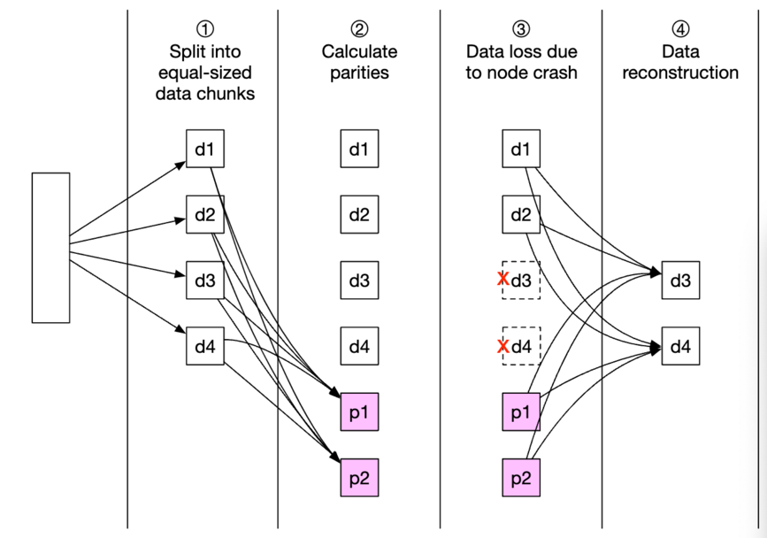

* 4 + 2 소거코드
  * 원본데이터 : 4개 
  * 패리티 : 2개 
  * 이중 어떤 4개라도 남아있으면 원본데이터를 복원할 수 있음

|         | 다중화                                     | 소거코드                                                                                     |  
|---------|-----------------------------------------|------------------------------------------------------------------------------------------|
| 내구성     | 99.9999%(3중 복제의 경우)                     | 99.999999999%( 8+4 소거 코드를 사용 하는 경우)                                                      | 
| 저장소 효율성 | 200%의    저장 용량 오버헤드                     | 50%의 저장 용량 오버헤드                                                                          |  
| 계산 자원   | 계산이 필요 없음                               | 패리티 계산에 많은 계산 자원 소모                                                                      |
| 쓰기 성능   | 데이터를 여러 노드에 복제. 추가로 필요한 계산 없음           | 데이터를 디스크에 기록하기 전에 패리티 계산이 필요하므로 쓰기 연산의 응답 지연이 증가                                         |
| 읽기 성능   | 장애가 발생하지 않은 노드에서 데이터를 읽음. 다중화 쪽의 성능이 우월 | 데이터를 읽어야 할 때마다 클러스터 내의 여러 노드에서 데이터를 가져와야함.  장애가 발생한 경우 빠진 데이터를 먼저 복원하여야 하므로 지연 시간 증가  |  

#### 정확성 검증
* 소거 코드를 사용하면 적당한 비용으로 높은 데이터 내구성을 달성할 수 있으나, 대규모 시스템의 경우 메모리의 데이터가 망가지는 일도 자주 일어남
* 메모리 데이터가 훼손되는 문제는 프로세스 경계에 데이터 검증을 위한 체크섬을 두어 해결 
* 체크섬 
  * 데이터 에러를 발견하는 데 사용되는 작은 크기의 데이터 블록 
  * 체크섬 알고리즘을 통해 체크섬이 생성되며, 새로 계산한 체크섬이 원본 체크섬과 같으면 높은 확률로 데이터가 온전하다고 봄
  * MD5, SHA1, HMAC

  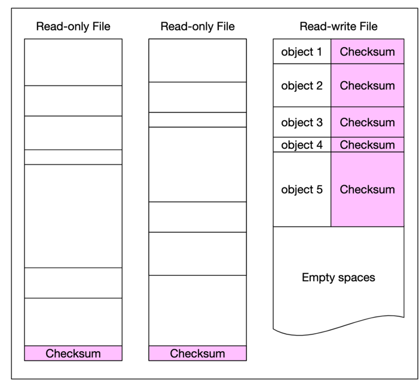

* 체크섬을 객체 데이터 끝에 두고, 파일을 읽기 전용으로 전환하기 직전에 전체 파일의 체크섬을 계산한 다음에 파일 말미에 추가 
* 소거 코드와 체크섬 확인 메커니즘 동시에 활용하는 경우
  * 객체 데이터와 체크섬을 가져옴
  * 수신된 데이터의 체크섬을 계산하여 일치하는지 확인하고, 일치하지 않으면 데이터가 망가진 것이므로 다른 장애 도메인에서 데이터를 가져와 복구 시도
  * 데이터 8조각을 전부 수신할 때까지 1과 2를 반복하여 원래 객체를 복원한 다음 클라이언트에게 보냄 

 

### 메타데이터 데이터모델 

#### 스키마 
* 데이터 베이스 스키마는 다음 3가지 질의를 지원할 수 있어야함
  * 질의1 : 객체 이름으로 객체 ID 찾기 
  * 질의2 : 객체 이름에 기반하여 객체 삽입 또는 삭제 
  * 질의 3 : 같은 접두어를 갖는 버킷 내의 모든 객체 목록 확인 
* 이 조건을 만족하려면 bucket, object 테이블이 필요함 

#### bucket 테이블 

|bucket|
|-------|
|bucket_name|
|bucket_id |
|owner_id|
|enable_versioning|

* 한 사용자가 만들 수 있는 버킷의 수에는 제한이 있으므로 이 테이블의 크기는 작으며, 서버 한대에 충분히 저장할 수 있음
* 읽기 요청을 처리하기에 CPU 용량이나 네트워크 대역폭이 부족할 수 있으므로, 데이터베이스 사본을 만들어 읽기 부하를 분산하면 됨 

#### object 테이블 

| object         |
|----------------|
| bucket_name    |
| object_name    |
| object_version |
| object_id      |

* object 테이블에는 객체 메타데이터를 보관 
* 이 책의 설계상 객체 메타데이터를 단일 데이터베이스 서버에 보관하는 건 불가능하므로, 테이블의 스케일 아웃(확장) 이 필요
  * bucket_id 로 샤딩 : 간단하게 샤딩이 가능하나, 하나의 버킷에 너무 많은 객체가 들어가는 경우 핫스팟 현상
  * object_id 로 샤딩 : 부히가 고르게 분산되나, 질의1, 질의2를 지원하지 못함 -> URI를 기준으로 하기 떄문에 
  * bucket_name + object_name 으로 샤딩 : 대부분의 메타데이터 관련 연산은 객체 URI를 기준으로 수행되기 때문.
    * bucket_name을 기준으로 균등 분산 가능하며, object_name의 순서를 해싱하여 샤딩 키로 사용하면 적절한 분산이 가능

 

### 버킷 내 객체 목록 확인
* 객체 저장소는 객체를 파일 시스템처럼 계층적 구조로 보관하지 않음
* s3://<버킷 이름>/<객체 이름>의 수평적 경로로 접근 
* S3는 객체 이름의 시작 부분 문자열인 접두어를 지원 -> 접두어를 활용하여 디렉토리와 비슷하게 데이터 정리 가능 
* aws s3 ls s3://mybucket/abc/ --recursive 
  * mybucket 내 abc/ 프리픽스 경로의 모든 디렉토리까지 재귀적으로 탐색 

 

### 단일 데이터베이스 서버 vs 분산 데이터베이스 서버의 목록 출력
| 항목	| 단일 DB | 	분산 DB |
|-------|--------|---------|
|목록 조회 |	SQL 하나로 간단 |	모든 샤드 쿼리 + 결과 병합 |
|페이징	| OFFSET, LIMIT, ORDER BY 사용	|각 샤드마다 커서 처리 + 복잡한 로직 필요 |
|성능	|우수	|느릴 수 있음 |
|구조 단순화	|쉬움|	어려움 (추적, 병합 필요)|

* 객체 저장소 시스템에서 목록 출력 성능은 최우선 순위가 아니다
* 분산 데이터베이스 서버에서 목록 기능을 최적화 하려면 별도 테이블에 목록 데이터를 비정규화 하여 저장하고 객체 목록을 출력할때는 이 테이블 데이터만 사용 (단일 DB 처럼 사용)

 

### 객체 버전
* 버킷 안에 한 객체의 여러 버전을 둘 수 있도록 하는 기능
* 버전 기능이 활성화 되어있으면 객체 저장소는 해당 문서의 모든 이전 버전을 메타데이터 저장소에 유지

  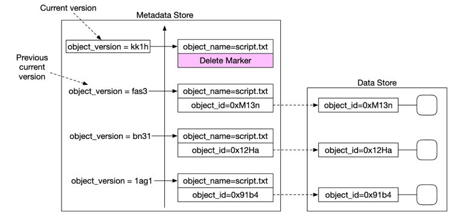

* object_version에 기록된 TIMEUUID 값이 가장 큰 것이 최신 버전
* 객체를 삭제할 때는 해당 객체의 모든 버전을 버킷 안에 그대로 두고 단순히 삭제 표식만 추가 

 

### 큰 파일의 업로드 성능 최적화
* 멀티파트 업로드 
  * 큰 객체를 작게 쪼갠 다음 업로드 후 객체 저장소에서 조각을 모아 원본 객체를 복원하는 것 

  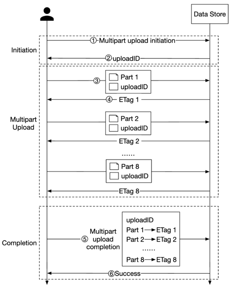

* 멀티 파트 업로드 시작, 객체 저장소 호출
* 데이터 저장소 업로드를 식별할 uploadId 반환
* 클라이언트에서는 파일을 작은 객체로 분할한 뒤 uploadId와 함께 데이터 저장소에 올림
* 조각 하나가 올라갈때마다 조각에 대한 MD5 해시 체크섬인 Etag 반환 
* 모든 조각 업로드 후 클라이언트에서는 멀티파트 종료 요청 (uploadId, 조각번호모음, Etag 포함)
* 데이터 저장소는 조각 번호 목록을 사용해 원본 객체 복원. 클라이언트에게 성공 메시지를 보냄
* 조각은 쓰레기 수집 프로세스를 통해 삭제 

### 쓰레기 수집 
* 더이상 할당 되지 않은 데이터에 할당된 저장 공간을 자동으로 회수 
* 주기적으로 정리 메커니즘을 통해 삭제 
* 데이터를 다중화 하는 경우에는 주 저장소 노드 뿐만 아니라 부 저장소 노드에서도 지워야함 

