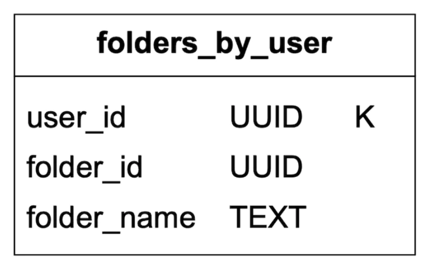
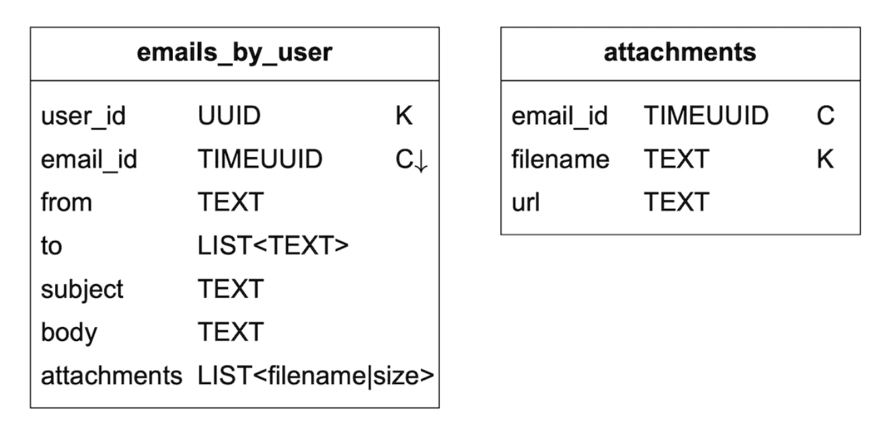

# Chapter 08 분산 이메일 서비스

## 1단계: 문제 이해 및 설계 범위 확정

* 사용자 : 10억명
* 기능
  * 이메일 발송/수신
  * 모든 이메일 가져오기
  * 읽음 여부에 따른 이메일 필터링
  * 제목, 발신인, 메일 내용에 따른 검색 기능
  * 스팸 및 바이러스 방지 기능
* SMTP / POP / IMAP 등의 프로토콜 사용, HTTP 웹 메일 사용
* 첨부파일

#### 비기능적 요구사항
* 안정성 : 소실 X
* 가용성 : 여러 노드에 자동 복재 / 시스템 계속 동작
* 확장성 : 사용자 수가 늘어나도 감당 가능
* 유연성과 확장성 : 새 컴포넌트를 더하기 쉽게

#### 개략적인 규모 추정
* 10억명 사용자
* 대략 qps는10^9 * 10 / 10^5 = 100,000로 계산 (86,400 ≈ 10^5)
* 수신 이메일수는 40건, 메일 하나의 메타데이터는 50KB
  * 1년간 10^9 * 40 * 365 * 50KB = 790PB
* 첨부파일 포함 이메일 비율 20%, 첨부 파일 평균 크기 500KB
  * 10^9 * 40 * 365 * 20% * 500KB = 1,460PB

## 2단계: 개략적 설계안 제시 및 동의 구하기


## 이메일 101 (101은 기본 개념? 이런뜻)
* 이메일을 주고받는 프로토콜에는 대표적으로 POP, IMAP, SMTP 같은 프토콜 사용

### 이메일 프로토콜

| 구분          | SMTP (Simple Mail Transfer Protocol) | POP (Post Office Protocol)    | IMAP (Internet Message Access Protocol) |
| :---------- | :----------------------------------- | :-------------------------------- | :-------------------------------------- |
| **목적**      | 이메일 **보내기**                          | 이메일 **받기**                  | 이메일 **받기**                      |
| **역할**      | 발신자 → 수신자 서버로 메일 전송                  | 서버에서 메일을 **다운로드 후 삭제**            | 서버에 메일을 **남겨두고 동기화**                    |
| **동작 방식**   | 메일 작성 → SMTP 서버에 보내기 → 상대 서버에 전달     | 메일 서버에 접속해 메일을 로컬로 내려받고 서버 메일은 삭제 | 메일 서버와 클라이언트가 항상 **동기화**, 서버에 메일이 남아 있음 |                            |
| **장점**      | 메일 전송 표준, 거의 모든 메일 시스템 사용            | 클라이언트에 저장하니 오프라인 접근 용이            | 여러 기기(PC, 스마트폰 등)에서 동일 메일 관리 가능         |
| **단점**      | 수신에는 사용 불가                           | 여러 기기에서 메일 관리 불편 (다운로드한 곳에만 존재)   | 서버 용량 관리 필요, 약간 느릴 수 있음                 |
| **주로 쓰는 곳** | 메일 발송 서버 (Gmail 발송, 회사 메일 발송 등)      | 오래된 이메일 클라이언트, 로컬 메일 백업           | 현대적 이메일 앱(모바일/웹메일), Gmail, Outlook      |


### 도메인 이름 서비스 (DNS)
* DNS 서버는 수시잔 도메인의 메일 교환기 레코드 검색에 이용

### 첨부파일
* 이메일 메시지와 함께 전송
* 일반적으로는 Base64 인코딩 사용
* MIME 는 첨부파일을 전송할 수 있도록 하는 표준 규격

### 전통적 메일 서버

#### 전통적 메일 서버 아키텍처
* 클라이언트 -> 서버 사이에도 메일을 **발신** 하는 상황이기 때문에 SMTP
* 전송은 SMTP / 수신(읽기)는 IMAP, POP


#### 저장소
* 전통적인 메일 서버는 파일 시스템의 디렉토리에 저장
* 사용자가 많아지면 사용하지 못함

## 분산 메일 서버
* 분산 메일 서버는 현대적 사용패턴, 확장성, 안정성 문제를 해결

### 이메일 API
* 메일의 생명 주기를 기준으로 
  * 모바일 단말 클라이언트를 위한 SMTP/POP/IMAP API
  * 송신 측 메일 서버와 수신 측 메일 서버간의 SMTP
  * 대화형 웹 기반 이메일 애플리케이션을 위한 HTTP 기반 RESTful API
* 웹 메일 통신에는 일반적으로 HTTP 사용

#### 1. POST /v1/message
* To, Tc, Bcc 헤더에 명시된 수신자에게 메시지를 전송
#### 2. GET /v1/folders
* 주어진 이메일 계정에 존재하는 모든 폴더를 반환한다.

```json
[{
    id: string, // 고유 폴더 식별자
    name: string, // 폴더 이름, 기본 폴더 이름이 일반적으로 사용됨(All, Archive ....)
    user_id: string // 계정 소유 ID
}]
```

#### 3. GET /v1/folders/{:folder_id}/message
* 주어진 포더 아래의 모든 메시지를 반환

#### 4. GET /v1/messages/{:message_id}
* 특정 메시지 대한 모든 정보를 반환

```json
[{
    user_id: string, // 계정주의 ID
    from: string, // 발신자 정보
    ...
}]
```

### 분산 메일 서버 아키텍처
* 웹메일 : 사용자 브라우저를 사용해 메일을 보내고 받음
* 웹서버 : 로그인, 가입, 발송, 목록 확인 등등
* 실시간 서버 : 새로운 이메일 내용을 클라이언트에게 전달
* 메타데이터 데이터베이스 : 이메일의 메타 데이터를 저장
* 첨부 파일 저장소 : 아마존 S3같은 객체 저장소를 사용, 디비 컬럼은 부적절
* 분산 케시 : 최근 읽은 이메일의 히트율을 높일 수 있음
* 검색 저장소 : 고속 텍스트 검색에 사용


### 이메일 전송 절치
* 웹서버에서는
  * 기본적인 이메일 검증
  * 송싱자 도메인 검사 후 같다면 외부 전송 큐에 저장하지 않고 바이러스 검사와 같은 기본 절차 후 바로 저장
  * 외부 전송 큐 : 검증 통과후 외부 전송 큐에 저장, 첨부 파일은 참조만 추가
  * 에러 큐 : 기본 검증 실패한 메일을 저장
  * 외부 전송 담당 SMTP : 외부 전송 큐에서 스팸 및 바이러스 감염 여부 검사 / 저장 / 전송 담당


#### 외부 전송 큐에 메시지가 오래 남아 있다면?
* 수신자 측 메일 서버 장애 / 이메일을 보낼 큐의 컨슈머가 부족

### 이메일 수신 절차
* 로드밸런서를 통해 여러개의 SMTP 서버로 전달
* 수신 이메일 큐를 둬서 SMTP 서버간의 결합도를 낮춤
* 수신자가 온라인이면 실시간 서버를 통해 알림 전달 


## 3단계: 상세 설계
* 메타데이터 데이터 서비스
* 검색
* 전송 가능성
* 규모 확장성

### 메타데이터 데이터베이스

#### 이메일 메타데이터의 특성
* 헤더는 작고, 빈번하게 이용
* 본문의 사용 빈도는 낮다 (이메일을 한번 읽는 케이스가 많음)
* 이메일 작업은 사용자 별로 격리 가능해야 함 
* 데이터의 신선도는 데이터 사용 패턴에 영향을 미침
* 데이터의 높은 안전성이 보장 필요, 손실 용납 X

#### 올바른 데이터베이스의 선정
* 일반적인 큰 규모의 이메일 서비스들은 맞춤 제작한 데이터베이스를 사용
* **관계형 데이터베이스**는 컬럼 크기가 늘어나면 문제가 발생할 경우가 있음
* 디스크 I/O 발생 가능성이 많음
* **분산 객체 저장소**는 이메일 검색이나 기능 구현에 적합하지 않음
* **NoSql 데이터베이스**는 충분히 실현가능함 (지메일이 구글 빅텥이블을 저장소로 사용), 다만 카산드라와 같은 오픈소스형 데이터베이스를 사용하는곳은 확인되지 않음

* 설계안에 딱 맞는 데이터베이스는 없음
* 면접에서는 특정 데이터베이스를 고르는 건 힘들기 때문에 메일서비스에 맞는 여러 기능/비기능적 요구사항을 충족해야 한다는걸 강조해야함

#### 데이터 모델
* user_id를 파티션 키로 사용
* 테이블은 **파티션 키**와 정렬을 위한 **클러스터 키** 두가지로 구성
* 파티션 키 : 데이터를 여러 노드에 분산하는 역할을 함
* 클러스터 키 : 파티션 내 데이터를 정렬하는데 사용
* 이메일 서비스의 **데이터 계층**은 다음과 같은 질의를 지원해야 한다.
  * 주어진 사용자의 모든 폴더 가져오기
  * 특정 폴더 내의 모든 이메일 표시
  * 메일 생성/삭제/가져오기
  * 이미 읽은 메일 전부, 또는 아직 읽지 않은 메일 가져오기
  * 이메일 타래를 가져오기

#### 질의 1: 특정 사용자의 모든 폴더 질의
* user_id는 파티션 키기 때문에 특정 사용자의 모든 메일 내용은 같은 파티션 안에 있음


#### 질의 2: 특정 폴더에 속한 모든 이메일 표시
* user_id와 folder_id를 조합해 파티션 키를 만들고, 이메일의 id값을 TIMEUUID로 지정해 클러스터 키로 사용 (정렬 가능, 우리가 배웠던 tiemstamp + 랜덤값 으로도 가능하지않을까?)

#### 질의 3: 이메일 생성/삭제/수신
* 이메일 id와 fileName을 같이 사용하면 모든 첨부 파일을 질의 할 수 있음


#### 질의 4: 읽음 여부에 따른 이메일 필터링
* 읽음 여부에 따라 이메일을 필터링하기 위해서는 읽음 여부를 나타내는 플래그를 사용 (is_read)
* 대부분의 NoSql 에서는 파티션키와 클렄스터 키를 조합해 질의하기 때문에 읽음 여부를 클러스터 키로 사용하면 안됨
* 비정규화를 통해 is_read 여부에 따른 테이블을 따로 만듬

#### 이메일 타래
* 이메일 헤더에 있는 내용들을 바탕으로 관련 메일들을 메모리 탑재 후 엮어낼 수 있다.

#### 일관성 문제
* 모든 메일함은 반드시 하나의 주(primary) 사본을 통해야만 서비스 해야 함 (데이터의 정확성이 중요)
* 다른 사본을 통해 주 사본이 복원 될 때까지 동기화/갱신이 조금 어려울 수도 있음

### 이메일 전송 가능성
* 스팸으로 분류되기 쉽다.
* 전용 IP 사용
* 발송시 범주 별 다른 IP를 사용
* 새로운 이메일 서버의 IP 주소의 사용 빈도를 서서히 증가
* 스팸 발송자의 신속한 차단
* ISP 에서의 피드백을 위한 처리가 필요

### 검색
* 검색 기능을 사용하려면 메일을 수신/발신 할때마다 색인을 해줘야 함
* 검색 기능은 사용자가 검색 버튼을 누를때만 실행
* 결과적으로 스기 연산이 더 많이 발생함

#### 방안 1: 엘라스틱서치 사용
* 이메일 전송 / 수신 / 삭제시 카프카 큐를 통해 비동기 형식으로 색인 요청
* 검색은 동기식 호출을 통함
* 다만 비동기 식이기 때문에 검색하는 순간 색인이 미완료 상태일 수 있음
  * 메일 저장 + 색인 완료 를 하나의 트랜잭션으로 묶어 처리 가능
  * 잠시 후 표시 되는걸로 안내 메시지 노출

#### 방안 2: 맞춤형 검색 솔루션
* 메일을 저장할 때 가장 큰 문제는 디스크 I/O 부하이다.
* 메일마다 색인해야 할 데이터가 매우 많기 때문에, 효율적인 저장이 필요하다.
* LSM 트리를 사용하여 쓰기(Write)에 최적화된 구조를 설계한다.
* 초기에는 메일 데이터를 작은 단위로 쪼개어 정렬된 상태로 디스크에 기록한다.
* 이후, 여러 개의 작은 파일(SSTable)을 계층(Level)별로 병합(compaction) 하면서 관리한다.
* 하나의 거대한 테이블에 계속 덮어쓰는 방식이 아니라,  여러 정렬된 파일을 추가해나가는 방식이기 때문에 초기 쓰기 부하가 작고,  병합(Compaction) 작업은 분산 및 제어할 수 있다.
* 데이터가 정렬된 형태로 저장되기 때문에,  검색 시에도 범위 조회(Range Scan) 가 빠르다